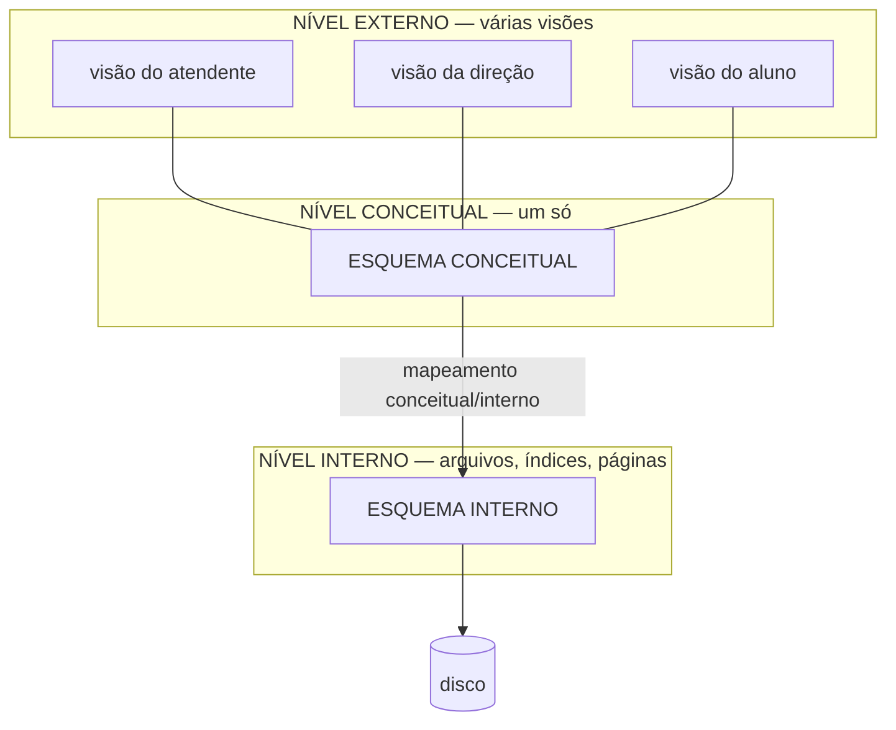

# Aula 02 — Arquitetura de SGBD e Independência de Dados

> 🎯 Objetivos: distinguir esquema de instância, explicar a arquitetura em três níveis e o que ela protege, e classificar comandos em DDL, DML e DCL.

## 1. Esquema × instância

Duas coisas diferentes que a linguagem cotidiana chama de "o banco de dados":

**Esquema** é a **descrição** da estrutura: quais tabelas existem, quais colunas cada uma tem, de que tipo, com quais restrições. É projetado uma vez e muda raramente.

**Instância** (ou *estado*) são os **dados guardados** num dado instante. Muda o tempo todo — a cada empréstimo, a cada devolução.

```
ESQUEMA (a forma)                    INSTÂNCIA (o conteúdo, hoje às 14h32)
─────────────────────────            ──────────────────────────────────────
ALUNO(matricula, nome, curso)        (2023101, 'Ana Souza',  'SI')
                                     (2023102, 'Bruno Lima', 'SI')
                                     (2024007, 'Célia Reis', 'ADM')
```

A analogia útil: o esquema é a planta da casa; a instância é a casa mobiliada num certo dia. Mudar a planta é obra. Trocar os móveis é terça-feira.

> ⚠️ **Um erro de esquema é infinitamente mais caro que um erro de instância.** Dado errado se corrige com um `UPDATE`. Esquema errado se corrige migrando todos os dados existentes, reescrevendo todo programa que o usa e explicando à gerência por que o sistema vai ficar fora do ar no sábado. É por isso que este curso inteiro trata de esquema.

## 2. A arquitetura em três níveis

Proposta pelo comitê ANSI/SPARC nos anos 1970, é o modelo mental que todo SGBD moderno realiza:



**Nível interno** — como os dados estão fisicamente armazenados: organização dos arquivos, quais índices existem, como as páginas são gravadas, se há compressão. Assunto da Aula 15.

**Nível conceitual** — **todas** as entidades, atributos, relacionamentos e restrições da organização, sem falar de disco. É o coração do curso: os Blocos 2 e 3 constroem exatamente este nível.

**Nível externo** — o que cada grupo de usuários enxerga. Um recorte, quase sempre menor, às vezes reorganizado, do nível conceitual. No SQL, cada visão externa é uma `VIEW` (Aula 14).

Um exemplo dos três, sobre o mesmo dado:

| Nível | O que se diz |
|---|---|
| Externo (atendente) | "Empréstimos vencidos: nome do aluno, título do livro, dias de atraso" |
| Conceitual | `EMPRESTIMO(id, matricula, tombo, data_retirada, data_prevista, data_devolucao)` com FK para `USUARIO` e `EXEMPLAR` |
| Interno | Arquivo `emprestimo` em páginas de 8 KB, índice árvore-B em `id`, índice secundário em `data_prevista` |

## 3. Independência de dados

É o ganho que a arquitetura em três níveis compra, e vem em dois sabores.

**Independência física** — mudar o nível **interno** sem mexer no conceitual nem nos programas. Criar um índice, mudar o disco, reorganizar arquivos: nenhuma consulta precisa ser reescrita. É a independência fácil, e todo SGBD entrega bem.

**Independência lógica** — mudar o nível **conceitual** sem mexer nas visões externas. Acrescentar uma tabela, acrescentar uma coluna, dividir uma tabela em duas: os programas que não usam a novidade continuam funcionando. É a independência difícil, e a que se perde com mais facilidade.

```
Mudança                                    Que independência protege?
────────────────────────────────────────   ──────────────────────────
Criar um índice em data_prevista           física
Migrar o banco para um disco SSD           física
Acrescentar a coluna "email" em ALUNO      lógica
Separar ENDERECO de ALUNO em outra tabela  lógica (se houver uma VIEW no lugar antigo)
Renomear a coluna "nome" para "nome_completo"  nenhuma — quebra tudo que a cita
```

> 💡 **A independência lógica não é automática — é conquistada.** O programa que faz `SELECT * FROM aluno` e confia na ordem das colunas perde a independência na primeira alteração. O que faz `SELECT matricula, nome FROM aluno` sobrevive. Escrever nomes de coluna explicitamente é uma decisão de arquitetura disfarçada de estilo.

## 4. As três famílias de comandos

A linguagem de um SGBD divide-se por finalidade. Em SQL, as três convivem no mesmo dialeto:

**DDL — *Data Definition Language*.** Define e altera o **esquema**: `CREATE`, `ALTER`, `DROP`, `TRUNCATE`. Mexe na forma.

**DML — *Data Manipulation Language*.** Manipula a **instância**: `INSERT`, `UPDATE`, `DELETE` e `SELECT`. Mexe no conteúdo.

**DCL — *Data Control Language*.** Controla **quem pode o quê**: `GRANT`, `REVOKE`.

```sql
CREATE TABLE aluno (...);              -- DDL: cria a forma
INSERT INTO aluno VALUES (...);        -- DML: põe conteúdo
SELECT * FROM aluno;                   -- DML: consulta o conteúdo
GRANT SELECT ON aluno TO atendente;    -- DCL: autoriza
DROP TABLE aluno;                      -- DDL: destrói a forma (e o conteúdo junto)
```

> ⚠️ **`DELETE` e `DROP` não são sinônimos, e a confusão custa caro.** `DELETE FROM aluno;` apaga todas as linhas e deixa a tabela vazia, de pé. `DROP TABLE aluno;` apaga a tabela — estrutura, índices, restrições e dados. O primeiro é DML e se desfaz dentro de uma transação; o segundo é DDL.

Há ainda quem separe uma quarta família, **TCL** (*Transaction Control*): `COMMIT`, `ROLLBACK`, `SAVEPOINT`. Alguns autores a colocam dentro da DML. Assunto da Aula 15.

## 5. O catálogo: o banco que descreve o banco

Quando você cria uma tabela, o SGBD guarda essa informação **em tabelas próprias**. O conjunto delas chama-se **catálogo** ou **dicionário de dados**, e é o que permite ao banco validar consultas, planejar execuções e responder `\d aluno`.

No PostgreSQL, o catálogo é consultável como qualquer outra coisa:

```sql
SELECT table_name, column_name, data_type
FROM information_schema.columns
WHERE table_schema = 'public'
ORDER BY table_name, ordinal_position;
```

Esse comando devolve o **esquema conceitual do seu banco**, lido do próprio banco. É a definição de metadado: dado sobre dado.

> 💡 Um SGBD que guarda a própria descrição no formato que ele mesmo gerencia é um sistema **autodescritivo** — e essa é uma das diferenças de fundo entre um banco e um punhado de arquivos. Um arquivo `.csv` não sabe dizer que tipo tem a terceira coluna. Um banco sabe, e pode agir sobre isso.

## 6. Panorama dos modelos de dados

Um **modelo de dados** é o conjunto de conceitos disponíveis para descrever a realidade. Escolher um modelo é escolher o que dá para dizer.

| Modelo | Como estrutura | Época / situação |
|---|---|---|
| **Hierárquico** | Árvore: todo registro tem um pai | Anos 60–70 (IMS). Rápido no caminho previsto, péssimo fora dele |
| **Rede** | Grafo de ponteiros entre registros | Anos 70 (CODASYL). Mais flexível, e mais difícil de navegar |
| **Relacional** | **Tabelas**, com ligações por valor de chave | Codd, 1970. Domina desde os anos 80 |
| **Orientado a objetos** | Objetos, classes, herança | Anos 90. Nicho; sobreviveu como recursos dentro do relacional |
| **NoSQL** | Documento, chave-valor, coluna larga, grafo | Anos 2000. Escala e flexibilidade em troca de garantias |

O modelo **relacional** venceu por um motivo que vale entender: as ligações são feitas **por valor**, não por ponteiro. Se o empréstimo guarda a matrícula `2023101`, ele se liga ao aluno sem que exista qualquer endereço físico envolvido — o que torna o dado independente de onde ele está guardado. Toda a independência da seção 3 sai daí.

> 📖 O livro-base trata os modelos de dados e a arquitetura em três níveis nos capítulos introdutórios, antes de entrar no modelo ER. Vale ler a comparação histórica: entender **o que o relacional resolveu** explica por que ele é como é.

Panorama de NoSQL e de quando o relacional **não** é a resposta: Aula 16.

## 🏋️ Exercícios da aula

Na pasta `aula-02/` do seu repositório:

1. **`ex01.md`** — classifique cada afirmação como **esquema** ou **instância**, justificando em uma linha: (a) "a tabela `LIVRO` tem uma coluna `ano_publicacao` do tipo inteiro"; (b) "existem 4.317 livros cadastrados"; (c) "nenhum livro pode ter ISBN repetido"; (d) "o livro de ISBN 978-85-1234-567-8 chama-se *Fundamentos de Bancos de Dados*"; (e) "todo empréstimo tem que apontar para um aluno existente";
2. **`ex02.md`** — para o sistema de uma biblioteca, escreva **uma visão externa para cada um destes três usuários**, listando só os dados que cada um precisa: o aluno consultando o próprio histórico, o atendente do balcão, e a direção montando o relatório anual. Depois responda: que dado aparece nas três? Qual aparece em uma só, e por quê?
3. **`ex03.md`** — para cada mudança, diga qual independência a protege (**física**, **lógica** ou **nenhuma**) e explique: (a) criar um índice em `data_prevista`; (b) acrescentar a coluna `telefone` em `USUARIO`; (c) mudar o tipo de `ano_publicacao` de `VARCHAR` para `INTEGER`; (d) migrar o servidor para outra máquina; (e) quebrar a tabela `USUARIO` em `USUARIO` e `USUARIO_CONTATO`;
4. **`ex04.md`** — classifique em **DDL**, **DML** ou **DCL**: `CREATE INDEX`, `SELECT`, `REVOKE`, `UPDATE`, `ALTER TABLE`, `DELETE`, `DROP VIEW`, `INSERT`, `GRANT`, `TRUNCATE`. Em seguida explique, em três linhas, por que `SELECT` é DML mesmo não modificando nada;
5. **Desafio 🌶️ `ex05.md`** — a biblioteca decidiu separar a tabela `USUARIO` em `USUARIO` (dados de identificação) e `CONTATO` (e-mail e telefone). Descreva: (a) o que quebraria nos programas existentes; (b) como uma `VIEW` chamada `usuario` poderia manter tudo funcionando; (c) o que essa `VIEW` **não** consegue resolver. Escreva o `CREATE VIEW` em pseudo-SQL — a sintaxe exata vem na Aula 14, aqui interessa a ideia.

## 🧠 Revisão

[8 questões de múltipla escolha](revisao/README.md) para conferir se os conceitos ficaram sólidos. Responda sem consultar a aula — depois volte e corrija.

## ✅ Entrega

```bash
git add aula-02/
git commit -m "Resolve exercícios da aula 02 (arquitetura e independência)"
git push
```

---

⬅️ [Aula 01](../aula-01-por-que-bancos-de-dados/README.md) | ➡️ [Aula 03 — Projeto de BD e o minimundo](../aula-03-projeto-de-bd-e-minimundo/README.md)
