<!-- _class: capa -->

<div class="emoji">🏛️</div>

# Arquitetura e Independência de Dados

## Aula 02 · Bloco 1 — Fundamentos

<div class="meta">Esquema × instância, e os três níveis que protegem seu sistema</div>

---

## 🎯 Nesta aula

1. **Esquema** × **instância**
2. A arquitetura em **três níveis**
3. Independência **física** e **lógica**
4. **DDL, DML, DCL**
5. O **catálogo** e o panorama dos modelos

---

## Esquema × instância

**Esquema** é a **descrição** da estrutura: quais tabelas, quais colunas, de que tipo, com quais restrições. Projetado uma vez, muda raramente.

**Instância** são os **dados guardados** num instante. Muda o tempo todo.

```
ESQUEMA (a forma)              INSTÂNCIA (o conteúdo, hoje 14h32)
─────────────────────────      ─────────────────────────────────
ALUNO(matricula, nome, curso)  (2023101, 'Ana Souza',  'SI')
                               (2023102, 'Bruno Lima', 'SI')
```

O esquema é a **planta da casa**; a instância é a casa mobiliada num certo dia.

---

<!-- _class: lead -->

## ⚠️ Erro de esquema é infinitamente mais caro

Dado errado se corrige com um `UPDATE`.

**Esquema errado** se corrige migrando todos os dados,
reescrevendo todo programa que o usa,
e explicando à gerência por que o sistema
vai ficar fora do ar no sábado.

É por isso que este curso inteiro trata de **esquema**.

---

<!-- _class: diagrama -->

## A arquitetura em três níveis



---

## O que cada nível guarda

**Interno** — como os dados estão **fisicamente** armazenados: arquivos, índices, páginas, compressão. Aula 15.

**Conceitual** — **todas** as entidades, atributos, relacionamentos e restrições da organização, sem falar de disco. É o coração do curso: Blocos 2 e 3.

**Externo** — o que **cada grupo de usuários** enxerga. Um recorte do conceitual. No SQL, cada visão externa é uma `VIEW` — aula 14.

---

<!-- _class: tabela-densa -->

## Os três níveis, sobre o mesmo dado

| Nível | O que se diz |
|---|---|
| **Externo** (atendente) | "Empréstimos vencidos: nome do aluno, título, dias de atraso" |
| **Conceitual** | `EMPRESTIMO(id, matricula, tombo, data_retirada, …)` com FK para `USUARIO` e `EXEMPLAR` |
| **Interno** | arquivo em páginas de 8 KB, índice árvore-B em `id`, índice secundário em `data_prevista` |

---

## Independência de dados

É o ganho que a arquitetura de três níveis compra. Vem em dois sabores:

**Física** — mudar o **interno** sem mexer no conceitual nem nos programas. Criar índice, trocar disco. É a **fácil**, e todo SGBD entrega bem.

**Lógica** — mudar o **conceitual** sem mexer nas visões externas. Acrescentar tabela, acrescentar coluna. É a **difícil**, e a que se perde com mais facilidade.

---

## Que independência protege cada mudança?

```
Criar um índice em data_prevista            → física
Migrar o banco para um SSD                  → física
Acrescentar a coluna "email" em ALUNO       → lógica
Separar ENDERECO de ALUNO em outra tabela   → lógica (se houver VIEW)
Renomear "nome" para "nome_completo"        → NENHUMA — quebra tudo
```

---

<!-- _class: lead -->

## 💡 A independência lógica é **conquistada**

O programa que faz `SELECT *`
e confia na ordem das colunas
perde a independência na primeira alteração.

O que faz `SELECT matricula, nome` sobrevive.

Escrever os nomes das colunas é
**decisão de arquitetura disfarçada de estilo**.

---

## As três famílias de comandos

```sql
CREATE TABLE aluno (...);            -- DDL: cria a FORMA
INSERT INTO aluno VALUES (...);      -- DML: põe CONTEÚDO
SELECT * FROM aluno;                 -- DML: consulta o conteúdo
GRANT SELECT ON aluno TO atendente;  -- DCL: AUTORIZA
DROP TABLE aluno;                    -- DDL: destrói a forma
```

**DDL** define o esquema · **DML** manipula a instância · **DCL** controla quem pode o quê

---

<!-- _class: lead -->

## ⚠️ `DELETE` e `DROP` não são sinônimos

`DELETE FROM aluno;` apaga **todas as linhas**
e deixa a tabela vazia, de pé. É **DML**,
e se desfaz dentro de uma transação.

`DROP TABLE aluno;` apaga **a tabela** —
estrutura, índices, restrições e dados. É **DDL**.

A confusão custa caro.

---

## O catálogo: o banco que descreve o banco

Quando você cria uma tabela, o SGBD guarda isso **em tabelas próprias** — o **catálogo**, ou dicionário de dados.

```sql
SELECT table_name, column_name, data_type
FROM information_schema.columns
WHERE table_schema = 'public';
```

Isso devolve **o esquema conceitual do seu banco, lido do próprio banco**. É a definição de metadado.

> 💡 Um `.csv` não sabe dizer que tipo tem a terceira coluna. Um banco sabe — e pode agir sobre isso.

---

<!-- _class: tabela-densa -->

## Panorama dos modelos de dados

| Modelo | Como estrutura | Situação |
|---|---|---|
| **Hierárquico** | árvore: todo registro tem um pai | anos 60–70 |
| **Rede** | grafo de ponteiros | anos 70 |
| **Relacional** | **tabelas**, ligadas **por valor** | Codd, 1970 — domina desde os 80 |
| **Orientado a objetos** | objetos, classes, herança | anos 90, nicho |
| **NoSQL** | documento, chave-valor, grafo | anos 2000 |

---

<!-- _class: lead -->

## 🔑 Por que o relacional venceu

As ligações são feitas **por valor**, não por ponteiro.

Se o empréstimo guarda a matrícula `2023101`,
ele se liga ao aluno **sem que exista
qualquer endereço físico envolvido**.

Toda a independência de dados sai daí.

---

<!-- _class: checkpoint -->

## 🏋️ Exercícios da aula

Na pasta `aula-02/`:

1. **`ex01.md`** — cada afirmação é **esquema** ou **instância**?
2. **`ex02.md`** — uma visão externa para o aluno, o atendente e a direção;
3. **`ex03.md`** — que independência protege cada mudança: física, lógica ou nenhuma;
4. **`ex04.md`** — classifique em DDL, DML ou DCL. E por que `SELECT` é DML?
5. **Desafio 🌶️ `ex05.md`** — separar `USUARIO` em duas tabelas: o que quebra, o que a `VIEW` salva, e o que ela **não** resolve.

---

<!-- _class: lead -->

## ➡️ Próxima aula

**Aula 03 — O Projeto de BD e o Minimundo**

Recortar a realidade — e decidir hoje
quais perguntas serão possíveis amanhã.
