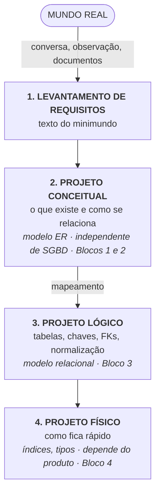

# Aula 03 — O Projeto de Banco de Dados e o Minimundo

> 🎯 Objetivos: reconhecer as quatro fases do projeto de um banco de dados, recortar um minimundo a partir de um texto e extrair dele os primeiros candidatos a entidade e relacionamento.
> 🎬 Slides da aula: [apresentacao-03-projeto-de-bd-e-minimundo.pdf](apresentacao/apresentacao-03-projeto-de-bd-e-minimundo.pdf)

## 1. Minimundo: recortar a realidade

Nenhum banco de dados representa o mundo. Todos representam um **recorte** dele, feito para uma finalidade.

O pedaço da realidade que o banco vai representar chama-se **minimundo** (ou *universo de discurso*). Ele não é dado pela natureza — é uma **decisão**, e é a primeira decisão de projeto que você toma.

Uma biblioteca:

- **Dentro do minimundo:** obras, exemplares, usuários, empréstimos, reservas, multas;
- **Fora:** a cor da parede, o nome do porteiro, a marca do café da copa;
- **Na fronteira, e aqui está a dificuldade:** o histórico de quem já leu cada livro. Interessa? Para o acervo, sim. Para a privacidade, é um problema. **Alguém precisa decidir, e a decisão precisa estar escrita.**

> ⚠️ **O que fica de fora do minimundo nunca poderá ser respondido.** Se você decidir não guardar a data de devolução efetiva, nenhuma consulta futura — nenhuma, por mais engenhosa — vai conseguir dizer quantos dias de atraso houve no semestre passado. Modelagem é a arte de decidir hoje quais perguntas serão possíveis amanhã.

## 2. As quatro fases



**1. Levantamento de requisitos.** Conversar com quem usa, ler documentos, observar o trabalho acontecendo. Produto: um texto em português descrevendo o minimundo, e uma lista das consultas que o sistema precisará responder.

**2. Projeto conceitual.** Transformar o texto num **modelo entidade-relacionamento**. Aqui não existe tabela, tipo de dado ou desempenho — existe apenas o que é verdade sobre o mundo. Produto: o DER.

**3. Projeto lógico.** Traduzir o DER para o modelo do SGBD que será usado (para nós, o relacional): tabelas, chaves primárias e estrangeiras, e a normalização do esquema. Produto: o esquema relacional.

**4. Projeto físico.** Escolher tipos, criar índices, decidir organização de arquivos. Produto: o script DDL e as decisões de desempenho.

> 💡 **Por que quatro fases e não uma?** Porque cada uma responde a uma pergunta diferente, e misturá-las faz você responder à errada primeiro. Quem começa pelo `CREATE TABLE` está decidindo desempenho antes de saber o que existe no mundo — e vai descobrir na quarta semana que o modelo não comporta um fato que o cliente considerava óbvio.

## 3. Por que o conceitual ignora o SGBD

A fase conceitual é a única que fala do **mundo**, e não do computador. Isso tem três consequências práticas:

**É a fase que o cliente consegue validar.** Ninguém que trabalha na biblioteca vai revisar seu `CREATE TABLE`. Mas qualquer pessoa de lá consegue dizer se a frase *"um exemplar pode ser emprestado a vários usuários ao mesmo tempo"* é verdadeira. **O DER é o documento que se discute com quem entende do negócio** — por isso ele não pode ter jargão de banco.

**Sobrevive à troca de tecnologia.** O modelo conceitual da biblioteca é o mesmo em PostgreSQL, em Oracle ou num banco de documentos. Muda o mapeamento, não o modelo.

**Separa "o que é verdade" de "o que é conveniente".** No conceitual, um empréstimo se relaciona com um exemplar — ponto. Se essa ligação será uma coluna `tombo` na tabela `emprestimo` é decisão do projeto lógico, e o cliente não precisa nem deve opinar.

> ⚠️ **Sinal de que você pulou a fase conceitual:** o modelo já tem `id_cliente INT`, `VARCHAR(50)` e uma tabela chamada `tb_cad_cli`. Nada disso existe no mundo. Se essas coisas apareceram antes de você saber responder *"um cliente pode ter dois endereços?"*, o projeto começou pelo fim.

## 4. Lendo um enunciado: substantivos e verbos

O primeiro corte é gramatical, e funciona surpreendentemente bem:

> A biblioteca possui **obras**, identificadas pelo **ISBN**. Cada obra tem **título**, **ano de publicação** e é publicada por uma **editora**. Uma obra tem vários **exemplares** físicos, cada um com um número de **tombo**. **Usuários** cadastrados **realizam empréstimos** de exemplares, registrando a **data de retirada**.

- **Substantivos concretos, contáveis, com vida própria** → candidatos a **entidade**: obra, exemplar, usuário, editora;
- **Substantivos que descrevem outro substantivo** → candidatos a **atributo**: ISBN, título, ano de publicação, tombo, data de retirada;
- **Verbos ligando dois substantivos** → candidatos a **relacionamento**: *possui*, *tem*, *é publicada por*, *realizam*;
- **Numerais e quantificadores** (*vários*, *cada*, *um ou mais*, *no máximo*) → **cardinalidade**. Grife-os separadamente: são a informação mais fácil de perder na leitura.

A palavra é **candidatos**. A promoção e o rebaixamento vêm da conversa:

| Palavra | Primeira leitura | Vira o quê, e por quê |
|---|---|---|
| editora | atributo de obra? | **Entidade**, se a biblioteca quiser guardar endereço e contato da editora. Atributo, se for só um nome impresso |
| tombo | atributo | **Atributo** de exemplar — e é o identificador dele |
| exemplar | ? | **Entidade**, e é a distinção que faz o modelo funcionar: empresta-se o exemplar, não a obra |
| data de retirada | atributo de empréstimo | **Atributo do relacionamento** — não é do usuário nem do exemplar, é do encontro dos dois |

> 💡 **Um teste que resolve a maioria dos casos:** se o cliente algum dia vai querer guardar **mais alguma coisa** sobre aquilo, é entidade. Se aquilo é um valor que só descreve outra coisa e nunca terá características próprias, é atributo. Editora com endereço e telefone é entidade; editora que é só um nome na capa é atributo.

## 5. As perguntas que todo modelador faz

Nenhum enunciado escrito está completo — inclusive os deste curso. As respostas que faltam vêm de perguntar, e há um conjunto que serve para qualquer domínio:

**Sobre quantidade** — *"Um X pode ter mais de um Y?"* e a recíproca. **Sempre as duas direções**, sempre no plural. Metade dos erros de modelagem nasce de perguntar em uma direção só.

**Sobre obrigatoriedade** — *"Pode existir um X sem nenhum Y?"* Distinta da anterior, e igualmente esquecida.

**Sobre identidade** — *"Como vocês distinguem dois X?"* A resposta é a chave. Se a resposta for "pelo nome", pergunte se já houve dois com o mesmo nome. (Já houve.)

**Sobre o tempo** — a pergunta mais rentável de todas: *"Isso muda? E quando muda, vocês precisam saber como era antes?"* O preço de um produto muda; se o histórico importa, ele não é um atributo, é uma entidade com período. Descobrir isso na terceira semana de implementação custa uma refatoração completa.

**Sobre exceções** — *"Sempre foi assim? Já aconteceu de ser diferente?"* O caso raro que o cliente esqueceu de mencionar é o que quebra o modelo.

**Sobre a finalidade** — *"Que perguntas vocês precisam que o sistema responda?"* Peça relatórios reais. Um relatório existente vale por uma hora de entrevista, porque prova quais dados precisam ser guardados.

> 📖 O livro-base trata o levantamento de requisitos e as fases do projeto antes de entrar no modelo ER. A ideia central a reter: **o modelo conceitual é um contrato escrito entre você e o cliente**, e existe justamente para tornar explícito o que a conversa deixou implícito.

## 6. O que fazer com o que não cabe no diagrama

Boa parte do que você descobre não tem símbolo no DER:

- *"O limite de empréstimos depende da categoria do usuário"*;
- *"Não se pode reservar uma obra que você já tem emprestada"*;
- *"A multa é perdoada se o atraso for menor que um dia"*.

Isso são **regras de negócio**. Algumas viram restrições no banco (`CHECK`, `UNIQUE`), outras viram código na aplicação, e outras ficam só no combinado entre pessoas. Todas, sem exceção, precisam estar **escritas junto do modelo**.

> 📏 **Regra do curso:** todo modelo entregue tem duas partes — o **diagrama** e a **lista numerada de regras de negócio** que o diagrama não consegue expressar. A segunda parte é a que salva o projeto seis meses depois, quando ninguém lembra por que aquela cardinalidade é 1:N.

## 🏋️ Exercícios da aula

Na pasta `aula-03/` do seu repositório:

1. **`ex01.md`** — escolha um minimundo do [catálogo](../../recursos/minimundos.md) e escreva três listas: **dentro** do minimundo, **fora** do minimundo, e **na fronteira**. Para cada item da fronteira, escreva a pergunta que você faria ao cliente e as duas consequências possíveis da resposta;
2. **`ex02.md`** — classifique cada decisão na fase a que pertence (requisitos, conceitual, lógico ou físico): (a) "o CPF será a chave primária de `CLIENTE`"; (b) "um pedido pode conter vários produtos"; (c) "vamos criar um índice em `data_pedido`"; (d) "precisamos saber quem cancelou cada pedido"; (e) "a tabela `ITEM_PEDIDO` terá chave composta"; (f) "o campo `observacao` será `TEXT`";
3. **`ex03.md`** — pegue o enunciado da [Videolocadora](../../recursos/minimundos.md#1-videolocadora-de-bairro) e marque, em uma tabela de três colunas: **candidatos a entidade**, **candidatos a atributo** (dizendo de qual entidade) e **candidatos a relacionamento**. Ao final, liste os três casos em que você ficou em dúvida e explique a dúvida — a dúvida bem formulada vale mais que a classificação certa;
4. **`ex04.md`** — para o mesmo minimundo, escreva **8 perguntas** que você faria ao dono da locadora, cobrindo pelo menos quatro das seis categorias da seção 5. Ao lado de cada uma, escreva o que muda no modelo conforme a resposta seja sim ou não;
5. **Desafio 🌶️ `ex05.md`** — o enunciado abaixo é ambíguo de propósito. Aponte **cinco ambiguidades**, escreva a pergunta que resolveria cada uma, e depois **reescreva o enunciado** de forma que um colega consiga modelá-lo sem precisar perguntar nada:

   > *"O laboratório empresta equipamentos para os professores. Cada equipamento tem um responsável. Os professores agendam o uso com antecedência. Equipamentos podem estar em manutenção. O laboratório mantém o histórico de uso."*

## 🧠 Revisão

[8 questões de múltipla escolha](revisao/README.md) para conferir se os conceitos ficaram sólidos. Responda sem consultar a aula — depois volte e corrija.

## ✅ Entrega

```bash
git add aula-03/
git commit -m "Resolve exercícios da aula 03 (projeto de BD e minimundo)"
git push
```

---

⬅️ [Aula 02](../aula-02-arquitetura-independencia/README.md) | ➡️ [Aula 04 — MER: entidades e atributos](../aula-04-mer-entidades-atributos/README.md)
