<!-- _class: capa -->

🌍

# O Projeto de BD e o Minimundo

## Aula 03 · Bloco 1 — Fundamentos

Recortar a realidade — e decidir quais perguntas serão possíveis

---

## 🎯 Nesta aula

1. **Minimundo** — recortar a realidade
2. As **quatro fases** do projeto
3. Por que o conceitual **ignora o SGBD**
4. Lendo um enunciado: **substantivos e verbos**
5. As perguntas que todo modelador faz

---

## Minimundo

É o **recorte da realidade** que o banco vai representar.

Não é o mundo. É o pedaço do mundo que interessa ao sistema — e a decisão de onde cortar é sua.

---

<!-- _class: lead -->

## ⚠️ O que fica de fora nunca poderá ser respondido

Se você decidir não guardar
a data de devolução efetiva,

**nenhuma consulta futura** — nenhuma,
por mais engenhosa — vai conseguir dizer
quantos dias de atraso houve no semestre passado.

Modelagem é a arte de decidir hoje
quais perguntas serão possíveis amanhã.

---

<!-- _class: diagrama -->

## As quatro fases

---

<!-- _class: lead -->

## 💡 Por que quatro fases e não uma?

Porque cada uma responde a uma **pergunta diferente** —
e misturá-las faz você responder à errada primeiro.

Quem começa pelo `CREATE TABLE`
está decidindo **desempenho** antes de saber
**o que existe no mundo**.

E descobre na quarta semana que o modelo
não comporta um fato que o cliente achava óbvio.

---

## Por que o conceitual ignora o SGBD

O modelo conceitual fala de **coisas do mundo**: alunos, obras, empréstimos.

Não fala de `INT`, `VARCHAR(50)` nem de nome de tabela.

> ⚠️ **Sinal de que você pulou a fase conceitual:** o modelo já tem `id_cliente INT`, `VARCHAR(50)` e uma tabela chamada `tb_cad_cli`. Nada disso existe no mundo. Se apareceu antes de você saber responder *"um cliente pode ter dois endereços?"*, o projeto começou pelo fim.

---

## Lendo um enunciado

**Substantivos** → candidatos a **entidade** ou **atributo**.
**Verbos** → candidatos a **relacionamento**.

> *"Um **aluno** **pega emprestado** um **exemplar** de uma **obra**, numa **data**."*

- `ALUNO`, `EXEMPLAR`, `OBRA` — entidades;
- `EMPRESTA` — relacionamento;
- `data` — atributo do relacionamento.

---

<!-- _class: lead -->

## 💡 Entidade ou atributo? O teste

Se o cliente algum dia vai querer guardar
**mais alguma coisa** sobre aquilo → **entidade**.

Se aquilo é um valor que só descreve outra coisa
e nunca terá características próprias → **atributo**.

Editora **com endereço e telefone** é entidade.
Editora que é **só um nome na capa** é atributo.

---

<!-- _class: lista-limpa -->

## As perguntas que todo modelador faz

- 🔢 *"Pode ter mais de um?"* — decide a cardinalidade;
- ❓ *"Pode não ter nenhum?"* — decide a participação;
- 🔑 *"Como vocês identificam isso, no dia a dia?"* — encontra a chave natural;
- 📜 *"O que acontece quando…?"* — descobre as regras de negócio;
- 🗑️ *"E se apagar?"* — decide a ação referencial.

---

## O que não cabe no diagrama

Nem toda regra é desenhável. *"Um aluno não pode pegar mais de 3 livros"* não tem símbolo em nenhuma notação.

> 📏 **Regra do curso:** todo modelo entregue tem **duas partes** — o **diagrama** e a **lista numerada de regras de negócio** que o diagrama não expressa.

A segunda parte é a que salva o projeto seis meses depois, quando ninguém lembra por que aquela cardinalidade é 1:N.

---

<!-- _class: checkpoint -->

## 🏋️ Exercícios da aula

Na pasta `aula-03/`:

1. **`ex01.md`** — recorte o minimundo de um sistema que você usa;
2. **`ex02.md`** — grife substantivos e verbos de um enunciado dado;
3. **`ex03.md`** — decida entidade × atributo em seis casos duvidosos, justificando;
4. **`ex04.md`** — as perguntas que você faria ao cliente;
5. **Desafio 🌶️ `ex05.md`** — as regras de negócio que o diagrama não expressa.

---

<!-- _class: lead -->

## ➡️ Próxima aula

**Aula 04 — MER: Entidades e Atributos**

O vocabulário formal — e a notação
que vai desenhar tudo daqui em diante.
