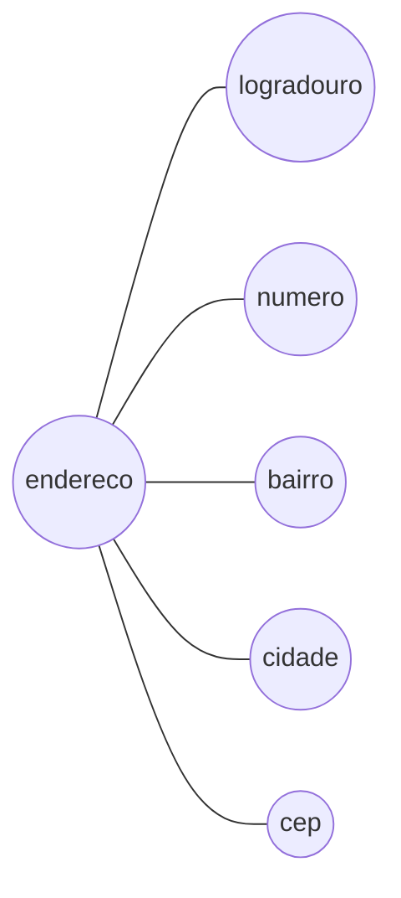
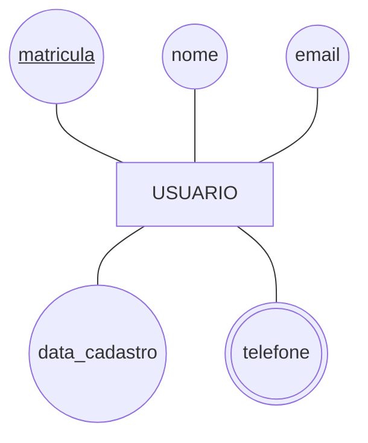
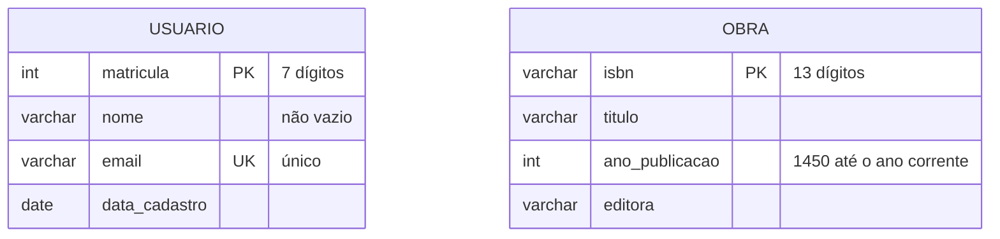

# Aula 04 — MER: Entidades e Atributos

> 🎯 Objetivos: distinguir conjunto de entidades de instância, classificar atributos pelos quatro eixos, escolher uma chave primária com justificativa e desenhar o resultado em Chen e em Mermaid.

## 1. Conjunto de entidades × instância de entidade

Uma **entidade** é algo do minimundo que existe de forma independente e sobre o qual queremos guardar informação: um aluno, um livro, um empréstimo.

Duas coisas diferentes usam a mesma palavra no dia a dia, e a confusão atrapalha:

- **Conjunto de entidades** (ou *tipo de entidade*) — a categoria: `LIVRO`. É o que se desenha no DER;
- **Instância de entidade** — um exemplar concreto da categoria: *o livro de ISBN 978-85-1234-567-8*. Isso nunca aparece no diagrama.

```
Conjunto de entidades LIVRO  ─────► desenhado no DER, uma caixa

  instâncias (não aparecem no DER, moram no banco):
     ('978-85-1234-567-8', 'Fundamentos de Bancos de Dados', 2003)
     ('978-85-9999-111-2', 'Projeto de Algoritmos',           2004)
```

É o mesmo par esquema/instância da Aula 02, agora no nível conceitual. **O DER descreve tipos, nunca ocorrências.**

> ⚠️ Um DER com uma caixa chamada `LIVRO_DE_BANCO_DE_DADOS` está descrevendo uma instância como se fosse um tipo. Toda vez que uma caixa do seu diagrama tiver nome de coisa específica, o modelo está errado.

**Convenção do curso:** nomes de conjuntos de entidades no **singular** e em **MAIÚSCULAS** — `ALUNO`, não `Alunos`. A caixa representa o tipo, e o tipo é um.

## 2. Atributos e seus quatro eixos

Um **atributo** é uma propriedade de uma entidade. Classifica-se em quatro eixos independentes — e a classificação não é decoração acadêmica: cada tipo é mapeado de um jeito diferente na Aula 10.

### Simples × composto

**Composto** é o atributo que se decompõe em partes com significado próprio.



Decompor ou não é decisão de projeto, e a pergunta é operacional: **alguém vai precisar consultar ou ordenar pela parte?** Se o sistema precisa listar usuários por cidade, `cidade` tem que ser um campo. Se o endereço só é impresso inteiro numa etiqueta, um campo de texto basta.

### Monovalorado × multivalorado

**Multivalorado** é o atributo que tem **vários valores simultâneos** para a mesma instância: os telefones de um usuário, os e-mails, as palavras-chave de um artigo.

> ⚠️ **Nunca resolva multivalorado com `telefone1`, `telefone2`, `telefone3`.** Você acaba de decidir, sem base, que ninguém tem quatro telefones; criou três colunas quase sempre vazias; e transformou "buscar quem tem o telefone X" numa consulta com três condições. Multivalorado vira **entidade própria** no projeto lógico — Aula 10, regra 6.

### Armazenado × derivado

**Derivado** é o que pode ser **calculado** a partir de outra informação: a idade (da data de nascimento), o total do pedido (da soma dos itens), a quantidade de exemplares de uma obra (contando).

Não se armazena atributo derivado — armazena-se a base do cálculo. Guardar a idade significa que ela estará errada amanhã.

> 💡 Há uma exceção legítima, e ela é decisão de **projeto físico**, não conceitual: quando o cálculo é caro e frequente, às vezes se guarda o valor calculado de propósito. Isso chama-se desnormalização (Aula 12), custa a obrigação de manter o valor sincronizado, e só se faz com medição na mão — nunca por comodidade.

### Obrigatório × opcional (e o valor nulo)

Um atributo é **opcional** quando pode não ter valor para alguma instância. A ausência representa-se por **nulo**.

E nulo é ambíguo, o que gera confusão pelo resto do curso. `data_devolucao` nula pode significar:

- **Não se aplica** — o empréstimo ainda está aberto, então não há data;
- **Desconhecido** — o livro foi devolvido, mas ninguém anotou quando;
- **Não informado** — o campo é opcional e o atendente pulou.

Três significados, um único símbolo. Voltamos a isso na Aula 09, quando os nulos começarem a estragar consultas.

## 3. Domínio

O **domínio** de um atributo é o conjunto de valores que ele pode assumir. Especificá-lo é parte do modelo, não detalhe de implementação:

| Atributo | Domínio |
|---|---|
| `matricula` | Inteiro de 7 dígitos, positivo |
| `nome` | Texto de até 100 caracteres, não vazio |
| `situacao` | Um de: `disponivel`, `emprestado`, `manutencao`, `extraviado` |
| `ano_publicacao` | Inteiro entre 1450 e o ano corrente |
| `email` | Texto contendo `@`, único no sistema |

> 💡 Cada linha dessa tabela vira uma restrição real na Aula 13 (`CHECK`, `NOT NULL`, `UNIQUE`). Escrever o domínio agora, em português, é escrever metade do DDL adiantado — e é o que impede que `ano_publicacao` receba `1204` em produção.

## 4. Chaves

Uma **chave** é um atributo, ou conjunto de atributos, cujo valor **identifica unicamente** uma instância.

**Superchave** — qualquer conjunto que identifique. `(matricula)` identifica; `(matricula, nome)` também identifica, mas com peso morto.

**Chave candidata** — uma superchave **mínima**: retire qualquer atributo e ela deixa de identificar. Uma entidade pode ter várias — `USUARIO` pode ser identificado por `matricula`, por `cpf` e por `email`.

**Chave primária** — a candidata **escolhida** para identificar oficialmente. Escolha, não descoberta.

**Chave alternativa** — as candidatas que não foram escolhidas. Continuam únicas (viram `UNIQUE` na Aula 13).

**Chave composta** — a formada por mais de um atributo, quando nenhum sozinho identifica.

### Como escolher a chave primária

Quatro critérios, em ordem de importância:

1. **Não muda nunca.** Se o valor muda, toda referência a ele precisa mudar junto. E-mail muda; matrícula não;
2. **Nunca é nulo.** Identificador vazio não identifica;
3. **É garantidamente único** — não "nunca vi repetir", mas *impossível repetir*;
4. **É curto e estável.** A chave é copiada em toda tabela que referenciar esta.

| Candidata em `USUARIO` | Serve? |
|---|---|
| `matricula` | ✅ Não muda, nunca nula, única, curta. **Escolhida** |
| `cpf` | ⚠️ Único e estável, mas nem todo usuário terá (visitante estrangeiro), e é dado sensível. Chave alternativa |
| `email` | ❌ Muda. Descartada como primária, mantida como `UNIQUE` |
| `nome` | ❌ Repete. Já houve dois "Ana Silva" |

> ⚠️ **"Nunca vi repetir" não é garantia de unicidade.** Nome de pessoa repete, telefone é compartilhado, e-mail é reciclado, CPF é digitado errado. Antes de eleger uma chave natural, faça a pergunta cruel: *"o que acontece com o sistema no dia em que repetir?"*

A alternativa é a **chave artificial** (*surrogate*): um número sequencial sem significado, criado só para identificar. Nunca muda, nunca é nula, sempre única — e não diz nada. O debate honesto entre natural e artificial fica para a Aula 06, depois que entidades fracas mostrarem por que ele existe.

## 5. Notação de Chen



O `matricula` sublinhado é a **chave primária**; o `telefone` de contorno duplo é **multivalorado**.

O vocabulário completo:

| Símbolo | Significado |
|---|---|
| Retângulo | Conjunto de entidades |
| Elipse | Atributo |
| Elipse com nome **sublinhado** | Atributo-chave |
| Elipse **dupla** | Atributo multivalorado |
| Elipse **tracejada** | Atributo derivado |
| Elipses penduradas em outra elipse | Atributo composto |

> 📖 A notação de Chen é a usada no livro-base e a esperada em resposta escrita. Vale desenhá-la à mão algumas vezes: a distinção visual entre entidade, atributo e relacionamento fixa o conceito melhor do que qualquer ferramenta.

## 6. O mesmo modelo em Mermaid

Chen é para pensar e para explicar. **Mermaid é para versionar** — e é o que você entrega:



Duas entidades, sem relacionamento entre elas ainda — isso é a Aula 05.

Repare no que **se perde** na tradução: o telefone multivalorado sumiu, porque o Mermaid não tem símbolo para ele. É esperado. A regra é a do [guia de notações](../../recursos/notacoes-der.md): **o que o diagrama não diz, o texto abaixo dele diz.**

> `telefone` é **multivalorado**: um usuário pode ter vários. Será modelado como entidade própria no projeto lógico.

> 💻 **Modelos desta aula:** [`usuario-obra.md`](exemplos/usuario-obra.md)

## 🏋️ Exercícios da aula

Na pasta `aula-04/` do seu repositório:

1. **`ex01.md`** — no enunciado abaixo, liste os **conjuntos de entidades** e, para cada um, os atributos que o texto menciona. Depois aponte dois substantivos que **parecem** entidade mas são atributo, justificando:

   > *"A gráfica recebe pedidos de impressão. Cada pedido é de um cliente, tem data de entrada, prazo, e uma lista de itens. Cada item indica o tipo de material (papel, adesivo, lona), a quantidade, a largura, a altura e o acabamento. Clientes têm razão social, CNPJ, e podem ter vários contatos, cada um com nome, cargo e telefone."*

2. **`ex02.md`** — classifique cada atributo nos **quatro eixos** (simples/composto, mono/multivalorado, armazenado/derivado, obrigatório/opcional), justificando em uma linha: `data_nascimento`, `idade`, `endereco`, `telefone`, `cpf`, `nome_social`, `total_do_pedido`, `situacao`, `palavras_chave`, `data_devolucao`;
3. **`ex03.md`** — para a entidade `PRODUTO` de um supermercado, liste **todas as chaves candidatas** que conseguir imaginar (pense em código interno, código de barras, nome+marca+volume), escolha a primária e defenda a escolha usando os **quatro critérios** da seção 4. Em seguida, descreva o que aconteceria com o sistema se cada candidata **rejeitada** tivesse sido escolhida;
4. **`ex04.md`** — desenhe a entidade `VEICULO` de uma oficina em **notação de Chen** (ASCII ou foto de desenho à mão) com pelo menos um atributo composto, um multivalorado e um derivado. Depois escreva a **mesma entidade em Mermaid**, e liste embaixo tudo que se perdeu na tradução;
5. **Desafio 🌶️ `ex05.md`** — no modelo abaixo, `cor` é um atributo. Argumente **os dois lados**: em que minimundo `cor` deveria virar entidade própria, e em que minimundo continuaria atributo. Dê um exemplo concreto de negócio para cada lado, e termine dizendo qual pergunta você faria ao cliente para decidir em cinco segundos:

   ```mermaid
   erDiagram
       CAMISETA {
           int codigo PK
           varchar modelo
           varchar cor
           varchar tamanho
       }
   ```

## 🧠 Revisão

[8 questões de múltipla escolha](revisao/README.md) para conferir se os conceitos ficaram sólidos. Responda sem consultar a aula — depois volte e corrija.

## ✅ Entrega

```bash
git add aula-04/
git commit -m "Resolve exercícios da aula 04 (entidades e atributos)"
git push
```

---

⬅️ [Aula 03](../aula-03-projeto-de-bd-e-minimundo/README.md) | ➡️ [Aula 05 — Relacionamentos e cardinalidade](../../bloco-2-modelagem-conceitual/aula-05-relacionamentos-cardinalidade/README.md)

🏁 **Fim do Bloco 1!** Você já sabe por que um banco existe, como um projeto se organiza e como descrever uma coisa do mundo. No Bloco 2 as coisas começam a se relacionar — que é onde a modelagem fica interessante e onde moram quase todos os erros.
