<!-- _class: capa -->

📐

# MER: Entidades e Atributos

## Aula 04 · Bloco 1 — Fundamentos

O vocabulário formal — e a notação de Chen

---

## 🎯 Nesta aula

1. **Conjunto de entidades** × **instância**
2. Atributos e seus **quatro eixos**
3. **Domínio**
4. **Chaves**: candidata, primária, composta
5. A notação de **Chen** — e a mesma coisa em Mermaid

---

## Conjunto de entidades × instância

**Conjunto de entidades** é o **tipo**: `LIVRO`, `ALUNO`, `EXEMPLAR`.

**Instância** é o exemplar concreto: *o* livro "Dom Casmurro", *a* aluna Ana.

No diagrama, você desenha **tipos** — nunca instâncias.

> ⚠️ Um DER com uma caixa chamada `LIVRO_DE_BANCO_DE_DADOS` está descrevendo uma **instância** como se fosse um tipo. Toda vez que uma caixa tiver nome de coisa específica, o modelo está errado.

---

<!-- _class: tabela-densa -->

## Os quatro eixos do atributo

| Eixo | De um lado | Do outro |
|---|---|---|
| **Estrutura** | simples — `cpf` | composto — `endereco` (rua, número, cidade) |
| **Cardinalidade** | monovalorado — `nome` | multivalorado — `telefone` |
| **Origem** | armazenado — `data_nascimento` | derivado — `idade` |
| **Obrigatoriedade** | obrigatório | opcional (aceita nulo) |

---

<!-- _class: lead -->

## ⚠️ Nunca resolva multivalorado com `telefone1, telefone2, telefone3`

Você acabou de decidir, **sem base**,
que ninguém tem quatro telefones.

Criou três colunas quase sempre vazias.

E transformou *"quem tem o telefone X?"*
numa consulta com três condições.

Multivalorado vira **entidade própria** — aula 10, regra 6.

---

## Armazenado × derivado

`idade` **não se guarda**. Guarda-se `data_nascimento` e calcula-se.

Guardar o derivado é criar um dado que **envelhece sozinho** e fica errado no dia seguinte.

> 💡 Há uma exceção legítima, e é decisão de **projeto físico**, não conceitual: quando o cálculo é caro e frequente, às vezes se guarda o valor calculado. Chama-se **desnormalização** (aula 12), custa a obrigação de manter sincronizado, e só se faz **com medição na mão**.

---

## Domínio

O **conjunto de valores válidos** de um atributo.

| Atributo | Domínio |
|---|---|
| `ano_publicacao` | inteiro entre 1450 e o ano atual |
| `email` | texto contendo `@`, único |
| `situacao` | um de: *disponível*, *emprestado*, *em reparo* |

> 💡 Cada linha dessa tabela vira uma restrição real na aula 13 — `CHECK`, `NOT NULL`, `UNIQUE`. Escrever o domínio agora, em português, é **escrever metade do DDL adiantado**.

---

## Chaves

**Candidata** — qualquer conjunto de atributos que identifica unicamente uma instância.

**Primária** — a candidata que você **escolheu**.

**Composta** — quando é preciso mais de um atributo para identificar.

**Alternativa** — as candidatas que ficaram de fora.

---

<!-- _class: lead -->

## ⚠️ "Nunca vi repetir" não é garantia de unicidade

Nome de pessoa repete.
Telefone é compartilhado.
E-mail é reciclado.
CPF é digitado errado.

Antes de eleger uma chave natural, faça a pergunta cruel:

**"o que acontece com o sistema no dia em que repetir?"**

---

<!-- _class: diagrama -->

## A notação de Chen

---

## O vocabulário visual de Chen

| Símbolo | Significa | Símbolo | Significa |
|---|---|---|---|
| **Retângulo** | entidade | **Elipse sublinhada** | chave primária |
| **Losango** | relacionamento | **Elipse dupla** | multivalorado |
| **Elipse** | atributo | **Elipse tracejada** | derivado |

> 📖 Chen é a notação do livro-base e a esperada em resposta escrita. Vale desenhá-la à mão algumas vezes — a distinção visual fixa o conceito melhor que qualquer ferramenta.

---

<!-- _class: diagrama -->

## O mesmo modelo em Mermaid

---

<!-- _class: checkpoint -->

## 🏋️ Exercícios da aula

Na pasta `aula-04/`:

1. **`ex01.md`** — classifique 10 atributos nos quatro eixos;
2. **`ex02.md`** — escreva o domínio de cada atributo de uma entidade sua;
3. **`ex03.md`** — escolha a chave primária e **justifique** — inclusive o que acontece se repetir;
4. **`ex04.md`** — desenhe a mesma entidade em Chen e em Mermaid;
5. **Desafio 🌶️ `ex05.md`** — um atributo que parece simples e não é.

---

<!-- _class: lead -->

## 🏁 Fim do Bloco 1

Você sabe **por que** um banco existe,
**como** ele se organiza e **qual** é o vocabulário.

**Bloco 2 — Modelagem Conceitual**

Agora as entidades começam a se relacionar.
