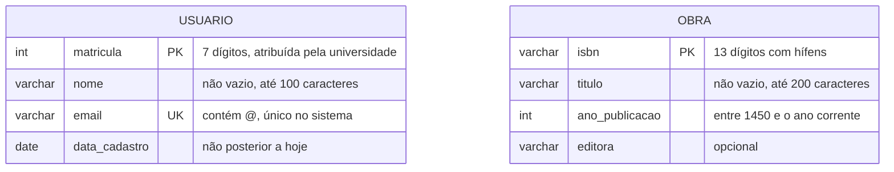
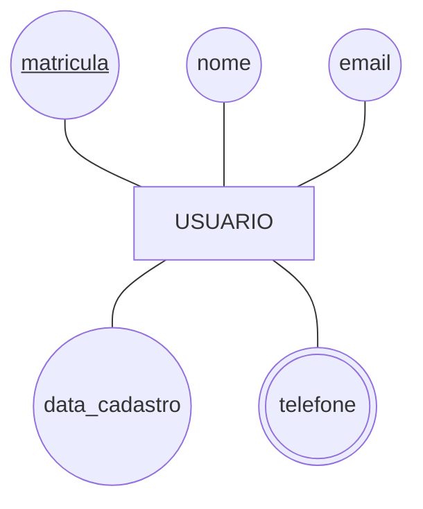
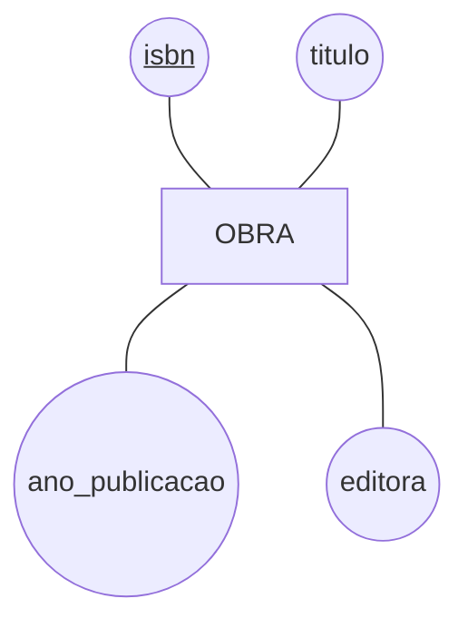

# Aula 04 — Entidades e atributos: `USUARIO` e `OBRA`

As duas primeiras entidades do caso da Biblioteca, ainda **sem relacionamento** — isso é a Aula 05.

## O modelo

## O que o diagrama não diz

Registrado em texto, como manda a [regra do curso](../../../recursos/notacoes-der.md#4-o-que-o-mermaid-não-desenha):

- **`telefone` é multivalorado** — um usuário pode ter vários. Não há símbolo no Mermaid; será modelado como entidade fraca (Aula 06);
- **`endereco` seria composto**, se o minimundo o exigisse: `logradouro`, `numero`, `bairro`, `cidade`, `cep`. Decidimos não guardá-lo — a universidade já tem esse dado no cadastro acadêmico;
- **Nenhum atributo derivado** aqui. `quantidade_de_exemplares` de uma obra seria um: calcula-se contando, e por isso **não** se armazena.

## As chaves, e por que estas

| Entidade | Candidatas | Escolhida | Justificativa |
|---|---|---|---|
| `USUARIO` | `matricula`, `email` | `matricula` | Não muda, nunca nula, atribuída pela instituição. `email` muda → vira chave alternativa (`UNIQUE`) |
| `OBRA` | `isbn` | `isbn` | Padrão internacional, estável, nunca nulo para obra publicada |

> ⚠️ `nome` **não** é candidata em `USUARIO`: já houve dois "Ana Silva" na universidade, e vai haver de novo.

## Os mesmos em notação de Chen

O que o Chen expressa e o `erDiagram` não: a **elipse dupla** de `telefone` (multivalorado) e o **sublinhado** da chave. É por isso que o curso usa `flowchart` quando o assunto é a notação, e `erDiagram` quando o assunto é a estrutura.

---

⬅️ [Voltar à Aula 04](../README.md) | 🏠 [Início do curso](../../../README.md)
