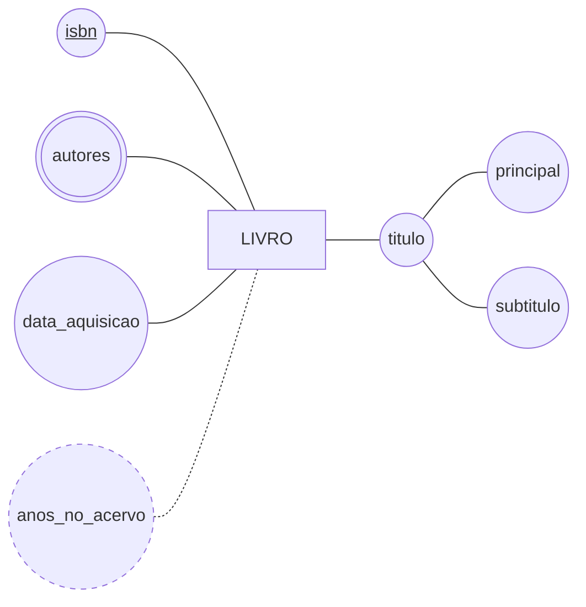

# Aula 03 — Os Elementos de um Banco de Dados

> 🎯 Objetivos: nomear os elementos de um banco de dados, distinguir entidade de atributo com um teste escrito e desenhar o primeiro diagrama na notação de Chen.
> 🎬 Slides da aula: [apresentacao-03-elementos-de-um-banco.pdf](apresentacao/apresentacao-03-elementos-de-um-banco.pdf)

## 1. Os elementos

Na Aula 01 separamos a planilha em três assuntos. Vamos olhar de perto um deles:

```
   LIVRO
   ┌───────────────┬────────────────────────┬──────┬────────────┐
   │ isbn          │ titulo                 │ ano  │ aquisicao  │
   ├───────────────┼────────────────────────┼──────┼────────────┤
   │ 978-8535212 │ Banco de Dados         │ 2019 │ 2024-02-10   │
   │ 978-8521637 │ Engenharia de Software │ 2021 │ 2024-02-10   │
   │ 978-8574523 │ Redes de Computadores  │ 2018 │ 2025-08-03   │
   └───────────────┴────────────────────────┴──────┴────────────┘
```

Cinco nomes para cinco coisas que você já está vendo:

- **Tabela** — o conjunto todo. No vocabulário formal do modelo relacional, chama-se **relação**;
- **Linha** — um livro específico. Formalmente, uma **tupla**;
- **Coluna** — uma característica que todos os livros têm;
- **Valor** — o conteúdo de uma célula: `2019`, `Banco de Dados`;
- **Domínio** — o conjunto de valores que uma coluna **aceita**. O domínio de `ano` são inteiros de quatro dígitos; o de `aquisicao` são datas válidas.

> 💡 O domínio é o elemento que os alunos esquecem, e é o mais útil dos cinco. Ele é a primeira regra que o banco pode verificar por você: se o domínio de `ano` são inteiros, `mil novecentos` não entra — e ninguém precisou escrever código para isso.

> ⚠️ **A ordem das linhas não significa nada.** Uma tabela é um *conjunto* de tuplas, não uma lista. Se o seu modelo depende de um livro estar "antes" de outro, essa ordem precisa virar uma coluna — uma data, um número de sequência.

## 2. Entidade: o que merece ser uma

Antes de existir tabela, existe uma decisão: **quais coisas do mundo o banco vai guardar?**

**Entidade** é uma coisa do mundo, distinguível das outras, sobre a qual o banco precisa guardar informação. `LIVRO` é entidade. `ALUNO` é entidade. `EMPRESTIMO` também — mesmo não sendo um objeto que se pega na mão, é um acontecimento sobre o qual há o que guardar.

Nem todo substantivo do enunciado vira entidade. O teste são três perguntas, e a candidata precisa passar nas três:

1. **Ela se distingue?** Existe alguma forma de apontar para uma ocorrência específica e não confundi-la com outra?
2. **Ela tem mais de uma característica própria?** Se só há o nome dela, provavelmente é o nome de outra coisa;
3. **Alguém vai querer guardar algo sobre ela no futuro?** Se a resposta for não, hoje e sempre, ela é um valor.

Aplicando a três candidatas da biblioteca:

| Candidata | Distingue? | Mais de uma característica? | Vai crescer? | Veredito |
|---|:---:|:---:|:---:|---|
| `EDITORA` | sim, pelo nome | sim: cidade, site, contato | sim | **entidade** |
| `SITUACAO` (disponível, emprestado) | sim, mas são quatro valores fixos | não, só a descrição | não | **atributo** |
| `EMPRESTIMO` | sim, pelo número | sim: datas, aluno, exemplar | sim | **entidade** |

> 💡 **Convenção de nome deste curso:** entidade em **maiúsculas e no singular** — `LIVRO`, não `livros`. Singular porque o nome descreve **uma** ocorrência, e é assim que a frase do modelo se lê em voz alta: *"um `LIVRO` tem um `titulo`"*. Sem acento e sem espaço no nome, que é o que a ferramenta de diagrama aceita.

## 3. Atributo e seus tipos

**Atributo** é uma característica de uma entidade. E eles não são todos iguais — são quatro tipos, e confundi-los é o que produz metade dos modelos errados:

- **Simples** — um valor, indivisível para o seu propósito. `ano`, `isbn`;
- **Composto** — se divide em partes que fazem sentido sozinhas. `titulo` de um livro se divide em título principal e subtítulo; `endereco` se divide em rua, número e cidade;
- **Multivalorado** — a mesma entidade tem **vários** valores dele ao mesmo tempo. Um livro tem vários autores; uma pessoa tem vários telefones;
- **Derivado** — não se guarda, se **calcula** a partir de outro. Os anos que um livro está no acervo saem da data de aquisição; a idade sai da data de nascimento.

Em Chen, cada tipo tem um desenho — e é por isso que a notação funciona: você reconhece o tipo pela forma, sem ler:



Lendo o desenho: `isbn` está **sublinhado**, então é o atributo que identifica; `titulo` tem duas elipses penduradas nele, então é **composto**; `autores` tem contorno **duplo**, então é **multivalorado**; `anos_no_acervo` está **tracejado**, então é **derivado** e não ocupa espaço no banco; `data_aquisicao` é uma elipse comum, então é **simples**.

> 💻 **Modelo desta aula:** [`entidade-livro.md`](exemplos/entidade-livro.md) — o mesmo diagrama, com o parágrafo em português que ele exige.

> ⚠️ **Atributo derivado não se armazena.** Guardar `anos_no_acervo` como coluna significa que ele fica errado no dia seguinte e alguém precisa atualizar tudo todo ano. Guarde a data e calcule quando precisar — a regra é: **guarde o que não dá para deduzir**.

> 📖 A classificação dos atributos e o teste de entidade estão no capítulo de modelo conceitual do Heuser, com exemplos diferentes dos daqui. Vale ver os dois.

## 4. O que não é entidade

O erro mais comum de quem está começando é **promover um atributo a entidade**. Ele nasce de uma intenção boa — "assim fica mais organizado" — e produz modelos cheios de entidades que só têm código e descrição.

O caso clássico é a entidade `SITUACAO`, com quatro ocorrências: disponível, emprestado, em manutenção, extraviado. Ela não passa no teste da seção 2: não tem características próprias além da descrição, e ninguém nunca vai pendurar nada nela. É um **atributo com domínio restrito**.

> 💡 O contrário também acontece, e é pior. `TELEFONE` tratado como atributo simples quando a biblioteca precisa saber o tipo (fixo, celular, recado), o horário de contato e quem atendeu. Aí ele tem três características próprias e virou entidade.

A pergunta que decide, e que vale levar para toda modelagem: **"o cliente algum dia vai querer guardar mais alguma coisa sobre isso?"** Se sim, entidade. Se não, atributo.

> ⚠️ Você não decide isso sozinho no papel — decide **perguntando**. É o assunto da próxima aula.

## 5. O processo de modelagem em quatro etapas

Você acabou de fazer, em pequena escala, a primeira etapa de um processo que tem quatro. Elas vão organizar o resto do curso:

```
   1. REQUISITOS     ──▶  o que o cliente precisa guardar
      (Aula 04)           conversa, em português, sem diagrama

   2. CONCEITUAL     ──▶  entidades, atributos, relacionamentos
      (Bloco 2)           o DER em Chen — independe de qualquer tecnologia

   3. LÓGICO         ──▶  o modelo traduzido para tabelas, chaves e ligações
      (Bloco 2)           já assume que o banco é relacional

   4. FÍSICO         ──▶  como isso é gravado: tipos, índices, armazenamento
      (fora deste curso)  depende do SGBD escolhido
```

Duas coisas para reparar, e as duas são a razão de o processo existir:

**A ordem não se inverte.** Quem começa criando tabelas está decidindo estrutura antes de entender o problema, e vai descobrir na metade que faltou perguntar alguma coisa.

**Cada etapa é independente da seguinte.** O modelo conceitual não menciona nenhum SGBD — o mesmo diagrama vale se o banco for PostgreSQL, Oracle ou nenhum dos dois. É por isso que este curso passa a maior parte do tempo na etapa 2: ela é a que não muda quando a tecnologia muda.

Para a biblioteca, as quatro etapas produziriam:

| Etapa | O que sai dela |
|---|---|
| Requisitos | *"a biblioteca empresta exemplares a alunos por quinze dias, e guarda o histórico"* |
| Conceitual | o diagrama com `ALUNO`, `EXEMPLAR`, `EMPRESTIMO` e as ligações entre eles |
| Lógico | as tabelas, com as colunas que identificam e as que ligam uma à outra |
| Físico | o tipo de cada coluna e o que o SGBD faz para achar rápido |

> ⚠️ Repare que a primeira etapa **não tem desenho nenhum** — é texto em português. Quem pula direto para o diagrama está adivinhando o que o cliente quer, e vai descobrir o erro na etapa 3.

## 🏋️ Exercícios da aula

Na pasta `aula-03/` do seu repositório:

1. **`ex01.md`** — classifique cada um dos oito atributos abaixo em **simples**, **composto**, **multivalorado** ou **derivado**, escrevendo uma linha de justificativa para cada: `isbn`, `endereco_editora`, `telefones_editora`, `idade_do_acervo`, `titulo`, `nome_autor`, `data_aquisicao`, `qtd_exemplares`. *Confere assim: há pelo menos um de cada tipo, e **dois** dos oito são derivados — se você achou só um, releia procurando o que dá para contar.*

2. **`ex02.md`** — a biblioteca também empresta salas de estudo: *"Cada sala tem um código, uma capacidade e fica num andar. As salas são reservadas por alunos, para um dia e um horário. Algumas salas têm projetor, e o técnico responsável pelo equipamento precisa ser registrado."* Liste os **candidatos a entidade** desse texto e aplique a cada um as três perguntas da seção 2, aceitando ou recusando por escrito. *Confere assim: pelo menos um candidato é recusado — e ele é um atributo disfarçado de entidade.*

3. **`ex03.md`** — desenhe em Mermaid `flowchart`, na notação de Chen, a entidade `EXEMPLAR` com **cinco atributos**: o que identifica (sublinhado), pelo menos um multivalorado **ou** derivado, e os demais simples. Abaixo do diagrama, escreva o parágrafo em português dizendo o que ele afirma sobre o mundo. *Confere assim: abra o arquivo no preview do GitHub — se o diagrama aparecer como código cru em vez de desenho, há erro de sintaxe. A [notação](../../recursos/notacoes-der.md) tem a lista dos cinco tropeços mais comuns.*

### 📤 Entrega

Estes exercícios são feitos em sala e vão para o **seu repositório** `exercicios-modelagem-dados`:

```bash
cd ..                 # da pasta da aula para a raiz do repositório
git add aula-03/
git commit -m "Resolve exercícios da aula 03"
git push
```

Confira no navegador que a pasta apareceu em `github.com/SEU-USUARIO/exercicios-modelagem-dados`.

## 🧠 Revisão

[8 questões de múltipla escolha](revisao/README.md) para conferir se os conceitos ficaram sólidos. Responda sem consultar a aula — depois volte e corrija.

**A entrega é pelo formulário:** [responder a revisão da Aula 03](https://docs.google.com/forms/d/e/1FAIpQLSeBonzekOFuwleTMbKl4KU7CfSKD2YobUC09fcb-7NFymd5LA/viewform)

Entre com uma conta Google, selecione seu nome na lista e informe seu usuário do GitHub — só o usuário, não o endereço do perfil. Se o seu nome ainda não estiver na lista, marque a última opção e escreva o nome completo no campo seguinte. É **uma resposta por aluno** e não dá para editar depois de enviar, então confira antes. A nota é liberada no AVA depois da revisão em sala e da divulgação do gabarito.

---

⬅️ [Aula 02 — De Onde Vêm os Bancos de Dados](../aula-02-de-onde-vem-os-bancos/README.md) | ➡️ [Aula 04 — Requisitos, OLTP e OLAP](../aula-04-requisitos-oltp-e-olap/README.md)
