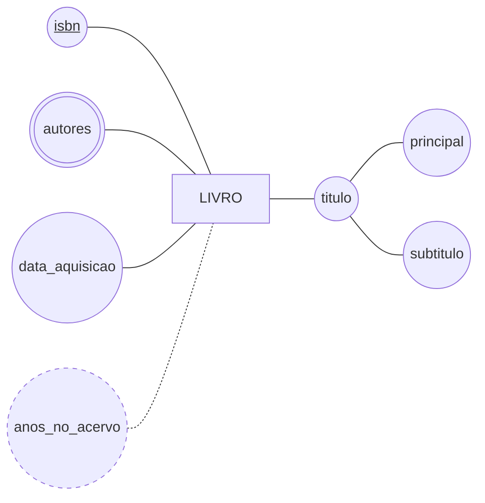

# A entidade `LIVRO` em Chen

O modelo da [Aula 03](../README.md), com os quatro tipos de atributo num diagrama só. Use-o como referência de sintaxe no `ex03`.

## O que este diagrama afirma sobre o mundo

Todo livro do acervo é identificado pelo seu **ISBN**, e não existem dois livros diferentes com o mesmo ISBN.

Todo livro tem um **título**, que se divide em título principal e subtítulo — a biblioteca precisa dos dois separados porque a busca no catálogo procura no principal, e a ficha catalográfica imprime os dois.

Um livro tem **um ou mais autores**, e é por isso que `autores` está desenhado como multivalorado: não cabe um valor só. Já se a biblioteca precisasse saber a instituição de cada autor, ou a ordem em que assinam, `autores` deixaria de ser atributo e viraria uma entidade própria — é a decisão da seção 4 da aula.

A **data de aquisição** é única por livro e se guarda como está. Os **anos no acervo** aparecem tracejados porque são calculados a partir dela: guardar esse número significaria reescrevê-lo em todo o acervo a cada aniversário de compra.

> ⚠️ Este diagrama não diz nada sobre **exemplares**. Um livro é a obra; o exemplar é o volume físico que se leva para casa. São entidades diferentes, e confundi-las é o erro clássico que o curso trata no Bloco 2.

---

⬅️ [Voltar à Aula 03](../README.md)
