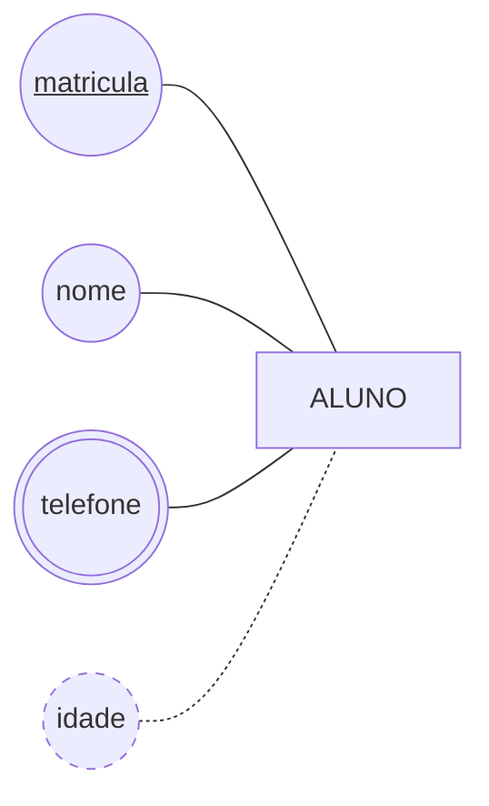

# Aula 03 — Revisão: Múltipla Escolha

> 🎯 8 questões sobre a [Aula 03 — Os Elementos de um Banco de Dados](../README.md). Só uma alternativa está correta em cada uma.

**Sem gabarito, de propósito.** Cada questão termina com a seção da aula onde a resposta está. Responda **tudo primeiro**, sem consultar — só depois volte às seções indicadas e corrija.

As três últimas são marcadas **[ENADE]**: seguem o formato do exame, com cinco alternativas e enunciado mais longo.

---

### Q-A03-01

Na tabela `LIVRO`, a coluna `ano` aceita apenas números inteiros de quatro dígitos. Esse conjunto de valores que a coluna aceita chama-se:

- **a)** tupla;
- **b)** domínio;
- **c)** relação;
- **d)** atributo derivado.

↩︎ *Aula 03, seção 1 — Os elementos*

---

### Q-A03-02

Qual dos atributos abaixo é **derivado**?

- **a)** o ISBN de um livro;
- **b)** os telefones de contato de uma editora;
- **c)** o endereço de um aluno;
- **d)** a quantidade de exemplares que a biblioteca tem de uma obra.

↩︎ *Aula 03, seção 3 — Atributo e seus tipos*

---

### Q-A03-03

Uma candidata a entidade tem apenas um código e uma descrição, possui quatro ocorrências fixas e ninguém pretende guardar mais nada sobre ela, hoje ou no futuro. Segundo o teste visto na aula, ela deve ser modelada como:

- **a)** atributo com domínio restrito;
- **b)** entidade fraca, por depender de outra para existir;
- **c)** entidade com chave composta;
- **d)** atributo derivado, por ser calculável.

↩︎ *Aula 03, seção 4 — O que não é entidade*

---

### Q-A03-04

A ordem correta das quatro etapas do processo de modelagem é:

- **a)** conceitual, requisitos, lógico, físico;
- **b)** requisitos, lógico, conceitual, físico;
- **c)** requisitos, conceitual, lógico, físico;
- **d)** conceitual, lógico, físico, requisitos.

↩︎ *Aula 03, seção 5 — O processo de modelagem em quatro etapas*

---

### Q-A03-05

No vocabulário formal do modelo relacional, uma linha de uma tabela chama-se:

- **a)** domínio;
- **b)** tupla;
- **c)** relação;
- **d)** atributo.

↩︎ *Aula 03, seção 1 — Os elementos*

---

### Q-A03-06

**[ENADE]**

Durante o levantamento de um sistema acadêmico, um analista apresentou o diagrama a seguir, na notação de Chen, para representar a entidade `ALUNO`.

Com base exclusivamente no que o diagrama representa, é correto afirmar que:

- **A)** cada aluno possui um único telefone, e sua idade é armazenada no banco;
- **B)** o atributo `matricula` é multivalorado, por estar sublinhado no diagrama;
- **C)** a idade é armazenada, e o telefone é calculado a partir de outro atributo;
- **D)** o diagrama não indica qual atributo identifica cada aluno;
- **E)** cada aluno pode ter vários telefones, e a idade não é armazenada, mas calculada.

↩︎ *Aula 03, seção 3 — Atributo e seus tipos*

---

### Q-A03-07

**[ENADE]**

Avalie as asserções a seguir e a relação proposta entre elas.

I. Um atributo multivalorado deve ser transformado em uma entidade própria quando for necessário guardar informação a respeito de cada um dos seus valores.

PORQUE

II. Um atributo guarda características da entidade a que pertence, e não características de si mesmo.

A respeito dessas asserções, assinale a opção correta.

- **A)** As asserções I e II são proposições verdadeiras, e a II é uma justificativa correta da I;
- **B)** As asserções I e II são proposições verdadeiras, mas a II não é uma justificativa correta da I;
- **C)** A asserção I é uma proposição verdadeira, e a II é uma proposição falsa;
- **D)** A asserção I é uma proposição falsa, e a II é uma proposição verdadeira;
- **E)** As asserções I e II são proposições falsas.

↩︎ *Aula 03, seção 4 — O que não é entidade*

---

### Q-A03-08

**[ENADE]**

A respeito das etapas do processo de modelagem de dados, avalie as afirmações a seguir.

I. O modelo conceitual independe do sistema gerenciador de banco de dados que será utilizado.

II. O modelo lógico já assume que o banco de dados será relacional.

III. O modelo físico deve ser definido antes do conceitual, para orientar as decisões das etapas seguintes.

É correto apenas o que se afirma em:

- **A)** I;
- **B)** II;
- **C)** I e III;
- **D)** I e II;
- **E)** II e III.

↩︎ *Aula 03, seção 5 — O processo de modelagem em quatro etapas*

---

⬅️ [Voltar à Aula 03](../README.md) | 🏠 [Início](../../../README.md)
