<!-- _class: capa -->

⚖️

# Requisitos, OLTP e OLAP

## Aula 04 · Bloco 1 — Fundamentos de Bancos de Dados

As perguntas que revelam a estrutura escondida

---

## 🎯 Nesta aula

1. Levantar requisitos é **fazer perguntas**
2. De onde vêm os requisitos — e o que cada fonte **esconde**
3. A primeira bifurcação: **operar ou analisar?**
4. **OLTP** — o banco que opera
5. **OLAP** — o banco que analisa, e a **granularidade**
6. O que fazer com as respostas: a **regra numerada**

---

## De onde viemos

Na **Aula 03** você decidiu se `SITUACAO` era **entidade ou atributo**.

Só que essa decisão **não se toma no papel**. Toma-se **perguntando a quem conhece o assunto** — e é isso que esta aula ensina a fazer.

> 💡 O levantamento é a **etapa 1** do processo, e a única que acontece inteiramente **em português**. Aqui ainda não há uma linha de modelo.

---

## Levantar requisitos é fazer perguntas

**Levantamento de requisitos** é a etapa em que você descobre o que o banco precisa guardar, **conversando com quem vai usá-lo**.

O bibliotecário diz:

> *"O aluno pega o livro e devolve em quinze dias."*

Uma frase — e ela deixa **quase tudo em aberto**.

---

## Quatro perguntas revelam a estrutura

Cada uma decide **uma coisa diferente** no modelo que você vai desenhar no Bloco 2.

---

## "Quantos?" e "Pode zero?"

**Quantos?** Um aluno pode ter vários empréstimos ao mesmo tempo? Um exemplar pode estar em dois empréstimos? → decide a **cardinalidade**.

**Pode zero?** Existe empréstimo sem aluno? Aluno sem nenhum empréstimo? → decide **o que é obrigatório**.

Parecem a mesma pergunta feita de dois jeitos. **Não são.**

---

<!-- _class: lead -->

## ⚠️ São duas perguntas, não uma

Um empréstimo tem
**no máximo um** aluno — *quantos* —
**e obrigatoriamente um** aluno — *pode zero*.

São afirmações diferentes sobre o mundo,
e cada uma vira uma coisa
diferente no diagrama.

---

## "Precisa do histórico?" e "Quem pode ver?"

**Precisa do histórico?** Quando o livro é devolvido, o empréstimo **some ou fica registrado**? → decide se o dado é apagado ou preservado.

**Quem pode ver?** O aluno consulta os empréstimos dos colegas? → decide a **política de segurança** da Aula 02.

Nenhuma das duas aparece na frase do cliente. **As duas mudam o banco.**

---

<!-- _class: lead -->

## 💡 A pergunta mais produtiva não está na lista

*"Me dá um exemplo de
quando isso deu errado?"*

As exceções que o cliente lembra
são exatamente as regras
que ele **esqueceu de contar**.

---

<!-- _class: tabela-densa -->

## De onde vêm os requisitos

| Fonte | O que dá bem | O que esconde |
|---|---|---|
| **Entrevista** | as regras que sabe explicar | o que faz sem perceber que faz |
| **Documento** | os campos que existem mesmo | por que existem; quais não se usam |
| **Sistema legado** | o comportamento real, testado | as decisões erradas, que se copia junto |
| **Observação** | o passo que ninguém conta | leva tempo; a pessoa muda ao ser observada |

O que cada fonte esconde é **sistemático**, não acidental — por isso a coluna da direita é a que importa.

---

## Nenhuma fonte basta sozinha

As quatro alimentam **a mesma lista numerada** — e é ela, não a sua lembrança da conversa, que vira o modelo do Bloco 2.

---

## O campo que ninguém mencionou

O formulário de empréstimo da biblioteca tem um campo **"observação"** que o bibliotecário **nunca citou na entrevista**.

É lá que ele anota quando o livro voltou **danificado**.

Isso é uma **regra de negócio inteira**, escondida num campo de texto livre — e só o **documento** a revelaria. A entrevista, sozinha, não a alcança.

---

## A primeira bifurcação

Antes de desenhar qualquer coisa: **este banco existe para operar o dia a dia, ou para analisar o que já aconteceu?**

---

## Os dois pedidos da biblioteca

**"Registrar o empréstimo enquanto o aluno espera no balcão."** — uma operação, agora, rápida; escreve pouca coisa; precisa estar **certa na hora**.

**"Saber quais assuntos foram mais procurados nos últimos 5 anos, por curso."** — uma pergunta sobre **milhões** de empréstimos já encerrados; lê muito, não escreve nada; **pode demorar**.

Necessidades tão diferentes que receberam **nomes próprios**.

---

## OLTP — o banco que opera

**OLTP** — *On-Line Transaction Processing* — é o banco do dia a dia: empréstimos, matrículas, vendas, pagamentos.

- **Muitas operações curtas** — centenas por minuto, poucas linhas cada;
- **Escrita frequente** — insere, atualiza, corrige;
- **Dado atual** — este exemplar está emprestado ou não;
- **Modelo normalizado** — cada dado num lugar só;
- **Precisa estar certo na hora** — o aluno está no balcão.

---

## O que "transação" quer dizer aqui

Não é o sentido bancário nem o de "transação comercial".

Aqui **transação** é **uma operação completa de negócio**: registrar um empréstimo é *uma* transação.

É desse **volume de operações curtas** que vem o nome — *On-Line **Transaction** Processing*.

> 💡 O modelo **normalizado** da lista anterior não é preferência estética: é o que impede a contradição da Aula 01, num banco onde se altera o tempo todo.

---

## OLAP — o banco que analisa

**OLAP** — *On-Line Analytical Processing* — é o banco das perguntas: relatórios, tendências, comparações ao longo do tempo.

- **Poucas consultas, cada uma pesada** — uma pergunta varre anos;
- **Leitura quase pura** — os dados entram em carga programada;
- **Dado histórico** — a série inteira, inclusive o já encerrado;
- **Modelo desnormalizado de propósito** — aceita repetir dado para não juntar dezenas de tabelas;
- **Pode demorar** — ninguém espera relatório anual no balcão.

---

## Granularidade

**Granularidade** é o **nível de detalhe** em que o dado é guardado.

Um banco analítico pode guardar **cada empréstimo**, ou já guardar **os totais por mês**.

**Quanto mais grossa a granularidade, mais rápido o relatório — e menos perguntas ele consegue responder.**

---

## A granularidade, e o que ela custa

Escolher a granularidade é escolher **quais perguntas o banco poderá responder** daqui a três anos. O detalhe que não foi guardado **não volta**.

---

<!-- _class: lead -->

## ⚠️ Desnormalizar em OLAP é decisão consciente

Ela só é legítima porque o dado analítico
**não é alterado**: entra numa carga
e é lido muitas vezes.

A anomalia de alteração da Aula 01
**não acontece onde ninguém altera**.

---

<!-- _class: tabela-densa -->

## Os dois, lado a lado

| | OLTP | OLAP |
|---|---|---|
| **Pergunta típica** | "este exemplar está disponível?" | "quais assuntos cresceram em 5 anos?" |
| **Operações** | muitas e curtas | poucas e longas |
| **Predomina** | escrita | leitura |
| **Recorte do tempo** | o estado de agora | a série histórica |
| **Modelo** | normalizado | desnormalizado |

É esta tabela que o `ex02` cobra: para cada cenário, **qual dimensão decidiu** a classificação.

---

## Os dois convivem — e conversam

O OLTP registra o dia a dia. Periodicamente, uma **carga** leva esses dados para o OLAP, onde as perguntas analíticas são feitas.

A seta vermelha é a **única** ligação entre os dois — e ela acontece quando ninguém está no balcão.

---

## Por que não deixar tudo num banco só

O motivo é concreto, e não é purismo.

**Um relatório de cinco anos rodando no banco do balcão deixaria o atendimento lento justamente no horário de pico.**

A consulta analítica varre milhões de linhas; enquanto ela roda, o aluno na fila espera — e o bibliotecário liga reclamando do sistema.

---

<!-- _class: lead -->

## ⚠️ Não são tecnologias — são cargas de trabalho

Não existe "instalar um OLAP".

O mesmo SGBD da Aula 02 serve aos dois,
com **modelagens diferentes**.

Tratá-los como produtos
é a confusão mais comum do tópico.

---

## Perguntar é metade

A outra metade é **escrever** — porque o que não foi escrito vira lembrança, e **lembrança de duas pessoas nunca é a mesma**.

Cada resposta vira uma frase **curta**, **afirmativa** e **verificável**: o cliente precisa poder responder "verdadeiro ou falso" a ela, na sua frente.

> 💡 Essa lista numerada acompanha o modelo **até o fim do projeto**.

---

## Uma frase virou quatro regras

Repare na **RN-04, em vermelho**: ela não estava na fala do cliente. Apareceu porque alguém perguntou *"e quando devolve, some?"*.

---

## Três coisas para reparar

**Cada regra afirma uma coisa só.** Dá para responder "verdadeiro ou falso" a cada uma, isoladamente, na frente do cliente.

**Elas ganham número.** Você vai precisar apontar para uma delas quando perguntarem por que o modelo ficou daquele jeito.

**Requisito não levantado não é requisito ausente** — é requisito que vai aparecer **tarde**, quando o modelo já estiver pronto.

---

## ⚠️ Nem toda regra cabe no diagrama

*"O prazo é de 15 dias"* **não vira desenho nenhum**: fica na lista, em texto.

E tudo bem. **Perder a informação porque ela não tem símbolo é pior** do que ter duas formas de registro.

> 💡 No Bloco 2, cada linha do seu diagrama vai poder ser justificada apontando para uma dessas regras — e **o que não puder é invenção sua**.

---

<!-- _class: checkpoint -->

## 🏋️ Exercícios da aula

Na pasta `aula-04/`:

1. **`ex01.md`** — seis perguntas de levantamento sobre a regra da reserva;
2. **`ex02.md`** — classifique seis cenários em OLTP ou OLAP, citando a dimensão que decidiu;
3. **`ex03.md`** — **autoral**: escolha um minimundo ⭐ do catálogo, faça oito perguntas e decida OLTP ou OLAP.

---

<!-- _class: lead -->

## ➡️ Próxima aula

**Aula 05 — Projeto de BD: conceitual, lógico e físico**

O mesmo empréstimo, escrito três vezes —
e quem precisa entender cada uma delas.
