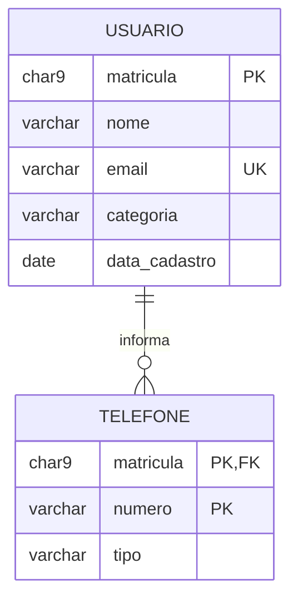
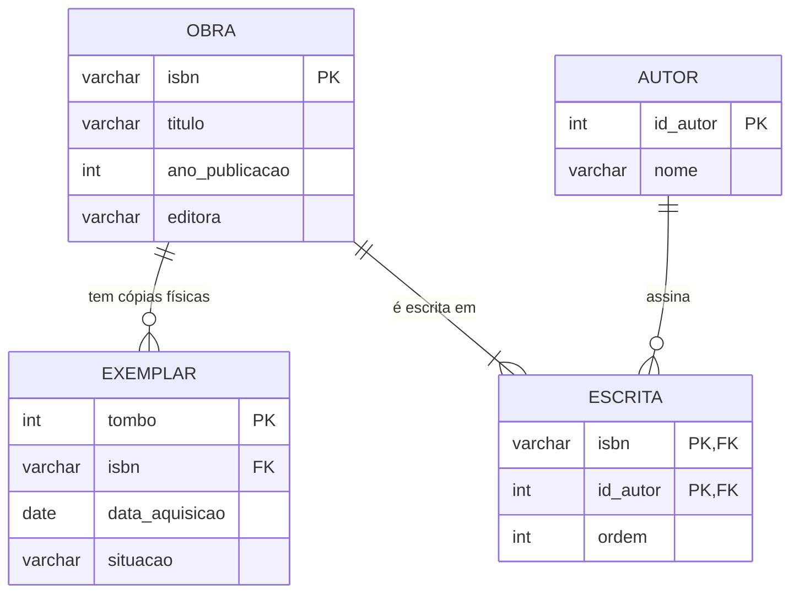

# Aula 05 — O Minimundo e o DER

> 🎯 Objetivos: recortar um minimundo a partir de um texto em português, identificar entidades e atributos com um critério defensável e desenhar o diagrama em Mermaid `erDiagram`.
> 🎬 Slides da aula: [apresentacao-05-minimundo-e-der.pdf](apresentacao/apresentacao-05-minimundo-e-der.pdf)

## 1. O minimundo: a parte da realidade que entra

Nas quatro primeiras aulas, alguém já tinha decidido quais tabelas existiam. Na vida real, o que chega até você é isto:

> *"A biblioteca central atende usuários vinculados à universidade, identificados pela matrícula, com nome, e-mail e a data em que se cadastraram. Um usuário pode informar vários telefones, cada um com um tipo (celular, residencial, recado)."*

Um parágrafo em português, escrito por alguém que entende de biblioteca e não de banco de dados. Transformar isso em tabelas é o trabalho.

O primeiro passo não é modelar — é **recortar**. Uma biblioteca tem iluminação, contrato de limpeza, goteira no telhado e um gato que dorme na recepção. Nada disso entra. O **minimundo** é a fatia da realidade que o sistema precisa conhecer, e tudo que ficou de fora ficou de fora **por decisão**, não por esquecimento.

> 📏 **Regra do curso:** escreva o que ficou de fora e por quê. Uma lista de cinco linhas dizendo "endereço do usuário não entra porque já existe no cadastro acadêmico" evita a reunião em que alguém pergunta "e o endereço?" e ninguém sabe se foi decisão ou falha.

## 2. Substantivos e verbos: a primeira leitura

Existe um truque que funciona na primeira leitura de qualquer enunciado, e ele é literalmente gramatical:

- Os **substantivos** que se repetem são candidatos a **entidade** — as coisas sobre as quais você guarda dados;
- Os **verbos** que ligam dois substantivos são candidatos a **relacionamento**;
- Os substantivos que **descrevem** outro substantivo são candidatos a **atributo**.

Aplicado ao parágrafo da seção 1:

```
   A biblioteca atende USUÁRIOS vinculados à universidade, identificados
                       ~~~~~~~~                            ‾‾‾‾‾‾‾‾‾‾‾‾
   pela MATRÍCULA, com NOME, E-MAIL e a DATA em que se cadastraram.
        ‾‾‾‾‾‾‾‾‾      ‾‾‾‾  ‾‾‾‾‾‾    ‾‾‾‾
   Um usuário pode INFORMAR vários TELEFONES, cada um com um TIPO.
                   ~~~~~~~~        ~~~~~~~~~                 ‾‾‾‾

   ~~~~  candidato a entidade ou relacionamento
   ‾‾‾‾  candidato a atributo
```

> ⚠️ **É um truque de primeira leitura, não um método.** Ele acerta o suficiente para você começar, e erra o suficiente para você precisar da próxima seção. O enunciado é escrito em linguagem natural, e linguagem natural mente.

## 3. Entidade ou atributo? O teste que decide

`TELEFONE` é entidade ou atributo? A resposta muda o modelo inteiro, e existe um teste de duas perguntas:

**1. Você guarda mais de um valor?** Um usuário tem vários telefones. Um valor por célula é regra (Aula 01), então `telefone` não cabe como coluna de `USUARIO`. Só isso já resolve: é entidade.

**2. A coisa tem propriedades próprias?** O telefone tem um `tipo`. Se ele fosse só o número, e um só por pessoa, seria uma coluna.

Aplicando às outras palavras do enunciado:

| Palavra | Decisão | Por quê |
|---|---|---|
| `USUARIO` | **Entidade** | Muitas propriedades, e outras coisas vão se ligar a ela |
| `matricula`, `nome`, `email` | **Atributos** | Um valor por usuário, sem propriedades próprias |
| `TELEFONE` | **Entidade** | Vários por usuário, e tem `tipo` |
| `tipo` (do telefone) | **Atributo** | Um valor por telefone, sem propriedades |
| `categoria` (aluno/professor/servidor) | **Atributo** | Um valor por usuário, e o conjunto de valores é fechado |

> ⚠️ **O erro mais comum de quem começa a modelar é promover a atributos a entidade.** Uma tabela `CATEGORIA` com três linhas — "aluno", "professor", "servidor" — e nada mais que um código e um nome não é entidade: é um atributo com domínio restrito. Vira entidade no dia em que alguém quiser guardar o limite de empréstimos **dentro** dela. Pergunte ao cliente: *"vocês algum dia vão querer guardar mais alguma coisa sobre isso?"*

> 💡 O erro contrário existe e é pior, porque é silencioso: tratar `TELEFONE` como coluna e descobrir na produção que metade dos usuários tem dois números, separados por barra, dentro do mesmo campo de texto.

## 4. O diagrama em Mermaid

Decidido o que é entidade e o que é atributo, o diagrama sai quase sozinho:



Três coisas para reparar, porque elas se repetem em todo diagrama do curso:

- **O nome da entidade vai em maiúsculas**, sem espaço nem acento — `ITEM_PEDIDO`, nunca `Item Pedido`;
- **`PK`, `FK` e `UK`** marcam chave primária, estrangeira e única. Em `TELEFONE`, a chave é composta: `(matricula, numero)`;
- **O rótulo do relacionamento é obrigatório.** Sem os dois-pontos e o texto entre aspas, o diagrama não renderiza.

> 💻 **Modelos desta aula:** [`der-parcial.md`](exemplos/der-parcial.md) — este diagrama e o próximo, prontos para copiar.

> 📏 **Regra do curso:** todo diagrama vem seguido de um parágrafo em português dizendo o que ele **afirma sobre o mundo**. O desenho mostra a forma; o texto carrega o compromisso. O diagrama acima afirma: *um usuário informa zero ou muitos telefones; todo telefone pertence a exatamente um usuário.*

## 5. Dizendo "quantos" e "pode zero" no diagrama

O símbolo do meio guarda as duas respostas da Aula 03, uma em cada metade:

```
              ||--o{
              ‾‾  ‾‾
              │    └── do lado direito: mínimo 0, máximo N  →  "zero ou vários"
              └─────── do lado esquerdo: mínimo 1, máximo 1 →  "um e apenas um"
```

| Peça | Mínimo | Máximo |
|:---:|:---:|:---:|
| `\|\|` | 1 | 1 |
| `\|o` | 0 | 1 |
| `}\|` | 1 | N |
| `}o` | 0 | N |

Ampliando o modelo com o acervo — e aqui aparece um N:M, que no diagrama já nasce como a tabela associativa da Aula 03:



Leia em voz alta, uma linha de cada vez: *uma obra tem zero ou muitos exemplares* — sim, uma obra pode estar catalogada antes de o volume chegar. *Uma obra é escrita por pelo menos um autor* — sim, obra sem autor não existe. *Um autor assina zero ou muitas obras* — sim, o autor entra no cadastro junto com a primeira obra dele, mas pode ficar sem nenhuma se ela for descartada.

> 💡 A `ordem` mora em `ESCRITA` porque não é do autor (ele é terceiro numa obra e primeiro em outra) nem da obra (ela tem várias posições). É do **par**. Toda vez que um dado só faz sentido para a combinação de dois, ele mora na associativa.

## 6. As perguntas que faltam ao cliente

Todo enunciado é incompleto, e a diferença entre um modelo bom e um chute é a lista de perguntas que você fez antes de desenhar. Quatro que sempre valem:

1. **"Pode ter mais de um?"** — a pergunta que separa atributo de entidade;
2. **"Pode não ter nenhum?"** — a que decide se a coluna é obrigatória;
3. **"Isso muda com o tempo? Vocês precisam do histórico?"** — a que transforma um atributo numa entidade com data, e a que mais destrói modelos quando é feita tarde;
4. **"Vocês emprestam o título ou o volume físico?"** — a pergunta específica deste caso, e a mais importante dele: é ela que separa `OBRA` de `EXEMPLAR`. Todo domínio tem a sua.

> ⚠️ Pergunta feita depois do modelo pronto custa dez vezes mais que pergunta feita antes. E a resposta "ah, isso a gente nunca vai precisar" precisa ser **escrita** junto com o nome de quem a deu.

> 📖 O minimundo, a distinção entre entidade e atributo e a leitura do enunciado abrem o capítulo de modelagem conceitual do livro-base. A notação de lá é a de Chen — a [tabela de conversão](../../recursos/notacoes-der.md) traduz.

## 🏋️ Exercícios da aula

Na pasta `aula-05/` do seu repositório:

1. **`ex01.md`** — escolha um minimundo do [catálogo](../../recursos/minimundos.md) que você ainda não conheça e escreva o **recorte**: uma lista do que entra e outra do que fica de fora, com o motivo de cada exclusão em uma linha. Mínimo de 4 exclusões. *Confira assim: se algum motivo for "não é importante", ele não é um motivo — diga por que não é.*
2. **`ex02.md`** — no mesmo enunciado, grife os substantivos e os verbos e monte três listas: candidatos a entidade, candidatos a relacionamento e candidatos a atributo. Depois **derrube pelo menos um candidato de cada lista**, explicando por que o truque gramatical errou naquele caso. *Confira assim: um enunciado real sempre tem pelo menos um substantivo repetido que não é entidade — se você não achou nenhum, olhe os adjetivos disfarçados de coisa.*
3. **`ex03.md`** — desenhe o DER do seu minimundo em Mermaid `erDiagram`, com no mínimo 4 entidades, os atributos de cada uma, as chaves marcadas e todos os relacionamentos com rótulo. Abaixo do diagrama, escreva o parágrafo que diz o que ele afirma sobre o mundo — uma frase por relacionamento. *Confira assim: cole no [mermaid.live](https://mermaid.live) antes de commitar; e leia cada frase em voz alta perguntando "isso é verdade?".*
4. **`ex04.md`** — escreva **6 perguntas** que você faria ao cliente antes de considerar esse modelo pronto. Para cada uma, diga **o que muda no diagrama** conforme a resposta seja sim ou não. Pelo menos duas precisam ser do tipo "vocês precisam do histórico?". *Confira assim: se a resposta a uma pergunta não muda nada no diagrama, a pergunta é decorativa — troque.*
5. **Desafio 🌶️ `ex05.md`** — encontre no seu minimundo um item que você modelou como **atributo** e que, com uma pergunta a mais ao cliente, viraria **entidade**. Entregue: a versão com atributo, a pergunta que muda tudo, a versão com entidade, e a análise do que se ganha e do que se perde em cada uma. Depois faça o caminho inverso: encontre uma entidade que provavelmente deveria ser atributo, e defenda o rebaixamento. *Confira assim: as duas versões precisam ser desenhadas de verdade, e a análise precisa citar uma consulta concreta que fica mais fácil numa e mais difícil na outra.*

## 🧠 Revisão

[8 questões de múltipla escolha](revisao/README.md) para conferir se os conceitos ficaram sólidos. Responda sem consultar a aula — depois volte e corrija.

## ✅ Entrega

```bash
git add aula-05/
git commit -m "Resolve exercícios da aula 05 (minimundo e DER)"
git push
```

---

⬅️ [Aula 04](../../bloco-1-modelo-relacional/aula-04-integridade-e-nulo/README.md) | ➡️ [Aula 06 — Do DER às tabelas](../aula-06-do-der-as-tabelas/README.md)
