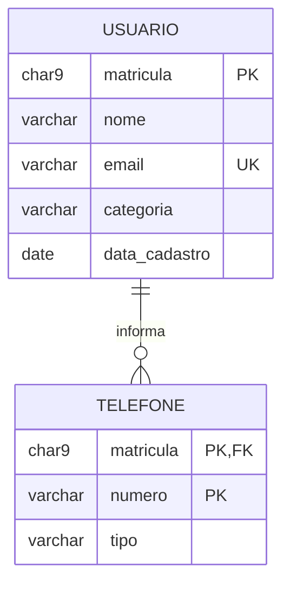
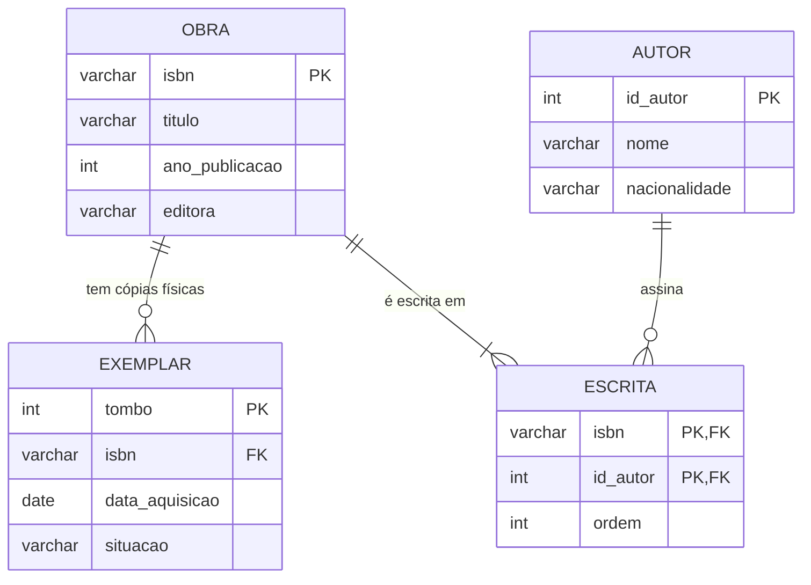

# DER parcial — Biblioteca Universitária

> Os dois fragmentos desenhados na Aula 05, prontos para copiar e adaptar. O modelo **completo** da Biblioteca só aparece na [Aula 08](../../aula-08-estudo-de-caso/exemplos/der-completo.md) — até lá, ele cresce um pedaço por aula.

## Fragmento 1 — o usuário e seus telefones

**O que ele afirma sobre o mundo:** um usuário informa zero ou muitos telefones; todo telefone pertence a exatamente um usuário. A chave de `TELEFONE` é o par `(matricula, numero)` — o número sozinho não identifica, porque duas pessoas podem informar o telefone do mesmo departamento.

**Decisão registrada:** `categoria` (aluno, professor, servidor) é **atributo**, não entidade. O conjunto de valores é fechado e não há nada a guardar sobre uma categoria além do nome dela. Se um dia o limite de empréstimos precisar ser configurável, ela vira entidade — e é só nesse dia.

## Fragmento 2 — o acervo

**O que ele afirma sobre o mundo:**

- Uma obra tem zero ou muitos exemplares — ela pode estar catalogada antes de o volume físico chegar;
- Todo exemplar pertence a exatamente uma obra;
- Uma obra é escrita por **pelo menos um** autor;
- Um autor assina zero ou muitas obras;
- A `ordem` em que os autores aparecem na capa é do **par** obra-autor, e por isso mora em `ESCRITA`.

**A decisão mais importante do caso inteiro** está aqui: `OBRA` e `EXEMPLAR` são coisas diferentes. A obra é o título — "Banco de Dados", ISBN tal. O exemplar é o volume físico com uma etiqueta colada. É o exemplar que sai pela porta, e é por isso que o empréstimo aponta para ele, nunca para a obra. Um modelo que confunde os dois não consegue responder "quantas cópias temos?" nem "esta cópia específica está com quem?".

## Regras que o diagrama não diz

Nenhum diagrama expressa isto, e por isso a lista existe:

1. `situacao` do exemplar é uma de: `disponivel`, `emprestado`, `manutencao`, `extraviado`;
2. `categoria` do usuário é uma de: `aluno`, `professor`, `servidor`;
3. `ano_publicacao` está entre 1450 e o ano corrente;
4. A `ordem` dos autores de uma mesma obra não se repete: não existem dois "segundo autor".

---

⬅️ [Voltar à Aula 05](../README.md) | 🏠 [Início do curso](../../../README.md)
