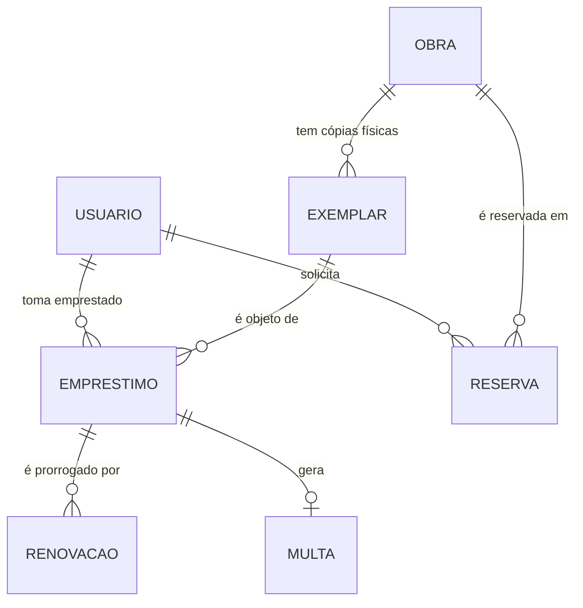

# Aula 08 — Estudo de Caso: do Minimundo ao Esquema Pronto

> 🎯 Objetivos: percorrer um roteiro de seis passos que leva do texto ao esquema normalizado, reconhecer os cinco erros clássicos num modelo alheio e defender por escrito as decisões tomadas.
> 🎬 Slides da aula: [apresentacao-08-estudo-de-caso.pdf](apresentacao/apresentacao-08-estudo-de-caso.pdf)

## 1. O caso inteiro, de uma vez

As sete aulas anteriores viram pedaços da Biblioteca. Esta aula junta tudo: o enunciado completo, o diagrama completo, o esquema completo — e o percurso entre eles.

O enunciado está em [`minimundo.md`](exemplos/minimundo.md): sete parágrafos em português, oito regras de negócio e a lista do que ficou de fora. **Leia antes de continuar.** O resto da aula supõe que você leu.

> 📏 Repare no tamanho: sete parágrafos e oito regras. Um minimundo de estudo que precisa de três páginas não é mais profundo — é mal recortado. A profundidade vem da discussão sobre as decisões, e discutir exige que sobre atenção.

## 2. O roteiro em seis passos

Sempre o mesmo, para qualquer enunciado:

| Passo | O que fazer | Entregável |
|:---:|---|---|
| 1 | **Recortar** — o que entra, o que fica fora e por quê | Lista de exclusões justificadas |
| 2 | **Grifar** — substantivos e verbos, e a primeira triagem | Três listas de candidatos |
| 3 | **Decidir** entidade × atributo, com o teste da Aula 05 | Lista de entidades com seus atributos |
| 4 | **Perguntar** ao cliente o que o texto não diz | Perguntas com a resposta que mudou o modelo |
| 5 | **Desenhar** o diagrama e ler cada linha em voz alta | DER em Mermaid + o parágrafo do que ele afirma |
| 6 | **Mapear e conferir** — as cinco regras, depois as três formas normais | Esquema com PKs, FKs e as regras que não couberam |

> ⚠️ **A ordem importa, e o passo 4 é o que todo mundo pula.** Modelo feito sem perguntar é modelo que responde ao que você imaginou, não ao que o cliente faz. As sete perguntas que geraram este enunciado estão no fim do [`minimundo.md`](exemplos/minimundo.md) — vale ler o que cada resposta mudou.

## 3. As três decisões que definiram este modelo

Nem toda decisão pesa igual. Três pesaram:

**Obra ≠ exemplar.** A pergunta foi *"vocês emprestam o título ou o volume físico?"*. A resposta separou uma entidade em duas, e é o que permite responder "quantas cópias temos?" e "esta cópia está com quem?". Um modelo que funde as duas não responde nem uma nem outra.

**A reserva é da obra, não do exemplar.** O usuário quer *o livro*, qualquer cópia serve. Por isso `RESERVA` aponta para `OBRA` enquanto `EMPRESTIMO` aponta para `EXEMPLAR` — duas tabelas quase gêmeas apontando para lugares diferentes de propósito.

**`categoria` é atributo, não entidade.** Aluno, professor e servidor são três valores fixos, sem nada a guardar dentro. Uma tabela `CATEGORIA` com três linhas acrescentaria uma junção a toda consulta sem responder pergunta nova. **No dia** em que o limite de empréstimos precisar ser configurado sem alterar código, ela vira tabela — e a decisão está escrita, esperando esse dia.

> 💡 As três são respostas a perguntas, não deduções do texto. É por isso que a justificativa escrita vale metade do trabalho: o diagrama mostra o **que**; só o texto guarda o **porquê**, e é o porquê que a próxima pessoa vai precisar.

## 4. O resultado

O diagrama completo e o esquema completo estão em [`der-completo.md`](exemplos/der-completo.md): 13 tabelas, saindo de 10 entidades, 1 atributo multivalorado e 2 relacionamentos N:M.

Um trecho, para ver como as peças se encaixam:



Leia em voz alta, uma linha por vez, e confira contra o enunciado. É o passo 5 do roteiro, e ele encontra mais defeito que qualquer outra coisa: *um empréstimo gera zero ou uma multa* — sim. *Uma obra é reservada em zero ou muitas reservas* — sim. *Um exemplar é objeto de zero ou muitos empréstimos* — sim, ao longo do tempo.

## 5. Os cinco erros clássicos

Estes cinco aparecem em todo projeto, em todo domínio. Aprender a vê-los no modelo alheio é a forma mais rápida de parar de cometê-los no próprio:

**1. O atributo promovido a entidade.**

```
✗ SITUACAO(cod, descricao)   — quatro linhas: disponível, emprestado, manutenção, extraviado
  EXEMPLAR(tombo, isbn, cod_situacao)
✅ EXEMPLAR(tombo, isbn, situacao)   — situacao ∈ {disponivel, emprestado, manutencao, extraviado}
```

Uma tabela com código e nome, e nada mais, acrescenta uma junção a toda consulta sem responder nenhuma pergunta nova. Pergunte: *"vamos guardar mais alguma coisa aqui dentro?"* Se não, é atributo.

**2. O N:M que ninguém viu.**

```
✗ OBRA(isbn, titulo, matricula_reservou)   — funciona até a segunda pessoa reservar o mesmo livro
✅ RESERVA(id_reserva, matricula, isbn, data_solicitacao, situacao)
```

A cura é a pergunta nas duas direções, sempre no plural: *uma obra pode ser reservada por várias pessoas?* *Uma pessoa pode reservar várias obras?* Dois sins.

**3. A FK do lado errado.**

```
✗ OBRA(isbn, titulo, tombo)      — "para saber o exemplar da obra". Quebra no segundo exemplar
✅ EXEMPLAR(tombo, isbn, ...)     — a FK mora do lado N, onde cabe um valor só
```

**4. O dado repetido que sobrou.**

```
✗ EMPRESTIMO(id, matricula, nome_usuario, tombo, retirada)   — "para não precisar de junção"
```

É a dependência transitiva da Aula 07: `matricula → nome_usuario`, e `matricula` não é chave dessa tabela. O efeito prático é o nome estar diferente em duas linhas do mesmo usuário, sem que nada acuse.

**5. O ciclo redundante.**

```
✗ EMPRESTIMO(id, tombo, isbn, ...)   — aponta para EXEMPLAR e para OBRA ao mesmo tempo
```

Como o exemplar já determina a obra, o segundo caminho é derivável do primeiro — e permite a contradição de um empréstimo cujo `isbn` não é o da obra do `tombo`.

> ⚠️ Nem todo ciclo é erro. O erro é o ciclo em que **um caminho é derivável do outro**. Se os dois significam coisas diferentes, os dois ficam — e a diferença vai por escrito.

## 6. Validar com o cliente

O modelo não está pronto quando o diagrama fica bonito. Está pronto quando alguém que **entende do negócio e não entende de banco** confirma que ele diz a verdade.

Como conduzir essa conversa:

- **Leia frases, não desenhos.** "Um empréstimo é de um exemplar só" é uma frase que o bibliotecário sabe julgar; um losango, não;
- **Traga casos concretos, de preferência estranhos.** "E se o aluno perder o livro?" "E se dois professores quiserem o mesmo livro no mesmo dia?" É nos casos raros que os modelos quebram;
- **Anote o que o modelo não faz.** Toda resposta "isso a gente resolve na mão" vira uma linha na lista de regras de negócio, com a data e o nome de quem disse.

> 📏 **Regra do curso, e do mercado:** todo modelo vem acompanhado da justificativa por escrito. Um diagrama sem argumento é um chute bem desenhado — e some na primeira pergunta do cliente.

> 💻 **Modelos desta aula:** [`minimundo.md`](exemplos/minimundo.md) · [`der-completo.md`](exemplos/der-completo.md)

> 📖 O livro-base traz estudos de caso completos ao fim do capítulo de modelagem conceitual. Vale comparar o percurso: a notação é outra, as perguntas são as mesmas.

## 🏋️ Exercícios da aula

Na pasta `aula-08/` do seu repositório:

1. **`ex01.md`** — escolha um minimundo ⭐⭐ do [catálogo](../../recursos/minimundos.md) e percorra **os seis passos do roteiro**, entregando o entregável de cada um. Nada de pular direto para o diagrama: o passo 1 e o passo 4 têm que estar escritos. *Confira assim: as armadilhas do catálogo estão listadas ao fim de cada minimundo — leia só depois de terminar e conte quantas você evitou sozinho.*
2. **`ex02.md`** — o esquema abaixo modela uma clínica e contém **os cinco erros** da seção 5, um de cada. Encontre-os, nomeie cada um, explique o estrago concreto que cada um causa e entregue o esquema corrigido:
   `PACIENTE(cpf, nome, id_convenio, nome_convenio, n_consulta)` · `CONVENIO(id_convenio, nome)` · `SEXO(cod, descricao)` · `CONSULTA(n_consulta, cpf, crm, data, nome_medico)` · `MEDICO(crm, nome, cpf_paciente)`
   *Confira assim: são exatamente cinco, e cada um corresponde a um item da seção 5 — se você achou seis, dois são o mesmo erro visto de ângulos diferentes.*
3. **`ex03.md`** — no modelo que você fez no `ex01`, escolha **três decisões** que poderiam ter sido tomadas de outro jeito e defenda cada uma em um parágrafo: qual era a alternativa, por que você escolheu esta, e o que aconteceria se o cliente mudasse de ideia. *Confira assim: se a alternativa que você descreveu é obviamente ruim, ela não era uma decisão — procure uma em que os dois lados tinham argumento.*
4. **`ex04.md`** — revise o modelo de um colega. Entregue um texto com: duas coisas que ele resolveu melhor que você, dois problemas concretos (com o caso que quebra cada um) e uma pergunta que ele deveria ter feito ao cliente. Faça a revisão pelo repositório dele, e registre no seu arquivo o link do que você comentou. *Confira assim: um problema descrito sem o caso que o quebra é opinião, não revisão — cada um dos dois precisa vir com uma instância concreta que o modelo não comporta.*
5. **Desafio 🌶️ `ex05.md`** — modele a Biblioteca **com mais uma exigência**: ela passa a ter várias unidades. Cada exemplar pertence a uma unidade, o usuário pode retirar em qualquer uma, mas o exemplar precisa voltar para a de origem, e as transferências entre unidades ficam registradas. Entregue o diagrama completo alterado, o esquema, e a análise do que **quebrou** no modelo original — quais tabelas mudaram, quais regras de negócio novas apareceram, e o que passou a ser impossível garantir só com chaves. *Confira assim: pelo menos três tabelas do modelo original precisam mudar, e pelo menos uma regra nova não cabe no esquema.*

## 🧠 Revisão

[8 questões de múltipla escolha](revisao/README.md) para conferir se os conceitos ficaram sólidos. Responda sem consultar a aula — depois volte e corrija.

## ✅ Entrega

```bash
git add aula-08/
git commit -m "Resolve exercícios da aula 08 (estudo de caso)"
git push
```

> 🤝 **É aqui que começa o [trabalho em dupla](../../projetos/trabalho-em-dupla.md)** — a modelagem de um minimundo revisada por Pull Requests. Você já tem tudo de que precisa para fazê-lo.

---

⬅️ [Aula 07](../aula-07-normalizacao/README.md) | ➡️ [Aula 09 — Por que um SGBD existe](../../bloco-3-o-sgbd-na-pratica/aula-09-por-que-um-sgbd-existe/README.md)
