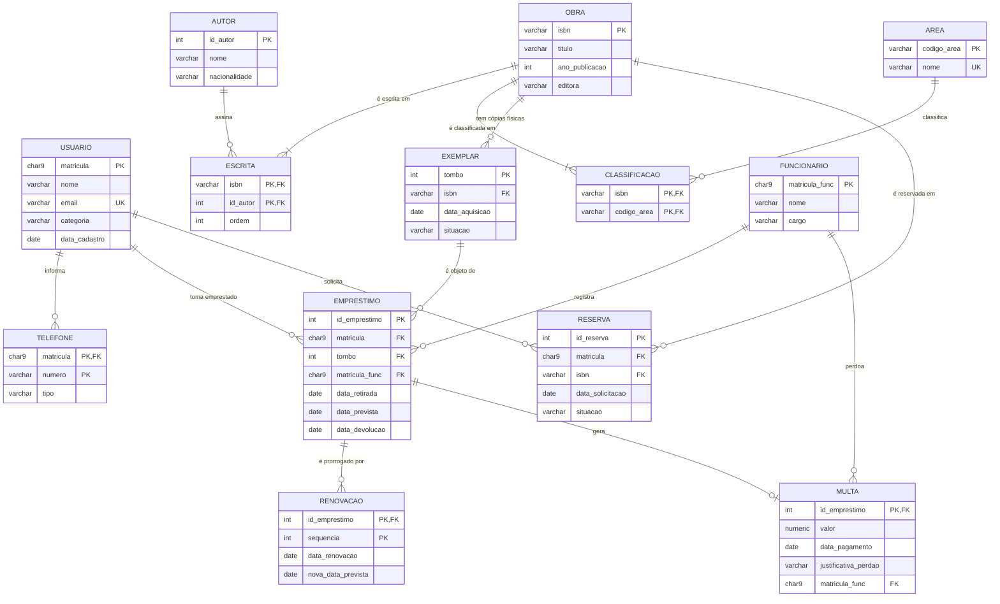

# DER e esquema completos — Biblioteca Universitária

> O [minimundo](minimundo.md) depois dos seis passos do roteiro. **10 entidades + 1 atributo multivalorado + 2 relacionamentos N:M → 13 tabelas.**

## O diagrama



## O esquema

Chave primária sublinhada, chave estrangeira com seta.

```
USUARIO(matricula, nome, email, categoria, data_cadastro)              — Regra 1
        ‾‾‾‾‾‾‾‾‾   email UNIQUE · categoria ∈ {aluno, professor, servidor}

TELEFONE(matricula, numero, tipo)                                      — Regra 2
         ‾‾‾‾‾‾‾‾‾‾‾‾‾‾‾‾‾   matricula → USUARIO   obrigatória, em cascata

OBRA(isbn, titulo, ano_publicacao, editora)                            — Regra 1
     ‾‾‾‾   ano_publicacao entre 1450 e o ano corrente

AUTOR(id_autor, nome, nacionalidade)                                   — Regra 1
      ‾‾‾‾‾‾‾‾

ESCRITA(isbn, id_autor, ordem)                                         — Regra 4
        ‾‾‾‾‾‾‾‾‾‾‾‾‾‾   isbn → OBRA (cascata) · id_autor → AUTOR (recusar)
                         (isbn, ordem) UNIQUE

AREA(codigo_area, nome)                                                — Regra 1
     ‾‾‾‾‾‾‾‾‾‾‾   nome UNIQUE

CLASSIFICACAO(isbn, codigo_area)                                       — Regra 4
              ‾‾‾‾‾‾‾‾‾‾‾‾‾‾‾‾‾   isbn → OBRA (cascata) · codigo_area → AREA (recusar)

EXEMPLAR(tombo, isbn, data_aquisicao, situacao)                        — Regra 3
         ‾‾‾‾‾   isbn → OBRA   obrigatória, recusar
                 situacao ∈ {disponivel, emprestado, manutencao, extraviado}

FUNCIONARIO(matricula_func, nome, cargo)                               — Regra 1
            ‾‾‾‾‾‾‾‾‾‾‾‾‾‾

EMPRESTIMO(id_emprestimo, matricula, tombo, matricula_func,            — Regra 3 (×3)
           ‾‾‾‾‾‾‾‾‾‾‾‾‾  data_retirada, data_prevista, data_devolucao)
           matricula      → USUARIO       obrigatória, recusar
           tombo          → EXEMPLAR      obrigatória, recusar
           matricula_func → FUNCIONARIO   obrigatória, recusar
           data_devolucao vazia = empréstimo em aberto

RENOVACAO(id_emprestimo, sequencia, data_renovacao, nova_data_prevista) — Regra 2
          ‾‾‾‾‾‾‾‾‾‾‾‾‾‾‾‾‾‾‾‾‾‾‾‾   id_emprestimo → EMPRESTIMO   em cascata

RESERVA(id_reserva, matricula, isbn, data_solicitacao, situacao)       — Regra 3 (×2)
        ‾‾‾‾‾‾‾‾‾‾   matricula → USUARIO (recusar) · isbn → OBRA (recusar)
                     situacao ∈ {aguardando, atendida, cancelada, expirada}

MULTA(id_emprestimo, valor, data_pagamento, justificativa_perdao,      — Regra 5
      ‾‾‾‾‾‾‾‾‾‾‾‾‾  matricula_func)
      id_emprestimo  → EMPRESTIMO    em cascata
      matricula_func → FUNCIONARIO   opcional, esvaziar
```

## Regra por regra

| Regra | Onde foi aplicada | Resultado |
|---|---|---|
| 1 — Entidade vira tabela | `USUARIO`, `OBRA`, `AUTOR`, `AREA`, `EXEMPLAR`, `FUNCIONARIO`, `EMPRESTIMO`, `RESERVA` | Uma tabela cada |
| 2 — Multivalorado / dependente | `telefone`, `RENOVACAO` | Chave = chave do dono + o que distingue; FK em cascata |
| 3 — 1:N vira FK do lado N | `EXEMPLAR`→`OBRA`; `EMPRESTIMO`→ usuário, exemplar, funcionário; `RESERVA`→ usuário, obra | FK sempre no lado N |
| 4 — N:M vira associativa | `OBRA`–`AUTOR`; `OBRA`–`AREA` | `ESCRITA` (com `ordem`) e `CLASSIFICACAO` |
| 5 — 1:1 | `MULTA`–`EMPRESTIMO` | FK do lado obrigatório, virando a própria PK |

## Três decisões que precisam de justificativa escrita

**Por que `RESERVA` aponta para `OBRA` e `EMPRESTIMO` aponta para `EXEMPLAR`.** O usuário reserva *o livro* — qualquer cópia serve, e no momento da reserva nenhuma está disponível. Já o empréstimo é de um volume específico, com etiqueta e tombo. É a assimetria que o enunciado descreve, e ela é a razão de as duas tabelas, tão parecidas, apontarem para lugares diferentes.

**Por que `RENOVACAO` tem chave composta.** A sequência (1ª, 2ª, 3ª renovação) só faz sentido dentro de um empréstimo — existe uma "renovação nº 1" em cada um deles. A chave é `(id_emprestimo, sequencia)`: a tabela não se identifica sozinha, e por isso a exclusão é em cascata. Sem o empréstimo, a renovação não significa nada.

**Por que `MULTA.matricula_func` esvazia em vez de recusar.** O funcionário que perdoou a multa pode sair da universidade. A multa continua perdoada — o fato aconteceu. O que se perde é só o registro de quem autorizou, e perder isso é melhor que impedir a exclusão de um cadastro de funcionário para sempre.

## O que este esquema não consegue garantir

As oito regras de negócio do minimundo, e nenhuma delas cabe numa chave:

| Regra | Por que não cabe | Onde ela vive |
|---|---|---|
| Limite de exemplares por categoria | Depende de **contar** linhas de outra tabela | Aplicação |
| Só reservar obra com todos os exemplares emprestados | Idem | Aplicação |
| Renovar só se não houver reserva | Idem | Aplicação |
| Exemplar em manutenção não pode ser emprestado | Compara duas tabelas no momento da escrita | Aplicação |
| "Toda obra tem pelo menos um exemplar" | A FK está do outro lado | Aplicação |
| `ordem` dos autores sem buraco (1, 2, 3…) | Regra sobre o conjunto, não sobre a linha | Aplicação |

> ⚠️ Repare que **seis das oito regras** ficaram fora do esquema. Isso é normal, e é exatamente por isso que a lista de regras de negócio é parte do modelo, não um anexo. Um esquema entregue sem ela está entregue pela metade.

---

⬅️ [Voltar à Aula 08](../README.md) · [Ver o minimundo](minimundo.md) | 🏠 [Início do curso](../../../README.md)
