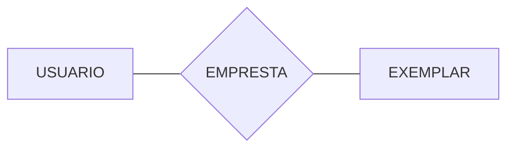
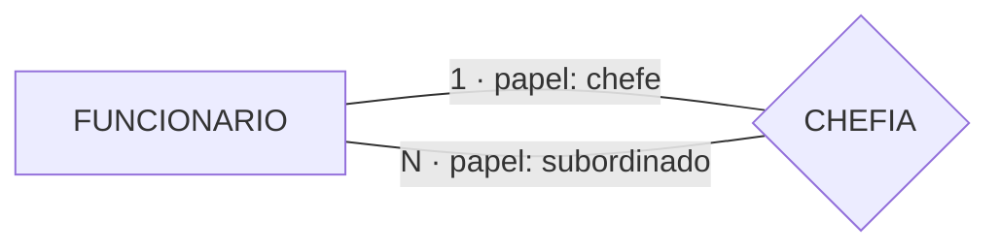
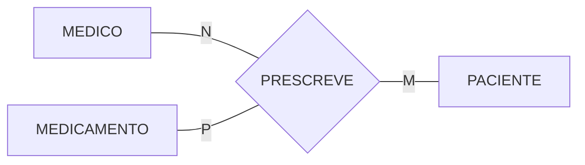
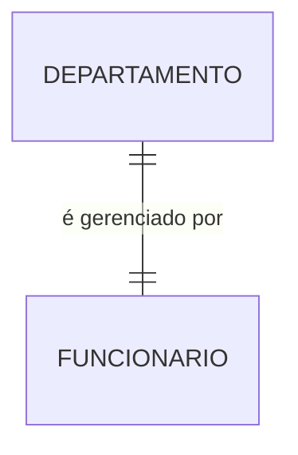
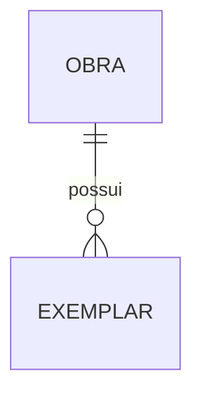
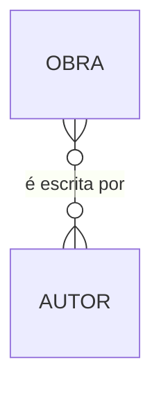
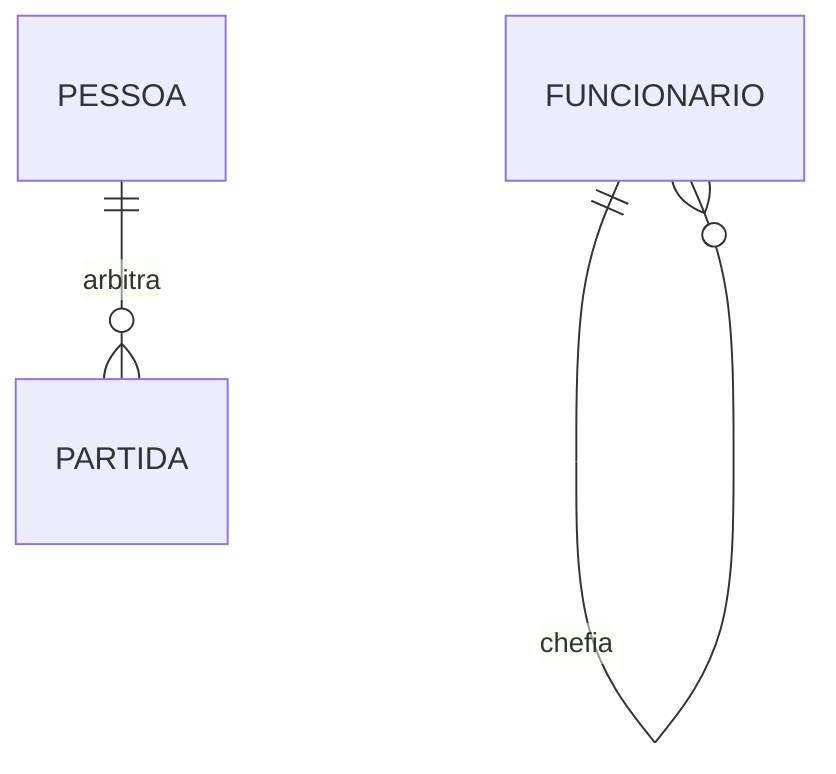

# Aula 05 — Relacionamentos, Grau e Cardinalidade

> 🎯 Objetivos: determinar a razão de cardinalidade de um relacionamento nas duas direções, distinguir cardinalidade de participação e decidir onde mora um atributo de relacionamento.
> 🎬 Slides da aula: [apresentacao-05-relacionamentos-cardinalidade.pdf](apresentacao/apresentacao-05-relacionamentos-cardinalidade.pdf)

## 1. O que é um relacionamento

Um **relacionamento** é uma associação entre instâncias de entidades. Se um usuário pega um exemplar emprestado, existe um relacionamento `EMPRESTA` entre `USUARIO` e `EXEMPLAR`.



**Convenção do curso:** relacionamento nomeado com **verbo**, entidade com **substantivo**. Um losango chamado `EMPRESTIMO_USUARIO` é sinal de que ninguém pensou no que a ligação significa.

O que **não** é relacionamento:

- **A ligação de uma entidade com seus atributos.** `USUARIO` "tem" `nome`, mas isso é atributo, não relacionamento. Relacionamento liga **duas entidades**;
- **Uma ligação que existe só no computador.** "A tela de cadastro chama a tela de consulta" não é relacionamento — não é um fato sobre o mundo.

## 2. Grau: quantas entidades participam

O **grau** é o número de conjuntos de entidades que o relacionamento envolve.

**Binário (grau 2)** — o caso normal, e mais de 95% do que você vai modelar.

**Unário / autorrelacionamento (grau 1)** — a entidade se relaciona consigo mesma. Um funcionário chefia outros funcionários; uma disciplina é pré-requisito de outra.



No autorrelacionamento, os **papéis** deixam de ser opcionais: sem dizer qual lado é chefe e qual é subordinado, o modelo não significa nada.

**Ternário (grau 3)** — três entidades numa única associação, quando o fato só existe com as três juntas.



> ⚠️ **Um ternário quase nunca equivale a três binários.** Se `PRESCREVE` fosse decomposto em `MEDICO–PACIENTE`, `MEDICO–MEDICAMENTO` e `PACIENTE–MEDICAMENTO`, saberíamos que o Dr. Silva atende Ana, que Dr. Silva prescreve dipirona e que Ana usa dipirona — **sem nunca saber se foi o Dr. Silva quem prescreveu dipirona para Ana**. A informação da associação tripla se perde. Antes de usar um ternário, porém, verifique se ele é mesmo indivisível: muitos "ternários" são um binário com um atributo.

## 3. Razão de cardinalidade

A **razão de cardinalidade** diz quantas instâncias de uma entidade podem se associar a uma instância da outra. São três casos.

### 1:1

Um departamento tem um gerente; um funcionário gerencia no máximo um departamento.



### 1:N

Uma obra tem vários exemplares; cada exemplar é de uma única obra.



### N:M

Uma obra tem vários autores; um autor escreve várias obras.



### O método que não erra

Duas perguntas, sempre no plural, sempre nas duas direções:

```
1. "UM(A) ⟨A⟩ se relaciona com QUANTOS(AS) ⟨B⟩?"     → um / vários
2. "UM(A) ⟨B⟩ se relaciona com QUANTOS(AS) ⟨A⟩?"     → um / vários
```

| Resposta 1 | Resposta 2 | Razão |
|---|---|---|
| um | um | 1:1 |
| vários | um | 1:N |
| um | vários | N:1 (é 1:N lido ao contrário) |
| vários | vários | N:M |

> ⚠️ **O erro mais comum do curso inteiro é responder uma pergunta só.** "Um pedido tem um produto" parece verdade se você imaginar o pedido mais simples possível. A pergunta que faltou é *"e um produto aparece em vários pedidos?"* — e as duas juntas revelam o N:M que o modelo ia esconder até a primeira semana em produção.

> 💡 **Ponte com a Aula 10:** a razão determina onde a chave estrangeira vai parar. Em 1:N, a FK fica **sempre do lado N**. Em N:M, não cabe em nenhum dos dois lados e nasce uma terceira tabela. Errar a cardinalidade agora significa uma tabela no lugar errado depois.

## 4. Participação: total ou parcial

Pergunta **diferente** da anterior, e igualmente esquecida: *"toda instância de A **precisa** participar do relacionamento?"*

- **Participação total** (dependência de existência) — sim, toda instância participa. Desenha-se com **linha dupla** em Chen;
- **Participação parcial** — pode haver instância que não participa. Linha simples.

Todo exemplar pertence obrigatoriamente a uma obra: participação **total** de `EXEMPLAR`. Nem toda obra tem exemplar (pode estar só catalogada): participação **parcial** de `OBRA`.

```
   ┌──────┐                          ┌──────────┐
   │ OBRA │────  POSSUI  ══════════│ EXEMPLAR │
   └──────┘   ↑                ↑     └──────────┘
        linha simples      linha dupla
        (parcial)          (total)
```

**Cardinalidade e participação são eixos independentes.** Todo lado de todo relacionamento tem duas respostas:

| | Cardinalidade | Participação |
|---|---|---|
| Pergunta | "no máximo quantos?" | "pode zero?" |
| Valores | 1 ou N | total ou parcial |
| Vira o quê na Aula 13 | posição da FK | `NOT NULL` na FK |

> ⚠️ Dizer "1:N total" sem indicar **de que lado** é a total não diz nada. A participação é sempre de **um lado específico** do relacionamento.

## 5. A notação (min,max): as duas respostas num par só

Escreve-se, junto de cada entidade, o par **(mínimo, máximo) de participações de UMA instância daquela entidade**:

```
   OBRA ──(0,N)── POSSUI ──(1,1)── EXEMPLAR
```

Lê-se: uma obra possui de 0 a N exemplares; um exemplar pertence a exatamente 1 obra.

E o par carrega tudo:

| Par | Cardinalidade | Participação |
|:---:|:---:|:---:|
| `(0,1)` | 1 | parcial |
| `(1,1)` | 1 | **total** |
| `(0,N)` | N | parcial |
| `(1,N)` | N | **total** |

> 💡 **Adote `(min,max)` como ferramenta de trabalho.** Quando dois colegas discutem se algo é 1:N ou N:M, peça o par dos dois lados: a discussão acaba, porque as perguntas ficam separadas. Depois converta para a notação que o professor ou o cliente espera ver.

> ⚠️ Cuidado com o **lado** em que o número é escrito: em Chen, o `N` fica junto à entidade que participa N vezes; em `(min,max)`, o par descreve **uma instância** da entidade ao lado. São convenções diferentes lidas em direções diferentes, e trocá-las inverte o modelo. Na dúvida, escreva a frase em português ao lado do diagrama.

## 6. Atributos de relacionamento

Algumas informações não pertencem a nenhuma das duas entidades — pertencem ao **encontro** delas.

`data_retirada` não é do usuário (que pega muitos livros em datas diferentes) nem do exemplar (que é pego por muitos usuários). É do **empréstimo**.

```
   ┌─────────┐      ╱‾‾‾‾‾‾‾‾‾╲      ┌──────────┐
   │ USUARIO │─────┤  EMPRESTA ├─────│ EXEMPLAR │
   └─────────┘      ╲____│____╱      └──────────┘
                         │
                  (data_retirada)
                  (data_prevista)
```

**Teste do atributo perdido:** se o valor muda conforme *o par*, e não conforme cada lado isoladamente, ele é do relacionamento.

| Atributo | De quem é? |
|---|---|
| `data_retirada` | Do relacionamento — muda a cada par (usuário, exemplar) |
| `nome` do usuário | Da entidade `USUARIO` |
| `situacao` do exemplar | Da entidade `EXEMPLAR` |
| `ordem` do autor numa obra | Do relacionamento — o mesmo autor é 1º numa obra e 3º noutra |
| `nacionalidade` do autor | Da entidade `AUTOR` |

> 💡 **Em N:M, atributo de relacionamento é a regra, não a exceção.** Se um relacionamento N:M não tem nenhum atributo, desconfie: geralmente falta perguntar *desde quando*, *em que ordem* ou *com qual valor*.

Num relacionamento 1:N, o atributo do relacionamento pode ser movido para o lado N sem perda — mas conceitualmente ele continua sendo do relacionamento, e escrever isso deixa o modelo mais honesto.

## 7. Papéis

Quando a mesma entidade participa duas vezes, ou quando o nome da entidade não deixa claro o que ela faz ali, nomeia-se o **papel**:



No autorrelacionamento, os papéis (`chefe` / `subordinado`) são **obrigatórios**: sem eles, não há como saber qual das duas pontas é qual — e, na Aula 10, não há como nomear as duas chaves estrangeiras que vão para a mesma tabela.

> 💻 **Modelos desta aula:** [`relacionamentos.md`](exemplos/relacionamentos.md)

## 🏋️ Exercícios da aula

Na pasta `aula-05/` do seu repositório:

1. **`ex01.md`** — para cada par, escreva **as duas perguntas** da seção 3, responda-as e conclua a razão de cardinalidade e a participação de cada lado, em `(min,max)`: (a) `CLIENTE`–`PEDIDO`; (b) `PEDIDO`–`PRODUTO`; (c) `PESSOA`–`CPF_DOCUMENTO`; (d) `TURMA`–`PROFESSOR`; (e) `MUNICIPIO`–`ESTADO`; (f) `AUTOR`–`LIVRO`;
2. **`ex02.md`** — o modelo abaixo tem **três erros de cardinalidade ou participação**. Encontre os três, explique por que cada um está errado usando uma frase em português sobre o mundo, e entregue o modelo corrigido em Mermaid:

   ```mermaid
   erDiagram
       PACIENTE }o--o{ CONSULTA : "tem"
       MEDICO ||--|| CONSULTA : "realiza"
       CONSULTA ||--|| RECEITA : "gera"
   ```

3. **`ex03.md`** — modele em Mermaid um **autorrelacionamento** para cada caso, nomeando os papéis e justificando a cardinalidade: (a) disciplinas que são pré-requisito de outras; (b) funcionários que chefiam funcionários; (c) produtos que são compostos de outros produtos (uma cesta contém itens que também são produtos);
4. **`ex04.md`** — para cada atributo, diga se pertence a uma **entidade** (qual?) ou ao **relacionamento**, aplicando o teste da seção 6: `salario` (em `FUNCIONARIO`–`CARGO`, onde o cargo tem faixa salarial e o funcionário tem um salário específico); `data_admissao`; `quantidade` (em `PEDIDO`–`PRODUTO`); `preco_de_tabela`; `preco_praticado`; `nota` (em `ALUNO`–`DISCIPLINA`); `carga_horaria` (da disciplina);
5. **Desafio 🌶️ `ex05.md`** — considere: *"um professor ministra uma disciplina em um semestre"*. Modele isso de **duas formas**: (a) como relacionamento **ternário** entre `PROFESSOR`, `DISCIPLINA` e `SEMESTRE`; (b) como entidade `TURMA` ligada às três por relacionamentos binários. Para cada versão, responda: que fatos ela consegue registrar que a outra não consegue? Qual você entregaria, e por quê? Termine com a pergunta que você faria ao cliente para decidir.

## 🧠 Revisão

[8 questões de múltipla escolha](revisao/README.md) para conferir se os conceitos ficaram sólidos. Responda sem consultar a aula — depois volte e corrija.

## ✅ Entrega

```bash
git add aula-05/
git commit -m "Resolve exercícios da aula 05 (relacionamentos e cardinalidade)"
git push
```

---

⬅️ [Aula 04](../../bloco-1-fundamentos-bd/aula-04-mer-entidades-atributos/README.md) | ➡️ [Aula 06 — Entidades fracas e chaves](../aula-06-entidades-fracas-chaves/README.md)
