<!-- _class: capa -->

<div class="emoji">🔗</div>

# Relacionamentos e Cardinalidade

## Aula 05 · Bloco 2 — Modelagem Conceitual

<div class="meta">Quantos de cada lado — e o método que não erra</div>

---

## 🎯 Nesta aula

1. O que é um **relacionamento**
2. **Grau**: binário, ternário, n-ário
3. **Razão de cardinalidade** — 1:1, 1:N, N:M
4. **Participação**: total ou parcial
5. Atributos de relacionamento e **papéis**

---

## O que é um relacionamento

Uma **associação entre instâncias** de entidades.

*"A aluna Ana **pegou emprestado** o exemplar 4417."*

No diagrama, o relacionamento liga **tipos**; no mundo, ele liga **instâncias**.

> ⚠️ Relacionamento **não é** um verbo qualquer. Se a associação não guarda fato nenhum e não tem cardinalidade interessante, talvez você esteja diante de um atributo.

---

## Grau: quantas entidades participam

**Binário** — duas entidades. É a esmagadora maioria.

**Ternário** — três entidades **simultaneamente**. Raro, e quase sempre confundido com três binários.

**Autorrelacionamento** — a entidade se relaciona com ela mesma: funcionário chefia funcionário.

---

<!-- _class: diagrama -->

## 1:1



---

<!-- _class: diagrama -->

## 1:N — a mais comum de todas


---

<!-- _class: diagrama -->

## N:M



---

<!-- _class: lead -->

## 🔑 O método que não erra

Não olhe o desenho. Faça **duas perguntas**,
uma para cada lado, no singular:

**"UM aluno pode ter QUANTOS empréstimos?"**
**"UM empréstimo pode ter QUANTOS alunos?"**

Muitos + um = **1:N**
Muitos + muitos = **N:M**
Um + um = **1:1**

---

## Participação: total ou parcial

Cardinalidade responde *"quantos?"*. Participação responde *"**precisa** ter?"*.

**Total** — toda instância **obrigatoriamente** participa. Todo empréstimo tem um aluno.

**Parcial** — a instância **pode** não participar. Nem todo aluno tem empréstimo.

> 💡 São perguntas **independentes**. Um relacionamento 1:N pode ter participação total de um lado e parcial do outro — e quase sempre tem.

---

<!-- _class: diagrama -->

## A notação (min,max): as duas respostas num par



---

## Atributos de relacionamento

Onde mora a `data_retirada`? No aluno? No exemplar?

Em **nenhum dos dois** — ela só existe quando os dois se encontram. Ela é do **relacionamento**.

**O teste:** se o valor muda quando você troca **qualquer um** dos participantes, é do relacionamento.

- `nota` em `ALUNO`–`DISCIPLINA` → do relacionamento;
- `carga_horaria` da disciplina → da entidade `DISCIPLINA`.

---

## Papéis

No autorrelacionamento, os dois lados precisam de **nome**:

```
FUNCIONARIO ──[chefia]── FUNCIONARIO
     ↑ chefe              ↑ subordinado
```

Sem os papéis, o diagrama fica ambíguo: quem chefia quem?

> 💡 Papéis também ajudam quando duas entidades se ligam por **mais de um** relacionamento — `USUARIO` *realiza* empréstimo e `USUARIO` *registra* empréstimo são coisas diferentes.

---

<!-- _class: checkpoint -->

## 🏋️ Exercícios da aula

Na pasta `aula-05/`:

1. **`ex01.md`** — cardinalidade e participação de 6 pares, com as duas perguntas escritas;
2. **`ex02.md`** — o mesmo relacionamento em (min,max);
3. **`ex03.md`** — três autorrelacionamentos, com papéis nomeados;
4. **`ex04.md`** — cada atributo é da entidade ou do relacionamento? Aplique o teste;
5. **Desafio 🌶️ `ex05.md`** — ternário × entidade `TURMA`: que fatos cada versão registra que a outra não?

---

<!-- _class: lead -->

## ➡️ Próxima aula

**Aula 06 — Entidades Fracas e Chaves**

A entidade que não consegue
se identificar sozinha.
