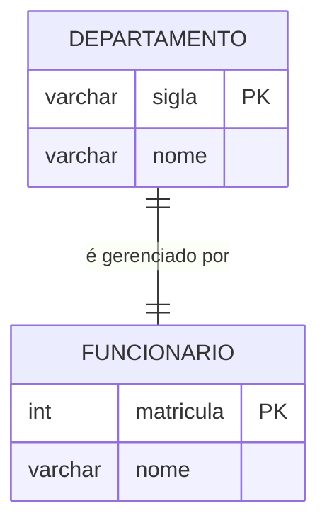
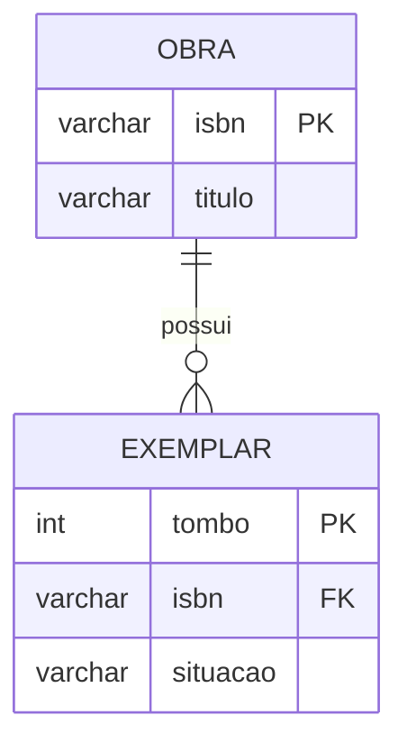
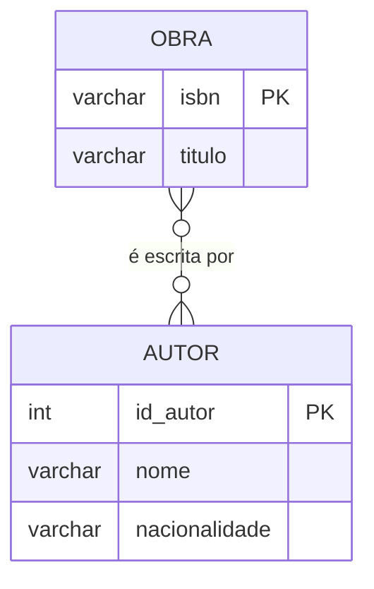
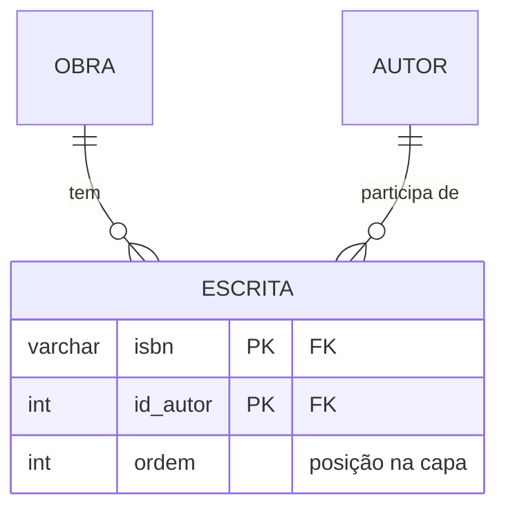
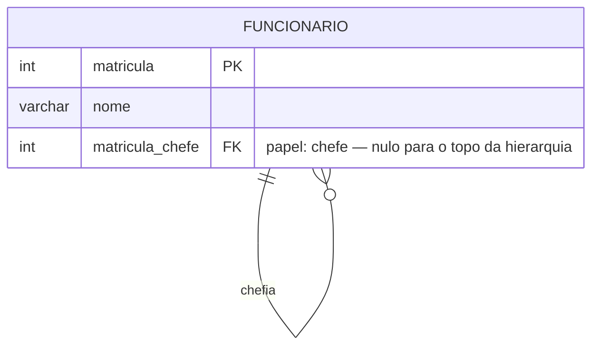
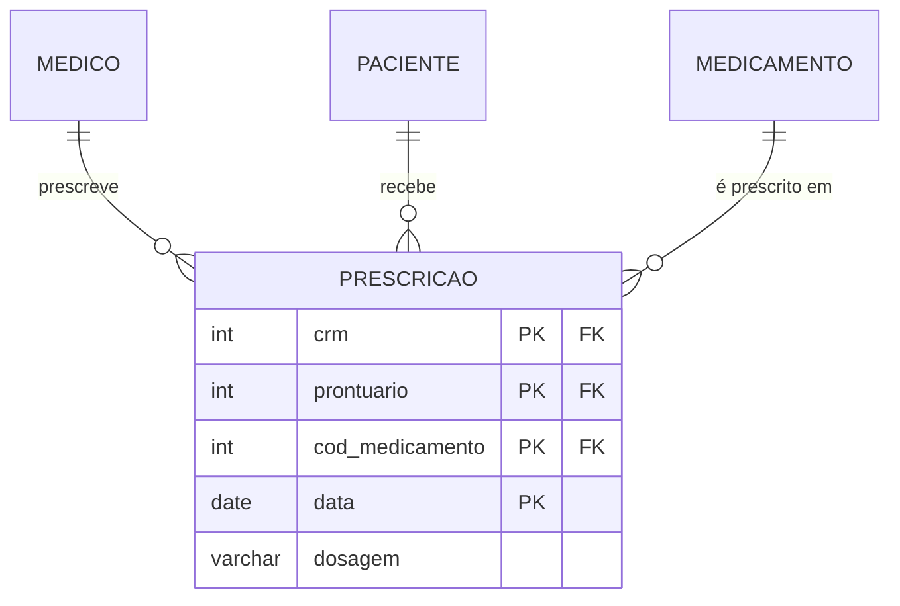

# Aula 05 — Relacionamentos, cardinalidade e participação

As três razões de cardinalidade, o autorrelacionamento e o atributo de relacionamento, cada um no caso mais limpo possível.

## 1:1 — um gerente por departamento

`(1,1)` dos dois lados: todo departamento tem exatamente um gerente, e quem gerencia gerencia um só.

> ⚠️ Cuidado: isto afirma que **todo funcionário é gerente de algum departamento**, o que é falso. O correto seria `(1,1)` do lado do departamento e `(0,1)` do lado do funcionário — em Mermaid, `DEPARTAMENTO ||--|| FUNCIONARIO` não distingue os dois casos, então escreva embaixo: *participação parcial do lado de `FUNCIONARIO`*.

## 1:N — uma obra, muitos exemplares

`OBRA (0,N)` — uma obra pode estar catalogada sem exemplar;
`EXEMPLAR (1,1)` — todo exemplar pertence a exatamente uma obra, obrigatoriamente.

**A FK vai para o lado N**, e é `NOT NULL` porque a participação de `EXEMPLAR` é total.

## N:M — obras e autores, com atributo no relacionamento

> O relacionamento tem o atributo **`ordem`**: a posição do autor na capa. Ele não é da obra (muda por autor) nem do autor (o mesmo autor é 1º numa obra e 2º noutra) — é do **par**. No projeto lógico vira coluna da tabela associativa (Aula 10, Regra 5).

O mesmo modelo já com a entidade associativa explícita, que é como ele vai ficar depois do mapeamento:

## Autorrelacionamento — os papéis deixam de ser opcionais

Dois papéis: **chefe** e **subordinado**. Sem nomeá-los, não há como saber qual ponta é qual — e, no projeto lógico, não haveria como nomear as duas colunas que apontam para a mesma tabela.

`matricula_chefe` é **opcional**: o presidente não tem chefe. Um autorrelacionamento hierárquico sempre tem essa exceção no topo.

## Ternário — quando três é indivisível

> Isto representa um relacionamento **ternário**. Decompô-lo em três binários perderia a informação de **qual** médico prescreveu **qual** remédio para **qual** paciente — saberíamos apenas os três pares isolados.

Repare que `data` entrou na chave: sem ela, o modelo só guardaria a **última** prescrição de cada combinação.

## A tabela de decisão

| Pergunta 1 | Pergunta 2 | Razão | Onde vai a FK |
|---|---|:---:|---|
| um | um | 1:1 | No lado de participação total |
| vários | um | 1:N | No lado **N**, sempre |
| um | vários | N:1 | É 1:N lido ao contrário |
| vários | vários | N:M | Em lugar nenhum — nasce uma tabela |

---

⬅️ [Voltar à Aula 05](../README.md) | 🏠 [Início do curso](../../../README.md)
