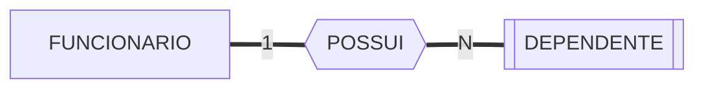
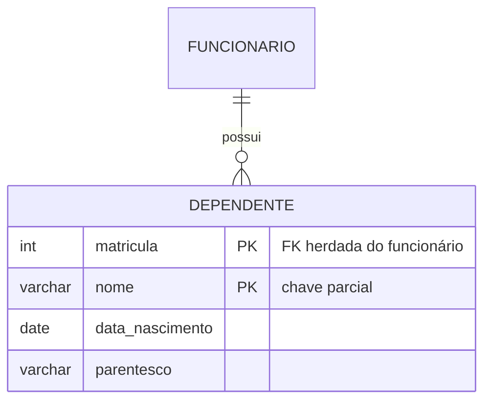
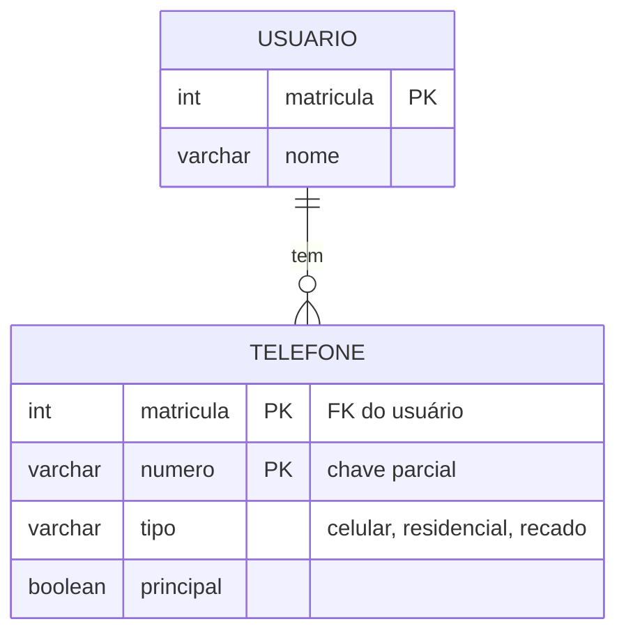

# Aula 06 — Entidades Fracas e Chaves

> 🎯 Objetivos: identificar uma entidade fraca pelo teste da identificação, definir sua chave parcial e decidir entre chave natural e artificial com argumento.
> 🎬 Slides da aula: [apresentacao-06-entidades-fracas-chaves.pdf](apresentacao/apresentacao-06-entidades-fracas-chaves.pdf)

## 1. A entidade que não se identifica sozinha

Uma empresa registra os dependentes dos funcionários. De cada dependente interessa nome, data de nascimento e parentesco.

Qual é a chave de `DEPENDENTE`?

- `nome`? Existem dezenas de "Maria" entre os dependentes da empresa;
- `(nome, data_nascimento)`? Melhor, e ainda assim frágil;
- Nada dentro de `DEPENDENTE` identifica com segurança.

Mas **dentro de um funcionário** o nome basta: o mesmo funcionário não tem dois dependentes chamados "Maria". A identificação é `(matrícula do funcionário, nome do dependente)`.

`DEPENDENTE` é uma **entidade fraca**: existe apenas em função de outra e **não tem chave própria** — a chave dela inclui a chave da entidade **proprietária** (ou *identificadora*).



Três marcas visuais em Chen, todas presentes acima: **retângulo duplo** para a entidade fraca, **losango duplo** para o relacionamento identificador e **linha dupla** para a participação total. A chave parcial leva **sublinhado tracejado**.

## 2. Relacionamento identificador e chave parcial

O **relacionamento identificador** é o que liga a fraca à proprietária. Ele é sempre:

- **1:N** (uma proprietária, várias fracas);
- **Total do lado fraco** — nenhum dependente existe sem funcionário. Essa participação total é obrigatória, não escolha.

A **chave parcial** (ou discriminador) é o atributo que distingue as instâncias fracas **dentro de uma mesma proprietária**. Em `DEPENDENTE`, é `nome`. Em `ITEM_PEDIDO`, é o número sequencial do item.

```
chave da entidade fraca = chave da proprietária + chave parcial
                          └── matricula ──┘   └──── nome ────┘
```

Em Mermaid, o relacionamento identificador é a **linha sólida** (`--`), contra a tracejada (`..`) do não identificador:



## 3. O teste que separa fraca de forte

Aqui mora o erro mais comum desta aula: **achar que toda entidade com FK obrigatória é fraca**.

Não é. São duas dependências diferentes:

| | Dependência de **existência** | Dependência de **identificação** |
|---|---|---|
| Pergunta | "Pode existir sem a outra?" | "Consegue se identificar sem a outra?" |
| `PEDIDO` sem `CLIENTE` | Não existe | Mas se identifica sozinho: tem número próprio |
| `DEPENDENTE` sem `FUNCIONARIO` | Não existe | E **não** se identifica: precisa da matrícula |
| Resultado | Só isso não faz fraca | **Isso** faz fraca |

> ⚠️ **Teste decisivo:** apague mentalmente a entidade proprietária do modelo. A chave da candidata ainda identifica cada instância? Se sim, é forte com FK obrigatória. Se não, é fraca.

`PEDIDO` tem número único no sistema inteiro: forte. `ITEM_PEDIDO` numerado 1, 2, 3 **dentro** do pedido: fraco. `NOTA_FISCAL` com número e série únicos: forte, mesmo exigindo cliente.

## 4. Entidade fraca × atributo multivalorado

Na Aula 04 ficou pendente: telefone é multivalorado. Onde ele vai parar?

Um atributo multivalorado é, na prática, **uma entidade fraca disfarçada** — e a decisão entre os dois é sobre quanta informação você precisa guardar:

| Situação | Modele como |
|---|---|
| Só o valor interessa (uma lista de telefones e nada mais) | Atributo multivalorado, que vira entidade fraca no projeto lógico |
| O valor tem características próprias (tipo, horário de contato, se é o principal) | **Entidade fraca**, já no conceitual |
| O valor tem identidade própria e é compartilhado (o telefone é da empresa, não da pessoa) | **Entidade forte** com relacionamento N:M |



Repare: `numero` é a chave parcial porque o mesmo usuário não cadastra o mesmo número duas vezes — mas **dois usuários podem ter o mesmo número** (mãe e filho, mesmo telefone residencial), e o modelo permite isso corretamente.

> 💡 A pergunta que decide em cinco segundos: *"além do valor, tem mais alguma coisa que vocês precisam saber sobre cada um?"* Se a resposta tiver mais de uma palavra, é entidade.

## 5. Chaves candidatas na prática

Recapitulando a Aula 04 com o vocabulário completo, agora aplicado a `EXEMPLAR` de uma biblioteca:

| Conjunto | É superchave? | É candidata? | Por quê |
|---|:---:|:---:|---|
| `(tombo)` | ✅ | ✅ | Único no acervo, atribuído na aquisição, nunca muda |
| `(tombo, isbn)` | ✅ | ❌ | Identifica, mas não é mínima: `tombo` sozinho já basta |
| `(isbn)` | ❌ | ❌ | Vários exemplares da mesma obra compartilham o ISBN |
| `(isbn, numero_copia)` | ✅ | ✅ | Candidata alternativa, se a numeração for por obra |
| `(data_aquisicao)` | ❌ | ❌ | Compras em lote entram no mesmo dia |

Duas candidatas, e a escolha entre elas muda o modelo: se a chave for `(isbn, numero_copia)`, `EXEMPLAR` **é uma entidade fraca** de `OBRA`. Se for `tombo`, é forte. **A mesma realidade, dois modelos válidos** — e é a política da biblioteca (numeração global ou por obra) que decide, não a sua preferência.

> 📏 **Regra do curso:** quando duas modelagens são defensáveis, escolha uma, **escreva a justificativa** e siga. O que não se aceita é a escolha inconsciente.

## 6. Chave natural × chave artificial

**Chave natural** — um atributo que já existe no mundo e identifica: CPF, ISBN, placa, matrícula.

**Chave artificial** (*surrogate*) — um número sequencial criado só para identificar, sem significado no mundo: o `id` que aparece em quase todo sistema.

O debate honesto:

| | Natural | Artificial |
|---|---|---|
| Significado | Tem — a chave já diz algo | Nenhum |
| Consultas simples | Dispensa junção: o ISBN já está na FK | Exige junção para ver qualquer coisa legível |
| Estabilidade | Depende: CPF é estável, e-mail não | Absoluta, por construção |
| Tamanho | Pode ser grande (chave composta de 3 campos se propaga) | Pequeno e uniforme |
| Se a regra mudar | Doloroso: a biblioteca decide renumerar os tombos e toda FK muda | Indiferente |
| Duplicidade acidental | Acontece (CPF digitado errado, ISBN reaproveitado) | Impossível |
| Risco | Amarrar o banco a uma regra de negócio | Perder a restrição de unicidade real |

> ⚠️ **O erro de quem adota `id` em tudo:** trocar a chave natural pela artificial **e esquecer de declarar a natural como `UNIQUE`**. Aí o banco aceita dois usuários com o mesmo CPF, porque a única unicidade que existe é a de um número que o próprio banco gerou. A chave artificial **substitui a chave primária, não a restrição de unicidade** — as duas coisas convivem.

**Posição do curso:** use a natural quando ela for genuinamente estável, única e curta (ISBN, placa, matrícula). Use artificial quando a natural for composta, longa, instável ou inexistente. Em qualquer dos casos, **declare todas as candidatas como únicas**.

> 📖 O livro-base trata as chaves ao apresentar o modelo ER e volta a elas no modelo relacional. A distinção entre chave candidata, primária e alternativa é o vocabulário que a Aula 09 usa inteiro — vale fixá-la agora.

> 💻 **Modelos desta aula:** [`entidades-fracas.md`](exemplos/entidades-fracas.md)

## 🏋️ Exercícios da aula

Na pasta `aula-06/` do seu repositório:

1. **`ex01.md`** — para cada par, diga se a segunda entidade é **fraca** ou **forte**, aplicando explicitamente o teste da seção 3: (a) `PEDIDO`–`ITEM_PEDIDO`; (b) `CLIENTE`–`PEDIDO`; (c) `EDIFICIO`–`APARTAMENTO`; (d) `CAMPEONATO`–`PARTIDA`; (e) `EMPRESTIMO`–`RENOVACAO`; (f) `CURSO`–`DISCIPLINA`. Onde for fraca, diga qual é a chave parcial;
2. **`ex02.md`** — modele em Mermaid a entidade fraca `PARCELA` de um `CONTRATO`: cada contrato é pago em N parcelas numeradas 1, 2, 3…, com valor e vencimento. Mostre a chave completa da parcela, e explique em três linhas por que o número da parcela **sozinho** não pode ser chave primária;
3. **`ex03.md`** — em uma clínica, um paciente pode informar vários convênios. Modele as **três** alternativas da seção 4 (atributo multivalorado, entidade fraca, entidade forte com N:M), diga qual informação cada uma consegue guardar que a anterior não conseguia, e escolha uma justificando com uma pergunta ao cliente;
4. **`ex04.md`** — para `FUNCIONARIO` de uma empresa, liste **todas** as chaves candidatas possíveis (CPF, matrícula, e-mail corporativo, `(nome, data_nascimento)`, PIS…). Para cada uma, avalie os quatro critérios da Aula 04 e diga se ela é candidata, e por quê. Escolha a primária, indique as alternativas, e diga o que aconteceria se a empresa fosse adquirida e as matrículas fossem renumeradas;
5. **Desafio 🌶️ `ex05.md`** — um colega afirma: *"chave natural é coisa do passado; hoje se usa `id` sequencial em tudo, sempre."* Escreva a resposta em **duas partes**: (a) o caso concreto e específico em que ele está certo, com o problema real que a natural causaria; (b) o caso concreto em que ele está errado, mostrando o dado corrompido que entraria no banco por causa dessa política. Termine com a regra de três linhas que você adotaria como padrão de projeto.

## 🧠 Revisão

[8 questões de múltipla escolha](revisao/README.md) para conferir se os conceitos ficaram sólidos. Responda sem consultar a aula — depois volte e corrija.

## ✅ Entrega

```bash
git add aula-06/
git commit -m "Resolve exercícios da aula 06 (entidades fracas e chaves)"
git push
```

---

⬅️ [Aula 05](../aula-05-relacionamentos-cardinalidade/README.md) | ➡️ [Aula 07 — Generalização e agregação](../aula-07-generalizacao-agregacao/README.md)
