<!-- _class: capa -->

<div class="emoji">🔑</div>

# Entidades Fracas e Chaves

## Aula 06 · Bloco 2 — Modelagem Conceitual

<div class="meta">A entidade que não se identifica sozinha</div>

---

## 🎯 Nesta aula

1. A entidade que **não se identifica sozinha**
2. **Relacionamento identificador** e **chave parcial**
3. O teste que separa fraca de forte
4. Fraca × **atributo multivalorado**
5. Chave **natural** × **artificial**

---

<!-- _class: diagrama -->

## Uma entidade que depende de outra


---

## O caso clássico

O **exemplar** de uma obra tem número 1, 2, 3…

Mas o "exemplar 2" **de qual obra**?

Sozinho, o número não identifica nada. Ele só faz sentido **dentro** de uma obra.

Isso é uma **entidade fraca**: existe e se identifica **em função de outra**.

---

## Relacionamento identificador e chave parcial

**Relacionamento identificador** — o que liga a fraca à sua **entidade proprietária**. Em Chen, losango duplo.

**Chave parcial** — o atributo que distingue as instâncias fracas **dentro** de uma proprietária. Sublinhado tracejado.

A chave **completa** da entidade fraca é sempre:

```
chave da proprietária  +  chave parcial
```

---

<!-- _class: lead -->

## 🧪 O teste que separa fraca de forte

**"Este atributo identifica a instância
no mundo inteiro, ou só dentro do pai?"**

No mundo inteiro → entidade **forte**.

Só dentro do pai → entidade **fraca**.

E se ela não tiver identificação nenhuma própria,
provavelmente é atributo multivalorado.

---

<!-- _class: diagrama -->

## Fraca × atributo multivalorado



---

## Como decidir entre os dois

**Atributo multivalorado** — o valor é **só um valor**. Um telefone é um número, e ponto.

**Entidade fraca** — aquilo tem **características próprias**. Um exemplar tem estado de conservação, data de aquisição, situação.

> 💡 Repita o teste da aula 03: *"o cliente algum dia vai querer guardar mais alguma coisa sobre isso?"* Se sim, entidade. Se não, atributo.

---

## Chaves candidatas na prática

Numa entidade real, quase sempre existe **mais de uma** candidata:

`USUARIO` pode ser identificado por `matricula`, por `cpf`, por `email`.

Você escolhe **uma** como primária. As outras viram **alternativas** — e ganham `UNIQUE` na aula 13.

> 📏 **Regra do curso:** quando duas modelagens são defensáveis, escolha uma, **escreva a justificativa** e siga. O que não se aceita é a escolha **inconsciente**.

---

<!-- _class: tabela-densa -->

## Chave natural × chave artificial

| | Natural (`cpf`, `isbn`) | Artificial (`id` serial) |
|---|---|---|
| **Significado** | tem significado no mundo | nenhum |
| **Estabilidade** | pode mudar, pode ser corrigida | nunca muda |
| **Tamanho** | variável, às vezes grande | pequeno e uniforme |
| **Conferência** | dá para validar com o cliente | ninguém sabe o que é |
| **Risco** | o dia em que repetir | acoplar ao SGBD |

---

<!-- _class: lead -->

## 📏 O debate honesto

Chave artificial é **quase sempre** a escolha prática —
mas ela **não dispensa** a natural.

Declare o `id` como primária **e** o `cpf` como `UNIQUE`.

Você ganha estabilidade **e** mantém
a regra do mundo real cobrada pelo banco.

Escolher artificial e **esquecer** o `UNIQUE`
é onde nascem os cadastros duplicados.

---

<!-- _class: checkpoint -->

## 🏋️ Exercícios da aula

Na pasta `aula-06/`:

1. **`ex01.md`** — três entidades fracas, com relacionamento identificador e chave parcial;
2. **`ex02.md`** — para cada caso, decida fraca × multivalorado e justifique;
3. **`ex03.md`** — liste as candidatas de três entidades e escolha a primária **com justificativa**;
4. **`ex04.md`** — natural × artificial em quatro casos, com o risco de cada escolha;
5. **Desafio 🌶️ `ex05.md`** — um caso em que a chave natural é a **certa**, e por quê.

---

<!-- _class: lead -->

## ➡️ Próxima aula

**Aula 07 — Generalização e Agregação**

Quando duas entidades são quase iguais —
e quando **não** especializar.
