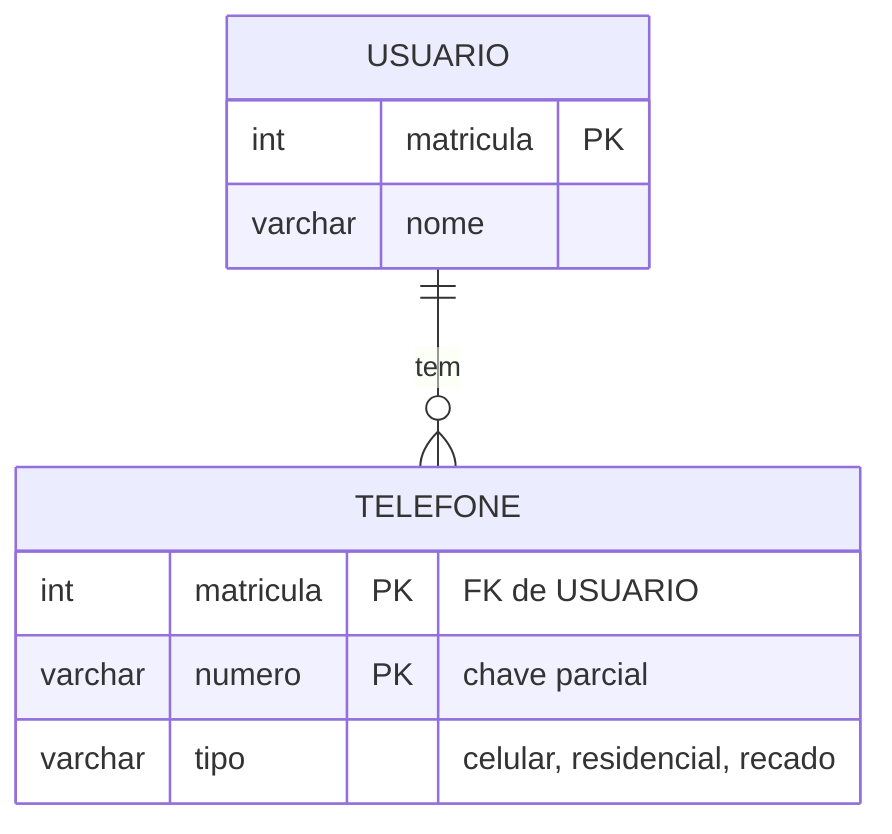
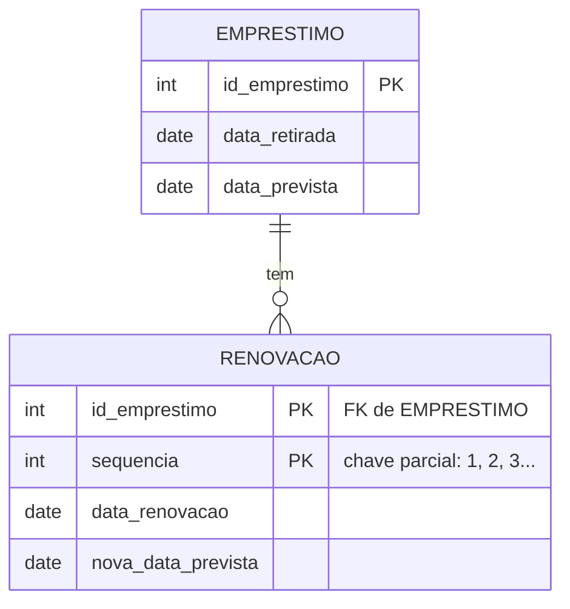
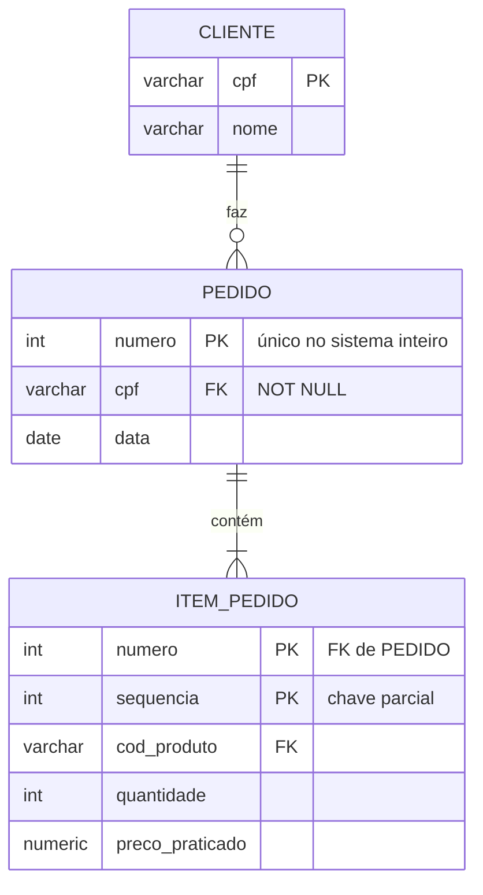
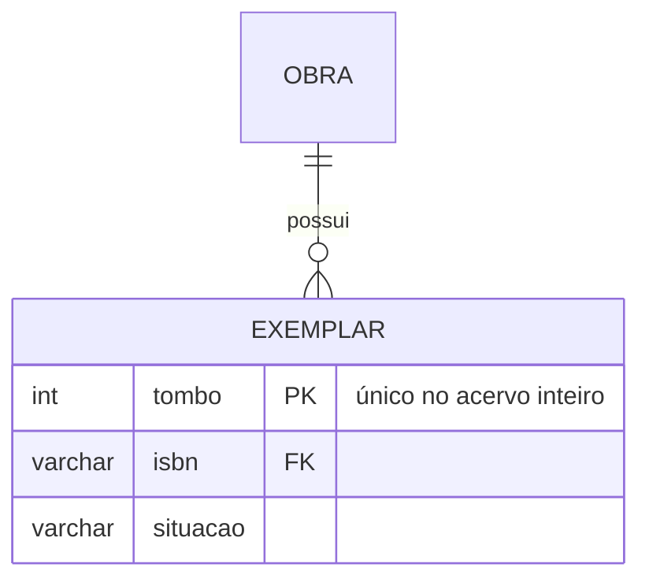
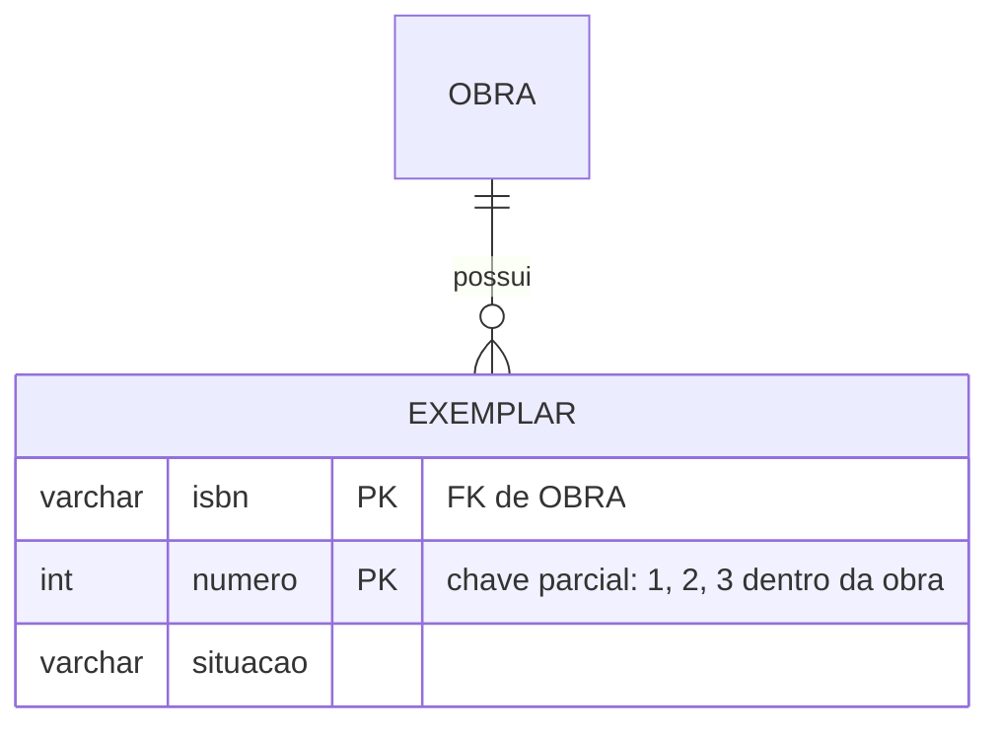

# Aula 06 — Entidades fracas e chaves

Quatro casos, do mais claro ao mais discutível.

## Caso 1 — `TELEFONE`: multivalorado com atributo próprio

> `TELEFONE` é **entidade fraca**. Chave: `(matricula, numero)`. Relacionamento identificador, `ON DELETE CASCADE`.

**Por que fraca e não forte:** o número sozinho não identifica a linha — dois usuários podem ter o mesmo número (mãe e filho, telefone residencial compartilhado), e o modelo precisa permitir isso.

**Por que fraca e não atributo multivalorado simples:** porque tem `tipo`. Se só o número interessasse, seria multivalorado puro — que, ao ser mapeado, viraria exatamente esta mesma tabela.

## Caso 2 — `RENOVACAO`: numerada dentro do dono

> **Fraca.** A `sequencia` recomeça em 1 a cada empréstimo — ela só significa alguma coisa **dentro** do empréstimo.

**A alternativa errada, e por que é errada:** um campo `qtd_renovacoes` em `EMPRESTIMO`. Guardaria *quantas*, perderia *quando* — e nenhuma consulta futura recupera uma data que nunca foi guardada.

## Caso 3 — `PEDIDO`: FK obrigatória, mas **forte**

Este é o caso que separa os dois tipos de dependência:

| | `PEDIDO` | `ITEM_PEDIDO` |
|---|---|---|
| Existe sem o dono? | **Não** — todo pedido tem cliente | **Não** |
| Identifica-se sem o dono? | **Sim** — `numero` é único no sistema | **Não** — a sequência recomeça a cada pedido |
| Resultado | **Forte**, com FK `NOT NULL` | **Fraca** |

> ⚠️ **Aplique o teste:** apague mentalmente `CLIENTE` do modelo. `PEDIDO.numero` ainda identifica cada pedido? Sim → forte. Apague `PEDIDO`. `ITEM_PEDIDO.sequencia` ainda identifica? Não, existem dezenas de "item 1" → fraca.

Repare também em `preco_praticado`: ele fica no item, e não no produto, porque é o preço **daquela venda**. Sem ele, mudar a tabela de preços reescreveria o passado.

## Caso 4 — a mesma realidade, dois modelos válidos

Se o enunciado disser *"cada exemplar tem um tombo único em todo o acervo"*:

> `EXEMPLAR` é **forte**: identifica-se sozinho.

Se disser *"os exemplares de cada obra são numerados a partir de 1"*:

> `EXEMPLAR` é **fraca**: chave `(isbn, numero)`.

**Uma frase do enunciado muda a natureza da entidade.** É por isso que a leitura atenta vale mais que a habilidade de desenhar — e por que a decisão precisa ser escrita, não suposta.

## Natural × artificial: o resumo honesto

| Entidade | Escolha | Por quê |
|---|---|---|
| `OBRA` | `isbn` (natural) | Padrão internacional, estável, curto, já impresso no livro |
| `USUARIO` | `matricula` (natural) | Atribuída pela instituição, não muda, nunca nula |
| `AUTOR` | `id_autor` (artificial) | Não existe chave natural: nomes repetem, homônimos existem |
| `EMPRESTIMO` | `id_emprestimo` (artificial) | A natural `(tombo, data_retirada)` falharia em dois empréstimos no mesmo dia |

> 📏 **A regra que resolve:** natural quando ela for genuinamente estável, única e curta. Artificial quando a natural for composta, longa, instável ou inexistente. **Em qualquer dos casos, declare todas as candidatas como `UNIQUE`** — trocar a PK natural pela artificial e esquecer o `UNIQUE` é como o banco passa a aceitar dois usuários com o mesmo CPF.

---

⬅️ [Voltar à Aula 06](../README.md) | 🏠 [Início do curso](../../../README.md)
