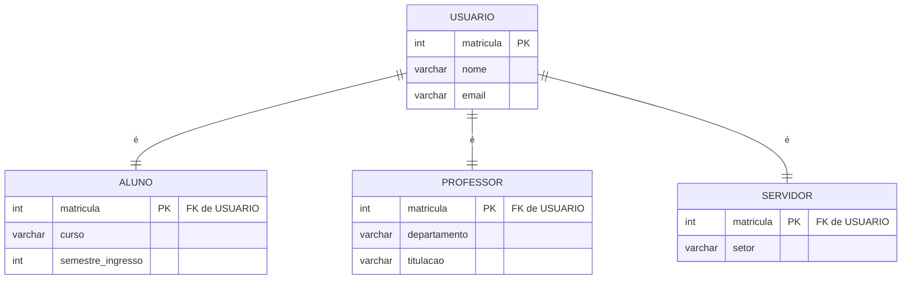
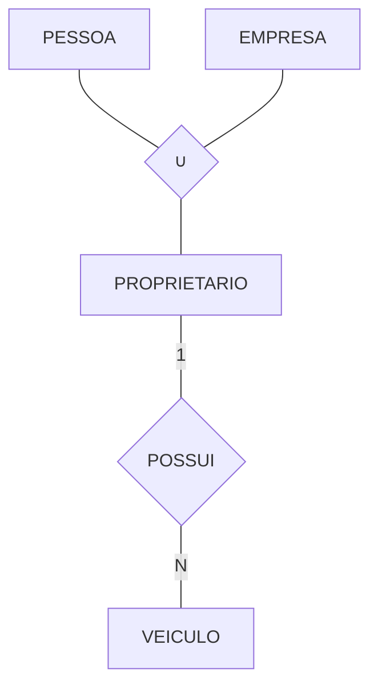
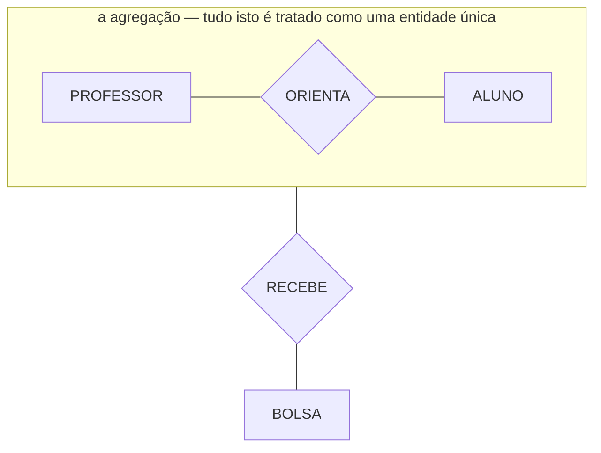
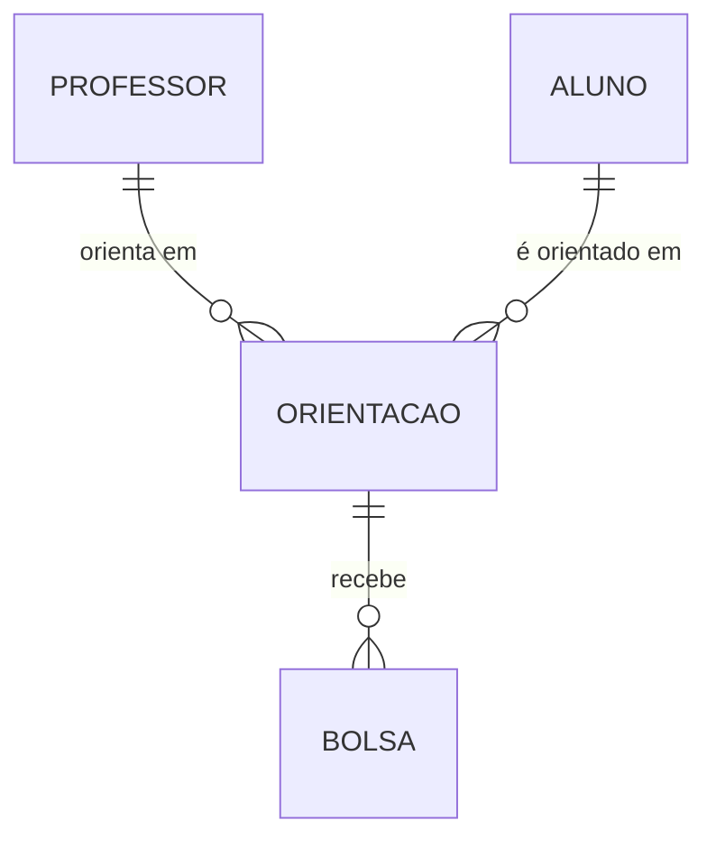

# Aula 07 — Generalização, Especialização e Agregação

> 🎯 Objetivos: modelar hierarquias com generalização e especialização, classificar as restrições de disjunção e completude, e reconhecer quando **não** especializar.
> 🎬 Slides da aula: [apresentacao-07-generalizacao-agregacao.pdf](apresentacao/apresentacao-07-generalizacao-agregacao.pdf)

## 1. Quando duas entidades são quase iguais

Uma biblioteca atende alunos, professores e servidores. Modelando cada um como entidade separada:

```
   ALUNO                PROFESSOR            SERVIDOR
   matricula            matricula            matricula
   nome                 nome                 nome
   email                email                email
   curso                departamento         setor
   semestre_ingresso    titulacao
```

Três quartos do modelo está repetido — e o estrago não é a repetição em si:

- O relacionamento `EMPRESTIMO` teria que ser desenhado **três vezes**, um para cada tipo;
- "Quantos empréstimos houve no mês?" exige somar três consultas;
- Acrescentar `telefone` significa acrescentar em três lugares, e esquecer um.

A **generalização** extrai o que é comum para uma superentidade:



> Especialização **disjunta e total**: todo usuário é exatamente um dos três.

Agora `EMPRESTIMO` liga-se a `USUARIO`, uma vez só, e vale para todos.

Dois nomes para o mesmo desenho, conforme a direção do raciocínio:

- **Generalização** — de baixo para cima: percebi três entidades parecidas e extraí a comum;
- **Especialização** — de cima para baixo: tenho `USUARIO` e percebi que alguns têm atributos próprios.

O resultado é idêntico. Em Chen, desenha-se com um triângulo apontando para a superclasse.

## 2. Herança

A subclasse **herda** todos os atributos e relacionamentos da superclasse. `ALUNO` tem `matricula`, `nome` e `email` sem que precisem ser redesenhados, e participa de `EMPRESTIMO` porque `USUARIO` participa.

O relacionamento entre super e subclasse é sempre **1:1**, e a instância é **a mesma coisa** vista em dois níveis — não são dois registros diferentes, são duas descrições do mesmo indivíduo. É por isso que a subclasse compartilha a chave da superclasse: `ALUNO.matricula` **é** `USUARIO.matricula`.

> 💡 **Ponte com POO (opcional):** quem vem de orientação a objetos reconhece a herança de imediato — `class Aluno extends Usuario`. A diferença que confunde: em POO o objeto é de **uma** classe, e aqui a instância existe **nos dois níveis ao mesmo tempo**, com o mesmo identificador. Um aluno é uma linha em `USUARIO` **e** uma linha em `ALUNO`, e as duas são a mesma pessoa. Se você não veio de POO, ignore este parágrafo sem prejuízo.

## 3. As duas restrições

Toda especialização precisa ser classificada em **dois eixos independentes** — e essa classificação é a informação que o modelo carrega. Sem ela, o desenho não diz quase nada.

### Disjunção: uma instância pode ser de mais de uma subclasse?

- **Disjunta** (`d`) — não. Todo usuário é aluno **ou** professor **ou** servidor, nunca dois;
- **Sobreposta** (`o`, de *overlapping*) — sim. Um pesquisador pode ser aluno de pós **e** professor substituto ao mesmo tempo.

### Completude: toda instância da superclasse pertence a alguma subclasse?

- **Total** — sim, obrigatoriamente. Não existe usuário que não seja de nenhum dos três tipos. Desenha-se com linha dupla;
- **Parcial** — não. Um usuário "visitante da comunidade" pode não se encaixar em nenhuma subclasse.

As quatro combinações, com exemplos reais:

| Disjunção | Completude | Exemplo |
|---|---|---|
| Disjunta | Total | `USUARIO` → aluno / professor / servidor, se todo usuário é obrigatoriamente um dos três |
| Disjunta | Parcial | `FUNCIONARIO` → motorista / mecânico, numa empresa que tem outros cargos sem atributos próprios |
| Sobreposta | Total | `PESSOA` → autor / revisor num congresso onde todos são um ou outro, e alguns são os dois |
| Sobreposta | Parcial | `CLIENTE` → assinante / comprador de avulso, podendo ser os dois ou nenhum |

> ⚠️ **A classificação não é enfeite: ela determina o mapeamento da Aula 10.** Disjunta e total permite uma tabela por subclasse sem tabela pai, ou uma tabela única com discriminador. Sobreposta **elimina** a alternativa de tabela única com um campo `tipo` — porque um campo não guarda dois valores. Classificar errado leva a um esquema que não comporta os dados.

Em Mermaid não há símbolo para isso. Escreva sempre, embaixo do diagrama:

> Especialização **disjunta** e **total**: todo usuário é exatamente um dos três.

## 4. Categoria (união)

Situação inversa da especialização: uma entidade cujas instâncias vêm de **superclasses diferentes**.

Numa universidade, um veículo pode ser autorizado a estacionar se pertencer a uma `PESSOA` ou a uma `EMPRESA` prestadora. `PROPRIETARIO` é uma **categoria** (ou tipo união): cada instância dela é *ou* uma pessoa *ou* uma empresa.



Diferença que importa: na **especialização**, a subclasse herda de **uma** superclasse e é uma restrição dela. Na **categoria**, a subclasse herda seletivamente de **várias** superclasses distintas, e cada instância vem de uma delas.

> 💡 Categoria é rara e cara de mapear. Antes de usá-la, verifique se o problema não se resolve com uma generalização a mais: se `PESSOA` e `EMPRESA` podem virar subclasses de `CLIENTE`, o modelo fica mais simples e o mapeamento também.

## 5. Agregação: quando um relacionamento vira entidade

Um professor orienta um aluno em um projeto — isso é um relacionamento ternário `ORIENTA`. Agora surge um fato novo: **cada orientação recebe bolsas**.

O problema é que uma bolsa não se relaciona com o professor, nem com o aluno, nem com o projeto isoladamente — ela se relaciona com **a orientação inteira**. E o MER não permite ligar uma entidade a um relacionamento.

A **agregação** resolve tratando o relacionamento como se fosse uma entidade:



Na prática, o efeito é o mesmo de promover o relacionamento a **entidade associativa** — e é assim que ele será mapeado na Aula 10. A agregação é a forma de dizer, no nível conceitual, *"o fato desta associação é ele próprio uma coisa sobre a qual tenho mais a dizer"*.

Em Mermaid, modele a entidade associativa diretamente e explique em texto:



> `ORIENTACAO` é a agregação do relacionamento entre professor e aluno, promovida a entidade para poder receber bolsas.

## 6. Quando **não** especializar

Especialização é a ferramenta mais usada em excesso do curso — especialmente por quem vem de programação orientada a objetos, onde herdar é barato.

Não especialize quando:

- **A subclasse não tem atributos próprios.** `CLIENTE` → `CLIENTE_ATIVO` / `CLIENTE_INATIVO` não é especialização: é um atributo `situacao`. Estado não é tipo;
- **A subclasse tem um único atributo exclusivo.** Uma coluna opcional com um `CHECK` resolve, e custa uma tabela e uma junção a menos;
- **A instância troca de subclasse.** Um aluno que se forma e vira professor teria que ser apagado de uma tabela e criado noutra, perdendo o histórico. Se a classificação **muda ao longo do tempo**, ela é atributo — ou, se o histórico importa, uma entidade com período;
- **A hierarquia tem mais de três níveis.** Cada nível é uma junção a mais em toda consulta. Três é muito; quatro é sinal de que a classificação virou taxonomia, e taxonomia se guarda em tabela de dados, não em estrutura.

> 📏 **Regra do curso:** especialize quando a subclasse tiver **dois ou mais atributos exclusivos** ou **participar de um relacionamento que as outras não têm**. Fora disso, um atributo `tipo` com domínio restrito faz o mesmo trabalho e não cobra junção.

> 📖 A generalização, a especialização e a agregação formam o que se chama **modelo ER estendido** (EER) — extensões propostas depois do artigo original de Chen para dar conta de modelos maiores. O livro-base as apresenta na sequência do modelo ER básico.

> 💻 **Modelos desta aula:** [`especializacao.md`](exemplos/especializacao.md)

## 🏋️ Exercícios da aula

Na pasta `aula-07/` do seu repositório:

1. **`ex01.md`** — modele em Mermaid a especialização de `PROFISSIONAL` num hospital, em `MEDICO` (CRM, especialidade), `ENFERMEIRO` (COREN, setor) e `TECNICO` (função). Classifique nos dois eixos e **justifique cada eixo com uma frase sobre o mundo real** — não basta dizer "disjunta e total", é preciso dizer por quê;
2. **`ex02.md`** — classifique cada especialização nos dois eixos, justificando: (a) `VEICULO` → carro / moto / caminhão; (b) `PESSOA` → cliente / fornecedor, numa empresa onde alguém pode ser os dois; (c) `CONTA` → corrente / poupança; (d) `PUBLICACAO` → livro / artigo / tese, numa base que também guarda outros tipos; (e) `FUNCIONARIO` → CLT / estagiário / terceirizado;
3. **`ex03.md`** — três modelos abaixo usam especialização **sem necessidade**. Para cada um, aponte o problema e entregue a versão simplificada em Mermaid: (a) `PEDIDO` → `PEDIDO_PAGO` / `PEDIDO_PENDENTE`; (b) `PRODUTO` → `PRODUTO_IMPORTADO` (com o único atributo `pais_origem`); (c) `ALUNO` → `ALUNO_BOLSISTA` (com `percentual_bolsa`), sabendo que o aluno pode ganhar e perder a bolsa a cada semestre;
4. **`ex04.md`** — num congresso, um artigo é avaliado por um revisor, e cada avaliação recebe um parecer do coordenador da trilha. Modele usando **agregação**, explique em texto qual relacionamento foi promovido a entidade e por que o parecer não podia se ligar diretamente ao artigo nem ao revisor;
5. **Desafio 🌶️ `ex05.md`** — numa universidade, um veículo autorizado a estacionar pode pertencer a uma pessoa (aluno, servidor) ou a uma empresa prestadora de serviço. Modele isso de **duas formas**: (a) com **categoria/união**; (b) com uma generalização adicional `PROPRIETARIO` da qual `PESSOA` e `EMPRESA` são especializações. Compare: que informação cada versão preserva, qual é mais simples de mapear para tabelas, e o que você perde em cada escolha. Recomende uma, com argumento.

## 🧠 Revisão

[8 questões de múltipla escolha](revisao/README.md) para conferir se os conceitos ficaram sólidos. Responda sem consultar a aula — depois volte e corrija.

## ✅ Entrega

```bash
git add aula-07/
git commit -m "Resolve exercícios da aula 07 (generalização e agregação)"
git push
```

---

⬅️ [Aula 06](../aula-06-entidades-fracas-chaves/README.md) | ➡️ [Aula 08 — Estudo de caso: do minimundo ao DER](../aula-08-estudo-de-caso-der/README.md)
