<!-- _class: capa -->

🌲

# Generalização e Agregação

## Aula 07 · Bloco 2 — Modelagem Conceitual

Hierarquias — e quando não especializar

---

## 🎯 Nesta aula

1. Quando duas entidades são **quase iguais**
2. **Herança** de atributos e relacionamentos
3. As duas restrições: **disjunção** e **completude**
4. **Categoria** (união)
5. **Agregação** — quando um relacionamento vira entidade

---

<!-- _class: diagrama -->

## Quando duas entidades são quase iguais

---

## O que a especialização resolve

`ALUNO` e `PROFESSOR` compartilham matrícula, nome, e-mail — e cada um tem o que é seu.

Sem especializar, você duplica os atributos comuns nas duas entidades. E no dia em que o e-mail passar a exigir validação, altera nos dois lugares.

**Generalização** é o caminho de baixo para cima (achei o que há em comum). **Especialização** é o de cima para baixo (dividi em tipos). O desenho é o mesmo.

---

## Herança

A subclasse **herda** tudo da superclasse:

- os **atributos** — `ALUNO` tem matrícula, nome e e-mail sem declará-los;
- os **relacionamentos** — se `USUARIO` faz reserva, `ALUNO` também faz.

E acrescenta o que é exclusivo dela.

---

<!-- _class: diagrama -->

## Disjunção: pode ser de mais de uma subclasse?

---

## As duas restrições, sempre em par

**Disjunção**

- **Disjunta** — cada instância pertence a **no máximo uma** subclasse;
- **Sobreposta** — pode pertencer a **várias**. Uma pessoa pode ser aluno **e** servidor.

**Completude**

- **Total** — toda instância da superclasse está em **alguma** subclasse;
- **Parcial** — pode existir instância que não é de nenhuma.

Toda especialização se declara nos **dois eixos**.

---

<!-- _class: diagrama -->

## Categoria (união): o inverso da especialização

---

## Categoria

Na especialização, **uma** superclasse vira várias subclasses.

Na **categoria**, **várias** superclasses distintas convergem numa subclasse.

*Um `PROPRIETARIO` de veículo pode ser uma `PESSOA` ou uma `EMPRESA`* — e as duas não têm parentesco entre si.

> 💡 É menos comum que a especialização, e a maioria dos casos que parecem categoria se resolve melhor com uma superclasse comum.

---

<!-- _class: diagrama -->

## Agregação: quando um relacionamento vira entidade

---

## Quando você precisa de agregação

Um relacionamento que **participa de outro relacionamento**.

*"Um `PROFESSOR` **orienta** um `ALUNO` num `PROJETO`. E essa orientação **gera** relatórios."*

O `RELATORIO` não se liga ao professor, nem ao aluno, nem ao projeto — ele se liga **à orientação inteira**.

Em Chen, envolve-se o losango num retângulo.

---

<!-- _class: lead -->

## 📏 Quando **não** especializar

Especialize quando a subclasse tiver:

**dois ou mais atributos exclusivos**

**ou** participar de um relacionamento
que as outras não têm.

Fora disso, um atributo `tipo` com domínio restrito
faz o mesmo trabalho — e não cobra junção.

---

## O custo escondido da especialização

Cada subclasse vira, no projeto lógico, uma tabela a mais — ou uma coluna a mais cheia de nulos.

Consultar "todos os usuários" passa a exigir junção, ou `UNION`.

> ⚠️ Especialização com uma subclasse que tem **um** atributo exclusivo é quase sempre um `tipo` disfarçado. O modelo fica bonito no diagrama e caro na consulta.

---

<!-- _class: checkpoint -->

## 🏋️ Exercícios da aula

Na pasta `aula-07/`:

1. **`ex01.md`** — três especializações, declarando disjunção e completude com justificativa;
2. **`ex02.md`** — um caso de **categoria**, e por que não é especialização;
3. **`ex03.md`** — um caso que **pede agregação**, mostrando o que se perde sem ela;
4. **`ex04.md`** — três casos em que **não** se deve especializar, e o que fazer no lugar;
5. **Desafio 🌶️ `ex05.md`** — a mesma realidade modelada com e sem especialização: compare as consultas.

---

<!-- _class: lead -->

## ➡️ Próxima aula

**Aula 08 — Estudo de Caso: do minimundo ao DER**

O roteiro completo, sobre a Biblioteca Universitária.
