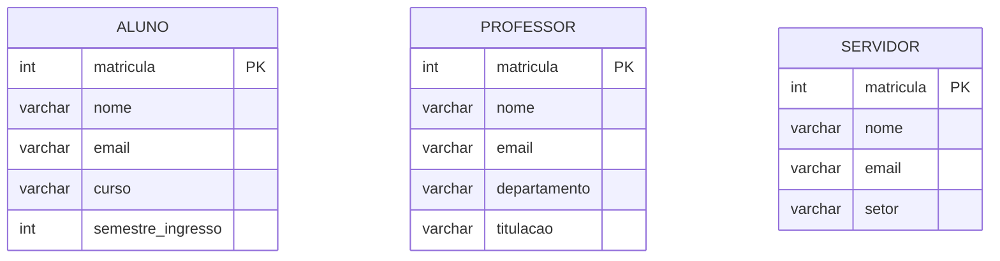
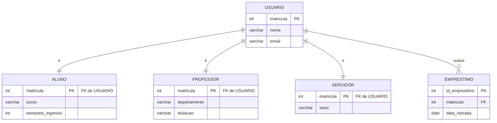
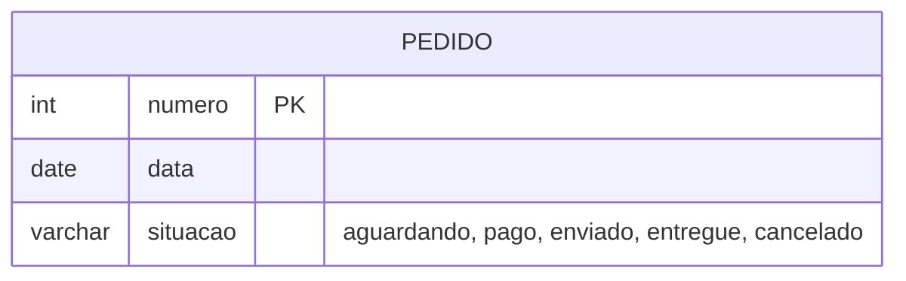
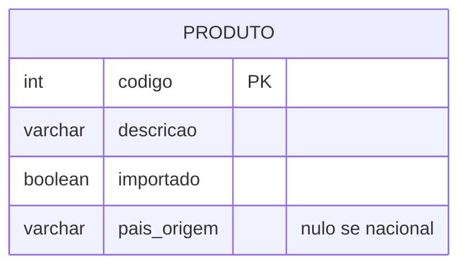
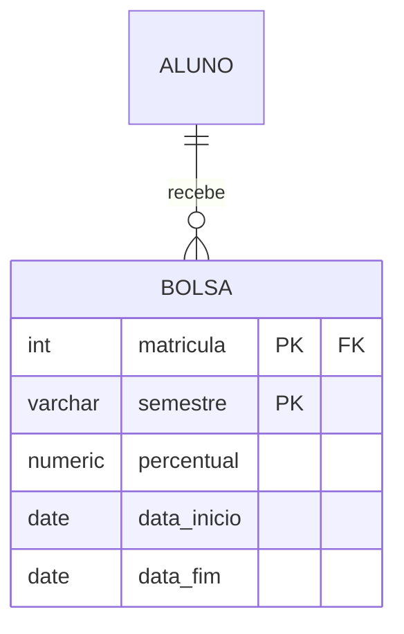
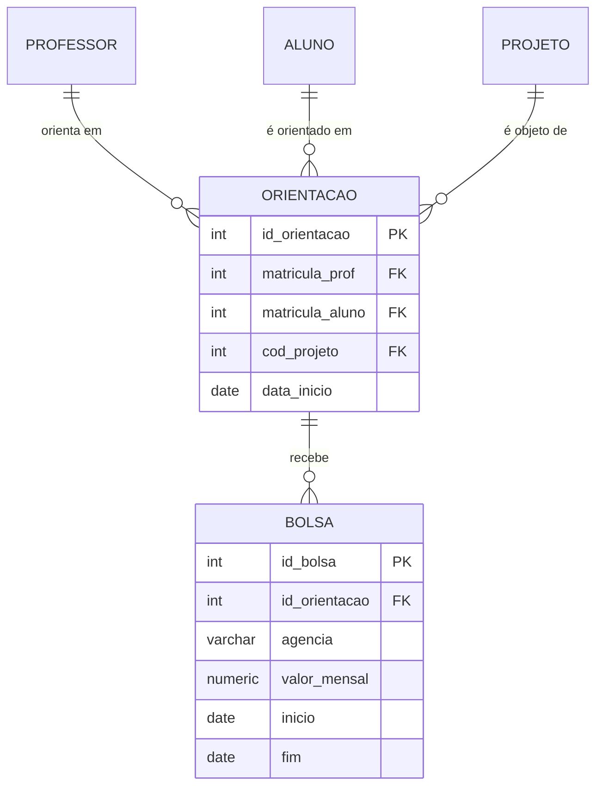

# Aula 07 — Generalização, especialização e agregação

## O problema: três entidades quase iguais

Três quartos repetido. E o estrago real não é a repetição: é que `EMPRESTIMO` precisaria ser desenhado **três vezes**, e "quantos empréstimos houve no mês?" viraria três consultas somadas.

## A solução: generalizar

> **Especialização disjunta e total.**
> **Disjunta** porque a universidade não permite vínculo duplo — ninguém é aluno e professor ao mesmo tempo.
> **Total** porque todo usuário da biblioteca tem obrigatoriamente um dos três vínculos; não há usuário externo.

`EMPRESTIMO` liga-se a `USUARIO` **uma vez só** e vale para os três tipos. Esse é o ganho.

## As quatro combinações, com exemplos reais

| Disjunção | Completude | Exemplo | Consequência no mapeamento |
|---|---|---|---|
| Disjunta | Total | `USUARIO` → aluno / professor / servidor | Opções A, B ou C (Aula 10, §9) |
| Disjunta | Parcial | `FUNCIONARIO` → motorista / mecânico, numa empresa com outros cargos | A ou C — a B não tem onde guardar quem não é de nenhum tipo |
| Sobreposta | Total | `PESSOA` → autor / revisor num congresso onde todos são um, e alguns são os dois | A ou D — a C é impossível: um campo `tipo` não guarda dois valores |
| Sobreposta | Parcial | `CLIENTE` → assinante / comprador avulso | A ou D |

> ⚠️ **Classificar errado leva a um esquema que não comporta os dados.** É a razão de a classificação não ser detalhe acadêmico.

## Quando NÃO especializar — três casos reais

### Estado não é tipo

❌ `PEDIDO` → `PEDIDO_PAGO` / `PEDIDO_PENDENTE` seria errado: um pedido **muda** de situação, e a instância teria que ser apagada de uma tabela e criada noutra a cada mudança, perdendo o histórico. **Se muda ao longo do tempo, é atributo.**

### Um atributo exclusivo não paga uma tabela

❌ `PRODUTO` → `PRODUTO_IMPORTADO` com o único atributo `pais_origem` custaria uma tabela e uma junção em toda consulta. Uma coluna opcional com um `CHECK` (`importado = FALSE OR pais_origem IS NOT NULL`) faz o mesmo trabalho.

### Classificação que vai e volta

Aluno bolsista, que ganha e perde a bolsa a cada semestre, não é subclasse — é uma **entidade com período**:

Assim o histórico existe, e "quem era bolsista em 2024.2?" tem resposta.

> 📏 **A regra:** especialize quando a subclasse tiver **dois ou mais atributos exclusivos** ou **participar de um relacionamento que as outras não têm**.

## Agregação: quando o relacionamento vira entidade

Um professor orienta um aluno num projeto. Cada **orientação** recebe bolsas — e a bolsa não se relaciona com o professor, nem com o aluno, nem com o projeto isoladamente, mas com a orientação inteira.

> `ORIENTACAO` é a **agregação** do relacionamento entre professor, aluno e projeto, promovida a entidade para poder receber bolsas. O MER puro não permite ligar uma entidade a um relacionamento; a agregação é a forma de dizer *"o fato desta associação é ele próprio uma coisa sobre a qual tenho mais a dizer"*.

Na prática, o efeito é idêntico ao de promover o relacionamento a **entidade associativa** — que é como ele será mapeado na Aula 10.

---

⬅️ [Voltar à Aula 07](../README.md) | 🏠 [Início do curso](../../../README.md)
