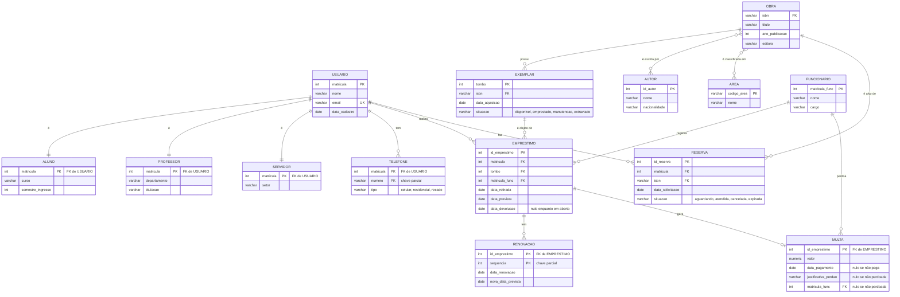

# Aula 08 — Estudo de Caso: do Minimundo ao DER

> 🎯 Objetivos: executar o roteiro completo de modelagem conceitual sobre um minimundo real, reconhecer os sete erros clássicos e validar um modelo lendo-o em voz alta.

Esta aula não traz conceito novo. Traz o **uso** de tudo que veio antes, no caso que vai acompanhar o resto do curso: nas Aulas 10 e 12 este modelo vira tabelas e é normalizado; nas Aulas 13 e 14 vira SQL rodando.

## 1. O minimundo: Biblioteca Universitária

> A biblioteca central atende **usuários** vinculados à universidade, identificados pela matrícula, com nome, e-mail e a data em que se cadastraram. Um usuário pode informar vários telefones, cada um com um tipo (celular, residencial, recado). Todo usuário é **aluno**, **professor** ou **servidor** — nunca mais de um. De alunos interessam o curso e o semestre de ingresso; de professores, o departamento e a titulação; de servidores, o setor de lotação.
>
> O acervo é formado por **obras**, identificadas pelo ISBN, com título, ano de publicação e editora. Uma obra é escrita por um ou mais **autores**, e a ordem em que os autores aparecem na capa importa. Uma obra é classificada em uma ou mais **áreas de conhecimento**.
>
> De cada obra a biblioteca possui **exemplares** físicos. Cada exemplar tem um número de tombo, único em todo o acervo, a data em que foi adquirido e uma situação (disponível, emprestado, em manutenção, extraviado). É o exemplar que é emprestado, nunca a obra.
>
> Um **empréstimo** registra a saída de um exemplar para um usuário, com a data de retirada, a data prevista de devolução e, quando ocorre, a data de devolução efetiva. Todo empréstimo é registrado por um **funcionário** da biblioteca. Um empréstimo pode ser **renovado** várias vezes; cada renovação registra a data em que foi feita e a nova data prevista, e as renovações de um empréstimo são numeradas em sequência.
>
> Usuários podem **reservar** obras que estão todas emprestadas — a reserva é da obra, não de um exemplar específico. A reserva guarda a data da solicitação e a situação (aguardando, atendida, cancelada, expirada).
>
> Quando a devolução atrasa, gera-se uma **multa** para aquele empréstimo, com o valor devido e a data de pagamento. Uma multa pode ser perdoada por um funcionário, que precisa registrar a justificativa.

## 2. O roteiro em seis passos

### Passo 1 — Grifar substantivos e verbos

Substantivos que se repetem e têm vida própria: **usuário, telefone, aluno, professor, servidor, obra, autor, área, exemplar, empréstimo, funcionário, renovação, reserva, multa**. Onze candidatos, mais três subtipos.

Verbos ligando dois deles: *escreve*, *classifica*, *possui*, *empresta*, *registra*, *renova*, *reserva*, *gera*, *perdoa*.

### Passo 2 — Separar entidades de atributos

Aplicando o teste da Aula 03 (*"o cliente vai querer guardar mais alguma coisa sobre isso?"*):

| Candidato | Decisão | Por quê |
|---|---|---|
| `AUTOR` | **Entidade** | Tem nacionalidade e é compartilhado entre obras |
| `AREA` | **Entidade** | Tem nome próprio e é compartilhada |
| `editora` | **Atributo** de `OBRA` | O enunciado não pede nada além do nome. Vira entidade no dia em que pedirem endereço |
| `situacao` do exemplar | **Atributo** com domínio restrito | Quatro valores fixos, sem características próprias |
| `TELEFONE` | **Entidade fraca** | Multivalorado **com** atributo próprio (`tipo`) — Aula 06, seção 4 |
| `RENOVACAO` | **Entidade fraca** | Numerada dentro do empréstimo |

### Passo 3 — Definir chaves

| Entidade | Chave | Justificativa |
|---|---|---|
| `USUARIO` | `matricula` | Natural, estável, única, atribuída pela universidade |
| `OBRA` | `isbn` | Natural, padrão internacional, não muda |
| `EXEMPLAR` | `tombo` | O enunciado diz **único em todo o acervo** → entidade **forte** |
| `AUTOR` | `id_autor` (artificial) | Não há chave natural: nomes repetem e homônimos existem |
| `EMPRESTIMO` | `id_emprestimo` (artificial) | A alternativa `(tombo, data_retirada)` falharia em dois empréstimos no mesmo dia |
| `RENOVACAO` | `(id_emprestimo, sequencia)` | Fraca: a sequência só faz sentido dentro do empréstimo |
| `TELEFONE` | `(matricula, numero)` | Fraca: dois usuários podem ter o mesmo número |
| `MULTA` | `id_emprestimo` | 1:1 com empréstimo — a chave é a mesma |

> 💡 Se o enunciado dissesse *"cada exemplar é numerado a partir de 1 dentro da obra"*, `EXEMPLAR` seria **fraca**, com chave `(isbn, numero)`. Uma frase do enunciado muda a natureza da entidade — é por isso que a leitura atenta vale mais que a habilidade de desenhar.

### Passo 4 — Cardinalidade e participação, par a par

| Relacionamento | (min,max) esquerda | (min,max) direita | Razão |
|---|:---:|:---:|:---:|
| `OBRA` possui `EXEMPLAR` | (0,N) | (1,1) | 1:N |
| `OBRA` escrita por `AUTOR` | (1,N) | (1,N) | N:M |
| `OBRA` classificada em `AREA` | (1,N) | (0,N) | N:M |
| `USUARIO` tem `TELEFONE` | (0,N) | (1,1) | 1:N |
| `USUARIO` realiza `EMPRESTIMO` | (0,N) | (1,1) | 1:N |
| `EXEMPLAR` objeto de `EMPRESTIMO` | (0,N) | (1,1) | 1:N |
| `FUNCIONARIO` registra `EMPRESTIMO` | (0,N) | (1,1) | 1:N |
| `EMPRESTIMO` tem `RENOVACAO` | (0,N) | (1,1) | 1:N |
| `EMPRESTIMO` gera `MULTA` | (0,1) | (1,1) | 1:1 |
| `USUARIO` faz `RESERVA` | (0,N) | (1,1) | 1:N |
| `OBRA` é alvo de `RESERVA` | (0,N) | (1,1) | 1:N |

Repare no `(0,N)` de `OBRA` para `EXEMPLAR`: uma obra **pode** estar catalogada sem exemplar. Isso é uma decisão — e é o tipo de coisa que se confirma com o cliente, não se supõe.

### Passo 5 — Desenhar



**O que o diagrama não diz, e o texto precisa dizer:**

- `USUARIO` → `ALUNO`/`PROFESSOR`/`SERVIDOR` é especialização **disjunta e total**;
- `TELEFONE` e `RENOVACAO` são **entidades fracas**, com chave parcial `numero` e `sequencia`;
- `ESCRITA` (o N:M entre `OBRA` e `AUTOR`) tem o atributo **`ordem`**, que registra a posição do autor na capa;
- `MULTA` é 1:1 com `EMPRESTIMO` e por isso compartilha a chave.

### Passo 6 — Regras de negócio

O que ficou de fora do desenho, numerado e explícito:

1. O limite de exemplares e o prazo de devolução dependem do tipo de usuário: aluno 3/14 dias, professor 10/60 dias, servidor 3/14 dias;
2. Só se pode reservar uma obra cujos exemplares estejam **todos** emprestados;
3. Um usuário não pode reservar obra da qual já tem exemplar emprestado;
4. Um empréstimo só é renovado se **não houver reserva** para a obra;
5. A multa é de valor fixo por dia de atraso, contado a partir da última `nova_data_prevista`;
6. Um exemplar em situação `manutencao` ou `extraviado` não pode ser emprestado;
7. `data_devolucao` nula significa **empréstimo em aberto** — o único significado admitido para nulo nesse campo.

> 📏 **Regra do curso:** esta lista **é parte do modelo**. Entregar o diagrama sem ela é entregar metade — e é a metade que o cliente consegue conferir.

## 3. Os sete erros clássicos

O que aparece quando o roteiro é pulado:

**1. Emprestar a obra em vez do exemplar.** `USUARIO` ligado direto a `OBRA`. O modelo passa a não saber *qual* livro físico saiu, não consegue ter dois exemplares emprestados a pessoas diferentes e perde o controle do acervo. É o erro que este minimundo existe para ensinar.

**2. Telefone como atributo simples.** Um campo `telefone` em `USUARIO`. Funciona até o primeiro usuário com dois números — e a "solução" `telefone1`, `telefone2` só adia o problema.

**3. Cardinalidade invertida em `OBRA`–`EXEMPLAR`.** Modelar como se um exemplar tivesse várias obras. Leia em voz alta: *"um exemplar pertence a várias obras"* — falso.

**4. `RENOVACAO` como contador.** Um campo `qtd_renovacoes` em `EMPRESTIMO`. Perde-se **quando** cada renovação foi feita, e nenhuma consulta futura recupera isso.

**5. Reserva do exemplar em vez da obra.** O enunciado diz explicitamente que a reserva é da obra. Reservar exemplar obrigaria o usuário a esperar um exemplar específico enquanto outro idêntico está livre.

**6. Situação do exemplar como entidade.** Uma tabela `SITUACAO` com quatro linhas e nada mais. Quatro valores fixos sem características próprias são um domínio, não uma entidade (Aula 04, seção 3).

**7. Especialização por estado.** Criar `USUARIO_ATIVO` e `USUARIO_INATIVO` como subclasses. Estado muda; tipo não. Isso é atributo (Aula 07, seção 6).

## 4. Validando o modelo: a leitura em voz alta

O ritual final, e o mais eficaz. Leia **cada linha** do diagrama como frase em português e pergunte se é verdade:

| Frase | Verdade? |
|---|:---:|
| "Um exemplar pertence a exatamente uma obra" | ✅ |
| "Uma obra pode existir sem nenhum exemplar" | ✅ (decidido no passo 4) |
| "Um empréstimo é de exatamente um exemplar" | ✅ |
| "Um empréstimo pode existir sem funcionário que o registrou" | ❌ → participação total, `NOT NULL` na FK |
| "Uma multa pode existir sem empréstimo" | ❌ → a multa é sempre de um empréstimo |
| "Um usuário pode ter zero telefones" | ✅ |
| "Um autor pode não ter escrito nenhuma obra" | ❌ no nosso caso → `(1,N)`, autor só existe se tiver obra |

Cinco minutos de leitura encontram mais defeitos que uma hora olhando o desenho. E quando a leitura é feita **com o cliente**, o modelo deixa de ser suposição.

> 💻 **Modelos desta aula:** [`minimundo.md`](exemplos/minimundo.md) e [`der-completo.md`](exemplos/der-completo.md) — o caso completo, que reaparece nas Aulas 10, 12, 13 e 14.

## 🏋️ Exercícios da aula

Na pasta `aula-08/` do seu repositório:

1. **`ex01.md`** — escolha um minimundo ⭐⭐ do [catálogo](../../recursos/minimundos.md) e execute **os seis passos**, entregando cada um explicitamente: substantivos e verbos grifados, tabela de decisão entidade/atributo, tabela de chaves com justificativa, tabela de `(min,max)`, diagrama em Mermaid e lista numerada de regras de negócio. O passo 4 é o que mais vale: não pule a tabela;
2. **`ex02.md`** — o DER abaixo modela a mesma biblioteca e contém **cinco** dos sete erros da seção 3. Identifique cada um, explique o estrago com uma situação concreta e entregue a versão corrigida:

   ```mermaid
   erDiagram
       USUARIO ||--o{ OBRA : "empresta"
       OBRA ||--o{ EXEMPLAR : "tem"
       USUARIO ||--|| USUARIO_ATIVO : "é"
       USUARIO ||--|| USUARIO_INATIVO : "é"
       EXEMPLAR }o--|| SITUACAO : "está em"
       USUARIO ||--o{ RESERVA : "faz"
       EXEMPLAR ||--o{ RESERVA : "é reservado em"
       USUARIO {
           int matricula PK
           varchar nome
           varchar telefone
       }
       OBRA {
           varchar isbn PK
           varchar titulo
           date data_retirada
           int qtd_renovacoes
       }
   ```

3. **`ex03.md`** — para o modelo da Biblioteca da seção 2, escreva a **leitura em voz alta completa**: uma frase por relacionamento, nos dois sentidos, com ✅ ou ❌ e, nos ❌, a correção. São 11 relacionamentos, 22 frases;
4. **`ex04.md`** — troque o `ex01.md` com um colega (por Pull Request no repositório dele) e faça a **revisão do modelo alheio**: três pontos que ele resolveu melhor que você, três perguntas sobre decisões que você não entendeu, e um erro da seção 3 que você encontrou — ou a constatação honesta de que não encontrou nenhum. Cole a revisão que você **recebeu** no seu `ex04.md`;
5. **Desafio 🌶️ `ex05.md`** — o enunciado da seção 1 muda: *"agora a biblioteca tem três unidades. Cada exemplar pertence a uma unidade, mas pode ser retirado e devolvido em qualquer uma delas. Toda transferência entre unidades precisa ser registrada, com data, unidade de origem, unidade de destino e o funcionário responsável."* Entregue: (a) o DER atualizado; (b) a lista do que **mudou** e do que **não** mudou no modelo anterior; (c) duas novas regras de negócio que essa mudança cria; (d) uma consulta em português que só passou a ser possível depois da mudança.

## 🧠 Revisão

[8 questões de múltipla escolha](revisao/README.md) para conferir se os conceitos ficaram sólidos. Responda sem consultar a aula — depois volte e corrija.

## ✅ Entrega

```bash
git add aula-08/
git commit -m "Resolve exercícios da aula 08 (estudo de caso)"
git push
```

---

⬅️ [Aula 07](../aula-07-generalizacao-agregacao/README.md) | ➡️ [Aula 09 — O modelo relacional](../../bloco-3-modelo-relacional/aula-09-modelo-relacional/README.md)

🏁 **Fim do Bloco 2!** Você já sabe transformar um texto em português num modelo conceitual defensável. No Bloco 3 esse modelo vira tabelas — e você descobre que a tradução tem regras, e que nem tudo sobrevive a ela.
