<!-- _class: capa -->

🏗️

# Do Minimundo ao DER

## Aula 08 · Bloco 2 — Modelagem Conceitual

O roteiro completo, sobre a Biblioteca Universitária

---

## 🎯 Nesta aula

1. O **minimundo** completo
2. O **roteiro em seis passos**
3. O DER final, em três partes
4. Os **sete erros clássicos**
5. Validando o modelo: a **leitura em voz alta**

---

## O roteiro em seis passos

1. **Grifar** substantivos e verbos;
2. **Separar** entidades de atributos;
3. **Definir** chaves;
4. **Cardinalidade e participação**, par a par;
5. **Desenhar**;
6. **Escrever as regras de negócio** que o desenho não expressa.

Nesta ordem. Pular o passo 4 é a causa da maioria dos modelos errados.

---

<!-- _class: diagrama -->

## O DER — parte 1: quem usa

---

<!-- _class: diagrama -->

## Parte 2: o acervo

---

<!-- _class: diagrama -->

## Parte 3: a circulação

---

<!-- _class: lead -->

## 💡 Por que em três partes

O DER completo tem 14 entidades.

Projetado inteiro, ele vira um borrão —
e ninguém consegue segui-lo numa aula.

Modelo grande se **apresenta por subsistema**
e se **entrega inteiro** no README.

---

<!-- _class: lista-limpa -->

## Os sete erros clássicos — parte 1

- 1️⃣ **Atributo virou entidade** — `cor` como entidade, sem nada além do nome;
- 2️⃣ **Relacionamento virou entidade** sem necessidade — uma tabela `LIGACAO` que só tem as duas chaves e nenhum fato;
- 3️⃣ **Cardinalidade invertida** — o clássico: leu o diagrama em vez de fazer as duas perguntas;
- 4️⃣ **Ciclo redundante** — três relacionamentos onde dois bastavam, e agora dá para chegar ao mesmo fato por dois caminhos que podem discordar.

---

<!-- _class: lista-limpa -->

## Os sete erros clássicos — parte 2

- 5️⃣ **Entidade sem identidade** — nenhuma chave candidata, e ninguém percebeu;
- 6️⃣ **N:M escondido** — modelado como 1:N porque *"na prática é sempre um"*. Até não ser;
- 7️⃣ **Especialização desnecessária** — subclasse com um atributo exclusivo, que era um `tipo` disfarçado.

> ⚠️ Cinco dos sete se evitam com **uma única disciplina**: fazer as duas perguntas de cardinalidade, no singular, em voz alta, para cada par.

---

<!-- _class: lead -->

## 🗣️ A leitura em voz alta

Percorra cada relacionamento e **leia como frase**:

*"Um usuário realiza zero ou muitos empréstimos.
Um empréstimo é realizado por exatamente um usuário."*

Se a frase soa estranha ao cliente,
o modelo está errado —

e ele consegue apontar isso **sem saber o que é um DER**.

---

## Regras de negócio: a outra metade

> 📏 **Regra do curso:** a lista numerada de regras **é parte do modelo**. Entregar o diagrama sem ela é entregar metade — e é a metade que o cliente consegue conferir.

Exemplos que nenhum símbolo expressa:

1. Um aluno pode ter no máximo 3 empréstimos ativos;
2. Obras de referência não são emprestadas;
3. A multa é de R$ 1,00 por dia de atraso, por exemplar.

---

<!-- _class: checkpoint -->

## 🏋️ Exercícios da aula

Na pasta `aula-08/`:

1. **`ex01.md`** — execute os seis passos sobre um minimundo do catálogo de `recursos/`;
2. **`ex02.md`** — encontre os sete erros num DER propositalmente defeituoso;
3. **`ex03.md`** — a leitura em voz alta do seu modelo, relacionamento por relacionamento;
4. **`ex04.md`** — a lista numerada de regras de negócio do seu minimundo;
5. **Desafio 🌶️ `ex05.md`** — modele o mesmo minimundo de duas formas defensáveis e defenda a sua.

---

<!-- _class: lead -->

## 🏁 Fim do Bloco 2

Você sabe modelar o mundo.

**Bloco 3 — Modelo Relacional**

Agora o modelo vira **tabelas** —
e ganha as regras que o banco cobra.
