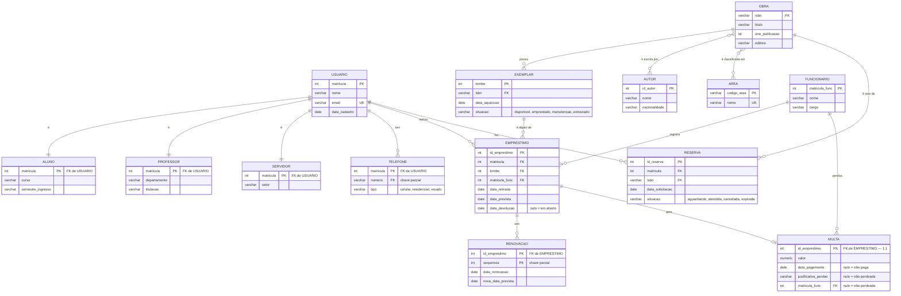

# DER completo — Biblioteca Universitária

O modelo conceitual do [minimundo](minimundo.md), pronto para ser mapeado na [Aula 10](../../../bloco-3-modelo-relacional/aula-10-mapeamento-er-relacional/README.md).

## O diagrama

## O que o Mermaid não expressa

Registrado em texto, porque **faz parte do modelo**:

- `USUARIO` → `ALUNO`/`PROFESSOR`/`SERVIDOR` é especialização **disjunta e total**;
- `TELEFONE` e `RENOVACAO` são **entidades fracas**, com chaves parciais `numero` e `sequencia`;
- O N:M `OBRA`–`AUTOR` tem o atributo **`ordem`** (posição do autor na capa);
- `MULTA` é **1:1** com `EMPRESTIMO` e por isso compartilha a chave. O `||--o|` acima expressa a cardinalidade, mas não que a chave é a mesma;
- As **regras de negócio** estão no [minimundo](minimundo.md#regras-de-negócio).

## Cardinalidade e participação, par a par

| Relacionamento | (min,max) esquerda | (min,max) direita | Razão |
|---|:---:|:---:|:---:|
| `OBRA` possui `EXEMPLAR` | (0,N) | (1,1) | 1:N |
| `OBRA` escrita por `AUTOR` | (1,N) | (1,N) | N:M |
| `OBRA` classificada em `AREA` | (1,N) | (0,N) | N:M |
| `USUARIO` tem `TELEFONE` | (0,N) | (1,1) | 1:N |
| `USUARIO` realiza `EMPRESTIMO` | (0,N) | (1,1) | 1:N |
| `EXEMPLAR` objeto de `EMPRESTIMO` | (0,N) | (1,1) | 1:N |
| `FUNCIONARIO` registra `EMPRESTIMO` | (0,N) | (1,1) | 1:N |
| `EMPRESTIMO` tem `RENOVACAO` | (0,N) | (1,1) | 1:N |
| `EMPRESTIMO` gera `MULTA` | (0,1) | (1,1) | 1:1 |
| `USUARIO` faz `RESERVA` | (0,N) | (1,1) | 1:N |
| `OBRA` alvo de `RESERVA` | (0,N) | (1,1) | 1:N |

## A leitura em voz alta

O ritual de validação da Aula 08, executado:

| Frase | Verdade? |
|---|:---:|
| Um exemplar pertence a exatamente uma obra | ✅ |
| Uma obra pode existir sem nenhum exemplar | ✅ (decisão registrada no minimundo) |
| Um exemplar pode ser emprestado a vários usuários **ao mesmo tempo** | ❌ → é o que a regra 6 e a `situacao` impedem |
| Um empréstimo é de exatamente um exemplar | ✅ |
| Um empréstimo pode existir sem funcionário que o registrou | ❌ → FK `NOT NULL` |
| Uma multa pode existir sem empréstimo | ❌ → a multa **é** de um empréstimo (1:1, chave compartilhada) |
| Um empréstimo pode existir sem multa | ✅ → a maioria não tem |
| Um usuário pode ter zero telefones | ✅ |
| Dois usuários podem ter o mesmo número de telefone | ✅ → por isso a chave é `(matricula, numero)` |
| Um autor pode não ter escrito nenhuma obra | ❌ → `(1,N)`; autor só é cadastrado com uma obra |
| Uma reserva é de um exemplar específico | ❌ → é da **obra**, por decisão do minimundo |
| Uma obra pode estar em duas áreas | ✅ |
| Uma renovação pode existir sem empréstimo | ❌ → entidade fraca |

## Para onde este modelo vai

| Aula | O que acontece com ele |
|---|---|
| [10](../../../bloco-3-modelo-relacional/aula-10-mapeamento-er-relacional/README.md) | Vira 16 relações, pelas sete regras de mapeamento |
| [12](../../../bloco-3-modelo-relacional/aula-12-normalizacao/exemplos/normalizacao.md) | É analisado relação por relação até 3FN/BCNF |
| [13](../../../bloco-4-sql-e-projeto-fisico/aula-13-sql-ddl/exemplos/01-ddl.sql) | Vira DDL que roda no PostgreSQL |
| [14](../../../bloco-4-sql-e-projeto-fisico/aula-14-sql-dml-consultas/exemplos/03-consultas.sql) | Recebe carga e 15 consultas |
| [15](../../../bloco-4-sql-e-projeto-fisico/aula-15-projeto-fisico-transacoes/exemplos/04-indices-transacoes.sql) | Ganha índices e transações |

---

⬅️ [Voltar à Aula 08](../README.md) · [Ver o minimundo](minimundo.md) | 🏠 [Início do curso](../../../README.md)
