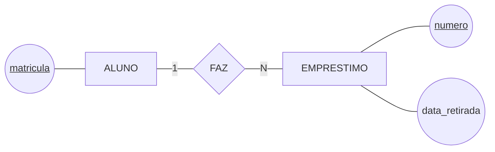

# Aula 05 — Projeto de Banco de Dados: Conceitual, Lógico e Físico

> 🎯 Objetivos: reconhecer as três representações de um mesmo banco de dados, dizer o que cada modelo decide e traduzir um fragmento conceitual em modelo lógico.
> 🎬 Slides da aula: [apresentacao-05-projeto-conceitual-logico-fisico.pdf](apresentacao/apresentacao-05-projeto-conceitual-logico-fisico.pdf)

## 1. O mesmo empréstimo, escrito três vezes

A biblioteca precisa registrar que a Ana pegou um livro no dia 2 de março. Um fato só. Veja como ele aparece em três documentos diferentes do mesmo projeto.

**Primeiro documento** — o desenho:



**Segundo documento** — as tabelas:

```
   ALUNO(matricula, nome)
   EMPRESTIMO(numero, data_retirada, matricula → ALUNO)
```

**Terceiro documento** — o detalhe de armazenamento:

```
   ALUNO.matricula ......... inteiro de 4 bytes, chave primária
   ALUNO.nome .............. texto de até 60 caracteres
   EMPRESTIMO.data_retirada  data, 3 bytes
   índice ................... por matrícula, para achar os empréstimos de um aluno
```

Os três falam do mesmo empréstimo. Mudou o **nível de detalhe** e mudou **quem precisa entender aquilo**: o primeiro você mostra ao bibliotecário, o terceiro só interessa a quem vai instalar o banco.

## 2. Projeto de banco de dados é um processo com etapas

**Projeto de banco de dados** é o trabalho de transformar uma necessidade descrita em português — o que você levantou na Aula 04 — em um banco de dados funcionando.

Ele tem **entrada** e **saída**, como todo processo: entra a lista de requisitos, sai o **esquema** do banco, que é a descrição da estrutura onde os dados vão morar.

Entre a entrada e a saída existem três modelos, e cada um é um documento que sobrevive ao projeto:

```
   REQUISITOS  ──▶  CONCEITUAL  ──▶   LÓGICO   ──▶   FÍSICO
   (Aula 04)          (o quê)       (como, no      (como, neste
                                     relacional)      SGBD)

   português         diagrama         tabelas        tipos, índices
                     de Chen        e chaves       e armazenamento
```

> 💡 Repare que a palavra "modelo" muda de sentido conforme o vizinho. **Modelo de dados** é a família — relacional, hierárquico, de rede, os da Aula 02. **Modelo conceitual, lógico e físico** são etapas do seu projeto. Um projeto relacional tem os três; um projeto hierárquico também teria.

## 3. O modelo conceitual — o que o mundo é

O **modelo conceitual** descreve a realidade que o banco vai guardar, **sem nenhum compromisso com tecnologia**. É o diagrama da seção 1: entidades, atributos e relacionamentos.

O que ele decide:

- **Quais coisas** existem no minimundo — `ALUNO`, `EMPRESTIMO`, `EXEMPLAR`;
- **O que se guarda** sobre cada uma;
- **Como elas se ligam**, e quantas de cada lado.

O que ele **não** decide, e é aqui que quase todo mundo escorrega na primeira vez:

| Isto **não** é decisão conceitual | Por quê |
|---|---|
| `matricula` é inteiro ou texto? | tipo de dado é decisão física |
| a tabela vai se chamar `tb_aluno`? | nome de tabela é decisão lógica; o conceitual tem entidades |
| vai precisar de índice para buscar por nome? | desempenho é decisão física |
| e se o banco for PostgreSQL? | o conceitual vale para qualquer SGBD, e até para nenhum |

> ⚠️ **O modelo conceitual é o único documento que o cliente consegue conferir.** O bibliotecário não sabe dizer se `matricula` deveria ser inteiro, mas sabe perfeitamente dizer se um empréstimo pode ter dois alunos. Levar tabela pronta para a reunião é desperdiçar a única revisão que pega erro de entendimento.

> 📖 O modelo conceitual e a notação entidade-relacionamento abrem o Heuser, e é a parte do livro que acompanha este bloco inteiro.

## 4. O modelo lógico — como isso vira tabela

O **modelo lógico** traduz o conceitual para a estrutura de um **modelo de dados** escolhido. Neste curso, sempre o relacional: tabelas, colunas e ligações por valor.

É a primeira vez que o projeto assume um compromisso — e é um compromisso grande, porque ele muda a forma do documento:

| No conceitual | Vira no lógico |
|---|---|
| Entidade | uma tabela |
| Atributo | uma coluna |
| Atributo que identifica | a chave primária |
| Relacionamento 1:N | uma coluna a mais no lado N, apontando para o outro |
| Relacionamento N:M | **uma tabela nova**, só para a ligação |

Foi o que aconteceu entre o primeiro e o segundo documento da seção 1: o losango `FAZ` **desapareceu** e virou a coluna `matricula` dentro de `EMPRESTIMO`. O relacionamento não some do mundo — ele muda de forma, porque tabela não tem losango.

> 💡 A regra do lado N tem uma razão prática de uma linha: **uma célula guarda um valor só**. Um empréstimo tem um aluno, então cabe. Um aluno tem vários empréstimos, então não caberia.

O N:M é o caso em que a tradução mais muda a cara do documento. Um autor escreve vários livros e um livro tem vários autores — e a ordem de assinatura só faz sentido para o par:

```
   NO CONCEITUAL                          NO LÓGICO

   AUTOR ---|N| ESCREVE ---|M| LIVRO      AUTOR(cpf, nome)
                   │                      LIVRO(isbn, titulo)
                   │                      ESCREVE(cpf → AUTOR,
            ordem_assinatura                       isbn → LIVRO,
                                                   ordem_assinatura)
```

Uma tabela que não existia no desenho apareceu, e o atributo do losango foi morar dentro dela. Não há para onde mais ele ir: `ordem_assinatura` muda a cada livro (então não é do autor) e a cada autor (então não é do livro).

As regras completas dessa tradução são a Aula 07. Por enquanto, o que importa é o mapa acima — e saber que a tradução **é mecânica**: modelos conceituais iguais produzem modelos lógicos iguais, e é por isso que vale gastar o tempo no primeiro.

## 5. O modelo físico — como isso vira arquivo

O **modelo físico** decide como o SGBD escolhido vai gravar aquilo em disco: o tipo exato de cada coluna, o tamanho, os índices que aceleram as buscas, a forma de armazenamento.

É o terceiro documento da seção 1. Três coisas o caracterizam:

- **Ele depende do SGBD.** O mesmo modelo lógico gera arquivos físicos diferentes no PostgreSQL e no Oracle;
- **É o único nível em que desempenho é assunto.** Antes disso, discutir velocidade é adivinhação;
- **É o mais fácil de mudar depois.** Criar um índice não altera o significado de nada — trocar uma entidade, sim.

Este curso **para no lógico**, de propósito. O físico exige escolher um SGBD, medir carga real e conhecer a linguagem de definição de dados — três assuntos que não cabem em 16 aulas e que só fazem sentido depois que o modelo está certo.

> ⚠️ **Índice não conserta modelo.** Um esquema com dado repetido em três tabelas continua se contradizendo depois de qualquer índice. A cura para modelo ruim é modelagem — a Aula 01 inteira é sobre isso.

## 6. Por que a ordem não se inverte

Os três níveis existem para separar decisões que envelhecem em velocidades diferentes:

| | Conceitual | Lógico | Físico |
|---|---|---|---|
| **Responde** | o que existe no mundo | como isso vira tabela | como isso vira arquivo |
| **Depende de** | nada além do minimundo | do modelo de dados escolhido | do SGBD escolhido |
| **Quem revisa** | o cliente e você | você | quem administra o banco |
| **Quando muda** | quando o negócio muda | quando o modelo conceitual muda | quando o desempenho exige |

A biblioteca vai trocar de SGBD algum dia. Quando trocar, o modelo físico é jogado fora, o lógico é revisto e **o conceitual continua valendo** — porque o que ele afirma é que um empréstimo pertence a um aluno, e isso não muda com a tecnologia.

> 💡 **Isso tem nome: independência de dados.** É a mesma ideia da camada única da Aula 01 — quanto mais alto o nível, menos ele sabe sobre a implementação, e mais tempo ele sobrevive. Você vai reencontrar o termo no Bloco 3.

Quem começa pelas tabelas inverte tudo isso: decide estrutura antes de entender o problema, e descobre o erro quando já existe dado gravado — o momento mais caro possível para descobrir.

> 💻 **Modelos desta aula:** [`tres-modelos.md`](exemplos/tres-modelos.md) — o mesmo fragmento da biblioteca nos três níveis, lado a lado.

## 🏋️ Exercícios da aula

Na pasta `aula-05/` do seu repositório:

1. **`ex01.md`** — classifique cada decisão abaixo em **conceitual**, **lógica** ou **física**, com uma linha de justificativa: (a) um empréstimo pertence a exatamente um aluno; (b) a coluna `titulo` aceita até 200 caracteres; (c) a ligação entre empréstimo e exemplar vira uma coluna na tabela de empréstimos; (d) existe um índice por data de retirada; (e) a biblioteca precisa guardar a editora de cada livro; (f) o relacionamento entre livro e autor vira uma tabela própria. *Confere assim: são duas de cada nível. Se a sua justificativa cita o nome de um SGBD, a decisão é física — sem exceção.*

2. **`ex02.md`** — dado o fragmento conceitual abaixo, escreva o **modelo lógico** correspondente, no formato `TABELA(coluna, coluna, ...)`, sublinhando a chave e marcando com `→` a coluna que aponta para outra tabela:

   ```
   EDITORA ---|1| PUBLICA{PUBLICA} ---|N| LIVRO
   EDITORA: cnpj (identifica), nome, cidade
   LIVRO:   isbn (identifica), titulo, ano
   ```

   *Confere assim: saem duas tabelas, e a coluna de ligação está em `LIVRO` — se ela ficou em `EDITORA`, releia o `> 💡` da seção 4 e pergunte quantos livros cabem numa célula.*

3. **`ex03.md`** — o estagiário entregou este "modelo conceitual" da sala de estudos: *"Tabela `tb_sala` com `id_sala` inteiro autoincremento, `capacidade` inteiro, `andar` char(2) e índice por andar. Cada sala é reservada por um aluno, e a reserva guarda `data_hora` no formato `timestamp`."* Aponte **tudo o que não pertence a um modelo conceitual**, dizendo a que nível cada coisa pertence, e reescreva o fragmento como modelo conceitual de verdade — em português, com entidades, atributos e relacionamento. *Confere assim: há pelo menos quatro invasões de outros níveis no texto dele, e o seu modelo reescrito não pode conter nenhuma palavra de tipo de dado.*

### 📤 Entrega

Estes exercícios são feitos em sala e vão para o **seu repositório** `exercicios-modelagem-dados`:

```bash
cd ..                 # da pasta da aula para a raiz do repositório
git add aula-05/
git commit -m "Resolve exercícios da aula 05"
git push
```

Confira no navegador que a pasta apareceu em `github.com/SEU-USUARIO/exercicios-modelagem-dados`.

## 🧠 Revisão

[8 questões de múltipla escolha](revisao/README.md) para conferir se os conceitos ficaram sólidos. Responda sem consultar a aula — depois volte e corrija.

---

⬅️ [Aula 04 — Requisitos, OLTP e OLAP](../../bloco-1-fundamentos-de-bancos-de-dados/aula-04-requisitos-oltp-e-olap/README.md) | ➡️ [Aula 06 — A Notação Gráfica e os Tipos de Entidade](../aula-06-notacao-e-tipos-de-entidade/README.md)
