<!-- _class: capa -->

🧭

# Projeto de BD: Conceitual, Lógico e Físico

## Aula 05 · Bloco 2 — Modelos de Banco de Dados

O mesmo empréstimo, escrito três vezes

---

## 🎯 Nesta aula

1. O mesmo fato em **três documentos**
2. Projeto de BD: um **processo com etapas**
3. O modelo **conceitual** — o que o mundo é
4. O modelo **lógico** — como isso vira tabela
5. O modelo **físico** — como isso vira arquivo
6. Por que a **ordem não se inverte**

---

## De onde viemos

Na **Aula 04** você levantou requisitos: quatro perguntas, quatro fontes, e uma lista de regras numeradas em português.

Agora essa lista vira **projeto** — e o projeto tem etapas com nome.

> 💡 A Ana pegou um livro no dia 2 de março. **Um fato só.** Veja como ele aparece em três documentos diferentes do mesmo projeto.

---

<!-- _class: diagrama -->

## Um fato só, três documentos

O primeiro você mostra **ao bibliotecário**. O terceiro só interessa **a quem vai instalar o banco**.

---

<!-- _class: diagrama -->

## O primeiro: o desenho

Entidades, atributos e a ligação entre elas. **Nenhum tipo de dado, nenhum nome de tabela, nenhum índice** — e é essa ausência que faz o bibliotecário conseguir conferir.

---

## O segundo e o terceiro

**As tabelas** — já com compromisso: existe o relacional, existem chaves, e o losango `FAZ` virou uma coluna dentro de `EMPRESTIMO`.

**O armazenamento** — `matricula` é inteiro de 4 bytes; `data_retirada` ocupa 3; há um índice por matrícula para achar os empréstimos de um aluno.

---

<!-- _class: lead -->

## Mudou o nível de detalhe

E mudou **quem precisa entender aquilo**.

Os três falam do mesmo empréstimo.
Nenhum deles é mais verdadeiro que os outros —
eles respondem a **perguntas diferentes**.

---

<!-- _class: diagrama -->

## Projeto de BD é um processo com etapas

**Entra** a lista de requisitos. **Sai** o esquema do banco — a descrição da estrutura onde os dados vão morar.

---

## 💡 "Modelo" muda de sentido conforme o vizinho

**Modelo de dados** é a **família**: relacional, hierárquico, de rede — os da Aula 02.

**Modelo conceitual, lógico e físico** são **etapas do seu projeto**.

Um projeto relacional tem os três. Um projeto hierárquico também teria.

---

## O modelo conceitual — o que o mundo é

Ele descreve a realidade que o banco vai guardar, **sem nenhum compromisso com tecnologia**.

O que ele decide:

- **Quais coisas** existem no minimundo;
- **O que se guarda** sobre cada uma;
- **Como elas se ligam**, e quantas de cada lado.

---

<!-- _class: tabela-densa -->

## E o que ele **não** decide

| Isto **não** é decisão conceitual | Por quê |
|---|---|
| `matricula` é inteiro ou texto? | tipo de dado é decisão **física** |
| a tabela vai se chamar `tb_aluno`? | nome de tabela é decisão **lógica** |
| precisa de índice para buscar por nome? | desempenho é decisão **física** |
| e se o banco for PostgreSQL? | o conceitual vale para **qualquer** SGBD |

É aqui que quase todo mundo escorrega na primeira vez.

---

## ⚠️ O único documento que o cliente confere

O bibliotecário **não sabe** dizer se `matricula` deveria ser inteiro.

Mas sabe perfeitamente dizer se um empréstimo pode ter **dois alunos**.

Levar tabela pronta para a reunião é **desperdiçar a única revisão que pega erro de entendimento** — e erro de entendimento é o mais caro de todos.

---

## O modelo lógico — como isso vira tabela

Ele traduz o conceitual para a estrutura de um **modelo de dados** escolhido. Neste curso, sempre o **relacional**.

É a primeira vez que o projeto assume um compromisso — e é um compromisso grande, porque **muda a forma do documento**.

---

<!-- _class: tabela-densa -->

## A tradução, item por item

| No conceitual | Vira no lógico |
|---|---|
| Entidade | uma **tabela** |
| Atributo | uma **coluna** |
| Atributo que identifica | a **chave primária** |
| Relacionamento 1:N | uma **coluna a mais** no lado N |
| Relacionamento N:M | uma **tabela nova**, só para a ligação |

As regras completas são a **Aula 07**. Por enquanto, o mapa.

---

<!-- _class: diagrama -->

## O losango desaparece

O relacionamento **não some do mundo** — ele muda de forma, porque tabela não tem losango.

---

## 💡 Por que a coluna vai para o lado N

A regra tem uma razão prática de uma linha:

**Uma célula guarda um valor só.**

Um empréstimo tem **um** aluno, então cabe.

Um aluno tem **vários** empréstimos, então não caberia.

---

<!-- _class: diagrama -->

## O N:M muda a cara do documento

Uma tabela que **não existia no desenho** apareceu — e o atributo do losango foi morar dentro dela. Não há para onde mais ele ir.

---

<!-- _class: lead -->

## A tradução é mecânica

Modelos conceituais iguais
produzem modelos lógicos iguais.

**E é exatamente por isso
que vale gastar o tempo no primeiro.**

---

## O modelo físico — como isso vira arquivo

Ele decide como o SGBD escolhido vai gravar aquilo em disco: o tipo exato de cada coluna, o tamanho, os índices, a forma de armazenamento.

Três coisas o caracterizam:

- **Depende do SGBD** — o mesmo lógico gera arquivos diferentes no PostgreSQL e no Oracle;
- **É o único nível em que desempenho é assunto** — antes disso, discutir velocidade é adivinhação;
- **É o mais fácil de mudar depois** — criar um índice não altera o significado de nada.

---

## ⚠️ Índice não conserta modelo

Um esquema com dado repetido em três tabelas **continua se contradizendo** depois de qualquer índice.

A cura para modelo ruim é **modelagem** — a Aula 01 inteira é sobre isso.

---

## Este curso para no lógico

E para **de propósito**.

O físico exige escolher um SGBD, medir carga real e conhecer a linguagem de definição de dados.

São três assuntos que não cabem em 16 aulas — e que **só fazem sentido depois que o modelo está certo**.

---

<!-- _class: tabela-densa -->

## Por que a ordem não se inverte

| | Conceitual | Lógico | Físico |
|---|---|---|---|
| **Responde** | o que existe no mundo | como isso vira tabela | como isso vira arquivo |
| **Depende de** | nada além do minimundo | do modelo de dados | do SGBD |
| **Quem revisa** | o cliente e você | você | quem administra o banco |
| **Quando muda** | quando o negócio muda | quando o conceitual muda | quando o desempenho exige |

Os três níveis existem para **separar decisões que envelhecem em velocidades diferentes**.

---

<!-- _class: diagrama -->

## O que sobrevive a uma troca de SGBD

O conceitual continua valendo porque o que ele afirma é que **um empréstimo pertence a um aluno** — e isso não muda com a tecnologia.

---

## 💡 Isso tem nome: independência de dados

É a mesma ideia da camada única da Aula 01.

**Quanto mais alto o nível, menos ele sabe sobre a implementação — e mais tempo ele sobrevive.**

Você vai reencontrar o termo no Bloco 3.

---

## ⚠️ Quem começa pelas tabelas inverte tudo

Decide **estrutura** antes de entender o **problema**.

E descobre o erro quando **já existe dado gravado** — o momento mais caro possível para descobrir.

---

<!-- _class: checkpoint -->

## 🏋️ Exercícios da aula

Na pasta `aula-05/`:

1. **`ex01.md`** — classifique seis decisões em **conceitual, lógica ou física**, com uma linha de justificativa cada;
2. **`ex02.md`** — dado um fragmento conceitual, escreva o **modelo lógico**, sublinhando a chave e marcando as ligações com `→`;
3. **`ex03.md`** — o "modelo conceitual" do estagiário está cheio de **invasões de outros níveis**. Aponte todas e reescreva.

---

<!-- _class: lead -->

## ➡️ Próxima aula

**Aula 06 — A notação gráfica e os tipos de entidade**

Você vai **desenhar** o conceitual:
três formas para três conceitos,
e a armadilha do lado que derruba todo mundo.
