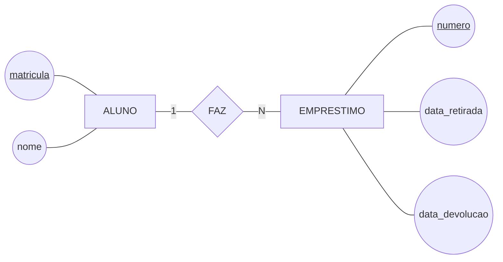

# Um fragmento da biblioteca nos três níveis

O mesmo pedaço do mundo — *o aluno faz empréstimos* — escrito como modelo conceitual, lógico e físico. Use este arquivo como referência de formato no `ex02`.

## 1. Modelo conceitual



**O que este diagrama afirma sobre o mundo.** Todo aluno é identificado pela matrícula. Todo empréstimo é identificado por um número próprio e pertence a **exatamente um** aluno; um mesmo aluno pode ter **vários** empréstimos, simultâneos ou ao longo do tempo. As duas datas pertencem ao empréstimo, não ao aluno — é o empréstimo que é retirado e devolvido.

Não há uma palavra sobre tipo de dado, tamanho de campo ou SGBD, e isso é proposital: este é o documento que o bibliotecário consegue conferir.

## 2. Modelo lógico

```
   ALUNO(matricula, nome)
   EMPRESTIMO(numero, data_retirada, data_devolucao, matricula → ALUNO)
```

A chave primária vem primeiro; `→` marca a coluna que aponta para a chave de outra tabela.

**O que mudou.** O losango `FAZ` desapareceu: virou a coluna `matricula` dentro de `EMPRESTIMO`. Ela está do lado **N** porque um empréstimo tem um aluno só, e um valor só cabe numa célula. A informação continua toda lá — mudou a forma, porque tabela não tem losango.

## 3. Modelo físico

```
   ALUNO
     matricula ......... inteiro de 4 bytes · chave primária
     nome .............. texto variável, até 60 caracteres

   EMPRESTIMO
     numero ............ inteiro de 4 bytes · chave primária
     data_retirada ..... data · não aceita vazio
     data_devolucao .... data · aceita vazio (empréstimo em aberto)
     matricula ......... inteiro de 4 bytes · aponta para ALUNO

   índice em EMPRESTIMO.matricula — para listar os empréstimos de um aluno
                                    sem varrer a tabela inteira
```

**O que mudou.** Nada sobre o mundo: apareceram decisões de armazenamento. Elas dependem do SGBD escolhido e são as mais fáceis de rever depois — criar ou remover um índice não altera o significado de nada.

> ⚠️ O `data_devolucao` que "aceita vazio" é a única linha desta página que carrega uma regra de negócio: empréstimo em aberto ainda não tem devolução. Repare que ela **também** estava no conceitual, na forma de um atributo opcional — quando uma regra só aparece no nível físico, ela foi descoberta tarde demais.

---

⬅️ [Voltar à Aula 05](../README.md)
