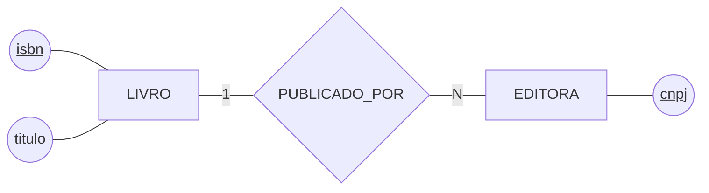
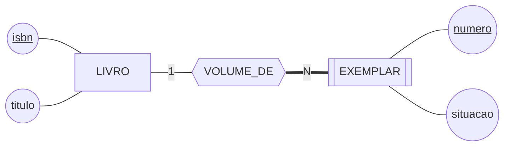
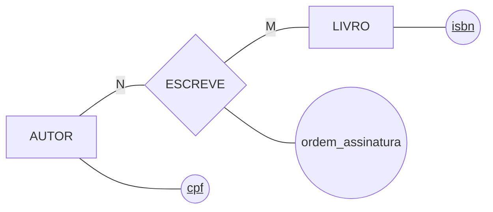
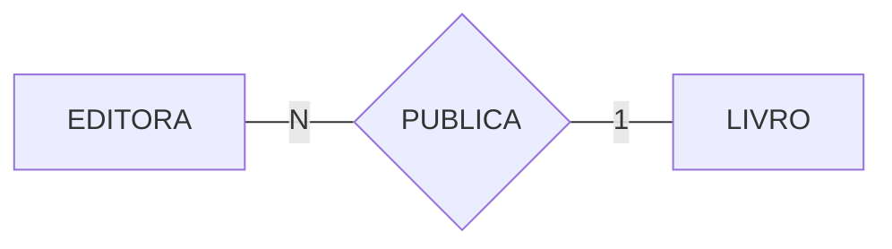
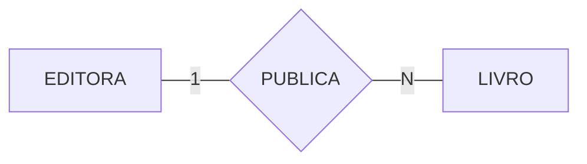
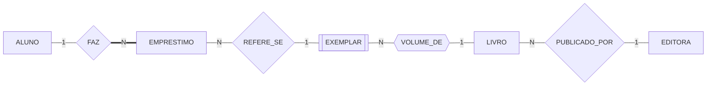

# Aula 06 — A Notação Gráfica e os Tipos de Entidade

> 🎯 Objetivos: ler um DER na notação de Chen, distinguir entidade forte de entidade fraca e escrever cardinalidade e participação sem trocar o lado.
> 🎬 Slides da aula: [apresentacao-06-notacao-e-tipos-de-entidade.pdf](apresentacao/apresentacao-06-notacao-e-tipos-de-entidade.pdf)

## 1. O diagrama diz o tipo antes de você ler o nome

Olhe o desenho abaixo por três segundos, sem ler nenhuma palavra:



Você já sabe que há **duas coisas** no mundo (os retângulos), **uma ligação** entre elas (o losango) e **três características** penduradas (as elipses). Isso é a notação gráfica funcionando: forma geométrica primeiro, nome depois.

São três formas para três conceitos, e a tabela completa — com entidade fraca, atributo multivalorado, derivado e os cinco tropeços de sintaxe — está no guia do curso: **[Desenhando o DER na notação de Chen](../../recursos/notacoes-der.md)**. Deixe-o aberto ao lado desta aula.

> ⚠️ **O diagrama não é o modelo inteiro.** Ele mostra a estrutura; as regras que não têm símbolo — "o prazo é de quinze dias" — ficam na lista de regras da Aula 04. Todo DER deste curso vem acompanhado de um parágrafo em português dizendo o que ele afirma sobre o mundo.

## 2. Entidade forte e entidade fraca

Um `LIVRO` se identifica sozinho: o ISBN basta. Ele é uma **entidade forte**.

Agora repare numa distinção que a biblioteca faz todo dia e que quase todo modelo iniciante perde: *"Banco de Dados"* é uma **obra** — a biblioteca tem **quatro cópias físicas** dela na estante, e é uma cópia específica que o aluno leva para casa.

Essas cópias são numeradas 1, 2, 3, 4 **dentro de cada livro**. Não existe "o exemplar 3" sem dizer de qual obra. Uma coisa assim se chama **entidade fraca**: ela não consegue se identificar sozinha.



Três coisas para reparar no desenho, e as três são a notação da entidade fraca:

- **`EXEMPLAR` tem retângulo duplo** — é a marca da entidade fraca;
- **O losango é duplo** (hexágono, no Mermaid): é o **relacionamento identificador**, o que empresta identidade. Não é uma ligação qualquer, é a que completa a chave;
- **A linha do lado do exemplar é dupla** — participação total, assunto da seção 5: exemplar nenhum existe fora dessa ligação.

O `numero` do exemplar é uma **chave parcial**: ele só distingue **dentro** da obra. A identificação completa é o par `(isbn, numero)`, e é isso que vai virar chave primária composta no modelo lógico, na Aula 07.

> ⚠️ **Vínculo obrigatório não é o mesmo que fraqueza.** Um `EMPRESTIMO` exige um aluno, mas tem número próprio e único — ele se identifica sozinho, então é forte. O teste está no [catálogo de erros](../../recursos/erros-comuns.md): **tire a entidade dona e pergunte se a chave ainda identifica.** Se ainda identifica, a entidade é forte, por mais obrigatório que o vínculo seja.

> 📖 Entidade fraca, relacionamento identificador e chave parcial estão no capítulo de modelo conceitual do Heuser, que usa a expressão *"entidade dependente"* para a mesma ideia.

## 3. O relacionamento e o que mora dentro dele

**Relacionamento** é a associação entre entidades. O número de entidades que ele liga é o seu **grau**: binário quando liga duas, ternário quando liga três. Neste curso, **todos são binários** — ternário fica de fora, e quase todo caso que parece ternário é uma agregação, assunto da Aula 08.

Um relacionamento pode ter **atributos próprios**, e essa é a parte que costuma passar despercebida. Volte à Aula 03: `autores` era um atributo multivalorado de `LIVRO`. Só que a biblioteca precisa saber **a ordem em que os autores assinam** a obra — o primeiro autor é quem aparece na ficha catalográfica.

Onde guardar a ordem? Ela não é do livro (muda a cada autor) nem do autor (muda a cada livro). Ela é **da ligação entre os dois**:



> 💡 **Atributo pendurado no losango é a assinatura de um N:M.** Sempre que um dado só faz sentido para o par — a quantidade de um produto num pedido, a data de inscrição de um atleta numa competição, a ordem de um autor num livro —, ele mora no relacionamento. Se você não encontra onde pôr um dado, provavelmente ele é de uma ligação que você ainda não desenhou.

## 4. Cardinalidade: quantos de cada lado

**Cardinalidade** é quantas ocorrências de uma entidade participam do relacionamento. O número fica na linha, entre o retângulo e o losango:

| Escreve-se | Lê-se em voz alta | Exemplo na biblioteca |
|---|---|---|
| `1` de um lado, `1` do outro | um para um | um exemplar ocupa uma posição na estante |
| `1` de um lado, `N` do outro | um para muitos | uma editora publica muitos livros |
| `N` de um lado, `M` do outro | muitos para muitos | muitos autores escrevem muitos livros |

O 1:N é o caso mais comum de todos. O 1:1 é raro e merece desconfiança — se duas entidades andam sempre juntas e uma nunca existe sem a outra, muitas vezes são **uma entidade só**, partida sem necessidade.

> ⚠️ **A armadilha do lado, que derruba todo mundo na primeira vez.** Em Chen, o número encostado em `EDITORA` diz **quantas editoras** entram na ligação, não quantos livros a editora publica. Leia sempre a frase inteira: *"uma editora publica N livros"* — o `1` fica do lado da editora e o `N` do lado do livro.

Os dois desenhos abaixo têm os mesmos elementos e afirmam coisas opostas. Este está **errado** para a biblioteca:



Ele diz: *"N editoras publicam 1 livro"* — cada obra teria várias editoras, e cada editora publicaria uma obra só. E este está **certo**:



*"Uma editora publica N livros."* Mudou só a posição de dois caracteres, e mudou o mundo inteiro que o modelo descreve.

O jeito seguro de decidir, e que acaba com qualquer discussão em dez segundos, é o das **duas perguntas separadas**, uma de cada lado:

```
   "Um livro pode ter vários autores?"      → sim  ─┐
                                                    ├─▶  N:M
   "Um autor pode ter vários livros?"       → sim  ─┘

   "Um livro pode ter várias editoras?"     → não  ─┐
                                                    ├─▶  1:N
   "Uma editora pode ter vários livros?"    → sim  ─┘
```

## 5. Participação: pode zero?

Cardinalidade responde *"quantos, no máximo?"*. Falta a outra pergunta da Aula 04, que é **independente** dela: *"pode zero?"*

- **Participação parcial** — a ocorrência pode existir sem participar. Um aluno recém-matriculado ainda não pegou nenhum livro, e nem por isso deixa de ser aluno. Linha simples;
- **Participação total** — a ocorrência **não existe** fora do relacionamento. Todo exemplar é exemplar de alguma obra. Linha dupla, `===`.

São dois eixos, e é por isso que cada lado de cada relacionamento tem **duas** respostas:

| | Quantos? | Pode zero? | Como fica no desenho |
|---|:---:|:---:|---|
| Lado `EXEMPLAR` de `VOLUME_DE` | N | não | `N` e linha **dupla** |
| Lado `LIVRO` de `VOLUME_DE` | 1 | sim, obra sem exemplar comprado | `1` e linha simples |
| Lado `EMPRESTIMO` de `FAZ` | N | não | `N` e linha **dupla** |
| Lado `ALUNO` de `FAZ` | 1 | sim, aluno sem empréstimo | `1` e linha simples |

> 💡 As duas respostas servem a coisas diferentes lá na frente: **"quantos" decide de que lado a ligação vira coluna**, e **"pode zero" decide se essa coluna aceita ficar vazia**. Misturar as duas numa resposta só, do tipo "1:N obrigatório", perde metade da informação — é o erro que o catálogo chama de *"quantos e é obrigatório são duas perguntas"*.

## 6. O DER da biblioteca até aqui

Juntando as decisões das seções anteriores:



Lido em voz alta, linha por linha — e é assim que se confere um modelo:

- um aluno faz vários empréstimos; **todo empréstimo tem exatamente um aluno**, e por isso a linha do lado do empréstimo é dupla;
- vários empréstimos podem se referir, ao longo do tempo, ao mesmo exemplar; cada empréstimo trata de **um** exemplar;
- todo exemplar é volume de exatamente uma obra;
- toda obra é publicada por uma editora, e uma editora publica várias.

> ⚠️ Este diagrama **ainda afirma uma coisa falsa**: que o mesmo exemplar pode estar em dois empréstimos em aberto ao mesmo tempo. Nada no desenho impede. Regra de tempo não cabe no DER — ela vai para a lista de regras de negócio, em texto, e é exatamente o tipo de coisa que a leitura em voz alta revela.

> 💻 **Modelos desta aula:** [`der-biblioteca-parcial.md`](exemplos/der-biblioteca-parcial.md) — o diagrama acima com os atributos e o parágrafo de justificativa.

## 🏋️ Exercícios da aula

Na pasta `aula-06/` do seu repositório:

1. **`ex01.md`** — leia o DER da seção 6 e escreva **oito frases em português**, duas para cada relacionamento, uma em cada direção (por exemplo: *"um aluno faz vários empréstimos"* e *"um empréstimo pertence a um aluno"*). Marque com ⭐ as frases em que a participação é **total**. *Confere assim: são duas frases marcadas, e as duas falam do lado que tem linha dupla no desenho.*

2. **`ex02.md`** — o estagiário desenhou a sala de estudos assim: `SALA` é entidade fraca de `ANDAR`, com relacionamento identificador; e `ALUNO ---|1| RESERVA{RESERVA} ---|N| SALA`. Sabendo que **toda sala tem um código único no prédio inteiro** (S-101, S-204) e que **um aluno faz várias reservas e uma sala é reservada por vários alunos**, aponte os **dois erros** do modelo dele e escreva a correção de cada um em uma linha. *Confere assim: um erro é de tipo de entidade e o outro é de cardinalidade — se você achou dois erros do mesmo tipo, falta um.*

3. **`ex03.md`** — desenhe em Mermaid, na notação de Chen, o fragmento da **reserva de salas**: uma sala tem código, capacidade e andar; um aluno reserva salas para uma data e um horário; uma reserva é sempre de um aluno e de uma sala. Ponha a **cardinalidade** nos quatro lados, a **participação total** onde ela existir e o atributo `data_hora` no lugar certo. Abaixo, escreva o parágrafo em português dizendo o que o diagrama afirma. *Confere assim: `data_hora` tem que estar pendurado no losango — se ele coube dentro de `SALA` ou de `ALUNO`, releia a seção 3. E abra o preview do GitHub: bloco que aparece como código cru tem erro de sintaxe.*

## 🧠 Revisão

[8 questões de múltipla escolha](revisao/README.md) para conferir se os conceitos ficaram sólidos. Responda sem consultar a aula — depois volte e corrija.

## ✅ Entrega

```bash
git add aula-06/
git commit -m "Resolve exercícios da aula 06 (notação e tipos de entidade)"
git push
```

---

⬅️ [Aula 05 — Projeto de Banco de Dados: Conceitual, Lógico e Físico](../aula-05-projeto-conceitual-logico-fisico/README.md) | ➡️ [Aula 07 — Do Relacional à Integridade Referencial](../aula-07-relacional-e-integridade/README.md)
