# Aula 06 — A Notação Gráfica e os Tipos de Entidade

> 🎯 Objetivos: ler um DER na notação de Chen, distinguir entidade forte de entidade fraca, escolher entre 1:1, 1:N e N:M sem trocar o lado do número e desenhar um autorrelacionamento com os dois papéis nomeados.
> 🎬 Slides da aula: [apresentacao-06-notacao-e-tipos-de-entidade.pdf](apresentacao/apresentacao-06-notacao-e-tipos-de-entidade.pdf)

## 1. O diagrama diz o tipo antes de você ler o nome

Olhe o desenho abaixo por três segundos, sem ler nenhuma palavra:

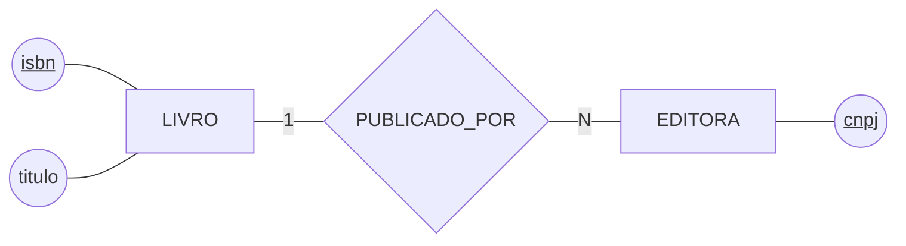

Você já sabe que há **duas coisas** no mundo (os retângulos), **uma ligação** entre elas (o losango) e **três características** penduradas (as elipses). Isso é a notação gráfica funcionando: forma geométrica primeiro, nome depois.

São três formas para três conceitos, e a tabela completa — com entidade fraca, atributo multivalorado, derivado e os cinco tropeços de sintaxe — está no guia do curso: **[Desenhando o DER na notação de Chen](../../recursos/notacoes-der.md)**. Deixe-o aberto ao lado desta aula.

> ⚠️ **O diagrama não é o modelo inteiro.** Ele mostra a estrutura; as regras que não têm símbolo — "o prazo é de quinze dias" — ficam na lista de regras da Aula 04. Todo DER deste curso vem acompanhado de um parágrafo em português dizendo o que ele afirma sobre o mundo.

## 2. Entidade forte e entidade fraca

Um `LIVRO` se identifica sozinho: o ISBN basta. Ele é uma **entidade forte**.

Agora repare numa distinção que a biblioteca faz todo dia e que quase todo modelo iniciante perde: *"Banco de Dados"* é uma **obra** — a biblioteca tem **quatro cópias físicas** dela na estante, e é uma cópia específica que o aluno leva para casa.

Essas cópias são numeradas 1, 2, 3, 4 **dentro de cada livro**. Não existe "o exemplar 3" sem dizer de qual obra. Uma coisa assim se chama **entidade fraca**: ela não consegue se identificar sozinha.

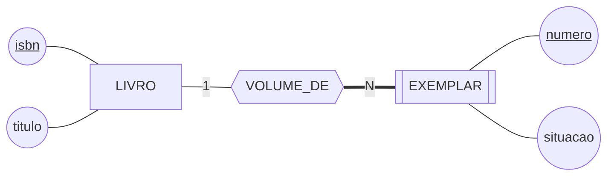

Três coisas para reparar no desenho, e as três são a notação da entidade fraca:

- **`EXEMPLAR` tem retângulo duplo** — é a marca da entidade fraca;
- **O losango é duplo** (hexágono, no Mermaid): é o **relacionamento identificador**, o que empresta identidade. Não é uma ligação qualquer, é a que completa a chave;
- **A linha do lado do exemplar é dupla** — participação total, assunto da seção 5: exemplar nenhum existe fora dessa ligação.

O `numero` do exemplar é uma **chave parcial**: ele só distingue **dentro** da obra. A identificação completa é o par `(isbn, numero)`, e é isso que vai virar chave primária composta no modelo lógico, na Aula 07.

> ⚠️ **Vínculo obrigatório não é o mesmo que fraqueza.** Um `EMPRESTIMO` exige um aluno, mas tem número próprio e único — ele se identifica sozinho, então é forte. O teste está no [catálogo de erros](../../recursos/erros-comuns.md): **tire a entidade dona e pergunte se a chave ainda identifica.** Se ainda identifica, a entidade é forte, por mais obrigatório que o vínculo seja.

> 📖 Entidade fraca, relacionamento identificador e chave parcial estão no capítulo de modelo conceitual do Heuser, que usa a expressão *"entidade dependente"* para a mesma ideia.

### ✏️ Tente você

A biblioteca passou a controlar as **doações**: cada doação recebe um número de protocolo único no sistema, e registra a data e quem doou. Uma doação traz uma ou mais obras.

`DOACAO` é entidade forte ou fraca?

<details>
<summary>Resposta</summary>

**Forte.** Ela tem protocolo próprio e único — tire o doador do modelo e o protocolo continua identificando a doação.

O que engana aqui é o vínculo obrigatório: toda doação tem um doador. Mas obrigatório e fraco são coisas diferentes, e o teste é sempre o mesmo — **tire a entidade dona e pergunte se a chave ainda identifica.**
</details>

## 3. O relacionamento e o que mora dentro dele

**Relacionamento** é a associação entre entidades. O número de entidades que ele liga é o seu **grau**: binário quando liga duas, ternário quando liga três. Neste curso, **todos são binários** — ternário fica de fora, e quase todo caso que parece ternário é uma agregação, assunto da Aula 08.

Um relacionamento pode ter **atributos próprios**, e essa é a parte que costuma passar despercebida. Volte à Aula 03: `autores` era um atributo multivalorado de `LIVRO`. Só que a biblioteca precisa saber **a ordem em que os autores assinam** a obra — o primeiro autor é quem aparece na ficha catalográfica.

Onde guardar a ordem? Ela não é do livro (muda a cada autor) nem do autor (muda a cada livro). Ela é **da ligação entre os dois**:

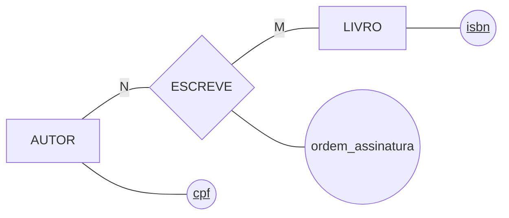

> 💡 **Atributo pendurado no losango é a assinatura de um N:M.** Sempre que um dado só faz sentido para o par — a quantidade de um produto num pedido, a data de inscrição de um atleta numa competição, a ordem de um autor num livro —, ele mora no relacionamento. Se você não encontra onde pôr um dado, provavelmente ele é de uma ligação que você ainda não desenhou.

### ✏️ Tente você

A biblioteca quer registrar quantas **estrelas** o aluno deu a cada oficina de pesquisa que cursou, de 1 a 5.

Onde essa informação mora no modelo?

<details>
<summary>Resposta</summary>

No **losango**, pendurada no relacionamento entre `ALUNO` e `OFICINA`.

Ela não é do aluno — o mesmo aluno dá estrelas diferentes a oficinas diferentes. E não é da oficina — a mesma oficina recebe estrelas diferentes de alunos diferentes. Ela só existe para o **par**.
</details>

## 4. Cardinalidade: quantos de cada lado

**Cardinalidade** é quantas ocorrências de uma entidade participam do relacionamento. O número fica na linha, entre o retângulo e o losango:

> ⚠️ **A armadilha do lado, que derruba todo mundo na primeira vez.** Em Chen, **o número fica junto da entidade que ele conta.** O `N` encostado em `LIVRO` diz *"N livros"* — não *"a editora publica N"*.

```
   [EDITORA] ──1── {PUBLICA} ──N── [LIVRO]
    ↑                               ↑
    └─ "1 editora"                  └─ "N livros"
```

Cubra o resto do desenho com o dedo e leia só um número com a entidade colada nele. Depois junte as duas pontas numa frase: *"uma editora publica N livros"*. É esse par de leituras que decide o desenho — e é a mesma checagem que serve para qualquer diagrama que você receber pronto.

Os dois desenhos abaixo têm os mesmos elementos e afirmam coisas opostas. Este está **errado** para a biblioteca:

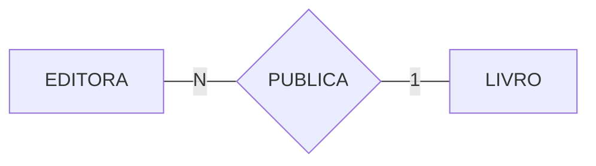

Ele diz: *"N editoras publicam 1 livro"* — cada obra teria várias editoras, e cada editora publicaria uma obra só. E este está **certo**:

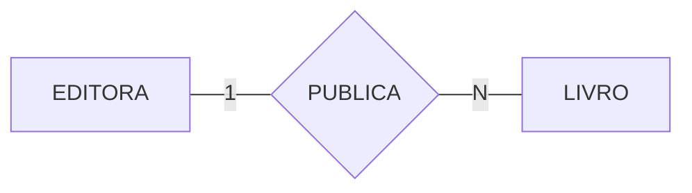

*"Uma editora publica N livros."* Mudou só a posição de dois caracteres, e mudou o mundo inteiro que o modelo descreve.

O jeito seguro de decidir, e que acaba com qualquer discussão em dez segundos, é o das **duas perguntas separadas**, uma de cada lado:

```
   "Um livro pode ter vários autores?"      → sim  ─┐
                                                    ├─▶  N:M
   "Um autor pode ter vários livros?"       → sim  ─┘

   "Um livro pode ter várias editoras?"     → não  ─┐
                                                    ├─▶  1:N
   "Uma editora pode ter vários livros?"    → sim  ─┘
```

São **três** respostas possíveis para esse par de perguntas, e cada uma é um tipo de relacionamento. Vale ver os três um por um — eles se parecem no desenho e se comportam de formas bem diferentes na hora de virar tabela.

### 1:N — o mais comum de todos

Um lado responde "não", o outro responde "sim". É o caso da editora: um livro tem uma editora só, uma editora tem vários livros.


A maioria esmagadora dos relacionamentos de um modelo é 1:N. Na Aula 07 você vai ver por quê ele é também o mais simples de traduzir: vira **uma coluna a mais** no lado N.

### N:M — quando os dois lados respondem "sim"

Um autor escreve vários livros e um livro tem vários autores. É o `ESCREVE` da seção 3 — e repare que as letras são **diferentes**, `N` e `M`, porque as duas quantidades não têm relação uma com a outra.

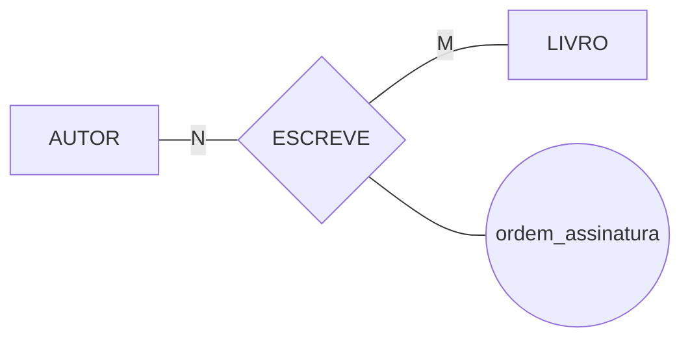

O N:M é o tipo que carrega atributo com mais frequência, e por um motivo estrutural: o dado que pertence ao par não tem outro lugar para morar.

### 1:1 — o tipo que pede desconfiança

Os dois lados respondem "não". Um aluno tem uma carteirinha, e cada carteirinha é de um aluno:

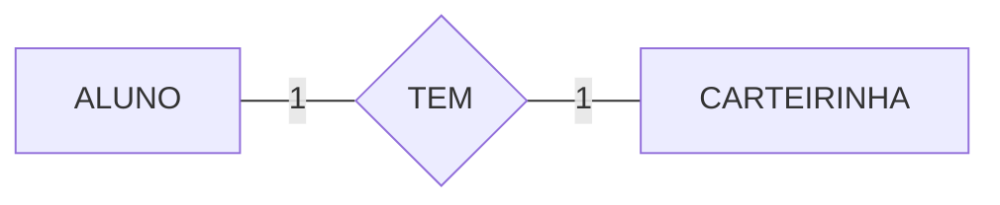

E é aqui que vale parar, porque **o 1:1 quase sempre denuncia uma entidade partida sem necessidade.** Se a carteirinha só guarda um número e uma foto, ela não é uma coisa do mundo — é um par de atributos do aluno, e o desenho certo é este:

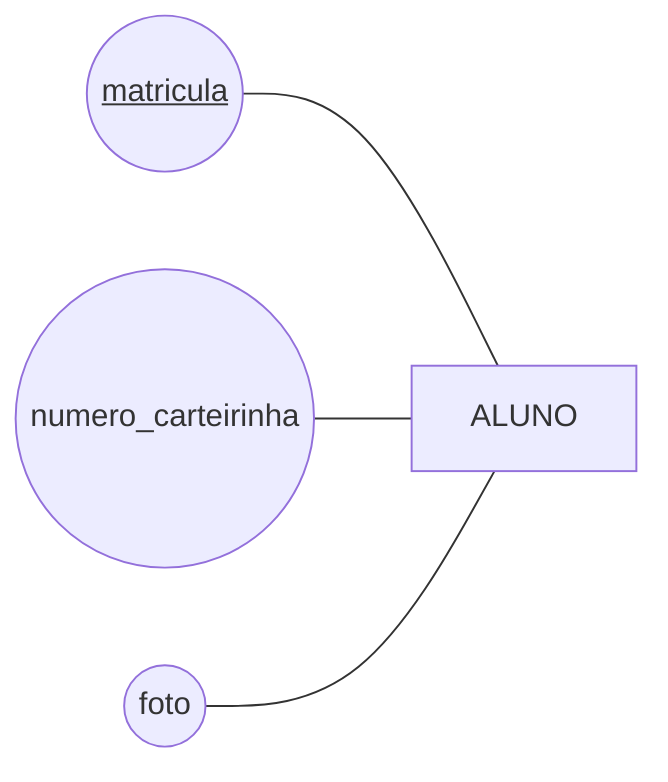

O que faria a carteirinha merecer a caixa é ter **vida própria**. E na biblioteca ela tem: a carteirinha é emitida numa data, vence, e a segunda via é uma carteirinha **nova** — mesmo aluno, outro número, outra validade. O aluno acumula carteirinhas ao longo do curso, e o balcão precisa saber qual está valendo.

Repare no que aconteceu com o desenho quando essa regra entrou:

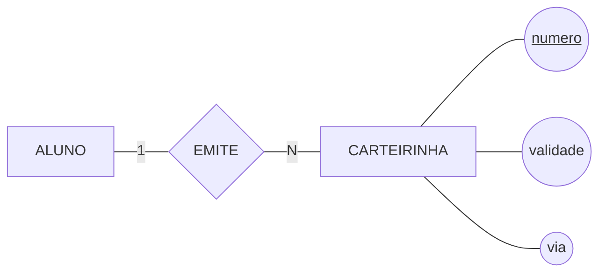

**Deixou de ser 1:1.** A regra que justificou separar as duas entidades é a mesma que transformou o relacionamento em 1:N — e isso não é coincidência: o que dá vida própria a uma entidade costuma ser exatamente o que faz aparecer mais de uma.

> ⚠️ **O teste do 1:1, em três perguntas:** *alguém referencia uma sem a outra? uma existe antes da outra? a segunda tem atributos próprios que importam?* **Três "não" e é uma entidade só** — os atributos da segunda viram colunas da primeira. Está no [catálogo de erros](../../recursos/erros-comuns.md).

### ✏️ Tente você

A bibliotecária descreve o depósito do acervo raro: *"cada obra rara fica guardada numa caixa-arquivo, e cada caixa guarda uma obra só."*

Que tipo de relacionamento é esse, e o que você perguntaria antes de desenhá-lo?

<details>
<summary>Resposta</summary>

É **1:1** — as duas perguntas dão "não".

E é justamente por isso que ele pede uma pergunta a mais, a do teste acima: *a caixa-arquivo tem alguma coisa que valha uma entidade?* Se ela só tem um código, é atributo de `OBRA` — `codigo_caixa` — e não existe relacionamento nenhum. Se ela tem localização, condição de conservação e histórico de troca, aí é entidade.

**A resposta não está no desenho, está no minimundo.** Só a bibliotecária sabe.
</details>

## 5. Participação: pode zero?

Cardinalidade responde *"quantos, no máximo?"*. Falta a outra pergunta da Aula 04, que é **independente** dela: *"pode zero?"*

- **Participação parcial** — a ocorrência pode existir sem participar. Um aluno recém-matriculado ainda não pegou nenhum livro, e nem por isso deixa de ser aluno. Linha simples;
- **Participação total** — a ocorrência **não existe** fora do relacionamento. Todo exemplar é exemplar de alguma obra. Linha dupla, `===`.

São dois eixos, e é por isso que cada lado de cada relacionamento tem **duas** respostas:

| | Quantos? | Pode zero? | Como fica no desenho |
|---|:---:|:---:|---|
| Lado `EXEMPLAR` de `VOLUME_DE` | N | não | `N` e linha **dupla** |
| Lado `LIVRO` de `VOLUME_DE` | 1 | sim, obra sem exemplar comprado | `1` e linha simples |
| Lado `EMPRESTIMO` de `FAZ` | N | não | `N` e linha **dupla** |
| Lado `ALUNO` de `FAZ` | 1 | sim, aluno sem empréstimo | `1` e linha simples |

> 💡 As duas respostas servem a coisas diferentes lá na frente: **"quantos" decide de que lado a ligação vira coluna**, e **"pode zero" decide se essa coluna aceita ficar vazia**. Misturar as duas numa resposta só, do tipo "1:N obrigatório", perde metade da informação — é o erro que o catálogo chama de *"quantos e é obrigatório são duas perguntas"*.

### ✏️ Tente você

Duas frases do balcão:

1. *"Todo exemplar pertence a uma obra do acervo."*
2. *"Nem toda obra do acervo tem exemplar — algumas estão só no catálogo, aguardando compra."*

Como cada uma aparece no desenho do `VOLUME_DE`?

<details>
<summary>Resposta</summary>

A primeira é **participação total** do lado do `EXEMPLAR`: linha dupla, `===`.

A segunda é **participação parcial** do lado do `LIVRO`: linha simples.

Repare que nenhuma das duas fala de *quantos* — as duas falam de *pode zero*. É o segundo eixo, e ele se decide separado.
</details>

## 6. O relacionamento de uma entidade com ela mesma

A biblioteca tem funcionários, e alguns supervisionam outros. A primeira tentativa costuma ser esta:

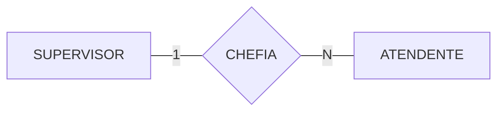

Duas caixas, e o modelo parece resolvido. Ele não está.

Repare no que se repete: supervisor tem matrícula, nome, ramal e data de admissão — e atendente também, porque **supervisor é funcionário**. Os mesmos atributos, desenhados duas vezes. E o modelo quebra no dia da primeira promoção: o registro teria de sair de uma caixa e entrar na outra, arrastando o histórico junto.

**Autorrelacionamento** é o relacionamento de uma entidade **com ela mesma**. Uma caixa só, e duas linhas saindo dela para o mesmo losango:

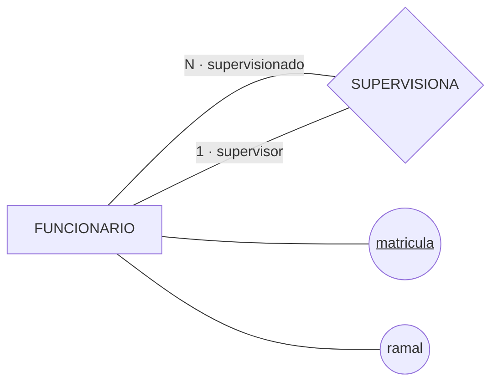

### O papel

Olhe o que está escrito nas linhas, além do número.

Num relacionamento comum, cada lado se identifica pela entidade que está na ponta — ninguém confunde quem é o aluno e quem é o livro. Aqui as duas pontas saem da **mesma caixa**, e o desenho sozinho não diz qual é qual.

**Papel** é o nome da qualidade em que cada ponta participa do relacionamento. Sem ele, o diagrama afirma apenas que funcionários se relacionam com funcionários — o que não é informação nenhuma.

> 📏 **Convenção do curso:** o rótulo da linha carrega a cardinalidade **e** o papel, separados por ponto médio — `|"N · supervisionado"|`. As aspas são obrigatórias: sem elas o Mermaid não aceita o ponto médio. Está no [guia de notações](../../recursos/notacoes-der.md).

E a leitura em voz alta continua sendo o teste, agora com o papel dentro da frase:

```
   [FUNCIONARIO] ──N·supervisionado── {SUPERVISIONA} ──1·supervisor── [FUNCIONARIO]
    ↑                                                                   ↑
    └─ "N funcionários são supervisionados…"       "…por 1 funcionário" ─┘
```

### O autorrelacionamento N:M

A supervisão é 1:N — um supervisor tem vários supervisionados, e cada funcionário tem no máximo um supervisor. O N:M também acontece, e na biblioteca ele aparece nas referências bibliográficas: uma obra cita várias outras e é citada por várias.

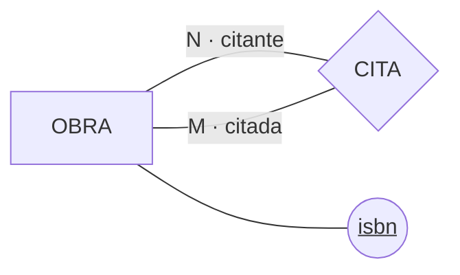

> ⚠️ **Papel não é entidade.** Foi o erro da primeira tentativa desta seção, e ele tem nome no [catálogo](../../recursos/erros-comuns.md). Supervisor não é um tipo de coisa — é **como** um funcionário participa de uma ligação. Tipo é o que a coisa é e não deixa de ser; papel muda numa promoção.

> 💡 **O papel serve fora do autorrelacionamento também.** Sempre que a mesma entidade participa **duas vezes** do mesmo relacionamento, as pontas precisam de nome: uma partida tem um time mandante e um visitante, e sem os dois papéis o placar não sabe de quem é.

### ✏️ Tente você

O acervo tem obras que são **continuação** de outras — *"Cálculo, volume 2"* continua o *volume 1*. Uma obra continua no máximo uma outra, e é continuada por no máximo uma.

Escreva o autorrelacionamento na notação linear e **nomeie os dois papéis**.

<details>
<summary>Resposta</summary>

```
   [OBRA] ──1·anterior── {CONTINUA} ──1·posterior── [OBRA]
```

É um 1:1 autorrelacionado — e desta vez o 1:1 não é suspeito, porque não há duas entidades para juntar: é a **mesma** entidade nos dois lados.

Os papéis são o que torna o desenho legível. `anterior` e `posterior`, `continua` e `continuada` — o nome exato é escolha sua; o que não pode faltar é o par.
</details>

## 7. O DER da biblioteca até aqui

Juntando as decisões das seções anteriores:

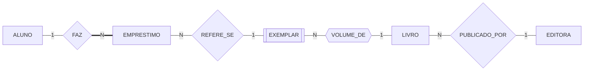

Lido em voz alta, linha por linha — e é assim que se confere um modelo:

- um aluno faz vários empréstimos; **todo empréstimo tem exatamente um aluno**, e por isso a linha do lado do empréstimo é dupla;
- vários empréstimos podem se referir, ao longo do tempo, ao mesmo exemplar; cada empréstimo trata de **um** exemplar;
- todo exemplar é volume de exatamente uma obra;
- toda obra é publicada por uma editora, e uma editora publica várias.

> ⚠️ Este diagrama **ainda afirma uma coisa falsa**: que o mesmo exemplar pode estar em dois empréstimos em aberto ao mesmo tempo. Nada no desenho impede. Regra de tempo não cabe no DER — ela vai para a lista de regras de negócio, em texto, e é exatamente o tipo de coisa que a leitura em voz alta revela.

> 💻 **Modelos desta aula:** [`der-biblioteca-parcial.md`](exemplos/der-biblioteca-parcial.md) — o diagrama acima com os atributos e o parágrafo de justificativa. E [`resolvendo-um-enunciado.md`](exemplos/resolvendo-um-enunciado.md) — **um enunciado em prosa resolvido do começo ao fim**, na ordem em que se modela. É o percurso que os exercícios abaixo pedem; leia antes de começá-los.

## 🏋️ Exercícios da aula

Use o **modelo entidade-relacionamento** para o projeto conceitual das bases de dados abaixo. Em todos os exercícios:

- para cada **entidade**, especifique os atributos relevantes — simples, compostos ou multivalorados — incluindo o **atributo identificador**;
- para cada **relacionamento**, dê a **cardinalidade** dos dois lados, diga se a **participação** de cada entidade é total ou parcial e inclua os atributos do relacionamento, se houver;
- nos **autorrelacionamentos**, diga também o **papel** de cada ponta.

Cada enunciado diz **o que se deseja registrar**. Ele não diz o que é entidade, o que é atributo e o que é relacionamento — essa decisão é sua, e é o exercício.

> 💡 O percurso inteiro de um enunciado como estes, passo a passo, está em [`resolvendo-um-enunciado.md`](exemplos/resolvendo-um-enunciado.md). Leia antes de começar.

Na pasta `aula-06/` do seu repositório, um arquivo `.md` por exercício, com o diagrama em Mermaid e o parágrafo em português dizendo o que ele afirma:

1. **`ex01.md`** — A biblioteca quer controlar o acervo de **periódicos**. De cada revista interessam o título, o ISSN e a periodicidade; de cada editora, o CNPJ e o nome. Uma revista é publicada por uma editora e uma editora publica várias revistas, e nenhuma revista entra no acervo sem editora identificada. De cada revista a biblioteca guarda os fascículos que possui, numerados de 1 em diante **dentro de cada revista**, com o mês e o ano de publicação de cada um. Uma revista pode ter sido catalogada sem que nenhum fascículo tenha chegado ainda.

   *Confere assim: uma das três entidades não se identifica sozinha — se as três do seu modelo têm chave própria, releia a seção 2. E das quatro pontas de relacionamento, exatamente duas têm participação total.*

2. **`ex02.md`** — A biblioteca vai registrar o **quadro de pessoal**. De cada funcionário interessam a matrícula funcional, o nome, o ramal e a data de admissão. Alguns funcionários supervisionam outros: quem supervisiona acompanha vários colegas, e cada funcionário é acompanhado por no máximo uma pessoa — o diretor não é acompanhado por ninguém. De cada acompanhamento a biblioteca quer saber **desde quando** ele vale.

   *Confere assim: o seu modelo tem uma caixa só. Se tem duas, uma para quem supervisiona e outra para quem é supervisionado, os atributos apareceram duas vezes e o modelo quebra na primeira promoção. E o "desde quando" não cabe em nenhuma das duas pontas — pergunte-se de quem ele é.*

3. **`ex03.md`** — O saguão da biblioteca tem um **guarda-volumes**. Cada armário tem um número, fica num corredor e abre com uma chave, que tem um código gravado; cada chave abre um armário só e nunca é trocada de armário. O aluno que deixa material no guarda-volumes recebe a chave e a devolve na saída, e a biblioteca precisa saber quem retirou, a que horas retirou e a que horas devolveu.

   *Confere assim: uma das coisas que o enunciado descreve como se fosse uma coisa do mundo não merece uma caixa — e o teste que decide está no fim da seção 4. Aplique as três perguntas antes de entregar. Os horários, esses, têm lugar certo, e não é dentro do aluno nem dentro do armário.*

### 📤 Entrega

Estes exercícios são feitos em sala e vão para o **seu repositório** `exercicios-modelagem-dados`:

```bash
cd ..                 # da pasta da aula para a raiz do repositório
git add aula-06/
git commit -m "Resolve exercícios da aula 06"
git push
```

Confira no navegador que a pasta apareceu em `github.com/SEU-USUARIO/exercicios-modelagem-dados`.

## 🧠 Revisão

[8 questões de múltipla escolha](revisao/README.md) para conferir se os conceitos ficaram sólidos. Responda sem consultar a aula — depois volte e corrija.

---

⬅️ [Aula 05 — Projeto de Banco de Dados: Conceitual, Lógico e Físico](../aula-05-projeto-conceitual-logico-fisico/README.md) | ➡️ [Aula 07 — Do Relacional à Integridade Referencial](../aula-07-relacional-e-integridade/README.md)
