<!-- _class: capa -->

📐

# A Notação Gráfica e os Tipos de Entidade

## Aula 06 · Bloco 2 — Modelos de Banco de Dados

Forma primeiro, nome depois

---

## 🎯 Nesta aula

1. Três formas para **três conceitos**
2. Entidade **forte** e entidade **fraca**
3. O relacionamento e o que **mora dentro dele**
4. **Cardinalidade**: 1:N, N:M e o 1:1 que engana
5. **Participação**: pode zero?
6. O relacionamento de uma entidade **com ela mesma**

---

## De onde viemos

Na **Aula 05** você viu que o modelo conceitual é o documento que descreve o mundo **sem compromisso com tecnologia**.

Agora você vai **desenhá-lo**.

> 💡 A notação é de **Peter Chen**, de 1976, e é a que o livro-base usa. Ela cabe em três formas geométricas — e é essa economia que faz o diagrama ser lido de longe.

---

<!-- _class: diagrama -->

## Três formas para três conceitos

**Retângulo** é entidade, **losango** é relacionamento, **elipse** é atributo. Você reconhece o que é cada coisa **antes de ler o nome**.

---

## ⚠️ O diagrama não é o modelo inteiro

Ele mostra a **estrutura**.

As regras que **não têm símbolo** — *"o prazo é de quinze dias"* — ficam na lista de regras da Aula 04, em texto.

**Todo DER deste curso vem acompanhado de um parágrafo em português** dizendo o que ele afirma sobre o mundo. Sem esse parágrafo, o desenho perde metade do que o modelo sabe.

---

## A obra e o volume físico

*"Banco de Dados"* é uma **obra**. A biblioteca tem **quatro cópias** dela na estante.

É uma cópia específica que o aluno leva para casa — e essas cópias são numeradas **1, 2, 3, 4 dentro de cada livro**.

Não existe "o exemplar 3" sem dizer **de qual obra**.

---

<!-- _class: diagrama -->

## Entidade fraca: não se identifica sozinha

O `numero` é uma **chave parcial** — só distingue dentro da obra. A identificação completa é o par `(isbn, numero)`.

---

<!-- _class: tabela-densa -->

## As três marcas da entidade fraca

| No desenho | O que significa |
|---|---|
| **Retângulo duplo** em `EXEMPLAR` | a entidade não se identifica sozinha |
| **Losango duplo** — hexágono, no Mermaid | é o **relacionamento identificador**, o que empresta identidade |
| **Linha dupla** do lado do exemplar | participação total: exemplar nenhum existe fora dessa ligação |

As três aparecem **juntas**, sempre. Entidade fraca sem relacionamento identificador é desenho incompleto.

---

## ⚠️ Vínculo obrigatório não é fraqueza

Um `EMPRESTIMO` **exige** um aluno. Mesmo assim ele é **forte**: tem número próprio e único.

O teste, e ele nunca falha:

**Tire a entidade dona e pergunte se a chave ainda identifica.**

Se ainda identifica, a entidade é forte — por mais obrigatório que o vínculo seja.

---

## O relacionamento pode ter atributos

A biblioteca precisa saber **a ordem em que os autores assinam** a obra: o primeiro é quem aparece na ficha catalográfica.

Onde guardar a ordem?

Ela **não é do livro** — muda a cada autor. E **não é do autor** — muda a cada livro.

---

<!-- _class: diagrama -->

## Ela é da ligação entre os dois

A `ordem_assinatura` fica pendurada **no losango**, porque só faz sentido para o **par**.

---

<!-- _class: lead -->

## 💡 Atributo no losango é a assinatura de um N:M

A quantidade de um produto num pedido.
A data de inscrição de um atleta numa competição.
A ordem de um autor num livro.

**Se você não encontra onde pôr um dado,
ele provavelmente é de uma ligação
que você ainda não desenhou.**

---

## Cardinalidade: quantos de cada lado

**Cardinalidade** é quantas ocorrências de uma entidade participam do relacionamento.

O número fica **na linha**, entre o retângulo e o losango.

E é aqui que quase todo mundo erra na primeira vez.

---

<!-- _class: diagrama -->

## ⚠️ A armadilha do lado

**O número fica junto da entidade que ele conta.** O `N` encostado em `LIVRO` diz *"N livros"* — não *"a editora publica N"*.

---

## As duas perguntas, separadas

Cubra o resto do desenho com o dedo e leia **um número com a entidade colada nele**. Depois junte as pontas numa frase.

O jeito seguro de decidir, e que acaba com qualquer discussão em dez segundos:

**"Um livro pode ter vários autores?"** → sim
**"Um autor pode ter vários livros?"** → sim  →  **N:M**

**"Um livro pode ter várias editoras?"** → não
**"Uma editora pode ter vários livros?"** → sim  →  **1:N**

---

## 1:N — o mais comum de todos

Um lado responde "não", o outro responde "sim".

Um livro tem **uma** editora; uma editora tem **vários** livros.

A maioria esmagadora dos relacionamentos de um modelo é 1:N — e, na Aula 07, ele é também o mais simples de traduzir: vira **uma coluna a mais** no lado N.

---

## N:M — quando os dois lados dizem "sim"

Um autor escreve vários livros **e** um livro tem vários autores.

Repare que as letras são **diferentes**, `N` e `M`: as duas quantidades não têm relação uma com a outra.

É o tipo que carrega atributo com mais frequência, por um motivo estrutural — **o dado que pertence ao par não tem outro lugar para morar**.

---

<!-- _class: diagrama -->

## 1:1 — o tipo que pede desconfiança

Um aluno tem uma carteirinha; cada carteirinha é de um aluno. Os dois lados respondem **"não"**.

---

## A carteirinha merece a caixa?

Se ela só guarda **um número e uma foto**, não. Ela não é uma coisa do mundo — é um par de atributos do aluno.

**O 1:1 quase sempre denuncia uma entidade partida sem necessidade.**

O que faria a carteirinha merecer a caixa é ter **vida própria**. E ela tem: é emitida numa data, vence, e a **segunda via é uma carteirinha nova** — mesmo aluno, outro número.

---

<!-- _class: diagrama -->

## Quando essa regra entra

O aluno acumula carteirinhas ao longo do curso, e o balcão precisa saber **qual está valendo**.

---

<!-- _class: lead -->

## Deixou de ser 1:1

A regra que justificou **separar** as duas entidades
é a mesma que transformou
o relacionamento em **1:N**.

Não é coincidência: o que dá vida própria
a uma entidade costuma ser exatamente
o que faz aparecer **mais de uma**.

---

## ⚠️ O teste do 1:1, em três perguntas

1. **Alguém referencia uma sem a outra?**
2. **Uma existe antes da outra?**
3. **A segunda tem atributos próprios que importam?**

**Três "não" e é uma entidade só** — os atributos da segunda viram colunas da primeira.

---

## Participação: pode zero?

Cardinalidade responde *"quantos, no máximo?"*. Falta a outra pergunta, que é **independente** dela.

**Participação parcial** — a ocorrência pode existir sem participar. Um aluno recém-matriculado ainda não pegou nenhum livro. Linha simples.

**Participação total** — a ocorrência **não existe** fora do relacionamento. Todo exemplar é exemplar de alguma obra. Linha dupla, `===`.

---

<!-- _class: tabela-densa -->

## São dois eixos, não um

| | Quantos? | Pode zero? | No desenho |
|---|:---:|:---:|---|
| Lado `EXEMPLAR` de `VOLUME_DE` | N | não | `N` e linha **dupla** |
| Lado `LIVRO` de `VOLUME_DE` | 1 | sim | `1` e linha simples |
| Lado `EMPRESTIMO` de `FAZ` | N | não | `N` e linha **dupla** |
| Lado `ALUNO` de `FAZ` | 1 | sim | `1` e linha simples |

**"Quantos" decide de que lado a ligação vira coluna. "Pode zero" decide se essa coluna aceita ficar vazia.** Responder "1:N obrigatório" perde metade da informação.

---

<!-- _class: diagrama -->

## A primeira tentativa, e por que ela quebra

Os mesmos atributos, desenhados **duas vezes** — porque supervisor **é** funcionário. E o modelo quebra na primeira promoção.

---

<!-- _class: diagrama -->

## Autorrelacionamento: uma caixa só

É o relacionamento de uma entidade **com ela mesma**. Ela aparece uma vez, e as duas linhas saem dela para o mesmo losango.

---

## O papel

Num relacionamento comum, cada lado se identifica **pela entidade que está na ponta**. Ninguém confunde quem é o aluno e quem é o livro.

Aqui as duas pontas saem da **mesma caixa**.

**Papel** é o nome da qualidade em que cada ponta participa. Sem ele, o diagrama afirma apenas que funcionários se relacionam com funcionários — **o que não é informação nenhuma**.

> 📏 Convenção do curso: o rótulo carrega a cardinalidade **e** o papel — `N · supervisionado`.

---

<!-- _class: diagrama -->

## O autorrelacionamento N:M

Uma obra **cita** várias outras e **é citada** por várias. Mesma estrutura, outro grau.

---

## ⚠️ Papel não é entidade

Supervisor **não é um tipo de coisa**. É **como** um funcionário participa de uma ligação.

Tipo é o que a coisa **é** e não deixa de ser. Papel **muda numa promoção**.

> 💡 O papel serve fora do autorrelacionamento também: uma partida tem um time **mandante** e um **visitante**, e sem os dois papéis o placar não sabe de quem é.

---

<!-- _class: diagrama -->

## O DER da biblioteca — o empréstimo

Um aluno faz vários empréstimos. **Todo empréstimo tem exatamente um aluno** — e por isso aquela linha é dupla.

---

<!-- _class: diagrama -->

## …e o acervo

⚠️ Este diagrama **ainda afirma uma coisa falsa**: que o mesmo exemplar pode estar em dois empréstimos em aberto. Regra de tempo não cabe no DER.

---

<!-- _class: checkpoint -->

## 🏋️ Exercícios da aula

Na pasta `aula-06/`, com o **cabeçalho de entrega** aberto ao lado:

1. **`ex01.md`** — o acervo de **periódicos**: revistas, fascículos e editora;
2. **`ex02.md`** — o **quadro de pessoal**, com a supervisão entre funcionários;
3. **`ex03.md`** — o **guarda-volumes**: armários, chaves e quem retirou.

O enunciado diz **o que se deseja registrar** — não diz o que é entidade. Essa decisão é o exercício.

---

<!-- _class: lead -->

## ➡️ Próxima aula

**Aula 07 — Do relacional à integridade referencial**

Os losangos desaparecem,
e cada um deles vira uma coluna.
Inclusive o que aponta para si mesmo.
