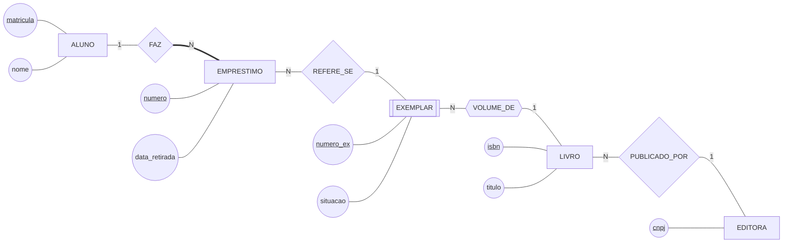

# O DER da biblioteca — versão da Aula 06

O modelo conceitual da biblioteca como ele está ao fim do Bloco 2 até aqui: entidades, atributos que importam, cardinalidade e participação. Ele volta na Aula 08, completo.

## O que este diagrama afirma sobre o mundo

**Aluno e empréstimo.** Um aluno pode fazer vários empréstimos, inclusive simultâneos, e pode não ter nenhum — por isso o lado dele tem linha simples. Todo empréstimo, ao contrário, pertence a **exatamente um** aluno e não existe sem ele: a linha do lado do empréstimo é dupla.

**Empréstimo e exemplar.** Cada empréstimo trata de um exemplar específico — não da obra, do volume físico que saiu da estante. O mesmo exemplar aparece em vários empréstimos ao longo dos anos, e é isso que forma o histórico.

**Exemplar e livro.** `EXEMPLAR` é **entidade fraca**: o `numero_ex` (1, 2, 3…) só distingue dentro de uma obra. A identificação completa é o par `(isbn, numero_ex)`, e quem completa a identidade é o relacionamento `VOLUME_DE`, desenhado com losango duplo — hexágono, na limitação do Mermaid.

> ⚠️ **Convenção do curso para a chave parcial.** A notação de Chen sublinha a chave parcial com traço pontilhado, e o Mermaid não faz isso. Aqui o `numero_ex` aparece sublinhado como qualquer chave, e **é este parágrafo que diz que ela é parcial**. Sempre que houver entidade fraca no seu modelo, escreva a frase — o desenho sozinho não dá conta.

**Livro e editora.** Toda obra do acervo tem uma editora; a mesma editora publica muitas obras.

## Três coisas que o diagrama não afirma

1. **Que um exemplar não pode estar em dois empréstimos em aberto.** Isso é regra de tempo, e vai para a lista de regras de negócio em texto;
2. **Que o prazo de devolução é de quinze dias.** Prazo não tem símbolo em Chen;
3. **Quem pode ver o quê.** A política de segurança da Aula 02 é outro documento.

Nenhuma das três é falha do desenho. Um DER mostra estrutura — o resto do modelo é texto, e some quando ninguém escreve.

---

⬅️ [Voltar à Aula 06](../README.md)
