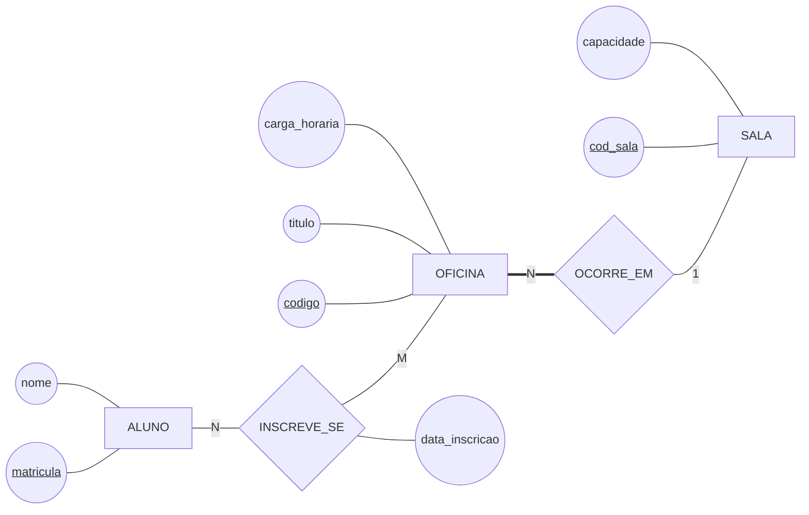

# Resolvendo um enunciado — as oficinas de pesquisa

Este arquivo mostra **o percurso**, não só o resultado. É o mesmo caminho que os exercícios da aula pedem: um enunciado em prosa, que não diz o que é entidade e o que é atributo, e a decisão sendo tomada passo a passo.

O modelo de referência da aula — o DER da biblioteca — está no arquivo vizinho, [`der-biblioteca-parcial.md`](der-biblioteca-parcial.md).

---

> 📋 **O enunciado**
>
> A biblioteca quer registrar as **oficinas de pesquisa** que oferece. De cada oficina interessam o título, a carga horária e a sala onde ela acontece; de cada sala, o código e a capacidade; de cada aluno, a matrícula e o nome. Um aluno se inscreve em várias oficinas e cada oficina recebe vários alunos, e interessa saber quando cada inscrição foi feita. Oficina sem sala marcada não é publicada; uma sala pode não receber oficina nenhuma.

Repare no que o enunciado **não** faz: ele não diz *"as entidades são…"*. Ele diz o que se deseja registrar, e a classificação é o trabalho.

## Passo 1 — quem são as entidades

Comece listando os substantivos, sem julgar nenhum:

```
   oficina · título · carga horária · sala · código · capacidade ·
   aluno · matrícula · nome · inscrição · data
```

Agora as três perguntas da Aula 03, uma candidata por vez:

| Candidata | Distingue? | Mais de uma característica? | Vai crescer? | Veredito |
|---|:---:|:---:|:---:|---|
| `OFICINA` | sim | sim: título, carga horária | sim | **entidade** |
| `SALA` | sim, pelo código | sim: capacidade | sim | **entidade** |
| `ALUNO` | sim, pela matrícula | sim: nome | sim | **entidade** |
| `INSCRICAO` | só dizendo *quem* e *em quê* | tem a data, e mais nada | não | **não é entidade** |
| `titulo`, `capacidade`, `nome` | não | — | não | **atributos** |

A linha da `INSCRICAO` é a que ensina. Ela não se distingue sozinha: para apontar uma inscrição específica você precisa dizer o aluno **e** a oficina. Uma coisa que só existe pelo encontro de duas outras não é entidade — **é relacionamento**.

> ⚠️ Este é o erro mais comum deste passo, e ele acontece nos dois sentidos. Promover `INSCRICAO` a entidade enche o modelo de caixas que não são coisas. E rebaixar `SALA` a atributo de `OFICINA` — afinal *"a sala é só um código"* — perde a capacidade e impede saber quais oficinas dividem a mesma sala.

## Passo 2 — os relacionamentos

Ligue o que se relaciona, **sem números ainda**, e nomeie com verbo:

```
   ALUNO ──── INSCREVE_SE ──── OFICINA
   OFICINA ──── OCORRE_EM ──── SALA
```

Dois relacionamentos. E um deles, o `INSCREVE_SE`, é a `INSCRICAO` que o passo 1 recusou como entidade — agora no lugar certo.

## Passo 3 — cardinalidade e participação

Duas perguntas de cada lado, uma por vez. Boa parte das respostas está no enunciado, palavra por palavra:

| A pergunta | O que o enunciado responde | Decide |
|---|---|---|
| Um aluno se inscreve em várias oficinas? | *"um aluno se inscreve em várias oficinas"* | `N` junto de `ALUNO` |
| Uma oficina recebe vários alunos? | *"cada oficina recebe vários alunos"* | `M` junto de `OFICINA` → **N:M** |
| Uma oficina ocorre em várias salas? | não diz — **pergunte**. Aqui: não | `1` junto de `SALA` |
| Uma sala recebe várias oficinas? | não diz — **pergunte**. Aqui: sim | `N` junto de `OFICINA` → **1:N** |
| Pode existir oficina sem sala? | *"oficina sem sala marcada não é publicada"* | participação **total** da oficina |
| Pode existir sala sem oficina? | *"uma sala pode não receber oficina nenhuma"* | participação **parcial** da sala |

> 💡 Duas das seis respostas **não estavam no enunciado**. Isso é normal, e é o que a Aula 04 chama de levantamento: enunciado nenhum é completo, e a resposta vem de quem conhece o assunto. O que não se pode é inventar em silêncio — a pergunta feita e a resposta obtida viram uma linha na lista de regras.

## Passo 4 — os atributos, e só agora

Chave primeiro, depois o que o enunciado citou:

- `ALUNO`: `matricula` (chave), `nome`;
- `OFICINA`: `codigo` (chave — o enunciado não citou nenhum identificador, e todo modelo precisa de um), `titulo`, `carga_horaria`;
- `SALA`: `cod_sala` (chave), `capacidade`;
- `INSCREVE_SE`: `data_inscricao`.

O último é o que costuma escapar. A data não é do aluno, porque o mesmo aluno se inscreve em datas diferentes; não é da oficina, porque a mesma oficina recebe inscrições em datas diferentes. **Ela é do par**, e mora no losango.



## Passo 5 — a leitura em voz alta

Cada linha, nas duas direções, e cada frase confrontada com o mundo:

| A frase que o desenho afirma | Verdade? |
|---|:---:|
| "Um aluno se inscreve em várias oficinas" | ✅ |
| "Uma oficina recebe vários alunos" | ✅ |
| "Toda oficina ocorre em exatamente uma sala" | ✅ |
| "Toda sala recebe pelo menos uma oficina" | ❌ |

A última é **falsa**, e é ela que justifica a linha simples do lado da `SALA`. Se ali houvesse linha dupla, o modelo estaria afirmando que sala sem oficina não pode existir — e o enunciado diz o contrário, com todas as letras.

> 💡 É sempre assim: **a leitura falsa é a que paga o ritual.** As três verdadeiras confirmam o que você já sabia; a quarta é a que encontra o defeito.

## O que ficou de fora do desenho

Duas coisas do enunciado não viraram símbolo nenhum, e as duas continuam sendo parte do modelo:

1. **"Oficina sem sala marcada não é publicada"** virou participação total — mas a palavra *publicada* não. Se existir um estado de rascunho, ele é um atributo que ninguém pediu ainda;
2. **A capacidade da sala não limita as inscrições.** Nada no desenho impede a vigésima inscrição numa sala de dez lugares. É regra de negócio com contagem dentro, e vive na lista, em texto.

Um modelo é o diagrama **mais** a lista. O que não tem símbolo não desaparece — ele muda de documento.

---

⬅️ [Voltar à Aula 06](../README.md)
