<!-- _class: capa -->

<div class="emoji">🔗</div>

# Do Relacional à Integridade Referencial

## Aula 07 · Bloco 2 — Modelos de Banco de Dados

<div class="meta">Os losangos desaparecem, e cada um vira uma coluna</div>

---

## 🎯 Nesta aula

1. A tabela, agora com os **nomes formais**
2. **Chaves**: candidata, primária, alternativa
3. Do **losango para a coluna** — as cinco conversões
4. As **três integridades**
5. E quando alguém **apaga o outro lado**?
6. O **esquema lógico** da biblioteca, inteiro

---

## De onde viemos

Na **Aula 06** você desenhou o DER: retângulos, losangos, cardinalidade e participação.

Agora ele vira **tabela** — e cada traço do desenho vira uma decisão de esquema.

> 💡 O modelo relacional que **Codd** propôs em 1970 tem uma ideia central: tudo é tabela, e as ligações entre as tabelas são feitas **por valor**. Não por ponteiro, não por posição, não por ordem de gravação.

---

<!-- _class: diagrama -->

## Os nomes formais



Três deles você já viu na Aula 03. O que muda aqui é que eles ganham **definição precisa** — e é sobre ela que a normalização do Bloco 4 vai trabalhar.

---

## ⚠️ "Cardinalidade" aparece aqui com outro sentido

No modelo relacional, a **cardinalidade de uma relação** é o número de **tuplas** que ela tem hoje. O **grau** é o número de atributos.

Nada a ver com o `1`, `N`, `M` do diagrama, que fala de **quantas ocorrências participam** de um relacionamento.

**Mesmo termo, dois assuntos.** Quando alguém disser "cardinalidade", pergunte de qual delas está falando.

---

## Chaves: como apontar para uma linha

As tuplas **não têm ordem nem posição**. Não existe "a terceira linha".

A única forma de apontar para uma linha específica é **pelo valor**.

Daí a importância das chaves — e daí o fato de que escolher a chave errada é um erro que se paga em toda tabela que fizer referência a esta.

---

<!-- _class: diagrama -->

## Candidata, primária, alternativa



Numa tabela de alunos com `matricula`, `nome`, `email` e `cpf`, três colunas identificam sozinhas. **A escolha entre elas é sua** — e ela vai ser copiada em toda tabela que apontar para esta.

---

## Os três critérios, nesta ordem

**A que nunca muda.** Chave que muda obriga a atualizar todas as referências.

**A menor.** Ela vai ser copiada inteira em cada tabela que referenciar esta.

**A que nunca fica vazia.** Chave vazia não identifica nada.

Por isso `matricula` ganha do `cpf` na biblioteca: o CPF é maior, é dado pessoal desnecessário aqui, e o aluno estrangeiro pode não ter um.

---

## Chave composta

É a que precisa de **mais de um atributo** para identificar.

É o caso do `EXEMPLAR` da Aula 06: nem `isbn` nem `numero_ex` identificam sozinhos.

O par `(isbn, numero_ex)` identifica — e é ele que vira a chave primária.

---

## ⚠️ Chave é o conjunto mínimo, não o que descreve

`PRODUTO(codigo, nome, fabricante)` como chave primária é o erro clássico do catálogo.

Se `codigo` já identifica, **acrescentar qualquer coisa não cria uma chave melhor** — cria uma chave grande, que será copiada inteira em toda referência.

---

## Do losango para a coluna

**Chave estrangeira** é uma coluna que guarda o valor da chave primária de outra tabela.

É assim que a ligação **por valor** acontece.

São **cinco** conversões, uma para cada construção da Aula 06 — e as cinco são mecânicas: modelos iguais produzem esquemas iguais.

---

<!-- _class: diagrama -->

## 1:N — uma coluna a mais, no lado N



A razão cabe numa linha: **uma célula guarda um valor só.** Um livro tem uma editora, então cabe. Uma editora tem vários livros, então não caberia.

---

<!-- _class: diagrama -->

## N:M — uma tabela nova



Não cabe coluna em nenhum dos dois lados. Nasce a **tabela associativa**, e os atributos do losango vão morar dentro dela.

---

<!-- _class: diagrama -->

## Entidade fraca — a chave da dona entra



`isbn` é, ao mesmo tempo, **chave estrangeira e parte da chave primária**. É a assinatura da entidade fraca no modelo lógico.

---

## 1:1 — escolha o lado da participação total

A chave estrangeira pode ir para **qualquer um dos dois lados**.

Escolha o lado que tem **participação total**, para não ficar com coluna vazia na maioria das linhas.

> 💡 É o diagrama pagando dividendo: a decisão que parece arbitrária tem resposta certa, e ela está desenhada na Aula 06.

---

<!-- _class: diagrama -->

## Autorrelacionamento — aponta para a própria tabela



A coluna **não pode** se chamar `matricula`: esse nome já está ocupado pela chave. **Quem dá o nome novo é o papel.**

---

<!-- _class: lead -->

## Nenhum losango sobreviveu

No modelo lógico existem
só **tabelas e colunas**.

O relacionamento continua lá,
mas escrito como valor repetido
em duas tabelas.

**É por isso que o diagrama continua necessário:
ele é o único documento onde
a ligação é visível de longe.**

---

## As três integridades

Traduzir não basta. O esquema precisa dizer **o que o banco deve recusar**.

**De domínio** — todo valor pertence ao conjunto de valores da coluna.

**De entidade** — nenhuma parte da chave primária fica vazia.

**Referencial** — toda chave estrangeira aponta para uma linha que existe.

---

<!-- _class: diagrama -->

## A referência órfã



A integridade **referencial** é a que amarra o modelo inteiro: ela impede a linha que aponta para o nada.

---

<!-- _class: tabela-densa -->

## Quatro tentativas de gravação

| O que se tenta gravar | Resultado | Qual regra agiu |
|---|---|---|
| `situacao` = `"disponivel?"` | recusado | **domínio** — valor fora do conjunto |
| empréstimo sem `numero` | recusado | **entidade** — falta parte da chave |
| empréstimo com aluno inexistente | recusado | **referencial** — a linha apontada não existe |
| empréstimo com `data_devolucao` vazia | **aceito** | nenhuma — é empréstimo em aberto |

---

<!-- _class: lead -->

## ⚠️ Integridade não é recusar o que parece estranho

A última linha é a que ensina.

**Coluna vazia só é erro
onde o modelo disse que era obrigatória** —

e quem disse isso foi a **participação total**
que você desenhou no DER.

---

## E quando alguém apaga o outro lado?

A integridade referencial tem um segundo capítulo, e é onde ela deixa de ser teoria.

**O que fazer quando a linha referenciada é apagada?**

São três políticas — e a escolha é **do modelo**, não do SGBD.

---

<!-- _class: diagrama -->

## As três políticas, e o que decide



A pergunta é sempre a mesma, e a resposta está no DER: **a entidade do outro lado existe sem esta?**

---

## ⚠️ Propagar é a política que apaga sem perguntar

Antes de escolhê-la, aplique o **teste da entidade fraca** da Aula 06.

Se a entidade se identifica sozinha, ela **sobrevive à dona** — e propagar vai destruir histórico que ninguém mandou destruir.

Participação total do lado N pede **recusar ou propagar**. Nunca anular: anular criaria justamente a ocorrência que o desenho diz ser impossível.

---

## O esquema lógico da biblioteca

```
ALUNO(matricula, nome, email)
EDITORA(cnpj, nome, cidade)
LIVRO(isbn, titulo, ano, cnpj → EDITORA)
EXEMPLAR(isbn → LIVRO, numero_ex, situacao)
EMPRESTIMO(numero, data_retirada, data_devolucao,
           matricula → ALUNO,
           isbn + numero_ex → EXEMPLAR)
```

O DER da Aula 06, convertido inteiro — e **cada coluna aí veio de uma linha do desenho**.

---

## Quatro decisões visíveis

**`EMPRESTIMO` carrega `matricula`** porque o lado dele era o N — um aluno faz vários.

**Essa coluna não aceita vazio**, porque a participação era total.

**`EXEMPLAR` tem chave composta** porque é entidade fraca.

**`EMPRESTIMO` referencia o exemplar com duas colunas** — chave composta se propaga.

---

## ⚠️ O furo que continua

O esquema **ainda permite** dois empréstimos em aberto do mesmo exemplar.

Nenhuma das três integridades pega isso: é **regra de negócio com tempo dentro**.

Ela vive na lista, em texto, para ser verificada pela aplicação.

> 💡 Modelo bom não é o sem furo — é o que **sabe onde estão os seus furos**.

---

<!-- _class: checkpoint -->

## 🏋️ Exercícios da aula

Na pasta `aula-07/`, agora entregando **DER e esquema lógico**:

1. **`ex01.md`** — o **empréstimo entre instituições**: chaves candidatas e a escolha da primária;
2. **`ex02.md`** — as **referências bibliográficas**: obra que cita obra, com papéis;
3. **`ex03.md`** — o **descarte de acervo**: três ligações, três políticas — e uma proposta melhor.

---

<!-- _class: lead -->

## ➡️ Próxima aula

**Aula 08 — Agregação e estudo de caso**

O relacionamento que precisa
se relacionar com outra coisa —
e o projeto inteiro, do minimundo ao esquema.
