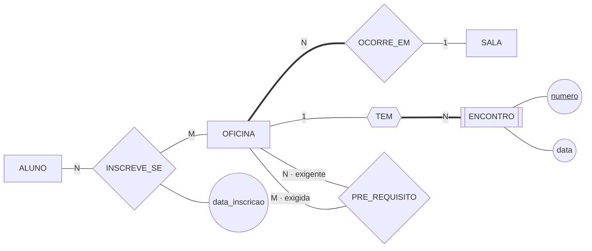

# Convertendo um DER — as oficinas de pesquisa

Este arquivo mostra **o percurso da conversão**: um DER pronto entra, um esquema lógico sai, e cada coluna que nasce tem um motivo escrito ao lado.

O caso é o mesmo que a Aula 06 modelou em [`resolvendo-um-enunciado.md`](../../aula-06-notacao-e-tipos-de-entidade/exemplos/resolvendo-um-enunciado.md) — vale abrir os dois lado a lado, porque juntos eles cobrem o caminho inteiro, do texto em português à tabela. O esquema de referência da biblioteca está no arquivo vizinho, [`esquema-logico-biblioteca.md`](esquema-logico-biblioteca.md).

---

## O ponto de partida

A secretaria trouxe duas regras novas depois da primeira modelagem:

- cada oficina acontece em **encontros**, numerados de 1 em diante **dentro da oficina**, cada um com a sua data;
- uma oficina pode exigir outra como **pré-requisito**, e uma mesma oficina pode ser pré-requisito de várias.

O DER cresceu para acomodá-las:



Quatro construções, e cada uma vira tabela de um jeito diferente. É o que os cinco passos abaixo fazem, um por vez.

## Passo 1 — as entidades viram tabelas

Regra sem exceção: **uma entidade, uma tabela; um atributo, uma coluna; o identificador vira a chave primária.**

```
   ALUNO(matricula, nome)
   SALA(cod_sala, capacidade)
   OFICINA(codigo, titulo, carga_horaria)
```

`ENCONTRO` fica de fora por enquanto — ele é entidade fraca, e a chave dele depende do passo 4.

## Passo 2 — o 1:N vira coluna, do lado N

`OCORRE_EM` liga oficina e sala: uma sala recebe N oficinas, uma oficina ocorre em 1 sala. **A chave estrangeira vai para o lado N** — para `OFICINA`:

```
   OFICINA(codigo, titulo, carga_horaria, cod_sala → SALA)
```

A razão é a de sempre, e cabe numa linha: **uma célula guarda um valor só.** Uma oficina tem uma sala, então cabe. Uma sala tem várias oficinas, então não caberia.

E a coluna **não aceita vazio**, porque o DER desenhou participação total do lado da oficina — *"oficina sem sala marcada não é publicada"*. A linha dupla do diagrama virou uma restrição do esquema.

## Passo 3 — o N:M vira tabela nova

`INSCREVE_SE` é N:M, e não cabe coluna em nenhum dos dois lados. Nasce a **tabela associativa**, com a chave composta pelas duas chaves e o atributo do losango dentro dela:

```
   INSCRICAO(matricula → ALUNO, codigo → OFICINA, data_inscricao)
             └──────────── chave primária composta ────────────┘
```

A `data_inscricao` não tinha para onde ir antes desta tabela existir — é a mesma constatação do passo 4 da Aula 06, agora com consequência concreta.

## Passo 4 — a entidade fraca herda a chave da dona

`ENCONTRO` não se identifica sozinho: o número 1 existe em toda oficina. **A chave da dona entra na chave da fraca**, e as duas juntas identificam:

```
   ENCONTRO(codigo → OFICINA, numero, data)
            └──── chave primária composta ────┘
```

Repare que `codigo` é, ao mesmo tempo, **chave estrangeira e parte da chave primária**. É a assinatura da entidade fraca no modelo lógico, e é o que distingue `ENCONTRO` de uma entidade forte com vínculo obrigatório.

## Passo 5 — o autorrelacionamento aponta para a própria tabela

`PRE_REQUISITO` é N:M autorrelacionado. Ele vira tabela associativa como qualquer N:M — só que **as duas colunas apontam para a mesma tabela**, e é o papel que dá nome a cada uma:

```
   PRE_REQUISITO(codigo_exigente → OFICINA, codigo_exigida → OFICINA)
                 └──────────── chave primária composta ────────────┘
```

Sem os papéis nomeados lá no diagrama, estas duas colunas não teriam como se chamar — as duas seriam `codigo`, e o esquema não diria qual é qual.

## O esquema completo

```
   ALUNO(matricula, nome)
   SALA(cod_sala, capacidade)
   OFICINA(codigo, titulo, carga_horaria, cod_sala → SALA)
   ENCONTRO(codigo → OFICINA, numero, data)
   INSCRICAO(matricula → ALUNO, codigo → OFICINA, data_inscricao)
   PRE_REQUISITO(codigo_exigente → OFICINA, codigo_exigida → OFICINA)
```

Seis tabelas a partir de três entidades e quatro relacionamentos. **Nenhum losango sobreviveu** — dois viraram tabela, um virou coluna, e o quarto virou a chave composta de uma entidade fraca.

## As três integridades, declaradas

| Integridade | Onde ela age neste esquema |
|---|---|
| **De domínio** | `carga_horaria` aceita inteiro de 1 a 40; `data` aceita data. Valor fora disso é recusado |
| **De entidade** | nenhuma parte de chave primária fica vazia — inclusive `numero` em `ENCONTRO` e as duas colunas de `PRE_REQUISITO` |
| **Referencial** | as seis chaves estrangeiras apontam para linhas que existem |

## As políticas de exclusão, uma por ligação

Cada chave estrangeira precisa de uma decisão, e **quem decide é a participação desenhada no DER**:

| Se alguém apagar… | Política | Por quê |
|---|---|---|
| uma `SALA` com oficinas marcadas | **recusar** | a oficina tem participação total: sem sala ela não pode existir, e anular criaria a linha que o desenho proíbe |
| uma `OFICINA` com encontros | **propagar** | `ENCONTRO` é fraco — encontro de oficina nenhuma não é coisa |
| uma `OFICINA` com inscritos | **recusar** | a inscrição é registro de quem participou, e apagá-la em silêncio destrói histórico |
| um `ALUNO` com inscrições | **recusar** | mesmo motivo |
| uma `OFICINA` que é pré-requisito de outra | **propagar** na `PRE_REQUISITO` | some a exigência, não a oficina que exigia |

> ⚠️ Repare que **duas ligações para a mesma tabela receberam políticas diferentes**: apagar uma oficina propaga para `ENCONTRO` e é recusado por causa de `INSCRICAO`. Não há política "da tabela" — há política **por ligação**, e cada uma se decide olhando o lado de lá.

## O que não coube no esquema

Duas regras do minimundo continuam sem símbolo, e continuam valendo:

1. **A capacidade da sala não limita as inscrições.** Nada no esquema impede a vigésima inscrição numa sala de dez lugares;
2. **O pré-requisito pode formar ciclo.** Nada impede que A exija B e B exija A. É regra com percurso dentro, e nenhuma das três integridades a alcança.

As duas vivem na lista de regras de negócio, em texto, e são verificadas pela aplicação. **Um modelo é o esquema mais a lista** — e a lista é o que sobra quando a notação não alcança.

---

⬅️ [Voltar à Aula 07](../README.md)
