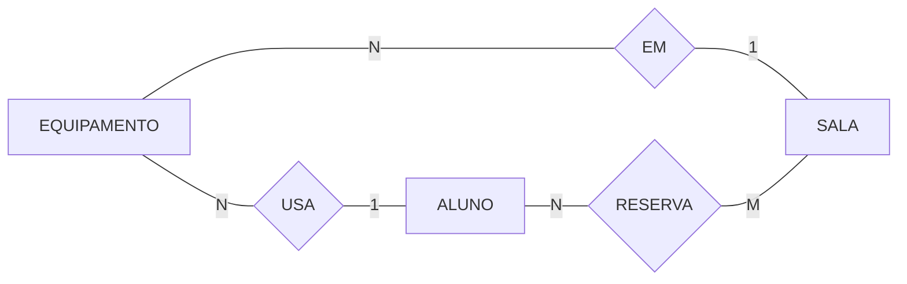
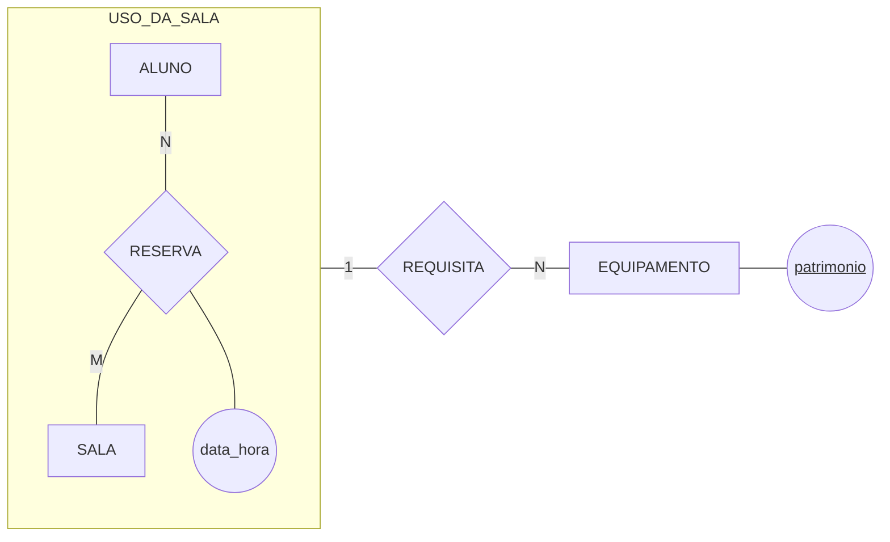
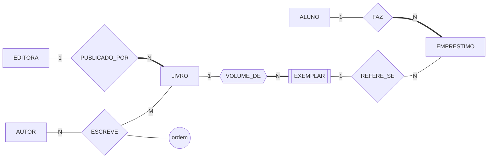

# Aula 08 — Agregação e Estudo de Caso

> 🎯 Objetivos: reconhecer quando um relacionamento precisa virar unidade, desenhar a agregação em Chen e conduzir um projeto conceitual completo do minimundo ao esquema lógico.
> 🎬 Slides da aula: [apresentacao-08-agregacao-e-estudo-de-caso.pdf](apresentacao/apresentacao-08-agregacao-e-estudo-de-caso.pdf)

## 1. O relacionamento que precisa se relacionar

A biblioteca também empresta **salas de estudo**. O aluno reserva a sala para uma data e um horário — um N:M com atributo, exatamente como a Aula 06 ensinou:

```
   ALUNO ---|N| RESERVA{RESERVA} ---|M| SALA
   RESERVA tem o atributo: data_hora
```

Até aqui, nada novo. Aí chega uma regra nova do balcão: *"o aluno pode requisitar um projetor ou um notebook **para aquela reserva** — o equipamento fica na sala durante o período reservado e volta no fim."*

Onde entra o equipamento nesse modelo? Tente as três saídas óbvias e veja as três falharem:

- **Ligar o equipamento ao `ALUNO`?** Aí o modelo diz que o aluno pegou um projetor, sem dizer para qual reserva. Ele reserva quatro salas por semana;
- **Ligar ao `SALA`?** Diz que a sala tem um projetor, o que é outra coisa: o projetor não é da sala, ele é levado até ela;
- **Ligar aos dois, com dois relacionamentos separados?** Aí o modelo permite a combinação impossível — o equipamento ligado a um aluno e a uma sala que não formam uma reserva.

A terceira saída merece ser desenhada, porque é a que parece funcionar:



Leia o que ele permite: o projetor está ligado à Ana **e** à sala 204, sem que exista reserva nenhuma da Ana para a 204. Os três relacionamentos são independentes, e nada obriga que as pontas se encontrem. O modelo aceita uma combinação que o mundo não tem.

O equipamento não se liga ao aluno nem à sala: liga-se **ao par**, àquela reserva específica. É precisamente o problema que a agregação resolve.

## 2. Agregação: tratar um relacionamento como uma coisa

**Agregação** é o recurso do modelo entidade-relacionamento que trata **um relacionamento inteiro como se fosse uma entidade**, para que ele possa participar de outro relacionamento.

Desenha-se com um **retângulo em volta** do relacionamento e das entidades que ele liga:



Lendo o desenho: o que está dentro da caixa é uma unidade chamada `USO_DA_SALA` — *este aluno, nesta sala, neste horário*. É **essa unidade** que requisita equipamentos, e cada equipamento pode ser requisitado em vários usos diferentes, em datas diferentes.

> 💡 O teste que identifica uma agregação é sempre o mesmo: **"o que está do outro lado se liga a uma das entidades, ou ao encontro delas?"** Se for ao encontro, é agregação. A prescrição que sai de uma consulta médica, o pagamento que se registra para a matrícula de um aluno num curso, o equipamento que sai de uma reserva — os três são o mesmo padrão.

> ⚠️ **Nem todo relacionamento a mais é agregação.** Se o equipamento fosse simplesmente *do aluno* — ele leva o projetor para onde quiser —, bastava um relacionamento comum entre `ALUNO` e `EQUIPAMENTO`. A agregação só se justifica quando a coisa de fora **depende do par**, e não de cada um separadamente.

> 📖 O Heuser trata a agregação junto com as construções avançadas do modelo ER, com a mesma notação de caixa em volta.

## 3. A alternativa: promover o relacionamento a entidade

Existe uma segunda saída para o mesmo problema, e você vai encontrá-la em muitos modelos por aí: transformar a reserva em uma **entidade associativa** — uma entidade de verdade, com chave própria.

```
   RESERVA(codigo, data_hora, matricula → ALUNO, cod_sala → SALA)
   REQUISICAO(codigo → RESERVA, patrimonio → EQUIPAMENTO)
```

Qual usar? A diferença é de **momento**, não de gosto:

| | Agregação | Entidade associativa |
|---|---|---|
| Onde vive | modelo conceitual | modelo lógico |
| O que preserva | que aquilo **é** uma ligação, não uma coisa | a facilidade de referenciar |
| Quando escolher | ao desenhar o DER com o cliente | ao converter para tabelas |

E é isso que acontece na conversão: **toda agregação vira uma tabela associativa** no modelo lógico, e quem se liga a ela referencia a chave dessa tabela. O `REQUISITA` do diagrama acima virou a tabela `REQUISICAO`, que aponta para a reserva inteira — não para o aluno, não para a sala.

> ⚠️ **Não desenhe o retângulo da agregação em volta de qualquer coisa "para dar destaque".** A caixa tem significado: ela diz *"isto aqui é a unidade que participa da próxima ligação"*. Caixa sem relacionamento saindo dela não é agregação, é enfeite — e confunde quem lê.

## 4. Estudo de caso — o projeto, parte 1: o minimundo

Chega de fragmentos. Agora o projeto inteiro, do texto ao esquema, na ordem em que se faz de verdade.

> 📋 **Minimundo — Biblioteca Universitária**
>
> A biblioteca controla o acervo e os empréstimos. O acervo é formado por **obras**, e de cada obra a biblioteca possui um ou mais **exemplares** físicos, numerados de 1 em diante dentro da obra. Cada obra tem ISBN, título, ano e uma editora; uma obra é escrita por um ou mais autores, e a ordem de assinatura importa para a ficha catalográfica. Os alunos, identificados pela matrícula, retiram exemplares por quinze dias. Cada empréstimo tem número próprio, registra a data de retirada e, quando o exemplar volta, a data de devolução. O histórico é mantido para sempre — empréstimo devolvido não é apagado.

Dessa descrição saem as regras numeradas da Aula 04. Nove bastam:

```
   RN-01  Uma obra é publicada por exatamente uma editora.
   RN-02  Uma obra tem um ou mais autores, com ordem de assinatura.
   RN-03  Uma obra tem zero ou mais exemplares no acervo.
   RN-04  Um exemplar pertence a exatamente uma obra e é numerado dentro dela.
   RN-05  Um empréstimo refere-se a exatamente um exemplar.
   RN-06  Um empréstimo pertence a exatamente um aluno.
   RN-07  Um aluno pode ter vários empréstimos, simultâneos ou não.
   RN-08  O prazo padrão é de quinze dias, contados da retirada.
   RN-09  Empréstimo devolvido é mantido no histórico.
```

> 💡 Repare que a **RN-08 e a RN-09 não vão virar desenho nenhum** — prazo e política de guarda não têm símbolo em Chen. Elas ficam na lista, em texto, e é assim que se evita perder informação por falta de notação. Um modelo é o diagrama **mais** a lista.

## 5. Estudo de caso — o projeto, parte 2: o diagrama e o esquema

Cada regra vira uma parte do desenho, e cada parte do desenho aponta para uma regra:



| Trecho do diagrama | Regra | Decisão tomada |
|---|:---:|---|
| `ESCREVE` é N:M com `ordem` no losango | RN-02 | a ordem é do par autor-obra; não cabe em nenhum dos dois |
| linha dupla em `LIVRO` no `PUBLICADO_POR` | RN-01 | toda obra tem editora — participação total |
| `EXEMPLAR` com retângulo duplo | RN-04 | entidade fraca: numeração só distingue dentro da obra |
| linha simples em `LIVRO` no `VOLUME_DE` | RN-03 | obra pode existir sem exemplar comprado |
| linha dupla em `EMPRESTIMO` nos dois lados | RN-05, RN-06 | empréstimo não existe sem aluno nem sem exemplar |

E o esquema lógico, pelas regras da Aula 07:

```
   ALUNO(matricula, nome, email)
   EDITORA(cnpj, nome, cidade)
   AUTOR(cpf, nome, nacionalidade)
   LIVRO(isbn, titulo, ano, cnpj → EDITORA)
   ESCREVE(cpf → AUTOR, isbn → LIVRO, ordem)
   EXEMPLAR(isbn → LIVRO, numero_ex, situacao)
   EMPRESTIMO(numero, data_retirada, data_devolucao,
              matricula → ALUNO, isbn + numero_ex → EXEMPLAR)
```

> 💻 **Modelos desta aula:** [`estudo-de-caso-biblioteca.md`](exemplos/estudo-de-caso-biblioteca.md) — o caso completo, com as políticas de exclusão e o que ficou de fora do desenho. E [`agregacao-sala-equipamento.md`](exemplos/agregacao-sala-equipamento.md), com a agregação da seção 2 convertida.

## 6. O ritual de leitura: o modelo em voz alta

Um modelo entregue sem esta última etapa é um modelo não conferido. São quatro perguntas, e elas encontram mais defeito em cinco minutos do que uma hora olhando o desenho:

1. **Leia cada linha nas duas direções.** *"Todo empréstimo tem um aluno"* — verdade. *"Todo aluno tem um empréstimo"* — falso, e por isso aquele lado tem linha simples;
2. **Invente três ocorrências reais e tente guardá-las.** A obra doada, sem editora conhecida, cabe? Se não cabe, ou a RN-01 está errada ou falta uma editora "não informada" — decida **com o cliente**;
3. **Tente inserir e apagar.** Dá para cadastrar uma obra nova antes de comprar exemplar? (Sim — foi para isso que a participação ficou parcial.) Apagar um aluno formado apaga o histórico?
4. **Procure o mesmo dado em dois lugares.** Se `nome_editora` aparecesse dentro de `LIVRO`, seria a redundância da Aula 01 voltando pela porta dos fundos.

> ⚠️ Este modelo **passa nas quatro perguntas e ainda assim tem um furo conhecido**: nada impede dois empréstimos em aberto do mesmo exemplar. Ele está registrado, em texto, e é responsabilidade da aplicação. Modelo bom não é o sem furo — é o que **sabe onde estão os seus furos**.

## 🏋️ Exercícios da aula

Na pasta `aula-08/` do seu repositório:

1. **`ex01.md`** — a biblioteca oferece **oficinas** de pesquisa bibliográfica, em que os alunos se inscrevem. Para cada situação, diga se ela **exige agregação** ou se um relacionamento comum resolve, justificando em duas linhas: (a) o comentário que o bibliotecário registra sobre cada empréstimo; (b) o certificado, com número e data de emissão, entregue ao aluno que participou de uma oficina; (c) o projetor instalado permanentemente em uma das salas de estudo; (d) o monitor designado para acompanhar um aluno numa oficina específica. *Confere assim: duas exigem agregação e duas não — e nas duas que não exigem, a coisa de fora pertence a **uma** entidade só.*

2. **`ex02.md`** — converta para esquema lógico o diagrama de agregação da seção 2, no formato da Aula 07. Depois escreva **uma linha** dizendo o que aconteceria com a tabela do equipamento se a reserva fosse apagada, e qual política de exclusão você adotaria. *Confere assim: saem quatro tabelas, e a que representa a requisição referencia **a reserva inteira** — se ela tem uma coluna para o aluno e outra para a sala separadamente, a agregação se perdeu na tradução.*

3. **`ex03.md`** — **exercício autoral.** Escolha um minimundo de dificuldade ⭐⭐ do [catálogo](../../recursos/minimundos.md) — Academia, Oficina mecânica, Hotel ou Escola de idiomas — e entregue o projeto conceitual completo, na ordem da seção 4: (i) a lista de **regras numeradas** que você extraiu do enunciado, com no mínimo oito; (ii) o **DER em Mermaid**, com cardinalidade e participação nos dois lados de cada relacionamento; (iii) o **esquema lógico**; (iv) o resultado das **quatro perguntas** da seção 6, escrito. *Confere assim: cada relacionamento do seu DER tem que apontar para pelo menos uma regra da sua lista — o que não aponta para regra nenhuma é invenção sua e deve sair, e a regra que não virou desenho precisa aparecer na lista em texto.*

## 🧠 Revisão

[8 questões de múltipla escolha](revisao/README.md) para conferir se os conceitos ficaram sólidos. Responda sem consultar a aula — depois volte e corrija.

## ✅ Entrega

```bash
git add aula-08/
git commit -m "Resolve exercícios da aula 08 (agregação e estudo de caso)"
git push
```

---

⬅️ [Aula 07 — Do Relacional à Integridade Referencial](../aula-07-relacional-e-integridade/README.md) | ➡️ [Aula 09 — Como se Conduz uma Modelagem](../../bloco-3-abordagem-entidade-relacionamento/aula-09-como-se-conduz-uma-modelagem/README.md)
