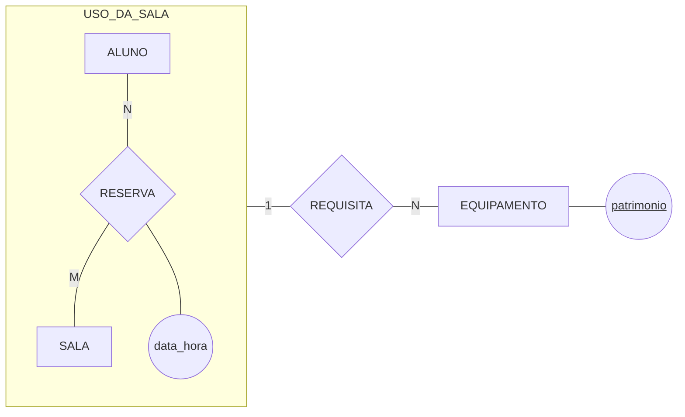

# Agregação — a reserva de sala e o equipamento

O caso da seção 2 da [Aula 08](../README.md), desenhado e convertido. É a referência de formato do `ex02`.

## O modelo conceitual



**O que este diagrama afirma sobre o mundo.** Um aluno reserva várias salas ao longo do tempo, e uma sala é reservada por vários alunos: a reserva é um relacionamento N:M, e a `data_hora` pertence a ele — não ao aluno nem à sala.

A caixa em volta diz que *aquele aluno, naquela sala, naquele horário* é **uma unidade**: o `USO_DA_SALA`. É essa unidade que requisita equipamento. O projetor não foi emprestado ao aluno (ele não pode levá-lo para casa) nem pertence à sala (ele é levado até ela) — ele está preso àquele uso específico.

## O esquema lógico

```
   ALUNO(matricula, nome, email)
   SALA(cod_sala, capacidade, andar)
   RESERVA(cod_reserva, data_hora,
           matricula → ALUNO, cod_sala → SALA)
   REQUISICAO(cod_reserva → RESERVA, patrimonio → EQUIPAMENTO)
   EQUIPAMENTO(patrimonio, descricao)
```

Duas coisas para reparar na conversão:

- **A agregação virou a tabela `RESERVA`**, com chave própria `cod_reserva`. Seria possível usar a chave composta `(matricula, cod_sala, data_hora)`, mas ela é grande e teria de ser copiada inteira em `REQUISICAO` — pelo critério de "menor" da Aula 07, a chave própria ganha;
- **`REQUISICAO` referencia a reserva inteira**, com uma coluna só. Se ela tivesse `matricula` e `cod_sala` separados, o modelo voltaria a permitir a combinação impossível: um equipamento ligado a um aluno e a uma sala que não formam reserva nenhuma. É esse o erro que a agregação existe para impedir.

## A política de exclusão

Ao apagar uma reserva, as requisições dela são **propagadas** — apagadas junto. A requisição não tem significado fora da reserva: ela é a ligação entre uma reserva e um equipamento, e sem uma das pontas não afirma coisa alguma.

> ⚠️ Repare que a **política do equipamento é outra**: apagar um equipamento do patrimônio com requisições registradas deve ser **recusado**, porque a requisição é histórico de uso da sala e o equipamento apenas participava dele.

---

⬅️ [Voltar à Aula 08](../README.md)
