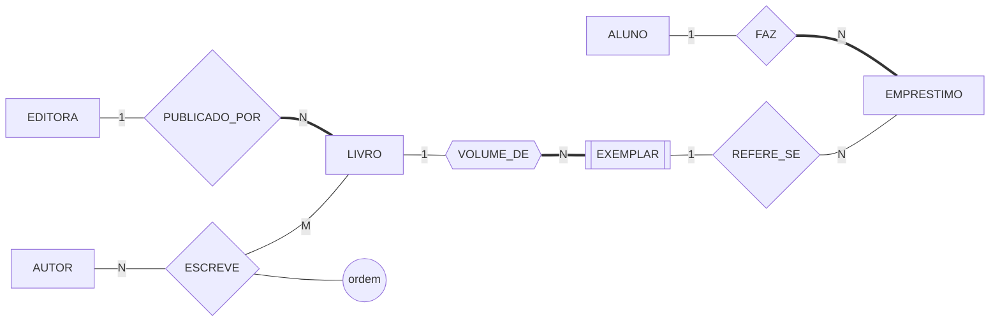

# Estudo de caso — Biblioteca Universitária

O projeto conceitual completo, do minimundo ao esquema lógico. É o modelo de entrega do `ex03`.

## 1. O minimundo

> A biblioteca controla o acervo e os empréstimos. O acervo é formado por **obras**, e de cada obra a biblioteca possui um ou mais **exemplares** físicos, numerados de 1 em diante dentro da obra. Cada obra tem ISBN, título, ano e uma editora; uma obra é escrita por um ou mais autores, e a ordem de assinatura importa para a ficha catalográfica. Os alunos, identificados pela matrícula, retiram exemplares por quinze dias. Cada empréstimo tem número próprio, registra a data de retirada e, quando o exemplar volta, a data de devolução. O histórico é mantido para sempre — empréstimo devolvido não é apagado.

## 2. As regras de negócio

```
   RN-01  Uma obra é publicada por exatamente uma editora.
   RN-02  Uma obra tem um ou mais autores, com ordem de assinatura.
   RN-03  Uma obra tem zero ou mais exemplares no acervo.
   RN-04  Um exemplar pertence a exatamente uma obra e é numerado dentro dela.
   RN-05  Um empréstimo refere-se a exatamente um exemplar.
   RN-06  Um empréstimo pertence a exatamente um aluno.
   RN-07  Um aluno pode ter vários empréstimos, simultâneos ou não.
   RN-08  O prazo padrão é de quinze dias, contados da retirada.
   RN-09  Empréstimo devolvido é mantido no histórico.
```

## 3. O modelo conceitual



Os atributos ficaram de fora do desenho de propósito — são muitos, e a régua do curso pede poucos por diagrama. Eles estão no esquema da seção 4.

**O que este diagrama afirma sobre o mundo.** Toda obra do acervo tem exatamente uma editora e não existe sem ela (RN-01, linha dupla). Uma obra é escrita por vários autores e um autor escreve várias obras; a ordem de assinatura pertence a esse encontro, não a nenhum dos dois lados (RN-02). Uma obra pode estar catalogada sem nenhum exemplar comprado, mas todo exemplar é volume de alguma obra e se numera dentro dela (RN-03, RN-04). Todo empréstimo tem exatamente um aluno e exatamente um exemplar, e nenhum dos dois é opcional (RN-05, RN-06); o mesmo aluno e o mesmo exemplar reaparecem em vários empréstimos ao longo do tempo (RN-07, RN-09).

## 4. O esquema lógico

```
   ALUNO(matricula, nome, email)
   EDITORA(cnpj, nome, cidade)
   AUTOR(cpf, nome, nacionalidade)
   LIVRO(isbn, titulo, ano, cnpj → EDITORA)
   ESCREVE(cpf → AUTOR, isbn → LIVRO, ordem)
   EXEMPLAR(isbn → LIVRO, numero_ex, situacao)
   EMPRESTIMO(numero, data_retirada, data_devolucao,
              matricula → ALUNO, isbn + numero_ex → EXEMPLAR)
```

**Políticas de exclusão**, decididas pela participação do diagrama:

| Ao apagar… | Política | Por quê |
|---|---|---|
| uma `EDITORA` com obras | recusar | a obra continua no acervo e precisa de editora (RN-01) |
| um `LIVRO` com exemplares | propagar | exemplar é entidade fraca — não existe sem a obra (RN-04) |
| um `LIVRO` com autores | propagar | a linha de `ESCREVE` só faz sentido com as duas pontas |
| um `ALUNO` com empréstimos | recusar | o histórico é registro da biblioteca (RN-09) |

## 5. As quatro perguntas de leitura

1. **Cada linha nas duas direções.** Todas verdadeiras no minimundo;
2. **Três ocorrências reais.** A obra doada sem editora conhecida **não cabe** — a RN-01 precisa ser confirmada com o bibliotecário, ou o acervo precisa de uma editora "não informada";
3. **Inserir e apagar.** Obra nova sem exemplar entra (RN-03). Aluno formado não pode ser apagado sem decisão sobre o histórico;
4. **Dado em dois lugares.** Nenhum — o nome da editora está só em `EDITORA`.

## 6. O que ficou fora do desenho

- **RN-08**, o prazo de quinze dias: regra sem símbolo em Chen, fica na lista;
- **RN-09**, a guarda do histórico: aparece indiretamente na política de exclusão;
- **O impedimento de dois empréstimos em aberto do mesmo exemplar**: regra com tempo dentro. Nenhuma integridade da Aula 07 pega isso — é responsabilidade da aplicação, e está registrado aqui para não se perder.

---

⬅️ [Voltar à Aula 08](../README.md)
