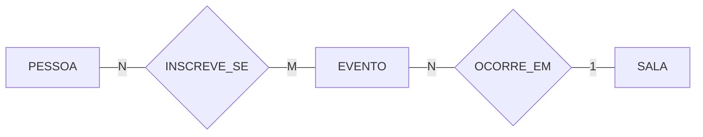
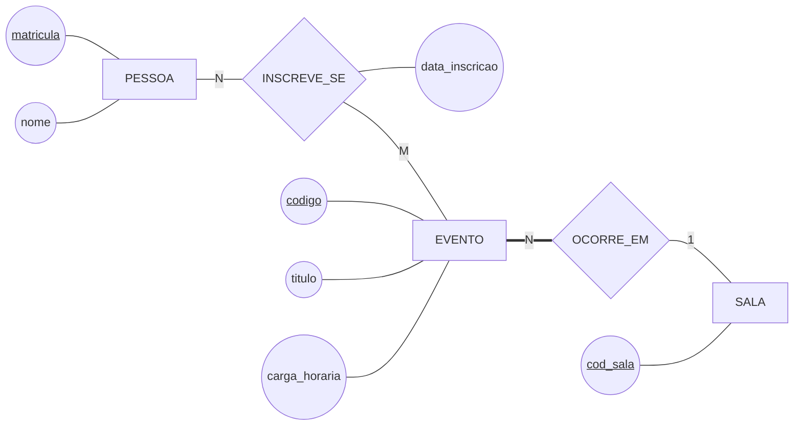

# Aula 09 — Como se Conduz uma Modelagem

> 🎯 Objetivos: escolher uma estratégia para começar um modelo, apresentar o mesmo DER em dois níveis de detalhe e documentar as decisões para que elas sobrevivam a quem as tomou.
> 🎬 Slides da aula: [apresentacao-09-como-se-conduz-uma-modelagem.pdf](apresentacao/apresentacao-09-como-se-conduz-uma-modelagem.pdf)

## 1. A folha em branco

Até aqui todo diagrama deste curso chegou pronto para ser lido. Agora a biblioteca pede um sistema novo — o de **eventos**: oficinas, palestras, inscrições, certificados, salas, palestrantes convidados — e a entrevista rendeu **trinta frases** e uma lista de dezoito substantivos.

Por onde se começa?

```
   OFICINA · PALESTRA · INSCRIÇÃO · CERTIFICADO · SALA · PALESTRANTE ·
   ALUNO · PROFESSOR · VAGA · LISTA DE ESPERA · CRACHÁ · MATERIAL ·
   CARGA HORÁRIA · PERÍODO · AVALIAÇÃO · PATROCÍNIO · COFFEE BREAK · FOTO
```

Quem tenta desenhar os dezoito de uma vez trava na terceira caixa. **Modelo grande não sai de uma tacada** — sai de uma ordem de ataque, e existem quatro conhecidas.

## 2. As quatro estratégias de modelagem

| Estratégia | Como se conduz | Quando funciona bem | O risco |
|---|---|---|---|
| **Top-down** | começa por poucos conceitos amplos e vai refinando | o cliente descreve o negócio em blocos grandes | refinar de menos e entregar um modelo vago |
| **Bottom-up** | começa pelos dados concretos — campos de formulário, colunas de planilha — e agrupa | existe sistema legado, formulário ou planilha em uso | copiar a bagunça do documento antigo |
| **Inside-out** | escolhe **uma** entidade central e vai puxando os vizinhos | há um conceito claramente central | ficar preso à vizinhança e perder o que está longe dela |
| **Mista** | divide o problema em partes, modela cada uma e **integra** | o domínio é grande e tem áreas distintas | as partes não encaixarem na hora da integração |

Aplicadas ao sistema de eventos, as quatro produzem começos diferentes:

- **Top-down:** *"há EVENTOS, PESSOAS e ESPAÇOS"* — e só depois se descobre que evento se divide em oficina e palestra;
- **Bottom-up:** parte da ficha de inscrição em papel, que tem nome, matrícula, evento, data e assinatura — cada campo vira candidato a atributo, e os grupos que se repetem viram entidades;
- **Inside-out:** começa em `INSCRICAO`, porque é onde tudo se encontra, e puxa quem se inscreve, em quê, quando, com que resultado;
- **Mista:** trata "programação" (evento, sala, horário) e "participação" (pessoa, inscrição, certificado) como duas frentes, e depois costura as duas pelo evento.

> 💡 **A inside-out é a mais produtiva para quem está começando**, e a biblioteca mostra por quê: partindo de `EMPRESTIMO`, as perguntas se fazem sozinhas — *quem pega? o que se pega? quando?* Cada resposta é uma entidade vizinha, e o modelo cresce sem que você precise saber o fim de antemão.

Vale ver a inside-out rodando, porque é a que você vai usar mais:

```
   PERGUNTA                             O QUE ENTRA NO DESENHO

   "O que é uma inscrição?"        →    INSCRICAO, no centro
   "Quem se inscreve?"             →    PESSOA, ligada a ela
   "Em quê?"                       →    EVENTO, ligado a ela
   "Quando?"                       →    data_inscricao — e repare que
                                        ela não é da pessoa nem do
                                        evento: é da ligação
   "O evento acontece onde?"       →    SALA, ligada a EVENTO
   "E o certificado, sai de quê?"  →    do par pessoa-evento — é a
                                        agregação da Aula 08
```

Seis perguntas, cinco elementos. Nenhuma delas exigiu saber o modelo inteiro de antemão — e é isso que faz a estratégia funcionar quando você está diante da folha em branco.

> ⚠️ **Nenhuma das quatro é "a certa".** Elas se misturam na prática: você começa inside-out, percebe que aluno e professor têm quase tudo em comum e faz um refinamento top-down ali. O nome importa para você **saber o que está fazendo** — e para explicar ao colega por que o modelo dele começou diferente do seu.

> 📖 As estratégias de condução da modelagem aparecem no Elmasri & Navathe, no capítulo de modelagem entidade-relacionamento, com o mesmo quadro de quatro.

## 3. O mesmo modelo em dois níveis

Modelo pronto tem dois públicos, e eles não querem o mesmo desenho.

A **descrição em alto nível** mostra só as entidades e as ligações. É a página que abre o documento e que o cliente consegue conferir:



A **descrição expandida** acrescenta atributos, identificadores, participação — tudo o que o desenho suporta. É o documento de trabalho:



São **o mesmo modelo**. Nada foi decidido de novo entre um e outro: o segundo mostra o que o primeiro já afirmava e mais o detalhe.

> ⚠️ **A ordem entre os dois não é livre.** Alto nível primeiro, sempre — é ele que se valida com o cliente, e um erro pego ali custa um traço. Levar a versão expandida para a primeira reunião faz o cliente discutir o nome de um atributo enquanto uma entidade inteira está faltando.

## 4. A documentação: o que o desenho não guarda

Um DER sem documento é um desenho que só a pessoa que o fez consegue defender — e ela esquece em três semanas. A documentação tem três partes.

**O dicionário de dados** — uma linha por atributo:

| Entidade | Atributo | Domínio | Obrigatório | Descrição |
|---|---|---|:---:|---|
| `PESSOA` | `matricula` | texto, 7 dígitos | sim | identificador institucional; é a chave |
| `PESSOA` | `nome` | texto até 80 | sim | nome completo, como sai no certificado |
| `EVENTO` | `codigo` | inteiro sequencial | sim | identificador do evento; é a chave |
| `EVENTO` | `titulo` | texto até 120 | sim | como o evento aparece no cartaz |
| `EVENTO` | `carga_horaria` | inteiro, 1 a 40 | sim | horas para efeito de certificado |
| `INSCREVE_SE` | `data_inscricao` | data | sim | dia em que a vaga foi tomada; ordena a fila |

**As regras numeradas**, no formato da Aula 04 — inclusive as que não viraram desenho, como *"a inscrição fecha 24 horas antes do evento"*.

**O registro das decisões**, que é a parte que todo mundo pula:

```
   D-01  PESSOA é uma entidade só, não ALUNO e PROFESSOR separados.
         Alternativa descartada: duas entidades independentes.
         Por quê: os dois se inscrevem do mesmo jeito e a diferença cabe
                  num atributo. Revisar se aparecer regra que valha só
                  para um dos dois (ver Aula 11).

   D-02  EVENTO tem participação total em OCORRE_EM.
         Alternativa descartada: evento sem sala definida.
         Por quê: o cliente confirmou que evento sem sala não é publicado.
```

**Onde tudo isso mora.** Num único `README.md` ao lado do diagrama, versionado com o modelo — e é aqui que o pré-requisito de Git do curso deixa de ser burocracia: quando alguém perguntar *"desde quando o evento exige sala?"*, a resposta é o histórico do arquivo, com data e mensagem de commit. Documento de modelagem em anexo de e-mail some; no repositório, ele envelhece junto com o que descreve.

> 💡 O registro de decisão vale mais que o diagrama daqui a um ano. O diagrama diz **o que** o modelo é; a decisão diz **o que ele quase foi, e por que não foi** — que é exatamente a pergunta que alguém vai fazer quando pedir a mudança que você já tinha considerado e recusado.

## 5. O roteiro de uma sessão de modelagem

A ordem que funciona, e que é a mesma quer você use top-down ou inside-out:

```
   1. ENTIDADES          liste os candidatos e aplique as três perguntas
                         da Aula 03. Recuse por escrito quem não passar.

   2. RELACIONAMENTOS    ligue o que se relaciona, sem números ainda.
                         Nomeie com verbo: INSCREVE_SE, OCORRE_EM.

   3. CARDINALIDADE      as duas perguntas, de cada lado: "quantos?"
      E PARTICIPAÇÃO     e "pode zero?" (Aula 06).

   4. ATRIBUTOS          agora, e só agora. Chave primeiro, depois os
                         que o cliente citou. Poucos por diagrama.

   5. LEITURA EM         cada linha, nas duas direções, em português.
      VOZ ALTA           (Aula 08, seção 6)
```

**Quando travar** — e você vai travar —, três saídas testadas: descreva a dúvida como uma frase que o modelo teria de afirmar e pergunte se é verdade; invente três ocorrências e tente guardá-las; ou pule o ponto, marque com `?` e siga — trecho travado costuma se resolver sozinho quando a vizinhança fica pronta.

> ⚠️ **Atributo por último não é preciosismo.** Quem começa listando atributos entra no bottom-up sem escolher, e o modelo passa a ser o formulário antigo redesenhado — com os defeitos dele, que ninguém mais vai questionar porque "sempre foi assim".

> 💻 **Modelos desta aula:** [`documentacao-der.md`](exemplos/documentacao-der.md) — o sistema de eventos documentado por inteiro: alto nível, expandido, dicionário, regras e decisões.

## 🏋️ Exercícios da aula

Na pasta `aula-09/` do seu repositório:

1. **`ex01.md`** — para cada situação, diga qual das quatro estratégias você adotaria e **por quê**, em duas linhas: (a) a secretaria entrega 12 planilhas em uso há seis anos; (b) o diretor descreve a instituição como "ensino, pesquisa e extensão" e pede um modelo dos três; (c) você vai modelar o controle de multas, e tudo gira em torno da multa; (d) o sistema cobre biblioteca, eventos e salas, e três pessoas diferentes vão modelar em paralelo. *Confere assim: são quatro estratégias e quatro situações, uma de cada — e a (d) é a única em que a palavra "integrar" precisa aparecer na sua justificativa.*

2. **`ex02.md`** — a partir da **descrição expandida** da seção 3, escreva a **descrição em alto nível** do modelo de eventos em texto corrido: um parágrafo curto por entidade, dizendo o que ela é e com quem se liga, **sem citar nenhum atributo**. *Confere assim: são quatro parágrafos e nenhum deles contém a palavra `matricula`, `codigo` ou `data_inscricao` — se contém, você escreveu a expandida de novo.*

3. **`ex03.md`** — o modelo de eventos ganhou uma regra nova: *"um evento pode ter um palestrante convidado externo, que não é aluno nem professor e de quem se guarda nome, instituição e telefone"*. Entregue três coisas: o **trecho de dicionário de dados** da entidade nova (uma linha por atributo, no formato da seção 4), **um registro de decisão** `D-03` com a alternativa que você descartou, e **uma frase** dizendo em que ponto do roteiro da seção 5 essa mudança entraria se o modelo estivesse sendo feito do zero. *Confere assim: a sua alternativa descartada tem que ser plausível — "não fazer nada" não é alternativa. A mais comum aqui é guardar o palestrante como atributo de `EVENTO`, e ela tem um defeito concreto que você precisa nomear.*

## 🧠 Revisão

[8 questões de múltipla escolha](revisao/README.md) para conferir se os conceitos ficaram sólidos. Responda sem consultar a aula — depois volte e corrija.

## ✅ Entrega

```bash
git add aula-09/
git commit -m "Resolve exercícios da aula 09 (condução e documentação da modelagem)"
git push
```

---

⬅️ [Aula 08 — Agregação e Estudo de Caso](../../bloco-2-modelos-de-banco-de-dados/aula-08-agregacao-e-estudo-de-caso/README.md) | ➡️ [Aula 10 — O Mesmo Caso em Duas Notações](../aula-10-o-mesmo-caso-em-duas-notacoes/README.md)
