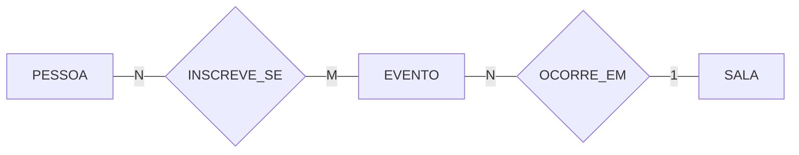
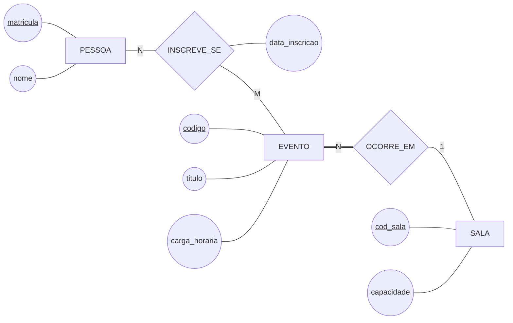

# O sistema de eventos, documentado

O modelo da [Aula 09](../README.md) com a documentação completa — as quatro partes que acompanham todo DER entregue neste curso. É o formato de referência do `ex03`.

## 1. Descrição em alto nível



A biblioteca promove **eventos** — oficinas e palestras — que acontecem em **salas** do prédio. **Pessoas** da comunidade acadêmica se inscrevem nos eventos. Um evento acontece em uma sala; uma sala recebe vários eventos ao longo do ano letivo. Uma pessoa se inscreve em vários eventos e um evento recebe várias inscrições.

## 2. Descrição expandida



Mesmo modelo, mais detalhe. A linha dupla em `EVENTO` diz que evento sem sala não existe (D-02).

## 3. Dicionário de dados

| Entidade | Atributo | Domínio | Obrigatório | Descrição |
|---|---|---|:---:|---|
| `PESSOA` | `matricula` | texto, 7 dígitos | sim | identificador institucional; é a chave |
| `PESSOA` | `nome` | texto até 80 | sim | nome completo, como sai no certificado |
| `EVENTO` | `codigo` | inteiro sequencial | sim | identificador do evento; é a chave |
| `EVENTO` | `titulo` | texto até 120 | sim | como o evento aparece no cartaz |
| `EVENTO` | `carga_horaria` | inteiro, 1 a 40 | sim | horas para efeito de certificado |
| `SALA` | `cod_sala` | texto, padrão `S-NNN` | sim | identificador da sala no prédio; é a chave |
| `SALA` | `capacidade` | inteiro, 1 a 200 | sim | lotação máxima; limita as inscrições |
| `INSCREVE_SE` | `data_inscricao` | data | sim | dia em que a vaga foi tomada; ordena a fila |

## 4. Regras de negócio

```
   RN-01  Uma pessoa se inscreve em vários eventos; um evento recebe
          várias inscrições.
   RN-02  Todo evento acontece em exatamente uma sala.
   RN-03  Uma sala recebe vários eventos, em horários diferentes.
   RN-04  O número de inscrições de um evento não passa da capacidade
          da sala em que ele ocorre.
   RN-05  A inscrição fecha 24 horas antes do início do evento.
   RN-06  Inscrição cancelada é mantida no histórico, com a data.
```

> ⚠️ **RN-04 e RN-05 não viraram desenho.** A primeira compara um total com um atributo de outra entidade; a segunda tem tempo dentro. Nenhuma das duas tem símbolo em Chen, e é por isso que a lista existe — sem ela, as duas regras desapareceriam do projeto.

## 5. Registro de decisões

```
   D-01  PESSOA é uma entidade só, não ALUNO e PROFESSOR separados.
         Alternativa descartada: duas entidades independentes.
         Por quê: os dois se inscrevem do mesmo jeito e a diferença cabe
                  num atributo. Revisar se aparecer regra que valha só
                  para um dos dois (ver Aula 11).

   D-02  EVENTO tem participação total em OCORRE_EM.
         Alternativa descartada: evento sem sala definida.
         Por quê: o cliente confirmou que evento sem sala não é publicado.

   D-03  A capacidade é atributo de SALA, não de EVENTO.
         Alternativa descartada: guardar o número de vagas no evento.
         Por quê: a lotação é física, da sala. Vaga por evento seria uma
                  regra a mais, e o cliente não pediu — se pedir, entra
                  como atributo de EVENTO sem desfazer esta decisão.
```

> 💡 Repare que a `D-01` já prevê a própria revisão. Decisão bem escrita não é a que acerta para sempre — é a que diz **em que condição ela deixa de valer**.

---

⬅️ [Voltar à Aula 09](../README.md)
