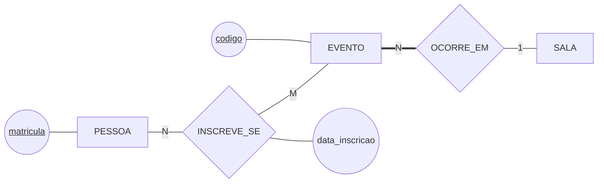
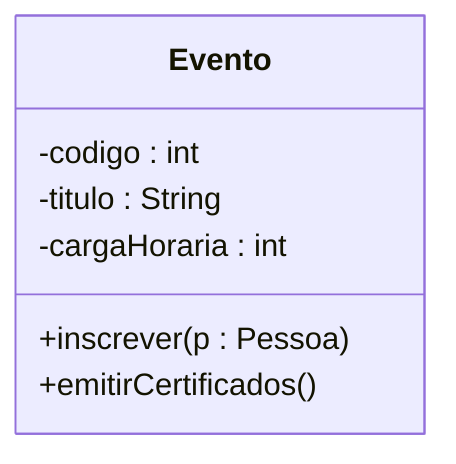
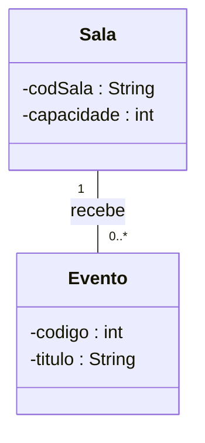
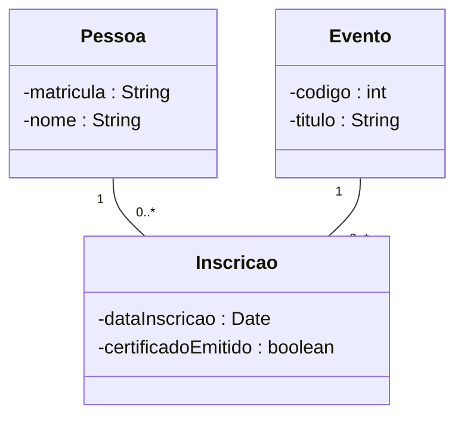
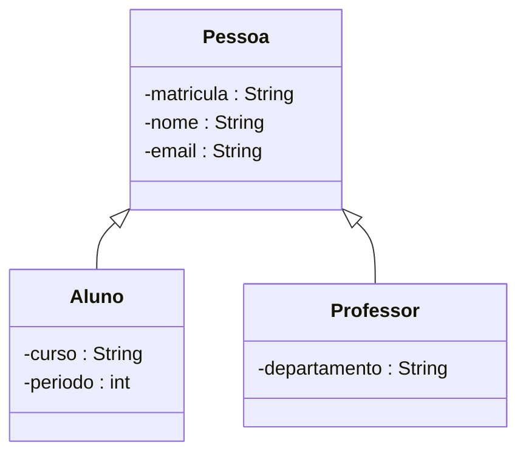

# Aula 10 — O Mesmo Caso em Duas Notações

> 🎯 Objetivos: ler um diagrama de classes UML, converter um DER em classes com associação e multiplicidade e reconhecer o que cada uma das duas notações mostra melhor.
> 🎬 Slides da aula: [apresentacao-10-o-mesmo-caso-em-duas-notacoes.pdf](apresentacao/apresentacao-10-o-mesmo-caso-em-duas-notacoes.pdf)

## 1. O caso, em DER

O sistema de eventos da Aula 09, com uma regra a mais: **quem participa recebe certificado**, e o certificado é daquela inscrição — não da pessoa, não do evento.



Esse desenho você já sabe ler. O que a aula faz é escrevê-lo **outra vez, em outra língua** — e é na tradução que se percebe o que cada notação assume sem dizer.

> 💡 As duas notações não competem. O DER é feito para **dados**: nasceu em 1976, do artigo do Chen, para descrever o que um banco guarda. A UML é feita para **sistemas**: descreve classes que têm dados **e comportamento**. Você vai encontrar as duas na mesma empresa, às vezes no mesmo documento.

## 2. A classe

Em UML, o retângulo tem **três compartimentos**: o nome, os atributos e as operações.



Três coisas mudaram em relação ao retângulo do DER:

- **O atributo tem tipo.** `codigo : int`, `titulo : String`. O DER não diz tipo — no Bloco 2 isso era decisão do modelo **físico**. A UML já mistura os dois níveis, e é preciso saber disso ao ler;
- **O `-` e o `+` são visibilidade.** `-` é privado (só a própria classe mexe), `+` é público. É vocabulário de programação, e entra aqui só para você reconhecer;
- **Existe um compartimento de operações**, e ele **não tem equivalente no DER**. Banco de dados não guarda comportamento.

> ⚠️ **Num modelo de dados, o terceiro compartimento fica vazio — e isso é correto.** Ao desenhar classes para representar um banco, você preenche nome e atributos e deixa as operações de fora. O Mermaid desenha a faixa vazia mesmo assim; ignore-a.

## 3. Associação e multiplicidade

O relacionamento do DER vira **associação**: uma linha entre duas classes, com um nome e com a **multiplicidade** nas pontas.



A multiplicidade é mais expressiva que o `1`, `N`, `M` de Chen, porque diz **duas coisas de uma vez** — quantos e se pode zero:

| Multiplicidade | Lê-se | Em Chen seria |
|---|---|---|
| `1` | exatamente um | `1` com participação total (linha dupla) |
| `0..1` | nenhum ou um | `1` com participação parcial |
| `1..*` | um ou mais | `N` com participação total |
| `0..*` ou `*` | qualquer quantidade, inclusive nenhuma | `N` com participação parcial |

> 💡 **É a fusão dos dois eixos da Aula 06.** "Quantos?" e "pode zero?" eram duas perguntas com duas respostas em dois lugares do desenho; em UML elas viram um símbolo só. Por isso a conversão de UML para Chen precisa de atenção: `1..*` vira **duas** marcas no diagrama de Chen.

**O lado em que o número fica é o mesmo nas duas notações** — a marca do "muitos" cai na mesma coluna:

```
   Chen   [SALA] ──1── {RECEBE} ──N── [EVENTO]
                                  ↑
   UML    Sala "1" ─── recebe ─── "0..*" Evento
                                  ↑
          nas duas, a marca de "muitos" está junto de EVENTO
```

O `0..*` encostado em `Evento` diz *"uma sala recebe de zero a muitos eventos"*, exatamente como o `N` encostado em `EVENTO`. A conversão é direta, ponta por ponta.

> ⚠️ **Onde o lado troca de verdade é na notação `(min,max)`**, que você vai encontrar em parte da literatura e em algumas ferramentas. Lá, o par escrito ao lado de uma entidade diz quantas vezes **cada ocorrência dela** participa do relacionamento — e o `(1,n)` acaba do lado que aqui recebe o `1`. Ao ler um diagrama de outra fonte, a primeira pergunta é sempre *"que convenção é esta?"*, e a resposta se confirma lendo uma linha em voz alta e conferindo se ela é verdade no mundo.

E o certificado, que no DER pedia agregação? Em UML ele é uma **classe de associação**: uma classe pendurada na própria associação. Como o Mermaid não desenha o conector tracejado dela, a convenção deste curso é a mesma da Aula 08 — desenhar a classe **no meio**, ligada às duas pontas:



## 4. Herança

Aqui está o que a UML tem e o DER de Chen puro não tem: um símbolo próprio para *"isto é um tipo de aquilo"*.

A biblioteca precisou separar quem se inscreve: aluno tem curso e período; professor tem departamento e pode propor evento. O que é comum — matrícula, nome, e-mail — não se repete:



O **triângulo vazado aponta para a superclasse**. Lê-se de baixo para cima: *"todo aluno é uma pessoa"*. `Aluno` e `Professor` são **subclasses** e herdam os três atributos de `Pessoa` — eles não são redesenhados embaixo.

> ⚠️ **O triângulo aponta para o geral, e o sentido não é decorativo.** Invertê-lo afirma que toda pessoa é um aluno, o que é falso. Na dúvida, leia a seta em voz alta com "é um": *"aluno é uma pessoa"* soa certo; *"pessoa é um aluno"*, não.

Quando essa separação se justifica — e quando ela é um erro — é a Aula 11 inteira. Aqui interessa a **notação**.

> 📖 O diagrama de classes com herança está no Fowler (*UML Essencial*), curto e direto, e no capítulo de modelagem entidade-relacionamento do Elmasri & Navathe, que apresenta a notação UML logo depois da de Chen.

## 5. A tabela de conversão

| No DER (Chen) | No diagrama de classes (UML) |
|---|---|
| Entidade | **Classe** |
| Atributo (elipse) | **atributo**, dentro da classe, com tipo |
| Atributo identificador (sublinhado) | atributo comum — a UML **não marca chave** |
| Relacionamento (losango) | **associação** (a linha), com nome |
| Cardinalidade `1`, `N`, `M` | **multiplicidade** `1`, `0..*`, `1..*` |
| Participação total (linha dupla) | multiplicidade que **começa em 1** |
| Entidade fraca | classe comum + associação `1` obrigatória |
| Agregação / entidade associativa | **classe de associação** |
| — (não existe em Chen puro) | **herança**, o triângulo |
| — (não existe) | **operações**, o terceiro compartimento |

> ⚠️ **A UML não marca chave primária, e isso não é esquecimento.** Objeto tem identidade própria na memória, não precisa de chave para se distinguir. Quando o modelo UML vai virar banco, alguém precisa **decidir a chave de novo** — e é aí que voltam as três perguntas da Aula 07.

## 6. O que cada uma mostra melhor

| | DER de Chen | Classes UML |
|---|---|---|
| Feito para | dados | sistemas inteiros |
| Mostra bem | multivalorado, derivado, participação, chave | herança, comportamento, tipos |
| Esconde | comportamento e tipo | chave e os tipos de atributo do Chen |
| Público | quem modela o banco, e o cliente | equipe de desenvolvimento |

Nenhuma das duas é a versão moderna da outra. O que decide é **para quem você está desenhando** — e num projeto grande, os dois documentos coexistem, mostrando o mesmo mundo para leitores diferentes.

> 💻 **Modelos desta aula:** [`der-e-classes.md`](exemplos/der-e-classes.md) — o caso de eventos completo nas duas notações, lado a lado, com a conversão explicada linha a linha.

## 🏋️ Exercícios da aula

Na pasta `aula-10/` do seu repositório:

1. **`ex01.md`** — converta para **multiplicidade UML** cada um destes lados do DER da biblioteca, justificando em uma linha: (a) `EMPRESTIMO` em `FAZ`, cardinalidade `N` e participação total; (b) `ALUNO` em `FAZ`, cardinalidade `1` e participação parcial; (c) `EXEMPLAR` em `VOLUME_DE`, cardinalidade `N` e participação total; (d) `LIVRO` em `VOLUME_DE`, cardinalidade `1` e participação parcial. *Confere assim: duas viram multiplicidade começando em `1` e duas começando em `0` — e o que decide não é a cardinalidade, é a participação.*

2. **`ex02.md`** — desenhe em Mermaid `classDiagram` o trecho da biblioteca com `Livro`, `Exemplar` e `Editora`: os atributos com tipo, as associações nomeadas e a multiplicidade nas quatro pontas. Abaixo, escreva **duas linhas** dizendo o que se perdeu na tradução do DER para a UML. *Confere assim: a chave primária é uma das duas perdas, e a outra aparece se você olhar o `numero_ex` do exemplar — ele era chave parcial de uma entidade fraca, e em UML virou um atributo qualquer.*

3. **`ex03.md`** — a biblioteca resolveu registrar os **funcionários**: todos têm matrícula funcional, nome e ramal; os **atendentes** têm turno; os **bibliotecários** têm número de registro no conselho profissional. Desenhe o diagrama de classes com a herança, e escreva **um parágrafo** dizendo o que aconteceria com esse modelo se ele fosse desenhado em DER de Chen puro, sem o triângulo. *Confere assim: o seu parágrafo precisa citar o que seria repetido — e a resposta não é "nada muda", porque Chen puro não tem símbolo para herança.*

## 🧠 Revisão

[8 questões de múltipla escolha](revisao/README.md) para conferir se os conceitos ficaram sólidos. Responda sem consultar a aula — depois volte e corrija.

## ✅ Entrega

```bash
git add aula-10/
git commit -m "Resolve exercícios da aula 10 (DER e classes UML)"
git push
```

---

⬅️ [Aula 09 — Como se Conduz uma Modelagem](../aula-09-como-se-conduz-uma-modelagem/README.md) | ➡️ [Aula 11 — Especialização, Generalização e as Ferramentas](../aula-11-especializacao-e-generalizacao/README.md)
