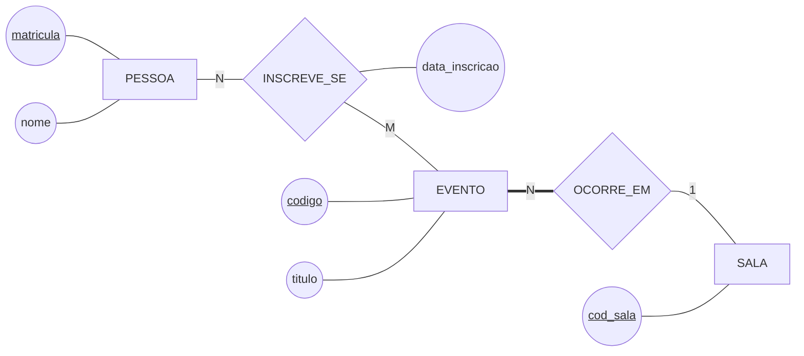
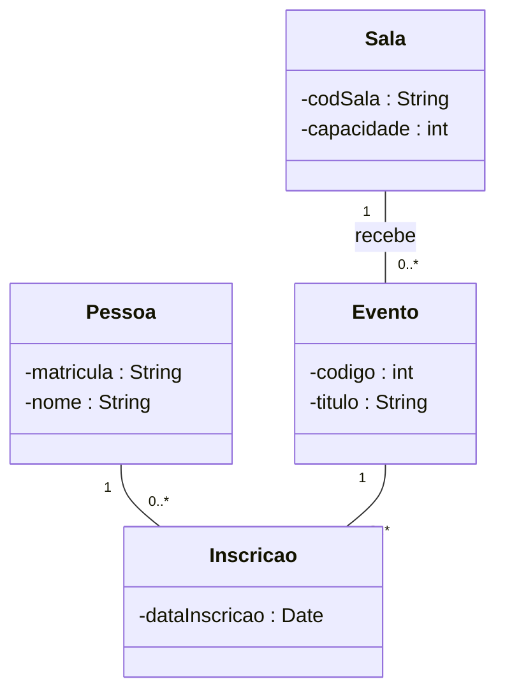

# O sistema de eventos nas duas notações

O mesmo modelo escrito em DER de Chen e em diagrama de classes UML, com a conversão explicada linha a linha. É a referência de formato do `ex02` e do `ex03`.

## 1. Em DER de Chen

## 2. Em classes UML

## 3. A conversão, linha a linha

| No DER | Virou em UML | Por quê |
|---|---|---|
| `PESSOA`, `EVENTO`, `SALA` | classes `Pessoa`, `Evento`, `Sala` | entidade vira classe, direto |
| `matricula` sublinhado | `-matricula : String` | a UML **não marca chave** — o sublinhado se perdeu |
| `INSCREVE_SE` (N:M com atributo) | classe `Inscricao` no meio | é a classe de associação; o Mermaid não desenha o conector tracejado dela |
| `data_inscricao` no losango | `-dataInscricao : Date` dentro de `Inscricao` | o atributo do relacionamento mora na classe de associação |
| `EVENTO` com linha dupla em `OCORRE_EM` | multiplicidade `1` do lado de `Sala` | participação total virou multiplicidade que começa em 1 |
| `SALA` com `1` e participação parcial | `0..*` do lado de `Evento` | uma sala pode não ter evento nenhum marcado |

## 4. O que se perdeu, e o que se ganhou

**Perdeu-se:**

- **A chave.** Nada em `Pessoa` diz que `matricula` identifica. Quando esse modelo virar banco, alguém decide a chave de novo — com as três perguntas da Aula 07;
- **O tipo de atributo do Chen.** Se `telefone` fosse multivalorado, o DER mostraria a elipse dupla; em UML ele viraria `-telefones : List` ou uma classe à parte, e a decisão fica implícita;
- **A distinção entre participação e cardinalidade.** As duas viraram um símbolo só. Não é perda de informação — é perda de **visibilidade** dos dois eixos.

**Ganhou-se:**

- **Tipo em cada atributo**, o que aproxima o documento de quem vai programar;
- **Herança**, que Chen puro não tem símbolo para representar (é a Aula 11);
- **Comportamento**, o terceiro compartimento — vazio aqui, porque um modelo de dados não guarda operação.

> ⚠️ Ao comparar os dois desenhos, repare que **o `0..*` está sempre do mesmo lado em que o Chen escreve o `N`**. É o que torna a conversão mecânica. Se você encontrar um diagrama em que o par `(1,n)` aparece do outro lado, ele está na notação `(min,max)` — outra convenção, descrita no [guia de notações](../../../recursos/notacoes-der.md).

---

⬅️ [Voltar à Aula 10](../README.md)
