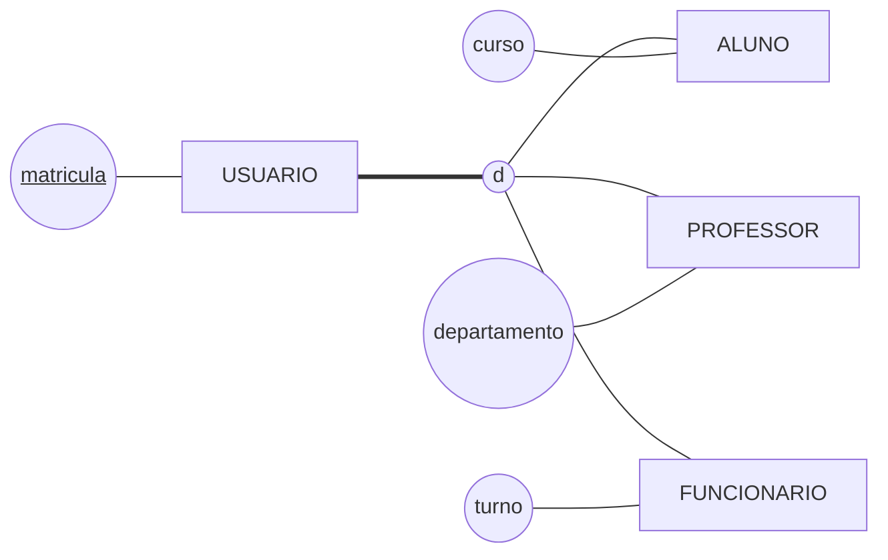
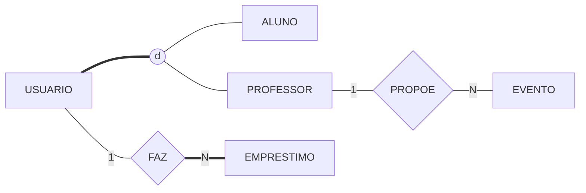
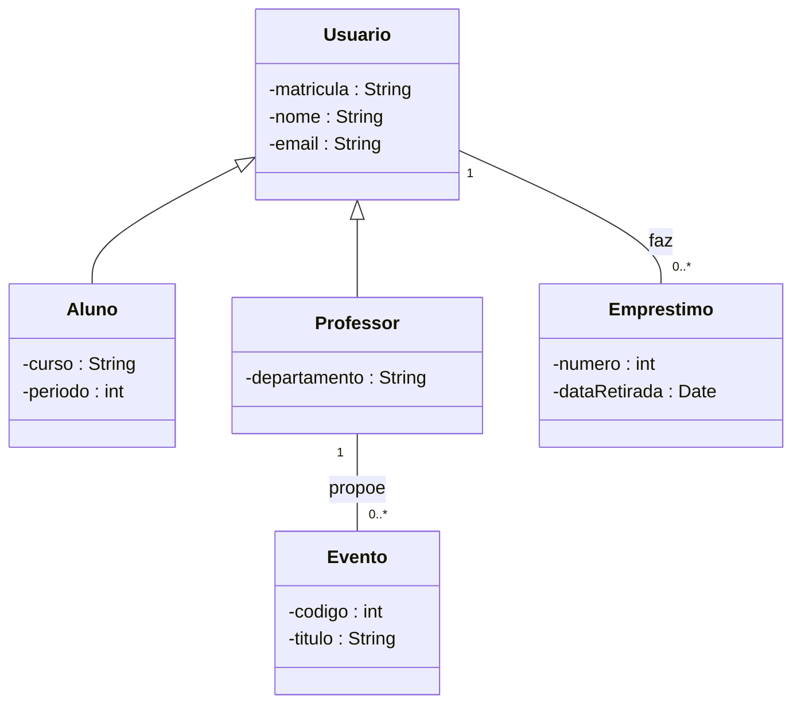

# Aula 11 — Especialização, Generalização e as Ferramentas

> 🎯 Objetivos: decidir quando uma especialização se justifica, classificá-la nos dois eixos obrigatórios e dizer o que uma ferramenta CASE faz — e o que ela não faz.
> 🎬 Slides da aula: [apresentacao-11-especializacao-e-generalizacao.pdf](apresentacao/apresentacao-11-especializacao-e-generalizacao.pdf)

## 1. A entidade que não cabe em si mesma

A biblioteca atende três públicos, e o cadastro tentou resolver tudo numa entidade só:

```
   USUARIO
   ┌───────────┬────────────┬────────┬─────────┬──────────────┬───────────┐
   │ matricula │ nome       │ curso  │ periodo │ departamento │ turno     │
   ├───────────┼────────────┼────────┼─────────┼──────────────┼───────────┤
   │  2023101  │ Ana Souza  │ ADS    │    3    │      —       │     —     │
   │  1099     │ Carlos Reis│   —    │    —    │ Computação   │     —     │
   │  7712     │ Marta Dias │   —    │    —    │      —       │  noturno  │
   └───────────┴────────────┴────────┴─────────┴──────────────┴───────────┘
```

Metade da tabela é traço. Pior: nada impede que alguém preencha `curso` **e** `departamento` na mesma linha, e o modelo não sabe dizer que isso é absurdo.

A saída não é criar três entidades soltas — matrícula, nome e e-mail se repetiriam nas três, e o empréstimo teria de apontar para três lugares diferentes. A saída é dizer o que essas três coisas **são**: tipos de uma mesma coisa.

## 2. Especialização e generalização

**Especialização** é partir de uma entidade genérica e identificar subconjuntos com características próprias: de `USUARIO` saem `ALUNO`, `PROFESSOR` e `FUNCIONARIO`. É o caminho **de cima para baixo**.

**Generalização** é o inverso: você já tem `ALUNO`, `PROFESSOR` e `FUNCIONARIO` e percebe que os três compartilham matrícula, nome e e-mail — então cria `USUARIO` para abrigar o que é comum. É **de baixo para cima**.

> 💡 São as estratégias top-down e bottom-up da Aula 09 aplicadas a uma entidade só. O **desenho resultante é o mesmo**; o que muda é por onde você chegou nele. Discutir "isto é especialização ou generalização?" olhando um diagrama pronto é discutir o caminho de quem já chegou.

Em Chen, a ligação vai da superclasse para as subclasses, e o círculo no meio carrega a classificação da seção 3:



As subclasses **herdam** matrícula, nome e e-mail — repare que esses atributos aparecem **uma vez só**, pendurados em `USUARIO`. Redesenhá-los embaixo é o erro que denuncia quem não entendeu a herança.

> ⚠️ **Convenção do curso, porque o Mermaid não tem o símbolo.** O círculo `d` marca especialização **disjunta** e o `o`, **sobreposta**; a linha dupla `===` entre a superclasse e o círculo marca especialização **total**, e a simples, parcial. A tabela completa está no [guia de notações](../../recursos/notacoes-der.md).

## 3. As duas perguntas que toda especialização responde

Não existe especialização "solta": ela sempre responde a **duas perguntas independentes**.

**Primeira — toda ocorrência da superclasse está em alguma subclasse?**

- **Total:** sim, obrigatoriamente. Não existe usuário que não seja aluno, professor ou funcionário;
- **Parcial:** não. Poderia haver um usuário da comunidade externa, que não é nenhum dos três.

**Segunda — uma ocorrência pode estar em mais de uma subclasse ao mesmo tempo?**

- **Disjunta:** não. Ou é aluno, ou é professor;
- **Sobreposta:** sim. O professor que faz mestrado é professor **e** aluno.

Quatro combinações, e você escolhe uma e **escreve qual**:

| | Disjunta | Sobreposta |
|---|---|---|
| **Total** | todo usuário é exatamente um dos três | todo usuário é pelo menos um dos três |
| **Parcial** | pode não ser nenhum; se for, é só um | pode não ser nenhum, e pode ser vários |

> ⚠️ **Diagrama que não diz qual das quatro é está incompleto**, e o custo aparece na implantação: é essa classificação que decide se a coluna aceita vazio e se o sistema pode recusar o segundo cadastro da mesma pessoa. O catálogo de [erros comuns](../../recursos/erros-comuns.md) tem o caso clássico — subclasses sobrepostas tratadas como disjuntas, e o primeiro professor-aluno que aparece derruba o cadastro.

## 4. Quando não especializar

A especialização é a construção mais usada em excesso do curso. Três testes recusam a maioria dos casos:

**O teste do atributo próprio.** Se a subclasse não tem atributo nem relacionamento que as outras não tenham, ela não existe. `CLIENTE_ATIVO` e `CLIENTE_INATIVO`, cuja única diferença é estar ativo, são um **atributo** `situacao` — não duas subclasses.

**O teste do tempo.** *"Isso pode mudar durante a vida do registro?"* Se pode, é **papel**, não tipo. `ALUNO` e `EX_ALUNO` como subclasses quebram no dia da formatura: o registro teria de mudar de classe, arrastando o histórico junto. Papel que muda vira **relacionamento com período**.

**O teste do tamanho.** Uma subclasse com um atributo próprio só, e mais nada, raramente paga o custo de existir. Pergunte se aquele atributo não vive melhor como opcional na superclasse.

> 💡 O par `ALUNO` / `PROFESSOR` da biblioteca passa nos três: cada um tem atributos próprios, ninguém deixa de ser aluno de um dia para o outro sem sair da instituição, e há relacionamento exclusivo — só professor propõe evento. Já *"usuário adimplente e inadimplente"* falha nos três de uma vez.

## 5. Estudo de caso: o mesmo modelo nas duas notações

Em Chen, com a especialização total e disjunta e o relacionamento que só o professor tem:



Em UML, a mesma coisa — e aqui a herança tem símbolo nativo, o triângulo da Aula 10:



Duas diferenças que valem anotar: o **empréstimo se liga à superclasse**, porque qualquer usuário pega livro; e a UML **não tem símbolo para disjunta ou total** — isso se escreve como restrição, `{disjoint, complete}`, ao lado do triângulo, ou fica no texto. Mais uma informação que só sobrevive se alguém escrever.

**E como isso vira tabela?** Não há um jeito só. São três, e a escolha depende da classificação da seção 3:

| Estratégia | O esquema fica | Boa quando |
|---|---|---|
| **Uma tabela só** | `USUARIO(matricula, nome, tipo, curso, periodo, departamento)` | há poucos atributos próprios — é a tabela cheia de traços da seção 1, aceitável quando ela é pequena |
| **Uma tabela por subclasse** | `ALUNO(matricula, nome, curso, periodo)` e `PROFESSOR(matricula, nome, departamento)` | a especialização é **total e disjunta**, e quase nada é comum |
| **Superclasse + subclasses** | `USUARIO(matricula, nome)`, `ALUNO(matricula → USUARIO, curso, periodo)`, `PROFESSOR(matricula → USUARIO, departamento)` | é o caso geral, e o único que funciona bem com especialização **parcial ou sobreposta** |

> 💡 A terceira é a que preserva o desenho: cada caixa do diagrama vira uma tabela, e a chave da subclasse **é** a chave da superclasse — as duas se ligam por igualdade. O preço é ter de juntar duas tabelas para montar a ficha completa de um aluno; a vantagem é que o empréstimo continua apontando para um lugar só.

## 6. O que é uma ferramenta CASE

**CASE** é *Computer-Aided Software Engineering* — o nome genérico das ferramentas que apoiam a construção de software, incluindo o desenho e a manutenção de modelos de dados.

O que uma ferramenta CASE de modelagem faz por você:

- **Desenha e mantém o diagrama**, com as formas da notação prontas;
- **Verifica consistência** — avisa quando um relacionamento ficou sem cardinalidade;
- **Converte o modelo conceitual em lógico** com um comando, aplicando as regras da Aula 07;
- **Gera o esquema físico** e, em algumas, faz o caminho inverso a partir de um banco existente.

E o que ela **não** faz:

- **Não decide.** A ferramenta não sabe se `SITUACAO` é entidade ou atributo, nem se a especialização é disjunta;
- **Não conversa com o cliente.** As regras de negócio continuam vindo da entrevista;
- **Não revisa a conversão.** O modelo lógico gerado automaticamente é um rascunho — nomes, chaves e políticas de exclusão precisam ser lidos um a um.

> ⚠️ **Ferramenta boa acelera quem sabe modelar e esconde o erro de quem não sabe.** Um modelo errado desenhado numa CASE fica bonito, alinhado e continua errado — e agora com aparência de aprovado.

> 💻 **Modelos desta aula:** [`especializacao-usuario.md`](exemplos/especializacao-usuario.md) — as quatro combinações desenhadas, com o caso da biblioteca classificado e justificado.

## 🏋️ Exercícios da aula

Na pasta `aula-11/` do seu repositório:

1. **`ex01.md`** — para cada especialização proposta, diga se ela **se justifica** ou não, aplicando por escrito um dos três testes da seção 4: (a) `EXEMPLAR` em `EXEMPLAR_DISPONIVEL` e `EXEMPLAR_EMPRESTADO`; (b) `USUARIO` em `ALUNO` e `PROFESSOR`; (c) `EVENTO` em `OFICINA` (que tem número de vagas e material) e `PALESTRA` (que tem palestrante convidado); (d) `LIVRO` em `LIVRO_NOVO` e `LIVRO_ANTIGO`, pela data de aquisição. *Confere assim: duas se justificam e duas não — e as duas recusadas caem em testes diferentes, uma no do estado e outra no do tempo.*

2. **`ex02.md`** — classifique cada especialização nos **dois eixos** (total ou parcial, disjunta ou sobreposta), justificando cada eixo em uma linha: (a) `PESSOA` em `ALUNO` e `PROFESSOR`, numa faculdade em que professores podem cursar pós-graduação; (b) `EVENTO` em `OFICINA` e `PALESTRA`, sabendo que todo evento é um ou outro; (c) `VEICULO` em `CARRO_DA_BIBLIOTECA`, numa instituição que também tem bicicletas e vans não cadastradas. *Confere assim: cada item tem **duas** respostas, e nenhuma das três combinações se repete.*

3. **`ex03.md`** — desenhe em Mermaid a especialização do item (c) do `ex01` — `EVENTO` em `OFICINA` e `PALESTRA` — na **notação de Chen** com o círculo e a linha de participação corretos, e depois a mesma coisa em **classes UML**. Abaixo, escreva a classificação nos dois eixos e **uma linha** dizendo o que a versão UML deixou de registrar. *Confere assim: a resposta da última linha é a mesma para qualquer especialização desenhada em UML — está no fim da seção 5.*

## 🧠 Revisão

[8 questões de múltipla escolha](revisao/README.md) para conferir se os conceitos ficaram sólidos. Responda sem consultar a aula — depois volte e corrija.

## ✅ Entrega

```bash
git add aula-11/
git commit -m "Resolve exercícios da aula 11 (especialização e generalização)"
git push
```

---

⬅️ [Aula 10 — O Mesmo Caso em Duas Notações](../aula-10-o-mesmo-caso-em-duas-notacoes/README.md) | ➡️ [Aula 12 — Ferramentas CASE na Prática](../aula-12-ferramentas-case-na-pratica/README.md)
