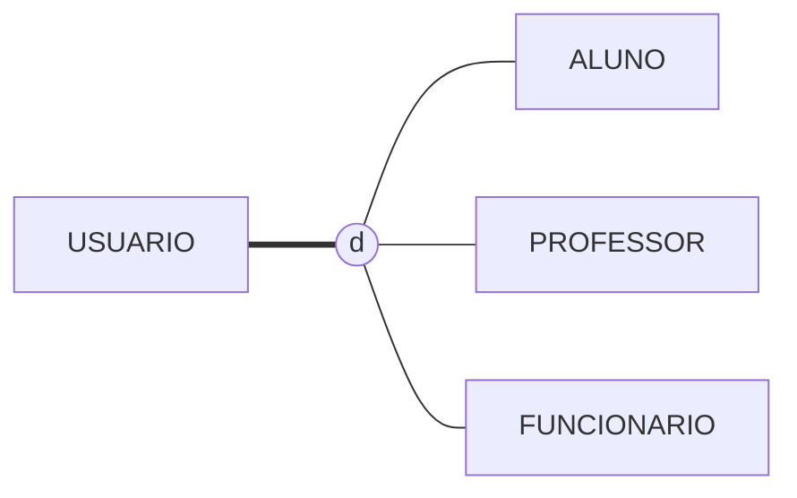
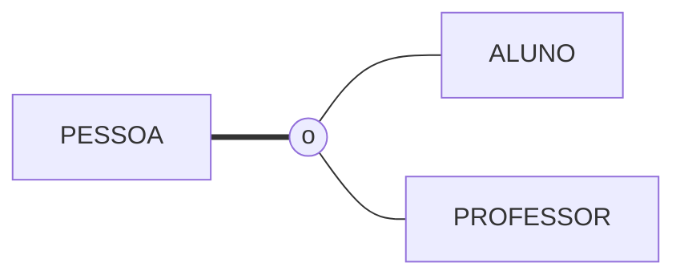
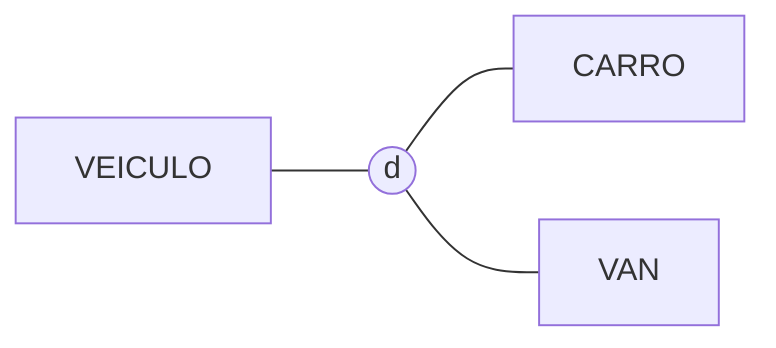

# As quatro combinações, desenhadas

Toda especialização responde a duas perguntas. Aqui estão as quatro respostas possíveis, cada uma com um caso da biblioteca. É a referência do `ex02` e do `ex03`.

## Total e disjunta — `===` e `d`

Todo usuário é **exatamente um** dos três.



*Vale quando:* a instituição só cadastra quem pertence a uma das três categorias, e os cargos são exclusivos.

## Total e sobreposta — `===` e `o`

Todo usuário é **pelo menos um** dos dois, e pode ser os dois.



*Vale quando:* o professor pode cursar a pós-graduação da própria instituição — e aí ele é aluno e professor ao mesmo tempo, com matrícula única.

## Parcial e disjunta — `---` e `d`

Pode não ser nenhum; se for, é só um.



*Vale quando:* a biblioteca cadastra veículos para entrega entre campi, mas bicicletas e outros veículos ficam sem subtipo.

## Parcial e sobreposta — `---` e `o`

Pode não ser nenhum, e pode ser vários.


*Vale quando:* nem todo funcionário atende no balcão ou monitora eventos, e há quem faça as duas coisas.

## O caso da biblioteca, classificado

| Pergunta | Resposta | Por quê |
|---|---|---|
| Toda ocorrência de `USUARIO` está em alguma subclasse? | **total** | o cadastro só existe para aluno, professor ou funcionário |
| Uma ocorrência pode estar em mais de uma? | **disjunta** | confirmado com a secretaria: o professor que estuda usa a matrícula funcional |

**A decisão registrada:**

```
   D-04  A especialização de USUARIO é total e disjunta.
         Alternativa descartada: sobreposta.
         Por quê: a secretaria confirmou que quem tem vínculo duplo usa
                  a matrícula funcional, e não abre segundo cadastro.
         Revisar se: a instituição passar a permitir matrícula dupla —
                  a mudança é de um símbolo no diagrama e de uma regra
                  no sistema, e é bem mais barata se estiver escrita.
```

> ⚠️ Repare que a classificação **não se deduz do desenho**: ela vem de uma pergunta feita a uma pessoa. Diagrama nenhum sabe se a instituição permite vínculo duplo — quem sabe é a secretaria.

---

⬅️ [Voltar à Aula 11](../README.md)
