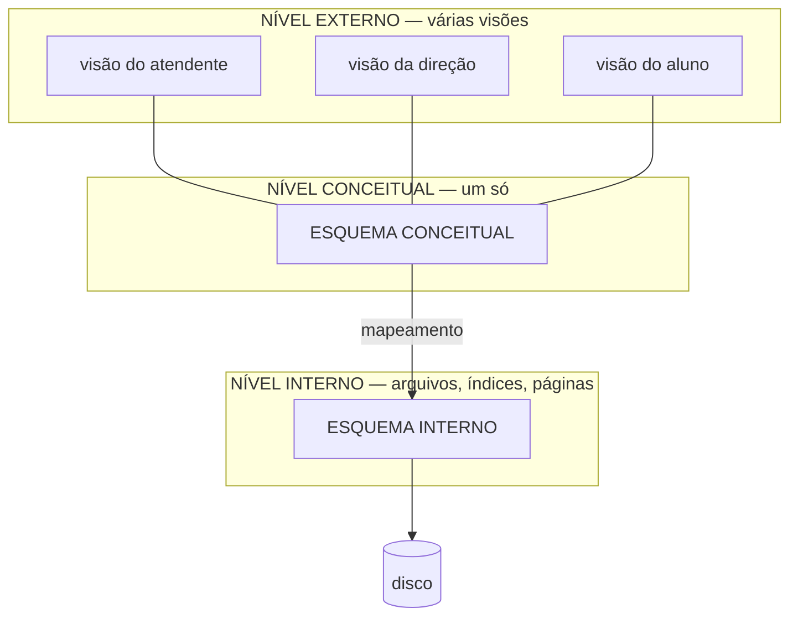

# Aula 10 — Arquitetura e Independência de Dados

> 🎯 Objetivos: separar esquema de instância com suas consequências práticas, explicar o que a arquitetura em três níveis protege e classificar comandos em DDL, DML e DCL.
> 🎬 Slides da aula: [apresentacao-10-arquitetura-independencia.pdf](apresentacao/apresentacao-10-arquitetura-independencia.pdf)

## 1. Esquema × instância, e por que a diferença é cara

Você já usou os dois termos na Aula 01. Agora eles ganham consequência.

```
   ESQUEMA (a forma)                    INSTÂNCIA (o conteúdo, hoje às 14h32)
   ─────────────────────────            ──────────────────────────────────────
   USUARIO(matricula, nome,             (2023101, 'Ana Souza',  'aluno')
           categoria)                   (2023102, 'Bruno Lima', 'aluno')
                                        (2024007, 'Célia Reis', 'professor')
```

O esquema é a planta da casa; a instância é a casa mobiliada num certo dia. Mudar a planta é obra. Trocar os móveis é terça-feira.

> ⚠️ **Um erro de esquema é incomparavelmente mais caro que um erro de instância.** Dado errado se corrige com um comando. Esquema errado se corrige migrando todos os dados existentes, reescrevendo todo programa que o usa e explicando à gerência por que o sistema vai ficar fora do ar no sábado. É por isso que as oito primeiras aulas trataram só de esquema.

## 2. A arquitetura em três níveis

Proposta pelo comitê ANSI/SPARC nos anos 1970, é o modelo mental que todo SGBD moderno realiza:



**Nível interno** — como os dados estão fisicamente armazenados: organização dos arquivos, quais índices existem, como as páginas são gravadas. Este curso não trata dele; o [guia de links](../../recursos/links-uteis.md) aponta por onde seguir.

**Nível conceitual** — **todas** as tabelas, colunas, chaves e restrições da organização, sem falar de disco. É exatamente o que você construiu nos Blocos 1 e 2.

**Nível externo** — o que cada grupo de usuários enxerga. Um recorte, quase sempre menor, às vezes reorganizado, do nível conceitual. No SQL, cada visão externa é uma `VIEW` (Aula 15).

Os três, sobre o mesmo dado:

| Nível | O que se diz |
|---|---|
| Externo (atendente) | "Empréstimos vencidos: nome do aluno, título do livro, dias de atraso" |
| Conceitual | `EMPRESTIMO(id_emprestimo, matricula, tombo, data_retirada, data_prevista, data_devolucao)`, com FKs para `USUARIO` e `EXEMPLAR` |
| Interno | Arquivo em páginas de 8 KB, índice em `id_emprestimo`, índice secundário em `data_prevista` |

## 3. Independência física

**Mudar o nível interno sem mexer no conceitual nem nos programas.**

Criar um índice, trocar o disco, reorganizar arquivos: nenhuma consulta precisa ser reescrita. O programa continua pedindo "os empréstimos vencidos" e o banco continua entregando — mais rápido ou mais devagar, mas entregando.

É a independência fácil, e todo SGBD entrega bem. Você a recebe de graça pelo simples fato de a ligação ser **por valor** e não por endereço, como você viu na Aula 03.

## 4. Independência lógica

**Mudar o nível conceitual sem mexer nas visões externas.**

Acrescentar uma tabela, acrescentar uma coluna, dividir uma tabela em duas: os programas que não usam a novidade continuam funcionando. É a independência difícil, e a que se perde com mais facilidade.

```
   Mudança                                      Que independência protege?
   ──────────────────────────────────────────   ──────────────────────────
   Criar um índice em data_prevista             física
   Migrar o banco para um disco novo            física
   Acrescentar a coluna "email" em USUARIO      lógica
   Separar CONTATO de USUARIO em outra tabela   lógica (se houver uma VIEW no lugar antigo)
   Renomear "nome" para "nome_completo"         nenhuma — quebra tudo que a cita
```

> 💡 **A independência lógica não é automática — é conquistada.** O programa que pede "todas as colunas" e confia na ordem delas perde a independência na primeira alteração. O que pede as colunas pelo nome sobrevive. Escrever nomes de coluna explicitamente é uma decisão de arquitetura disfarçada de estilo — e você vai ver a sintaxe disso na Aula 14.

## 5. As três famílias de comandos

A linguagem de um SGBD divide-se por finalidade. Em SQL, as três convivem no mesmo dialeto:

**DDL — linguagem de definição de dados.** Define e altera o **esquema**: `CREATE`, `ALTER`, `DROP`, `TRUNCATE`. Mexe na forma. É a Aula 13.

**DML — linguagem de manipulação de dados.** Manipula a **instância**: `INSERT`, `UPDATE`, `DELETE` e `SELECT`. Mexe no conteúdo. São as Aulas 14 e 15.

**DCL — linguagem de controle de dados.** Controla **quem pode o quê**: `GRANT`, `REVOKE`. Aparece na Aula 12.

```sql
CREATE TABLE usuario (...);              -- DDL: cria a forma
INSERT INTO usuario VALUES (...);        -- DML: põe conteúdo
SELECT * FROM usuario;                   -- DML: consulta o conteúdo
GRANT SELECT ON usuario TO atendente;    -- DCL: autoriza
DROP TABLE usuario;                      -- DDL: destrói a forma (e o conteúdo junto)
```

> ⚠️ **`DELETE` e `DROP` não são sinônimos, e a confusão custa caro.** `DELETE FROM usuario;` apaga todas as linhas e deixa a tabela vazia, de pé. `DROP TABLE usuario;` apaga a tabela inteira — estrutura, chaves, restrições e dados. O primeiro é DML e se desfaz dentro de uma transação; o segundo é DDL.

Há ainda quem separe uma quarta família, de controle de transação: `COMMIT`, `ROLLBACK`. Alguns autores a colocam dentro da DML. É a Aula 12.

## 6. O catálogo: o banco que descreve o banco

Quando você cria uma tabela, o SGBD guarda essa informação **em tabelas próprias**. O conjunto delas chama-se **catálogo**, e é o que permite ao banco validar consultas, planejar execuções e responder quando alguém pergunta como uma tabela é feita.

No PostgreSQL, o catálogo é consultável como qualquer outra coisa:

```sql
SELECT table_name, column_name, data_type
FROM information_schema.columns
WHERE table_schema = 'public'
ORDER BY table_name, ordinal_position;
```

Esse comando devolve **o esquema conceitual do seu banco, lido do próprio banco**. É a definição de metadado: dado sobre dado. Na Aula 11 você vai rodá-lo de verdade.

> 💡 Um SGBD que guarda a própria descrição no formato que ele mesmo gerencia é um sistema **autodescritivo**, e essa é uma das diferenças de fundo entre um banco e um punhado de arquivos. Um arquivo `.csv` não sabe dizer que tipo tem a terceira coluna. Um banco sabe, e pode agir sobre isso — recusando o que não couber.

> 📖 A arquitetura em três níveis e a independência de dados estão nos capítulos introdutórios do livro-base, antes do modelo relacional.

## 🏋️ Exercícios da aula

Na pasta `aula-10/` do seu repositório:

1. **`ex01.md`** — classifique cada afirmação como **esquema** ou **instância**, justificando em uma linha: (a) "a tabela `OBRA` tem uma coluna `ano_publicacao` do tipo inteiro"; (b) "existem 4.317 obras cadastradas"; (c) "nenhuma obra pode ter ISBN repetido"; (d) "a obra de ISBN 978-85-1234-567-8 chama-se *Fundamentos de Bancos de Dados*"; (e) "todo empréstimo aponta para um usuário existente"; (f) "hoje há 12 empréstimos em atraso". *Confira assim: as afirmações de esquema continuam verdadeiras com o banco vazio; as de instância, não.*
2. **`ex02.md`** — escreva **uma visão externa para cada um destes três usuários** da Biblioteca, listando só os dados de que cada um precisa: o aluno consultando o próprio histórico, o atendente do balcão e a direção montando o relatório anual. Depois responda: que dado aparece nas três? Qual aparece em uma só, e por quê? *Confira assim: se as três visões têm as mesmas colunas, você descreveu a tabela, não a visão.*
3. **`ex03.md`** — para cada mudança, diga qual independência a protege (**física**, **lógica** ou **nenhuma**) e explique: (a) criar um índice em `data_prevista`; (b) acrescentar a coluna `telefone_principal` em `USUARIO`; (c) mudar o tipo de `ano_publicacao` de texto para inteiro; (d) migrar o servidor para outra máquina; (e) quebrar `USUARIO` em `USUARIO` e `USUARIO_CONTATO`. *Confira assim: exatamente uma das cinco não é protegida por independência nenhuma.*
4. **`ex04.md`** — classifique em **DDL**, **DML** ou **DCL**: `CREATE INDEX`, `SELECT`, `REVOKE`, `UPDATE`, `ALTER TABLE`, `DELETE`, `DROP VIEW`, `INSERT`, `GRANT`, `TRUNCATE`. Em seguida explique, em três linhas, por que `SELECT` é DML mesmo não modificando nada. *Confira assim: são quatro DDL, quatro DML e duas DCL.*
5. **Desafio 🌶️ `ex05.md`** — a Biblioteca decidiu separar `USUARIO` em `USUARIO` (identificação) e `CONTATO` (e-mail e telefone). Descreva: (a) o que quebraria nos programas existentes; (b) como uma visão chamada `usuario` poderia manter tudo funcionando; (c) o que essa visão **não** consegue resolver. Escreva o comando em pseudo-SQL — a sintaxe exata vem na Aula 15, aqui interessa a ideia. *Confira assim: o item (c) tem a ver com escrita, não com leitura.*

## 🧠 Revisão

[8 questões de múltipla escolha](revisao/README.md) para conferir se os conceitos ficaram sólidos. Responda sem consultar a aula — depois volte e corrija.

## ✅ Entrega

```bash
git add aula-10/
git commit -m "Resolve exercícios da aula 10 (arquitetura e independência)"
git push
```

---

⬅️ [Aula 09](../aula-09-por-que-um-sgbd-existe/README.md) | ➡️ [Aula 11 — PostgreSQL na prática](../aula-11-postgresql-na-pratica/README.md)
