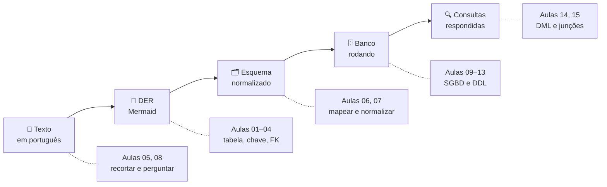

# Aula 16 — Revisão e Próximos Passos

> 🎯 Objetivos: reconstruir o percurso completo do curso, reconhecer o que ficou deliberadamente de fora e escolher com critério o próximo passo de estudo.
> 🎬 Slides da aula: [apresentacao-16-revisao-proximos-passos.pdf](apresentacao/apresentacao-16-revisao-proximos-passos.pdf)

## 1. O mapa do curso

Quinze aulas atrás você tinha uma planilha. Agora:



Repare que os Blocos 1 e 2 ocupam **metade do curso** e não tocam num computador. Foi de propósito: as decisões que custam caro são todas tomadas antes de existir uma linha de SQL, e nenhum banco conserta um modelo errado.

E repare também no que sobreviveu de ponta a ponta. Três ideias apareceram na Aula 01 e continuaram valendo até a última consulta:

- **Um valor por célula.** Virou a 1FN na Aula 07 e o tipo de coluna na Aula 13;
- **Cada dado num lugar só.** Virou a 3FN, e é o motivo de existir a junção da Aula 15;
- **A ordem das linhas não significa nada.** Virou o `ORDER BY` da Aula 14.

Nenhuma delas é sintaxe. São propriedades do modelo relacional — e é por isso que o que você aprendeu aqui vale em PostgreSQL, em MySQL, em Oracle e no banco que ainda não foi escrito.

## 2. Do minimundo ao banco, o caminho inteiro

O roteiro completo, para você levar embora:

| # | Passo | Aula | Como saber que deu certo |
|:---:|---|:---:|---|
| 1 | Recortar o minimundo | 05 | A lista do que **ficou de fora** está escrita |
| 2 | Achar entidades e atributos | 05 | Nenhuma tabela tem só código e nome |
| 3 | Perguntar ao cliente | 05, 08 | Cada resposta mudou alguma coisa no modelo |
| 4 | Desenhar o DER | 05 | Toda linha lida em voz alta é verdade |
| 5 | Mapear para tabelas | 06 | Todo elemento do diagrama virou alguma coisa |
| 6 | Normalizar até a 3FN | 07 | Nenhum dado está escrito em dois lugares |
| 7 | Escrever o DDL | 13 | O script roda do zero, duas vezes seguidas |
| 8 | Carregar dados | 14 | A ordem respeita as dependências |
| 9 | Consultar | 15 | O relatório responde a pergunta do cliente |

> 📏 **A regra que atravessou as dezesseis aulas:** todo modelo vem com a justificativa por escrito. O diagrama mostra o **que**; só o texto guarda o **porquê** — e é o porquê que a próxima pessoa vai precisar, inclusive quando a próxima pessoa for você daqui a seis meses.

## 3. O que ficou de fora, e por quê

Este curso foi recortado, como todo minimundo. O que não entrou, e onde continuar:

| Assunto | O que é | Onde estudar |
|---|---|---|
| **Álgebra relacional** | A teoria matemática por trás do `JOIN`: σ, π, ⋈ | [Calculadora interativa](../../recursos/links-uteis.md) |
| **BCNF, 4FN e além** | Formas normais que a 3FN não cobre, e a prova de que uma decomposição não perde nada | Livro-base, capítulo de normalização |
| **Projeto físico** | Índices, árvore B, plano de execução, ajuste de desempenho | *Use The Index, Luke!* |
| **Especialização e herança** | Quando uma entidade tem subtipos com atributos próprios | Livro-base, modelagem conceitual |
| **Relacionamento ternário** | Três entidades num relacionamento só | Livro-base, modelagem conceitual |

> 💡 Nenhum desses assuntos é "avançado demais" para sempre. Eles ficaram fora porque **este** curso tem dezesseis aulas e escolheu profundidade em uma metade em vez de superfície nas duas. Quando você precisar de um deles, vai precisar de verdade — e vai reconhecer o problema, que é a parte difícil.

## 4. NoSQL, em duas páginas

O modelo relacional não é a única resposta. As famílias que você vai ouvir citar:

| Família | Como guarda | Bom para |
|---|---|---|
| **Documento** (MongoDB) | Documentos aninhados, cada um com estrutura própria | Dados que variam de forma; leitura do documento inteiro |
| **Chave-valor** (Redis) | Uma chave, um valor | Cache, sessão, contador — velocidade extrema |
| **Coluna larga** (Cassandra) | Linhas com colunas variáveis, distribuídas | Volume enorme, escrita constante |
| **Grafo** (Neo4j) | Nós e arestas | Relacionamentos profundos: rede social, rota, fraude |

O mesmo empréstimo da Biblioteca, nas duas formas:

```
   Relacional (3 tabelas)              Documento (1 documento)
   ──────────────────────────          ────────────────────────────────────
   emprestimo(1, '202310100',          {
              4417, ...)                 "id": 1,
   usuario('202310100',                  "usuario": { "matricula": "202310100",
           'Ana Souza', ...)                           "nome": "Ana Souza" },
   exemplar(4417, '978-85-1111-1')       "exemplar": { "tombo": 4417,
                                                       "titulo": "Banco de Dados" }
                                       }
```

O documento se lê de uma vez, sem junção — e é por isso que ele é rápido. Mas o nome da Ana está agora dentro de **cada** empréstimo dela: é a redundância da Aula 01, de volta, agora por escolha. Quando ela mudar de nome, alguém vai ter que percorrer todos os documentos.

O que se ganha: flexibilidade de forma e escala horizontal mais fácil. O que se perde: **as garantias**. Junção, integridade referencial e transação entre coleções, quando existem, são limitadas — e o que o banco não garante, alguém no seu time vai ter que garantir na aplicação.

> ⚠️ **"NoSQL não tem esquema" é falso.** O esquema existe: ele saiu do banco e entrou no código, espalhado por todo lugar que lê aquele documento. A pergunta não é *se* há esquema, é *quem* o verifica. No relacional, é o banco, uma vez. No documento, é você, em toda leitura.

> 💡 O critério honesto: **se os seus dados são relacionados e as regras precisam valer sempre, o relacional está entregando muita coisa de graça.** Se a forma varia de registro para registro e o volume é o problema principal, vale olhar as alternativas. Sistemas grandes costumam usar os dois.

## 5. ORM e o descompasso

No trabalho você raramente vai escrever SQL na mão o dia inteiro. Vai usar um **ORM** — Hibernate, Entity Framework, Django ORM, Prisma — que traduz classes do seu programa em tabelas.

```
   No código                          No banco
   class Usuario {                    CREATE TABLE usuario (
       String matricula;                  matricula CHAR(9) PRIMARY KEY,
       List<Emprestimo> emprestimos;      ...
   }                                  );
```

E aí aparece o **descompasso objeto-relacional**: objetos têm herança, listas aninhadas e identidade por referência; tabelas têm chaves, valores atômicos e ligação por valor. A tradução nunca é exata, e o ORM esconde a diferença até o dia em que ela aparece — geralmente como uma consulta que fez 500 idas ao banco onde bastaria uma.

> 📏 **É por isso que este curso existe da forma como existe.** Quem entende o modelo relacional usa o ORM e sabe o que ele está gerando. Quem não entende fica refém dele, e não tem como diagnosticar o dia em que a aplicação fica lenta sem motivo aparente.

## 6. Para onde ir

Três caminhos, e você não precisa escolher só um:

- **Aprofundar o modelo** — o livro-base, dos capítulos que este curso pulou. É o caminho de quem gostou de modelar;
- **Aprofundar o SQL** — subconsultas correlacionadas, funções de janela, `CTE`. O [SQLZoo](https://sqlzoo.net/) e o [pgexercises](https://pgexercises.com/) levam longe, de graça;
- **Ligar o banco a um programa** — o [curso de POO com Java](https://github.com/jreluiz/curso-java-poo) ou o [de JavaScript](https://github.com/jreluiz/curso-javascript), e depois um ORM. É onde o descompasso da seção 5 deixa de ser teoria.

> 📖 Se você ler um único capítulo a mais do livro-base, que seja o de normalização além da 3FN. É curto, e fecha o assunto que este curso deixou pela metade de propósito.

## 🏋️ Exercícios da aula

Na pasta `aula-16/` do seu repositório:

1. **`ex01.md`** — autoavaliação honesta. Para cada um dos nove passos da seção 2, dê uma nota de 1 a 5 para a sua própria segurança e escreva **uma frase** dizendo o que faltou nos que ficaram abaixo de 4. *Confira assim: se todos os nove receberam 5, releia o exercício — o passo 3 (perguntar ao cliente) é o que quase ninguém pratica de verdade.*
2. **`ex02.md`** — refaça o modelo do `ex03` da Aula 05, do zero, sem olhar o que você fez lá. Depois compare as duas versões lado a lado e liste **o que mudou e por quê**. *Confira assim: se as duas versões forem idênticas, ou você acertou de primeira ou não aprendeu nada em onze aulas — releia a versão antiga procurando as cinco armadilhas da Aula 08.*
3. **`ex03.md`** — três sistemas: (a) o prontuário eletrônico de um hospital; (b) o histórico de cliques de um site com 10 milhões de visitas por dia; (c) a rede de amizades de um aplicativo social. Para cada um, escolha **relacional ou NoSQL**, diga qual família, e defenda em um parágrafo citando o que se ganha e o que se perde. *Confira assim: pelo menos um dos três tem resposta "os dois, para partes diferentes do sistema" — encontre qual.*
4. **`ex04.md`** — escreva o seu plano de estudo dos próximos três meses: o que estudar, em que ordem, com qual material e como você vai saber que aprendeu. Máximo de uma página. *Confira assim: se algum item não tem um critério verificável de "aprendi", ele é um desejo, não um plano.*
5. **Desafio 🌶️ `ex05.md`** — pegue o seu [projeto final](../../projetos/projeto-final.md) e escreva a **crítica dele**, como se fosse de outra pessoa: três decisões que você tomou e que um revisor experiente questionaria, com o argumento dele e a sua resposta. Depois liste as duas coisas que você faria diferente se recomeçasse hoje, e o que precisaria estudar para fazê-las. *Confira assim: se você não conseguiu escrever três críticas ao próprio trabalho, peça a um colega — a incapacidade de criticar o próprio modelo é o defeito profissional mais caro desta área.*

## 🧠 Revisão

[8 questões de múltipla escolha](revisao/README.md) para conferir se os conceitos ficaram sólidos. Responda sem consultar a aula — depois volte e corrija.

## ✅ Entrega

```bash
git add aula-16/
git commit -m "Resolve exercícios da aula 16 (revisão e próximos passos)"
git push
```

---

⬅️ [Aula 15](../aula-15-juncoes-e-agregacao/README.md) | 🏠 [Início do curso](../../README.md)

🏁 **Fim do curso.** Você entrou sabendo que dados ficam guardados em algum lugar e sai capaz de ler um texto em português e devolver um banco de dados íntegro, normalizado e defensável. É uma habilidade que não expira e não depende de linguagem, framework ou moda — o modelo relacional tem mais de cinquenta anos e continua sendo a resposta certa na maior parte das vezes. O [projeto final](../../projetos/projeto-final.md) é a prova de que você chegou lá. Bom trabalho. 🙂
