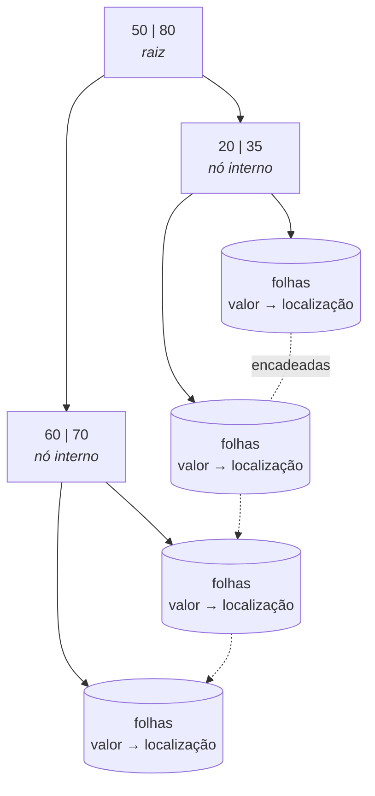

# Aula 15 — Projeto Físico, Índices e Transações

> 🎯 Objetivos: decidir quando criar um índice e a que custo, ler um plano de execução, e escrever transações entendendo o que ACID garante.

Esta é a aula do **nível interno** da Aula 02 — o último dos três, e o único que fala de disco.

## 1. O que acontece embaixo

Uma tabela do PostgreSQL é um arquivo dividido em **páginas** de 8 KB. As tuplas ficam dentro das páginas, em ordem de inserção. Ler qualquer coisa significa ler páginas inteiras do disco para a memória.

Sem nenhuma estrutura auxiliar, responder `WHERE tombo = 4417` exige uma **varredura sequencial**: ler todas as páginas, uma a uma, comparando cada tupla. Com 10 linhas, instantâneo. Com 10 milhões, um problema.

> 💡 **Toda a discussão de desempenho em banco de dados é sobre uma coisa: reduzir o número de páginas lidas.** Índices, planos de execução, ordem de junção — tudo serve a isso.

## 2. Índice e a árvore B

Um **índice** é uma estrutura auxiliar que mapeia valores de uma coluna para a localização das tuplas — a mesma ideia do índice remissivo de um livro.

O tipo padrão é a **árvore B⁺**, escolhida por manter-se **equilibrada**: todos os caminhos da raiz até uma folha têm o mesmo comprimento, e esse comprimento cresce **logaritmicamente**.



O que isso significa em números: numa tabela de **1 milhão** de linhas, uma busca por igualdade percorre **3 ou 4 níveis** em vez de ler 1 milhão de linhas. E as folhas encadeadas fazem consultas por faixa (`BETWEEN`, `>`, `<`) e `ORDER BY` funcionarem bem, não só a igualdade.

```sql
CREATE INDEX idx_emprestimo_prevista ON emprestimo (data_prevista);
CREATE INDEX idx_emprestimo_usuario  ON emprestimo (matricula);
CREATE UNIQUE INDEX uq_usuario_email ON usuario (email);
```

## 3. Quando criar — e o preço de criar demais

Índices **já existem** onde você não pediu: toda `PRIMARY KEY` e toda restrição `UNIQUE` criam um automaticamente.

**Crie índice em:**

- **Chaves estrangeiras** — o PostgreSQL **não** cria automaticamente, e elas são usadas em toda junção. É a primeira coisa a fazer num banco lento;
- Colunas frequentes em `WHERE`, `JOIN` ou `ORDER BY`;
- Colunas com **alta seletividade** — muitos valores distintos.

**Não crie em:**

- Colunas com **poucos valores distintos** (`situacao` com 4 valores, `sexo`, booleanos). Se o valor buscado ocorre em 30% da tabela, ler o índice **e depois** a tabela é mais caro que varrer tudo — e o otimizador vai ignorar seu índice, corretamente;
- Tabelas pequenas — abaixo de algumas centenas de linhas, a varredura sequencial ganha sempre;
- Colunas que quase nunca aparecem em filtro.

> ⚠️ **Índice não é grátis, e o custo é permanente.** Cada índice ocupa espaço em disco e precisa ser **atualizado a cada `INSERT`, `UPDATE` e `DELETE`**. Uma tabela com oito índices tem toda escrita multiplicada por nove. Índice demais é uma das causas mais comuns de banco lento — e a mais contraintuitiva, porque foi feita para acelerar.

> 📏 **Regra do curso:** índice se cria **depois** de medir, para uma consulta específica que está lenta, e se mede de novo depois. Criar índice "por precaução" é o mesmo que desnormalizar por comodidade (Aula 12).

## 4. `EXPLAIN`: lendo o plano

`EXPLAIN` mostra o que o otimizador **pretende** fazer. `EXPLAIN ANALYZE` executa e mostra o que realmente aconteceu.

```sql
EXPLAIN ANALYZE
SELECT * FROM emprestimo WHERE data_prevista < CURRENT_DATE;
```

```
Seq Scan on emprestimo  (cost=0.00..18.50 rows=3 width=32) (actual time=0.011..0.013 rows=3 loops=1)
  Filter: (data_prevista < CURRENT_DATE)
  Rows Removed by Filter: 5
Planning Time: 0.098 ms
Execution Time: 0.031 ms
```

O que ler, na ordem de importância:

| Item | Significado |
|---|---|
| `Seq Scan` | Varredura sequencial — leu a tabela inteira |
| `Index Scan` | Usou índice |
| `Bitmap Heap Scan` | Usou índice para muitas linhas |
| `cost=0.00..18.50` | Custo **estimado** (início..total), em unidade arbitrária. Serve para **comparar** planos, não como tempo |
| `rows=3` | Linhas estimadas |
| `actual ... rows=3` | Linhas reais. **Estimativa muito diferente do real é o sinal mais útil do plano** — indica estatísticas desatualizadas |
| `Rows Removed by Filter` | Linhas lidas e descartadas — trabalho jogado fora |

> 💡 **`Seq Scan` não é necessariamente erro.** Em tabela pequena, ou quando a consulta devolve boa parte das linhas, é a escolha certa e o otimizador sabe disso. O sinal de problema é `Seq Scan` numa tabela grande devolvendo poucas linhas, com muitas `Rows Removed by Filter`.

Neste curso `EXPLAIN` é ferramenta de **leitura**, não de otimização. O objetivo é entender que o banco toma decisões e que elas são inspecionáveis.

## 5. Transação e ACID

Uma **transação** é uma sequência de operações tratada como **unidade indivisível**.

```sql
BEGIN;
    UPDATE exemplar   SET situacao = 'emprestado' WHERE tombo = 4417;
    INSERT INTO emprestimo (matricula, tombo, matricula_func, data_prevista)
    VALUES (2023101, 4417, 900, CURRENT_DATE + 14);
COMMIT;
```

Se a energia cair entre os dois comandos, o exemplar ficaria marcado como emprestado sem que exista empréstimo. Dentro de uma transação isso não acontece: **ou os dois efeitos existem, ou nenhum**.

```sql
BEGIN;
    DELETE FROM emprestimo WHERE data_retirada < '2020-01-01';
    -- 4127 linhas?! Não era isso.
ROLLBACK;                    -- desfaz tudo, como se nunca tivesse acontecido
```

As quatro garantias, o acrônimo **ACID**:

**Atomicidade** — tudo ou nada. É o `ROLLBACK` acima.

**Consistência** — a transação leva o banco de um estado válido a outro estado válido. Todas as restrições declaradas na Aula 13 continuam valendo ao final.

**Isolamento** — transações concorrentes não enxergam os estados intermediários umas das outras. Cada uma trabalha como se estivesse sozinha.

**Durabilidade** — depois do `COMMIT`, o efeito sobrevive a queda de energia. O banco só confirma depois de gravar o registro da operação em disco.

> ⚠️ **No PostgreSQL, todo comando isolado já é uma transação** (*autocommit*). `UPDATE` sem `BEGIN` está confirmado no instante em que roda, e não há como desfazer. É por isso que o hábito de embrulhar `UPDATE` e `DELETE` em `BEGIN`/`COMMIT` vale a carreira inteira.

## 6. Concorrência: o que o isolamento evita

Sem controle de concorrência, três problemas clássicos aparecem.

**Atualização perdida** (*lost update*) — o caso da Aula 01, seção 4: duas transações leem o mesmo valor, ambas calculam a partir dele, a segunda gravação sobrescreve a primeira sem tê-la visto.

**Leitura suja** (*dirty read*) — T1 altera um dado, T2 o lê, T1 dá `ROLLBACK`. T2 trabalhou com um valor que nunca existiu oficialmente.

**Leitura não repetível** (*non-repeatable read*) — T1 lê um valor, T2 o altera e confirma, T1 lê de novo e vê outro número. O relatório de T1 fica internamente inconsistente.

O SQL define quatro **níveis de isolamento**, trocando garantia por concorrência:

| Nível | Evita leitura suja | Evita leitura não repetível | Evita leitura fantasma |
|---|:---:|:---:|:---:|
| `READ UNCOMMITTED` | ❌ | ❌ | ❌ |
| `READ COMMITTED` | ✅ | ❌ | ❌ |
| `REPEATABLE READ` | ✅ | ✅ | ❌ |
| `SERIALIZABLE` | ✅ | ✅ | ✅ |

```sql
BEGIN ISOLATION LEVEL SERIALIZABLE;
    -- ...
COMMIT;
```

O padrão do PostgreSQL é `READ COMMITTED`, que atende à maioria dos casos. `SERIALIZABLE` dá a garantia máxima — o resultado é como se as transações tivessem rodado uma após a outra — ao custo de transações que podem ser **abortadas** por conflito e precisam ser repetidas pela aplicação.

> 💡 O PostgreSQL implementa isolamento com **MVCC** (*multiversion concurrency control*): em vez de bloquear, mantém versões diferentes da mesma linha para transações diferentes. A consequência prática que vale saber: **leitura não bloqueia escrita e escrita não bloqueia leitura**. Um relatório longo não trava o sistema.

## 7. Segurança e backup, em panorama

**Autorização** — o DCL da Aula 02, e o nível externo da arquitetura em três níveis chegando ao fim natural:

```sql
CREATE ROLE atendente LOGIN PASSWORD 'trocar';
GRANT SELECT, INSERT, UPDATE ON emprestimo TO atendente;
GRANT SELECT ON emprestimos_em_aberto TO atendente;   -- a VIEW da Aula 14
REVOKE DELETE ON emprestimo FROM atendente;
```

> 💡 Conceder permissão sobre a **view**, e não sobre a tabela, é como se implementa "o atendente vê empréstimos, não vê tudo". A view é simultaneamente simplificação e mecanismo de segurança.

**Backup** — o PostgreSQL oferece o lógico, que é o que você vai usar no curso:

```bash
pg_dump curso_bd > backup.sql               # gera um script SQL que recria tudo
psql -d curso_bd_novo -f backup.sql          # restaura
```

> ⚠️ **Backup que nunca foi restaurado não é backup — é esperança.** A única forma de saber se o arquivo presta é restaurá-lo em outro banco e conferir. Faça isso pelo menos uma vez com o seu projeto final.

> 📖 O projeto físico, a organização de arquivos, os índices e o processamento de transações são tratados na parte final do livro-base. Esta aula cobre o suficiente para entender as decisões; cada um dos seis temas dá um curso inteiro.

> 💻 **Scripts desta aula:** [`04-indices-transacoes.sql`](exemplos/04-indices-transacoes.sql)

## 🏋️ Exercícios da aula

Na pasta `aula-15/` do seu repositório, sobre o banco que você criou nas Aulas 13 e 14.

1. **`ex01.sql`** — escolha uma consulta sua da Aula 14 que use `WHERE` numa coluna sem índice. Rode `EXPLAIN ANALYZE`, cole a saída em comentário; crie o índice; rode de novo e cole. Compare `cost`, `Execution Time` e o tipo de varredura. Se **nada mudou**, explique por quê — e essa é a resposta mais provável num banco pequeno, e a mais instrutiva;
2. **`ex02.sql`** — para o seu esquema, liste **todas** as chaves estrangeiras e escreva o `CREATE INDEX` de cada uma. Depois responda em comentário: por que o PostgreSQL cria índice automático para a PK, mas não para a FK? Qual operação fica lenta sem esse índice?
3. **`ex03.sql`** — escreva uma transação com **três** comandos que precisam acontecer juntos (por exemplo: dar baixa num exemplar, registrar o empréstimo e atualizar a situação). Rode uma vez com `COMMIT` e uma vez com `ROLLBACK`, mostrando com `SELECT` antes e depois que o efeito apareceu num caso e desapareceu no outro;
4. **`ex04.md`** — para cada situação, diga qual problema de concorrência ocorre e qual **nível de isolamento** o resolveria: (a) dois atendentes emprestam o último exemplar ao mesmo tempo; (b) um relatório soma multas enquanto outra transação insere uma multa e depois desfaz; (c) uma consulta lê o total de empréstimos duas vezes na mesma transação e obtém números diferentes; (d) uma transferência bancária que debita e não credita;
5. **Desafio 🌶️ `ex05.md`** — **simule uma atualização perdida de verdade**. Abra **duas sessões** do `psql` no mesmo banco e execute passo a passo, alternando entre elas, uma sequência que produza o problema. Documente: os comandos de cada sessão na ordem exata, o resultado obtido, o resultado esperado, e a versão corrigida usando `SELECT ... FOR UPDATE` ou `SERIALIZABLE`. Cole a saída dos dois terminais.

## 🧠 Revisão

[8 questões de múltipla escolha](revisao/README.md) para conferir se os conceitos ficaram sólidos. Responda sem consultar a aula — depois volte e corrija.

## ✅ Entrega

```bash
git add aula-15/
git commit -m "Resolve exercícios da aula 15 (projeto físico e transações)"
git push
```

---

⬅️ [Aula 14](../aula-14-sql-dml-consultas/README.md) | ➡️ [Aula 16 — Revisão e próximos passos](../aula-16-revisao-proximos-passos/README.md)
