<!-- _class: capa -->

<div class="emoji">⚙️</div>

# Projeto Físico e Transações

## Aula 15 · Bloco 4 — SQL e Projeto Físico

<div class="meta">O que acontece embaixo — índices, ACID e concorrência</div>

---

## 🎯 Nesta aula

1. O que acontece **embaixo**
2. **Índice** e a árvore B
3. Quando criar — e o **preço** de criar demais
4. **`EXPLAIN`**: lendo o plano
5. **Transação**, ACID e concorrência

---

## O que acontece embaixo

O banco guarda os dados em **páginas** de tamanho fixo — 8 KB no PostgreSQL.

Ler uma linha significa ler a página inteira do disco para a memória.

Uma consulta sem índice faz **varredura sequencial**: lê **todas** as páginas da tabela, mesmo para achar uma linha.

Com 10 linhas, tanto faz. Com 10 milhões, é a diferença entre 3 ms e 40 segundos.

---

<!-- _class: diagrama -->

## Índice e a árvore B



---

## Como o índice funciona

Uma estrutura **ordenada** que aponta para as linhas.

Buscar numa árvore B não percorre tudo: a cada nível, descarta a maior parte. Milhões de linhas em três ou quatro saltos.

É o mesmo princípio do índice remissivo de um livro: você não lê o livro inteiro para achar "normalização".

---

<!-- _class: lista-limpa -->

## O preço de criar demais

Índice não é grátis. Cada um cobra:

- 💾 **Espaço em disco** — às vezes tanto quanto a própria tabela;
- 🐌 **Escrita mais lenta** — todo `INSERT`, `UPDATE` e `DELETE` precisa atualizar **todos** os índices da tabela;
- 🧠 **Trabalho do otimizador** — mais caminhos para avaliar.

Um índice acelera leitura e **desacelera escrita**. Sempre.

---

<!-- _class: lead -->

## 📏 A regra do curso

Índice se cria **depois de medir**,

para uma consulta específica que está lenta,

e se mede **de novo** depois.

Criar índice "por precaução"
é o mesmo que desnormalizar por comodidade.

---

## `EXPLAIN`: lendo o plano

```sql
EXPLAIN ANALYZE
SELECT * FROM emprestimo WHERE data_prevista < CURRENT_DATE;
```

**`Seq Scan`** varredura sequencial, suspeito em tabela grande · **`Index Scan`** usou índice · **`cost=`** a estimativa · **`actual time=`** o tempo real

> 💡 Leia o `EXPLAIN` como **diagnóstico**, não como nota. Ele diz o que o banco fez — cabe a você decidir se está bom.

---

## Transação e ACID

Uma **transação** é um conjunto de operações tratado como **uma unidade indivisível**.

```sql
BEGIN;
  UPDATE conta SET saldo = saldo - 100 WHERE id = 1;
  UPDATE conta SET saldo = saldo + 100 WHERE id = 2;
COMMIT;      -- ou ROLLBACK, e nada aconteceu
```

**A**tomicidade · **C**onsistência · **I**solamento · **D**urabilidade

---

<!-- _class: tabela-densa -->

## O que cada letra promete

| Letra | Promessa |
|---|---|
| **Atomicidade** | tudo ou nada. Não existe meia transação |
| **Consistência** | o banco sai de um estado válido para outro válido |
| **Isolamento** | transações simultâneas não enxergam o meio uma da outra |
| **Durabilidade** | depois do `COMMIT`, sobrevive a queda de energia |

A atomicidade é o que resolve o problema da aula 01: transferir sem perder o exemplar no meio.

---

## Concorrência: o que o isolamento evita

**Atualização perdida** — dois gravam, um sobrescreve o outro sem perceber. *(o caso da aula 01)*

**Leitura suja** — ler um dado que outra transação ainda vai desfazer.

**Leitura não repetível** — ler duas vezes na mesma transação e obter valores diferentes.

**Fantasma** — a mesma consulta traz linhas novas na segunda execução.

> 💡 Os níveis de isolamento do SQL trocam **garantia por desempenho**. Mais isolamento, menos concorrência.

---

## Segurança e backup, em panorama

```sql
GRANT SELECT ON emprestimo TO atendente;
REVOKE DELETE ON usuario FROM atendente;
```

**Privilégio mínimo:** cada perfil recebe **só** o que precisa. O atendente consulta; não apaga.

**Backup** não é opção. E backup que nunca foi **restaurado em teste** não é backup — é esperança.

---

<!-- _class: checkpoint -->

## 🏋️ Exercícios da aula

Na pasta `aula-15/`:

1. **`ex01.sql`** — rode `EXPLAIN ANALYZE` antes e depois de criar um índice, e compare;
2. **`ex02.md`** — três consultas do seu banco: qual índice cada uma pediria, e por quê;
3. **`ex03.sql`** — uma transação com `ROLLBACK`, provando que nada foi gravado;
4. **`ex04.md`** — os quatro problemas de concorrência, com um exemplo do seu minimundo em cada;
5. **Desafio 🌶️ `ex05.sql`** — `GRANT`/`REVOKE` para três perfis de usuário do seu sistema.

---

<!-- _class: lead -->

## ➡️ Próxima aula

**Aula 16 — Revisão e Próximos Passos**

O curso inteiro num fio condutor —
e quando o relacional **não** é a resposta.
